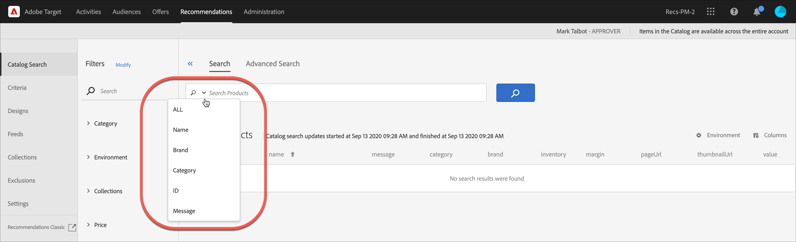

# 目錄搜尋

[!UICONTROL Catalog Search]中的[!DNL Adobe Recommendations]頁面可協助您在目錄中尋找產品或內容。 您可以在此頁面上執行的最基本工作是搜尋專案。 此外，您可以變更環境、將搜尋結果儲存至集合或排除專案、新增篩選多面向及修改表格中的欄、新增搜尋多面向等等。

目錄是指您的整個產品集 (實體)。您的目錄可以包含許多系列，好讓您以邏輯區間組織產品。

## 存取目錄搜尋

若要存取[!UICONTROL Catalog Search]頁面，請按一下&#x200B;**[!UICONTROL Recommendations]** > **[!UICONTROL Catalog Search]**。

## 搜尋專案

您可以使用簡單搜尋或進階搜尋，找出目錄中的專案。

### 執行簡單搜尋

1. 在&#x200B;**[!UICONTROL Search Products]**&#x200B;欄位中輸入搜尋字詞。

1. （選擇性）您可以從選項功能表中選取搜尋選項（按一下搜尋欄位的向下箭頭時顯示），以精簡搜尋。

   

   搜尋選項包含下列項目:

   * ALL — 使用OR邏輯搜尋所有其他搜尋條件。
   * 名稱
   * 品牌
   * 類別
   * ID
   * 訊息

1. 您現在可以捲動搜尋結果中的專案，以檢視縮圖和其他產品資訊。

   下圖顯示使用「全部」選項的「單車」結果。

   

   「產品」旁顯示的數字代表在所指定環境中可用的總數之中，符合搜尋詞語的產品數量。

   請注意，您可以使用搜尋自動完成功能。 在下圖中，輸入「bik」會傳回包含單字「bike」的所有產品。

   

   >[!NOTE]
   >
   >當您針對包含某數值的自訂屬性執行目錄搜尋時，結果會將自訂屬性視為字串類型，而非數值。
   >
   >目前沒有可讓您變更屬性型別的功能。 若要變更，[開啟客戶問題](/help/main/cmp-resources-and-contact-information.md#reference_ACA3391A00EF467B87930A450050077C)，指出需要將類型從字串變更為數值的屬性。

1. 您也可以使用篩選器來尋找所需的產品。 在下列範例中，透過展開[!UICONTROL Collections] Facet並選取「腳踏車工具」，目錄中的所有腳踏車工具都會顯示。

   

1. 您可以輸入搜尋字詞（例如「鏈」），在結果清單中進一步搜尋。

   

### 執行進階搜尋 {#advanced-search}

您可以使用[!UICONTROL Advanced Search]進一步縮小搜尋結果，或將搜尋結果儲存為[集合](/help/main/c-recommendations/c-products/collections.md)或[排除專案](/help/main/c-recommendations/c-products/exclusions.md)。

1. 按一下&#x200B;**[!UICONTROL Advanced Search]**&#x200B;連結。

   

1. 使用下拉式清單來指定搜尋的引數、運運算元和值。

1. （選擇性）按一下&#x200B;**[!UICONTROL Add Rule]**&#x200B;以新增其他搜尋規則。

   每個額外的搜尋規則都會以AND運運算元聯結。

1. 按一下 **[!UICONTROL Search]**。

1. （選擇性）按一下&#x200B;**[!UICONTROL Save As]**，然後按一下&#x200B;**[!UICONTROL Collection]**&#x200B;或&#x200B;**[!UICONTROL Exclusion]**。

   

   如需詳細資訊，請參閱下面的[根據進階搜尋建立集合或排除專案](#save-as)。

## 檢視專案的詳細資訊

您可以檢視個別專案的詳細資料，包括ID、名稱、訊息、類別等，只要檢視其詳細資料。

1. 按一下搜尋結果中的專案以檢視其詳細資訊。

   

## 從目錄中移除專案

1. 按一下搜尋結果中的專案以檢視其詳細資訊。

1. 按一下 **[!UICONTROL Remove from Catalog]**。

1. 確認您要移除專案。

該專案的所有相關資訊都會從目錄索引中移除。 只有當專案再次新增到資料摘要中時，它才會包含在您的目錄中。 已刪除的專案必須從摘要個別刪除。

## 重新整理目錄

當您上傳第一個摘要時，目錄索引會自動建立，並根據[指定的排程](/help/main/c-recommendations/c-products/feeds.md#steps)重新整理。

透過摘要檔案、API 或 mbox 更新收到更新時，目錄會自動重新整理。更新通常會在一小時內完成。如果正在進行更新，會顯示最新更新的開始時間。如果沒有任何正在進行的更新，會顯示最新更新的開始和結束時間。

## 根據進階搜尋建立集合或排除項目 {#save-as}

您可以在[頁面上使用](/help/main/c-recommendations/c-products/collections.md)建立[集合](/help/main/c-recommendations/c-products/exclusions.md)或[!UICONTROL Advanced Search]排除專案[!UICONTROL Catalog Search] ([!UICONTROL Recommendations] > [!UICONTROL Catalog Search] > [!UICONTROL Advanced Search])。

1. 執行[進階搜尋](#advanced-search)。

1. 按一下&#x200B;**[!UICONTROL Save As]**，然後按一下&#x200B;**[!UICONTROL Collection]**&#x200B;或&#x200B;**[!UICONTROL Exclusion]**。

   

   >[!IMPORTANT]
   >
   >[!UICONTROL Advanced Search]功能不區分大小寫；不過，傳遞時傳回的產品是以區分大小寫的搜尋為基礎。 此不相符的情況可能導致混淆。使用[!UICONTROL Advanced Search]功能根據結果建立集合或排除專案時，請務必考慮區分大小寫。 例如，如果您執行 &quot;Holiday&quot; 的搜尋，初始的搜尋清單結果會包含 &quot;Holiday&quot; 和 &quot;holiday&quot;。如果您之後建立一個目錄，目的要傳回包含 &quot;holiday&quot; 的產品，則只會傳回包含 &quot;holiday&quot; 的產品。不會傳回包含 &quot;Holiday&quot; 的產品。排除項目也是以類似的方式處理。

## 變更環境

[環境](/help/main/administrating-target/environments.md)可讓您組織您的網站和生產前環境，以方便管理和分隔報表。

1. 按一下環境連結。

   

1. 選取所需的環境。

## 修改「目錄搜尋」頁面（篩選器和欄）

您可以暫時修改目前工作階段在[!UICONTROL Catalog Search]頁面上的可用篩選器和欄。

### 修改篩選器

您可以在[!UICONTROL Catalog Search]頁面中新增其他篩選器Facet。

1. 在&#x200B;**[!UICONTROL Filters]**&#x200B;面板中，按一下&#x200B;**[!UICONTROL Modify]**。

   

1. 選取所需的搜尋Facet （識別碼、名稱、訊息等），然後按一下&#x200B;**[!UICONTROL Save]**。

   

請記住，其他篩選多面向僅適用於目前作業階段。

### 修改欄

您可以暫時修改[!UICONTROL Catalog Search]頁面上的作用中欄。

1. 按一下&#x200B;**[!UICONTROL Columns]**&#x200B;連結。

   

1. （條件式）若要重新排序作用中欄的順序，請以所需順序拖放&#x200B;**[!UICONTROL Active Columns]**&#x200B;區段中的欄。

1. （視條件而定）視需要將專案從&#x200B;**[!UICONTROL Active Columns]**&#x200B;拖放至&#x200B;**[!UICONTROL Inactive Columns]** （反之亦然）。

   您也可以按一下您要從使用中移動到非使用中區段的欄旁的刪除圖示( x )。

請記住，您所做的任何變更只會套用至目前的作業階段。
