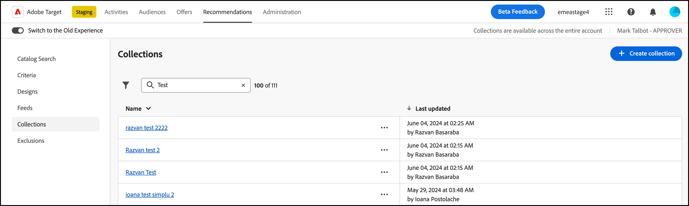

# 集合

集合是符合建議資格的一組產品或專案。 集合的定義方式是指定專案必須符合的條件，才能成為其一部分。

集合通常是指一組相似或相關的項目，例如單一產品集合。不過，您可以將任何專案分組到對您的業務有意義的類別中，例如特定價格範圍內的產品，或可能在特定地理區域受到歡迎的顏色或專案。

請使用集合以在邏輯分組中組織產品。例如，如果某些專案在一個區域可用，但在另一個區域不可用，您可以建立排除訪客區域不可用專案的集合。 您也可以使用集合來組織季節性項目，或使用業務上適合的任何其他組織參數。

[備份建議](/help/main/c-recommendations/c-algorithms/backup-recs.md) 為建議內的每個條件產生的也會使用此集合，因此備用建議中只會包含集合中的專案。 集合可讓您確保只顯示必須出現在位置中的產品。

每個條件每次執行時皆會重建或更新集合。

您可以將項目分組為目錄，然後為每個集合建立個別的建議。

包含條件的用途類似集合，但必須在您每次建立活動時設定。集合可讓您一次建立一組專案，然後可視需要隨時使用它，而無需重新設定。

當您建立或編輯 [!DNL Recommendations] 活動時，集合名稱會出現在 [!UICONTROL Criteria] 標籤在活動圖表上。

>[!NOTE]
>
>使用時不會套用集合 [!UICONTROL Recently Viewed Items] 建議金鑰。

## 建立集合 {#task_1256DFF6842141FCAADD9E1428EF7F08}

建立集合來組織您要在建議中顯示的產品或內容。

1. 按一下 **[!UICONTROL Recommendations]** > **[!UICONTROL Collections]** 以顯示現有集合的清單。

   

   此 [!UICONTROL Collections] 頁面會顯示您現有集合的清單。 您可以按一下 [!UICONTROL Create Collection] 按鈕。 您也可以編輯、複製和刪除現有集合，方法是按一下所需集合旁的省略符號圖示，然後按一下所需選項。

   針對每個集合報告的「專案數」，在 [!UICONTROL Collections] list view為設定的預設Recommendations中，符合集合規則的產品數量 [主機群組](/help/main/administrating-target/hosts.md) （環境）。 另請參閱 [設定](https://experienceleague.adobe.com/docs/target-dev/developer/recommendations.html){target=_blank} 變更預設主機群組。

1. 按一下 **[!UICONTROL Create Collection]**。

   

1. 輸入a **[!UICONTROL Name]** 用於集合。

   您也可以輸入選填的 **[!UICONTROL Description]**.

1. （視條件而定）選擇 [環境](/help/main/administrating-target/environments.md) 從 **[!UICONTROL Environment]** 建立（或更新）集合時進行篩選，以預覽該環境中的集合內容。 依照預設，會顯示預設主機群組的結果。

1. 設定用來建立集合的規則。

   例如，您的集合可能根據清單中的產品 ID 或類別、利潤或任何其他參數建立。

   您可以新增規則，以使用多個參數來定義集合。您可使用AND運運算元聯結多個規則。 所有指定的規則必須符合，才會套用集合。

1. 按一下 **[!UICONTROL Create]**。

## 建立集合，使用 [!UICONTROL Advanced Search]

您也可以使用下列專案建立集合 [!UICONTROL Advanced Search] 於 [目錄搜尋](/help/main/c-recommendations/c-products/catalog-search.md#save-as) 頁面([!UICONTROL Recommendations] > [!UICONTROL Catalog Search] > [!UICONTROL Advanced Search])。

例如，使用&quot;id > contains&quot;建立搜尋之後，您就可以按一下 [!UICONTROL Save As] > [!UICONTROL Collection].

>[!IMPORTANT]
>
>此 [!UICONTROL Advanced Search] 功能不區分大小寫，不過傳送時傳回的產品會以區分大小寫的搜尋為依據。 此不相符的情況可能導致混淆。確保在使用根據結果建立集合時考慮區分大小寫 [!UICONTROL Advanced Search] 功能。 例如，如果您執行 &quot;Holiday&quot; 的搜尋，初始的搜尋清單結果會包含 &quot;Holiday&quot; 和 &quot;holiday&quot;。如果您之後建立一個目錄，目的要傳回包含 &quot;holiday&quot; 的產品，則只會傳回包含 &quot;holiday&quot; 的產品。不會傳回包含 &quot;Holiday&quot; 的產品。

## 編輯、複製或刪除集合

按一下 **省略符號** 圖示按一下清單中所需系列旁的圖示，然後按一下適當的圖示：「編輯」、「複製」或「刪除」。

您可以複製現有收藏集以建立重複的收藏集，然後進行修改。 這可讓您輕鬆建立類似的系列。

請注意，集合在整個帳戶中皆可使用。 刪除集合前，請務必考量這一點。 已刪除的集合無法復原。

## 在中使用集合 [!DNL Recommendations] 活動

1. 使用上述其中一種方法建立集合。

1. 按一下 **[!UICONTROL Activities]** 和 [建立新的Recommendations](/help/main/c-recommendations/t-create-recs-activity/create-recs-activity.md) 活動或編輯現有活動。

1. 選取條件和設計後， [!UICONTROL Options] 頁面會顯示您選取所需集合的位置。

   

1. （視條件而定）若要變更現有的集合設定，請在 **[!UICONTROL Experiences]** 頁面（三步驟引導式工作流程的步驟2），按一下您放置建議的位置，然後按一下 **[!UICONTROL Change Collection]**，然後選取所需的集合。

   

## 訓練影片：在Recommendations中建立集合和排除專案(7:05) 

此影片包含下列資訊:

* 建立集合
* 建立排除項目

>[!VIDEO](https://video.tv.adobe.com/v/27689)