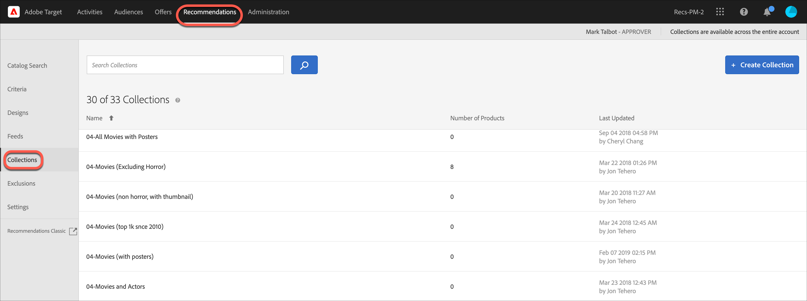

# 集合

集合是符合建議資格的一組產品或項目。集合的定義方式是指定要成為集合一部分的項目必須滿足的條件。

集合通常是指一組相似或相關的項目，例如單一產品集合。但是，您可以將任何對您的業務有意義的項目分組到一個類別中，例如特定價格範圍內的產品或顏色，或特定地理區域中可能感興趣的項目。

請使用集合以在邏輯分組中組織產品。例如，如果某些項目可在某個地區使用，但在另一個地區不可用，您可以建立集合來排除在訪客所在地區無法使用的項目。 您也可以使用集合來組織季節性項目，或使用業務上適合的任何其他組織參數。

針對建議內每個條件而產生的[備用建議](/help/main/c-recommendations/c-algorithms/backup-recs.md)也會使用此集合，因此，只有集合中的項目才會納入備用建議中。集合可讓您確保只顯示必須出現在位置中的產品。

每個條件每次執行時皆會重建或更新集合。

您可以將項目分組為目錄，然後為每個集合建立個別的建議。

包含條件的用途類似集合，但必須在您每次建立活動時設定。集合可讓您一次建立一組項目，然後在適當時機派上用場，而不必再次設定。

當您建立或編輯 [!DNL Recommendations] 活動時，集合名稱會出現在活動圖的[!UICONTROL 「條件」]標籤旁。

>[!NOTE]
>
>使用[!UICONTROL 「最近查看的項目」]建議索引鍵時不會套用集合。

## 建立集合 {#task_1256DFF6842141FCAADD9E1428EF7F08}

建立集合來組織您要在建議中顯示的產品或內容。

1. 依序按下&#x200B;**[!UICONTROL 「Recommendations]** > **[!UICONTROL 集合」]**，即可顯示現有集合清單。

   

   此 [!UICONTROL 集合] 頁面會顯示現有集合的清單。 您可以按一下 [!UICONTROL 建立集合] 按鈕。 您也可以將游標移至所需的系列上，然後按一下所需的圖示，以編輯、複製和刪除現有的系列。

   

   [!UICONTROL 「集合」]清單檢視上，每個集合的「項目數量」為設定的預設 Recommendations [主機群組](/help/main/administrating-target/hosts.md) (環境) 中，符合集合規則的產品數量。請參閱[設定](https://developer.adobe.com/target/implement/recommendations/)，瞭解如何變更預設主機群組。{target=_blank}

1. 按一下&#x200B;**[!UICONTROL 「建立集合」]**。

1. (依條件) 建立 (或更新) 集合時，從&#x200B;**[!UICONTROL 「環境」]**&#x200B;篩選器中選擇一個環境，以便預覽該環境中的集合內容。依照預設，會顯示預設主機群組的結果。

   

1. 輸入集合的&#x200B;**[!UICONTROL 名稱]**。

   您也可以輸入選填的&#x200B;**[!UICONTROL 說明]**。

1. 設定用來建立集合的規則。

   例如，您的集合可能根據清單中的產品 ID 或類別、利潤或任何其他參數建立。

   您可以新增規則，以使用多個參數來定義集合。您可使用AND運算子聯結多個規則。 所有指定的規則必須符合，才會套用集合。

1. 按一下&#x200B;**[!UICONTROL 儲存]**。

## 使用進階搜尋建立集合

您也可以使用[目錄搜尋](/help/main/c-recommendations/c-products/catalog-search.md#save-as)頁面上的進階搜尋 ([!UICONTROL Recommendations] > [!UICONTROL 目錄搜尋] > [!UICONTROL 進階搜尋])，以建立集合。

例如，使用 &quot;id > contains&quot; 建立搜尋之後，您就可以按一下[!UICONTROL 「另存新檔] > [!UICONTROL 集合」]。

>[!IMPORTANT]
>
>「進階搜尋」功能不區分大小寫，不過傳送時傳回的產品會以區分大小寫的搜尋為依據。此不相符的情況可能導致混淆。使用「進階搜尋」功能來根據結果建立集合時，務必注意大小寫。例如，如果您執行 &quot;Holiday&quot; 的搜尋，初始的搜尋清單結果會包含 &quot;Holiday&quot; 和 &quot;holiday&quot;。如果您之後建立一個目錄，目的要傳回包含 &quot;holiday&quot; 的產品，則只會傳回包含 &quot;holiday&quot; 的產品。不會傳回包含 &quot;Holiday&quot; 的產品。

## 編輯、複製或刪除集合

將滑鼠指標暫留在清單中所需的系列上，然後按一下適當的圖示：編輯、複製或刪除。

您可以複製現有的集合，以建立重複的集合，然後可加以修改。 這可讓您以更省心的方式建立類似的排除項目。

請注意，集合可供整個帳戶使用。 刪除集合之前，請務必考量這一點。 已刪除的集合無法復原。

## 在Recommendations活動中使用集合

1. 使用上述其中一種方法建立集合。

1. 按一下 **[!UICONTROL 活動]** 和 [建立新Recommendations](/help/main/c-recommendations/t-create-recs-activity/create-recs-activity.md) 活動或編輯現有活動。

1. 選取條件和設計後， [!UICONTROL 選項] 當您選取所需的集合時，就會顯示頁面。

   

1. （條件性）若要變更現有的集合設定，請在 **[!UICONTROL 體驗]** 頁面（三步驟引導式工作流程的步驟2），按一下您放置建議的位置，然後按一下 **[!UICONTROL 變更集合]**，然後選取所需的集合。

   

## 訓練影片：在Recommendations中建立集合和排除(7:05) 

此影片包含下列資訊:

* 建立集合
* 建立排除項目

>[!VIDEO](https://video.tv.adobe.com/v/27689)
