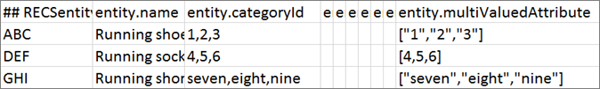

# 自訂實體屬性

在中使用單值和多值自訂實體屬性 [!DNL Adobe Target Recommendations] 來定義目錄中項目的其他資訊。

## 限制 {#limits}

您最多可以包含 100 個自訂實體屬性，以針對目錄中的項目定義額外的資訊。例如，您可以建立稱為 `entity.genre` 的自訂屬性，以定義書籍或電影。或者，售票廠商可能為活動場地建立屬性來包含第二個表演者，例如體育活動中的客隊，或音樂會的開場表演。

單值實體自訂屬性的長度上限為 15,000 個字元 (適用於單位元組和雙位元組 UTF-8 編碼語言，例如英文和其他拉丁字母) 或 10,000 個字元 (適用於三位元組 UTF-8 編碼語言，例如中文、日文和韓文)。

多值實體自訂屬性不得包含超過 500 個值。每個個別值限定為 100 個字元以內。所有值的總字元數必須符合單值實體自訂屬性之長度上限的限制 (如上所述)。

## 自訂實體屬性值 {#section_313331A9F8194A89B5EDD89363018651}

自訂實體屬性可以包含單一值或多個值。實體屬性值會顯示在產品檢視中。


含單一值的自訂實體屬性與單值預先定義的實體屬性以相同方式形成:

`entity.genre=genre1`

多值自訂實體屬性必須以有效的 JSON 陣列形成來傳送:

`entity.genre=["genre1", "genre2"]`

[!DNL Recommendations] 所支援的有效 JSON 陣列範例:

* `["AB","BC"]` 值全部為字串
* `[1,2]` 值全部為數字

>[!NOTE]
>
>[!DNL Recommendations] 在多值實體屬性中不支援混合值類型。例如，`["AB",1,true, [1,2,3]]` 是有效的 JSON 陣列，但在 [!DNL Recommendations] 中不支援，因為包含混合值類型 (字串、數值、布林、物件)。

以有效的 JSON 陣列形式傳送自訂屬性之後，對於目錄中的所有產品，此屬性會視為多值屬性。

>[!NOTE]
>
>若要將屬性從多值變成單值，您必須刪除目錄並上傳產品資料。刪除目錄並不會刪除與產品 ID 相關聯的歷程資料。如需相關資訊，請參閱 *Adobe 建議傳統版本*&#x200B;說明文件中的[從系統中刪除所有項目](/help/main/assets/adobe-recommendations-classic.pdf)。

**限制**:

* 您無法對自訂實體屬性使用預先定義的實體屬性名稱。(請參閱[實體屬性](/help/main/c-recommendations/c-products/entity-attributes.md#reference_3BCC1383FB3F44F4A2120BB36270387F))。
* 屬性 `entity.environment` 由系統保留，並且無法用於自訂實體屬性。嘗試使用 `entity.environment`、摘要或 API 來傳遞 `targetPageParams` 會被忽略。
* 陣列必須包含單一值類型。不支援混合值陣列 (`["AB",1,true]`)。
* 含有巢狀 JSON 陣列 (`[10,12,[1,2,3]]`) 的多值屬性視為單值屬性。

## 實作多值屬性 {#section_80FEFE49E8AF415D99B739AA3CBA2A14}

使用摘要(CSV)時支援多值自訂實體屬性， `targetPageParams`，以及上傳產品的傳送API。 新值會取代目前值，而不會附加。空白陣列 ([]) 視為沒有值。

必須將雙引號逸出。例如，`"[""test"", ""value""]"` 為可以在 CSV 中使用的有效 JSON 陣列。

您在多值屬性中最多可以包含 500 個值。

### 使用 targetPageParams

下列範例顯示如何使用 `targetPageParams`

```javascript
function targetPageParams() { 
  return { 
    'entity.id':                   '123', 
    'entity.categoryId':            '["A", "A:B", "A:B:C", "A:B:C:D"]',        
    'entity.MultiValueAttribute':   '["X", "Y", "Z"]', 
    'entity.event.detailsOnly':     'true', 
    'excludedIds":                  '[123, 3232, 2323, 4344]', 
    'orderId":                      '123456', 
    'orderTotal":                   '195.32', 
    'productPurchaseId":            '[001,002,003]' 
  }; 
}
```

### 使用 CSV

您可以使用文字編輯器來管理原始格式的 CSV 檔案，也可以使用試算表軟體。

原始 CSV 如下所示:


在試算表中，同樣的目錄如下所示:



轉換為 .csv 格式時，試算表軟體會在儲存格內容兩側加上雙引號，以防止將儲存格內的逗號當作欄分隔符號。對於您包含在自訂多值屬性中的 JSON 字串值，兩側也會加上雙引號。這會造成直接處理原始檔案很不方便。例如:

* 試算表: `["1","2","3"]`
* 原始: `"[""1"",""2"",""3""]"`

直接編輯原始目錄 CSV 檔案時請小心。

### 使用 API 

您可以使用mbox參數中的傳送API，以包含逸出JSON陣列的字串值形式傳遞多值屬性。

```javascript
"execute": {
    "mboxes": [
      {
        "index": 0,
        "name": "first-mbox",
        "parameters": {
          "entity.id": "32323",
          "entity.categoryId": "My Category",
          "entity.MultiValueAttribute": "[\"X\", \"Y\", \"Z\"]"
        }
      }
    ]
  }
```

如需使用傳送和儲存實體 API 的相關資訊，請參閱 [Adobe Recommendations API 文件](https://experienceleague.corp.adobe.com/docs/target-dev/developer/recommendations.html){target=_blank}。

## 對多值屬性使用運算子 {#section_83C2288A805242D9A02EBC4F07DEE945}

當您對演算法包含規則、目錄規則和排除規則中的多值自訂屬性套用運算子時，如果清單中至少一個值通過運算 (布林 *or*)，則結果為 *true*。

在下列範例中，規則是 `message contains abc`。

* 案例 1: `entity.genre = ["ab", "bc", "de"]`。結果為 false，因為沒有值包含 `abc`。
* 案例 2: `entity.genre = ["abcde","de","ef"]`。結果為 true，因為某個值包含 `abc`。

對於負數運算子，所有屬性值必須通過 (布林 *and*)。例如，假設運算子是 `notEquals`，如果任何值相符，則結果為 *false*。

請參閱下列章節，了解演算法包含規則、目錄規則和排除規則中的運算子行為。

### 等於

如果有任何屬性值等於輸入值，則結果為 true。

範例: `genre equals abc`

* 案例 1: `entity.genre = ["ab", "bc", "de"]`。結果為 false，因為沒有任何值等於 `abc`。
* 案例 2: `entity.genre = ["abc", "de", "ef"]`。結果為 true，因為有一個值等於 `abc`。
* 案例3: `entity.genre = ["abcde", "de", "ef"]`. 結果為 false，因為 `abc` 不等於清單中的任何元素。

### 不等於

如果沒有任何屬性值等於輸入值，則結果為 true。

範例: `genre not equals abc`

* 案例 1: `entity.genre = ["ab", "bc", "de"]`。結果為 true，因為沒有任何值等於 `abc`。
* 案例 2: `entity.genre = ["abc", "de", "ef"]`。結果為 false，因為有一個值等於 `abc`。
* 案例3: `entity.genre = ["abcde", "de", "ef"]`. 結果為 true，因為 `abc` 不等於清單中的任何元素。

### 包含

如果屬性的任何值包含輸入值，則結果為 true。

範例: `genre contains abc`

* 案例 1: `entity.genre = ["ab", "bc", "de"]`。結果為 false，因為沒有值包含 `abc`。
* 案例 2: `entity.genre = ["abcde", "de", "ef"]`。結果為 true，因為某個值包含 `abc`。

### 不包含

如果屬性的任何值都不包含輸入值，則結果為 true。

範例: `genre does not contain abc`

* 案例 1: `entity.genre = ["ab", "bc", "de"]`。結果為 true，因為沒有任何值包含 `abc`。
* 案例 2: `entity.genre = ["abcde", "de", "ef"]`。規則的結果為 false，因為有一個值包含 `abc`。

### 開始於

如果屬性的任何值以輸入值開頭，則結果為 true。

範例: `genre starts with abc`

* 案例 1: `entity.genre = ["ab", "bc", "de"]`。結果為 false，因為沒有任何值開頭為 `abc`。
* 案例 2: `entity.genre = ["abcde", "de", "ef"]`。結果為 true，因為某個值的開頭為 `abc`。
* 案例3: `entity.genre = ["ab", "de", "abc"]`. 結果為 true，因為某個值的開頭為 `abc` (不一定是清單中的第一個元素)。

### 終止於

如果屬性的任何值結尾是輸入值，則結果為 true。

範例: `genre ends with abc`

* 案例 1: `entity.genre = ["ab", "bc", "de"]`。結果為 false，因為沒有任何值結尾是 `abc`。
* 案例 2: `entity.genre = ["deabc", "de", "ef"]`。結果為 true，因為有一個值結尾是 `abc`。

### 大於或等於 (僅限數值)

屬性值會轉換為 double。執行規則時會略過無法轉換的屬性。

處理之後，如有任何屬性值大於或等於輸入值，則結果為 true。

範例: `price greater than or equal to 100`

* 案例 1: `entity.price = ["10", "20", "45"]`。結果為 false，因為沒有任何值大於或等於 100。系統會略過值 `de`，因為無法將它轉換為 double。
* 案例 2: `entity.price = ["100", "101", "90", "80"]`。結果為 true，因為有兩個值大於或等於 100。

### 小於或等於 (僅限數值)

屬性值會轉換為 double。執行規則時會略過無法轉換的屬性。

處理之後，如有任何屬性值小於或等於輸入值，則結果為 true。

範例: `price less than or equal to 100`

* 案例 1: `entity.price = ["101", "200", "141"]`。結果為 false，因為沒有任何值小於或等於 100。系統會略過值 `de`，因為無法將它轉換為 double。
* 案例 2: `entity.price = ["100", "101", "90", "80"]`。結果為 true，因為有兩個值小於或等於 100。

### 動態符合 (僅適用於以項目為基礎的演算法)

如果有任何屬性值符合輸入值，則結果為 true。

範例: `genre matches abc`

* 案例 1: `entity.genre = ["ab", "bc", "de"]`。結果為 false，因為沒有任何值符合 `abc`。
* 案例 2: `entity.genre = ["abc", "de", "ef"]`。結果為 true，因為有一個值符合 `abc`。

### 動態不符合 (僅適用於以項目為基礎的演算法)

如果有任何屬性值符合輸入值，則結果為 false。

範例: `genre does not match abc`

* 案例 1: `entity.genre = ["ab", "bc", "de"]`。結果為 true，因為沒有任何值符合 `abc`。
* 案例 2: `entity.genre = ["abc", "de", "ef"]`。規則的結果為 false，因為有一個值符合 `abc`。

### 動態範圍 (僅適用於以項目為基礎的演算法、數值)

如果有任何數值屬性值落在指定範圍內，則結果為true。

範例: `price dynamically ranges in 80% to 120% of 100`

* 案例 1: `entity.price = ["101", "200", "125"]`。結果為 true，因為 `101` 在 100 的 80% 到 120% 範圍內。系統會略過值 `de`，因為無法將它轉換為 double。
* 案例 2: `entity.price = ["130", "191", "60", "75"]`。結果為 false，因為沒有任何值在 100 的 80% 到 120% 範圍內。

>[!NOTE]
>
>*Double* 是一種 Java 資料類型。對於需要數值的運算子，轉換成倍精準數可避免非數值納入結果中考量。

## 設計中的多值屬性 {#section_F672E4F6E1D44B3196B7ADE89334ED4A}

在設計中參考多值屬性時，會以逗號分隔的清單顯示。

範例:  

在設計中將 `entity.genre=["genre1","genre2"]` 當成 `$entity<N>.genre` 來參照時，結果就是 `genre1, genre2`。

## 相關主題:

* [實體屬性](/help/main/c-recommendations/c-products/entity-attributes.md#reference_3BCC1383FB3F44F4A2120BB36270387F)
