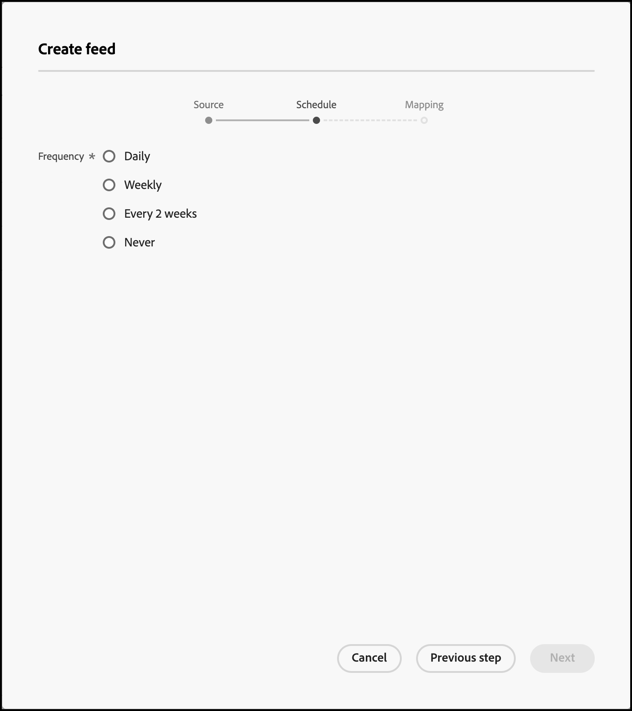

#  摘要

使用摘要來將實體匯入 [!DNL Adobe Target Recommendations]。實體可以使用 CSV 檔案、Google Product Search 摘要格式和 Adobe Analytics 產品分類來進行傳送。

## 摘要概覽 {#concept_D1E9C7347C5D4583AA69B02E79607890}

摘要可用來傳遞[實體](/help/main/c-recommendations/c-products/products.md)或擴增 mbox 資料的資訊，此資訊無法在頁面上取得，或直接從頁面傳送很不安全，例如利潤、COGS 等。

訂閱源允許您將詳細的項目資訊傳遞到 [!DNL Recommendations]，如產品ID、類別、名稱、消息和其他屬性。

您可以選取要將 [!DNL Target] 產品分類檔案或 Google Product Search 檔案中的哪些欄位傳送至 [!DNL Recommendations] 伺服器。

然後，可以使用有關每個項的以下資料：

* 在設計中顯示值
* 定義條件包含規則
* 將項目排序到不同的集合
* 將排除項應用於建議

物料說明可以傳遞到 [!DNL Target] 使用源或框。 如果資料是同時由實體摘要和 mbox 所收集，則採用最近的資料。通常最近的資料是來自 mbox，因為它較常被檢視。同時點選實體摘要資料和 mbox 資料的情形不常見，這時會使用 mbox 資料。

[!UICONTROL 摘要]清單 (**[!UICONTROL 建議]** > **[!UICONTROL 摘要]**) 提供您已建立的任何摘要的相關資訊。


摘要頁面包含下列各欄:

* **名稱**: 建立期間指定的摘要名稱。若要編輯摘要的名稱，您必須編輯摘要本身。儲存為新名稱時，摘要會重新整理。
* **類型**: 類型包含 [CSV](/help/main/c-recommendations/c-products/feeds.md#section_65CC1148C7DD448FB213FDF499D35FCA)、[Google 產品摘要](/help/main/c-recommendations/c-products/feeds.md#section_8EFA98B5BC064140B3F74534AA93AFFF)以及 [Analytics 分類](/help/main/c-recommendations/c-products/feeds.md#section_79E430D2C75443BEBC9AA0916A337E0A)。
* **狀態**: 摘要的目前[狀態](/help/main/c-recommendations/c-products/feeds.md#concept_E475986720D1400999868B3DFD14A7A0)。
* **排程**: 顯示摘要的更新排程: 每天、每週、每隔 2 週或永不。
* **項目**: 顯示摘要中的項目數量。
* **上次更新**: 顯示上次更新摘要的日期與時間，以及更新摘要的使用者名稱。如果[!UICONTROL 上次更新]摘要顯示「未定義」，表示摘要來自 [!DNL Recommendations Classic]，且無法從 [!DNL Target Premium Recommendations] 內變更。

>[!IMPORTANT]
>
>上載的實體和實體屬性將在61天後過期。 這表示:
>
>* 訂閱源應至少每月運行一次，以確保目錄內容不會過期。
>* 從源檔案中刪除項目不會從目錄中刪除該項目。 要從目錄中刪除該項，請通過目標UI或API手動刪除該項。 或者，修改物料屬性（如庫存）以確保將物料排除在考慮之外。


## 源類型

實體可以使用 CSV 檔案、Google Product Search 摘要格式和 Adobe Analytics 產品分類來進行傳送。

### CSV {#section_65CC1148C7DD448FB213FDF499D35FCA}

您可以使用 Adobe 專屬 CSV 上傳格式來建立 .csv 檔案。此檔案包含產品的保留屬性和自訂屬性相關的顯示資訊。若要上傳實作特有的屬性，請以您要使用的屬性名稱取代標題列中的 `CustomN`。在下列範例中,`entity.Custom1` 已取代為 `entity.availability`。然後您可以將檔案大量上傳至 [!DNL Recommendations] 伺服器。

使用 .csv 格式比 Google Feed 格式更好的理由如下:

* 不需要欄位對應。
* 不援多值屬性 (請參閱下列範例)。
* 最多支援 100 個自訂屬性。如果需要超過 100 個自訂屬性，您可以建立第二個摘要檔案，並指定一組不同的自訂屬性。

如果頁面上沒有 mbox，或想要用網站上未提供的項目來補充顯示資訊，請使用大量上傳方法來傳送顯示資訊。例如，您可能想要傳送未在網站上發佈的庫存資訊。

使用 .csv 檔案、Google 產品摘要或 Analytics 產品分類摘要來上傳的任何資料會覆寫資料庫中現有的實體屬性值。如果您透過 mbox 要求傳送價格資訊，之後又以檔案傳送不同的價格數值，則檔案中的值會覆寫以 mbox 要求設定的值。`categoryId` 實體屬性是此作法的例外，類別值會附加其後而不會覆寫，但有最多 250 個字元的上限。

>[!IMPORTANT]
>
>請勿在您的 .csv 檔案中將值含括在雙引號 ( &quot; ) 中，除非是刻意的操作。如果您將值含括在雙引號中，則必須藉由將它們含括在另一組雙引號中才能將其逸出。未逸出的雙引號會使建議摘要無法正確載入。

例如，下列語法不正確:

```
"Apples "Bananas" Grapes"",
```

下列語法正確:

```
"Apples ""Bananas"" Grapes""",
```

>[!NOTE]
>
>您不能以空白值來覆寫現有值。必須在其位置傳遞另一個值才能覆蓋它。 以售價來說，一般解決辦法是傳入實際的 &quot;NULL&quot; 或其他某些訊息。然後，您可以撰寫範本規則來排除含有該值的項目。

產品在成功上傳其實體大約兩小時之後，就可以在管理介面中使用。

下列是 .csv 檔案的範例程式碼:

```
## RECSRecommendations Upload File 
## RECS''## RECS'' indicates a Recommendations pre-process header. Please do not remove these lines. 
## RECS 
## RECSUse this file to upload product display information to Recommendations. Each product has its own row. Each line must contain 19 values and if not all are filled a space should be left. 
## RECSThe last 100 columns (entity.custom1 - entity.custom100) are custom. The name 'customN' can be replaced with a custom name such as 'onSale' or 'brand'. 
## RECSIf the products already exist in Recommendations then changes uploaded here will override the data in Recommendations. Any new attributes entered here will be added to the product''s entry in Recommendations. 
## RECSentity.id,entity.name,entity.categoryId,entity.message,entity.thumbnailUrl,entity.value,entity.pageUrl,entity.inventory,entity.margin,entity.last_updated_by,entity.multi_english,entity.availability,entity.tax_country,entity.tax_region,entity.tax_rate,entity.product_type,entity.item_group_id,entity.color,entity.size,entity.brand,entity.gtin 
na3456,RipCurl Watch with Titanium Dial,Watches & Sport,Cutting edge titanium with round case,https://example.com/s7/na3456_Viewer,425,https://example.com/shop/en-us/na3456_RipCurl,24,0.25,csv,"[""New"",""Web"",""Sales"",""[1,2,34,5]""]",in stock,US,CA,9.25,Shop by Category > Watches,dz1,Titanium,44mm,RipCurl,"075380 01050 5" 
na3457,RipCurl Watch with Black Dial,Watches & Sport,Cutting edge matte black with round case,https://example.com/s7/na3457_Viewer,275,https://example.com/shop/en-us/na3457_RipCurl,24,0.27,csv,"[""New"",""Web"",""Sales"",""[1,2,34,5]""]",in stock,US,CA,9.25,Shop by Category > Watches,dz1,Black,44mm,RipCurl,"075340 01060 7"
```

### Google {#section_8EFA98B5BC064140B3F74534AA93AFFF}

Google 產品搜尋摘要類型使用 Google 格式。這與 Adobe 的專屬 CSV 上傳格式不同。

如果您有現有的 Google 產品摘要，則可用來當作匯入檔案。

>[!NOTE]
>
>不一定要使用 Google 資料。[!DNL Recommendations] 使用與 Google 相同的格式。您可以使用此方法上傳任何您有的資料，並且使用可用的排程功能。不過，您在設定檔案時，必須保留 Google 預先定義的屬性名稱。

大部分零售商會將產品上傳至 Google，當訪客使用 Google 產品搜尋時，他們的產品就會出現。[!DNL Recommendations] 的實體摘要完全遵循 Google 的規格。實體源可以發送到 [!DNL Recommendations] 通過.xml、.txt或.tsv，並可以使用 [Google定義的屬性](https://support.google.com/merchants/answer/188494?hl=en&amp;topic=2473824&amp;ctx=topic#US)。 結果可供 [Google 購物頁面](https://www.google.com/prdhp)上搜尋。

>[!NOTE]
>
>託管 Google 摘要內容的伺服器上必須允許使用 POST 方法。

因為 [!DNL Recommendations] 用戶已配置.xml或.txt feeds，通過URL或FTP發送到Google，實體feed接受該產品資料，並使用它生成建議目錄。 指定該摘要存在何處及供 Recommendations 伺服器擷取資料的位置。

如果您將 Google Product Search 用於實體摘要上傳，您仍然需要將產品頁面 mbox 放置在要顯示建議的頁面上，或是根據檢視來追蹤演算法傳遞的產品檢視。

Google 摘要不支援一個自訂屬性有多個值。

儲存並啟用摘要時就會執行摘要。摘要會在您儲存時執行，然後在每天的稍後一小時執行。

下列是 Google Product Search 摘要 .xml 檔案的範例程式碼:

```
<?xml version="1.0" encoding="UTF-8" standalone="yes"?> 
<feed xmlns="https://www.w3.org/2005/Atom" xmlns:ns2="https://base.google.com/ns/1.0" xmlns:ns3="https://base.google.com/cns/1.0"> 
    <title>Product Feed</title> 
    <link href="https://example.com"/> 
    <updated>2017-12-13T08:45:04.918-08:00</updated> 
    <author> 
        <name>Product Feed Author</name> 
    </author> 
    <id>https://example.com</id> 
    <entry> 
        <title>RipCurl Watch with Titanium Dial</title> 
        <description>Cutting edge Titanium with Round case</description> 
        <ns2:id>na3452</ns2:id> 
        <ns2:link>https://example.com/shop/en-us/na3452_RipCurl</ns2:link> 
        <ns2:availability>in stock</ns2:availability> 
        <ns2:condition>NEW</ns2:condition> 
        <ns2:google_product_category>Watches &amp; Sport</ns2:google_product_category> 
        <ns2:gtin>075380 01050 5</ns2:gtin> 
        <ns2:image_link>https://example.com/s7/na3452_Viewer</ns2:image_link> 
        <ns2:mobile_link>https://m.example.com/s7/na3452_Viewer</ns2:mobile_link> 
        <ns2:mpn>71050</ns2:mpn> 
        <ns2:price>425</ns2:price> 
        <ns2:product_review_average>5.0</ns2:product_review_average> 
        <ns2:product_review_count>30</ns2:product_review_count> 
        <ns2:product_type>Shop by Category > Watches </ns2:product_type> 
        <ns2:brand>RipCurl</ns2:brand> 
        <ns2:sale_price>375</ns2:sale_price> 
        <ns2:tax> 
          <ns2:country>US</ns2:country> 
          <ns2:region>CA</ns2:region> 
          <ns2:rate>9.25</ns2:rate> 
          <ns2:tax_ship>y</ns2:tax_ship> 
        </ns2:tax> 
        <ns2:is_bundle>N</ns2:is_bundle> 
    </entry> 
    <entry> 
        <title>RipCurl Watch with Black Dial</title> 
        <description>Cutting edge matte black with Round case</description> 
        <ns2:id>na3453</ns2:id> 
        <ns2:link>https://example.com/shop/en-us/na3453_RipCurl</ns2:link> 
        <ns2:availability>in stock</ns2:availability> 
        <ns2:condition>NEW</ns2:condition> 
        <ns2:google_product_category>Watches &amp; Sport</ns2:google_product_category> 
        <ns2:gtin>075380 013450 5</ns2:gtin> 
        <ns2:image_link>https://example.com/s7/na3453_Viewer</ns2:image_link> 
        <ns2:mobile_link>https://m.example.com/s7/na3453_Viewer</ns2:mobile_link> 
        <ns2:mpn>71050</ns2:mpn> 
        <ns2:price>275</ns2:price> 
        <ns2:product_review_average>4.8</ns2:product_review_average> 
        <ns2:product_review_count>23</ns2:product_review_count> 
        <ns2:product_type>Shop by Category > Watches </ns2:product_type> 
        <ns2:brand>RipCurl</ns2:brand> 
        <ns2:sale_price>249</ns2:sale_price> 
        <ns2:tax> 
          <ns2:country>US</ns2:country> 
          <ns2:region>CA</ns2:region> 
          <ns2:rate>9.25</ns2:rate> 
          <ns2:tax_ship>y</ns2:tax_ship> 
        </ns2:tax> 
        <ns2:is_bundle>N</ns2:is_bundle> 
    </entry> 
</feed> 
```

下列是 Google Product Search 摘要 .tsv 檔案的範例程式碼:

```
id    title    description    link    price    condition    availability    image_link    tax    shipping_weight    shipping    google_product_category    product_type    item_group_id    color    size    gender    age_group    pattern    brand    gtin    mpn 
na3454    RipCurl Watch with Titanium Dial    Cutting edge titanium with round case    https://example.com/shop/en-us/na3454_RipCurl    425    new    in stock    https://example.com/s7/na3452_Viewer    US:CA:9.25:y    1.5 oz    US:::0.00 USD    Watches & Sport    Shop by Category > Watches    dz1    Black    44mm    male    adult    Solid    RipCurl    075380 01050 5    DZ1437 
na3455    RipCurl Watch with Black Dial    Cutting edge matte black with round case    https://example.com/shop/en-us/na3455_RipCurl    275    new    in stock    https://example.com/s7/na3452_Viewer    US:CA:9.25:y    1.5 oz    US:::0.00 USD    Watches & Sport    Shop by Category > Watches    dz1    Black    44mm    male    adult    Solid    RipCurl    075340 01060 7    DZ1446
```

### Analytics 產品分類 {#section_79E430D2C75443BEBC9AA0916A337E0A}

Analytics 產品分類是建議唯一可用的分類。有關此分類檔案的詳細資訊，請參見 [關於分類](https://experienceleague.adobe.com/docs/analytics/components/classifications/c-classifications.html) 的 *分析元件* 的子菜單。 目前的實作中不一定有建議所需的一切資訊，因此，如果您想要新增至分類檔案，請遵循此使用者指南。

>[!IMPORTANT]
>
>將實體資料導入之前 [!DNL Recommendations] 使用分析產品分類時，請注意這不是首選方法。
>
> 請注意下列警告:
>
>* 更新實體屬性會引起額外延遲，最多 24 小時。
>* [!DNL Target] 僅支援產品分類。 分析產品SKU必須與 [!DNL Recommendations] `entity.id`。 您可以使用 Adobe 諮詢服務來設計自訂 Analytics 分類。請聯絡您的帳戶管理員來提出問題。


## 建立摘要 {#steps}

建立摘要以將關於您的產品或服務的資訊插入 [!DNL Recommendations]。

1. 從 Target 介面內，按一下「**[!UICONTROL 建議]** > **[!UICONTROL 摘要]** > **[!UICONTROL 建立摘要]**」。

   

1. 為摘要指定描述性名稱。
1. 選取&#x200B;**[!UICONTROL 來源類型]**。

   * CSV
   * Google 產品摘要
   * Analytics 分類

   如需關於 CSV 和 Google 產品摘要摘要類型的資訊，請參閱[摘要概覽](/help/main/c-recommendations/c-products/feeds.md#concept_D1E9C7347C5D4583AA69B02E79607890)。您也可以 [下載模型CSV指南](/help/main/c-recommendations/c-products/assets/EntityFileUploadTemplate.csv) 的子菜單。

1. (視條件而定) 如果您已選取 **[!UICONTROL CSV]** 或 **[!UICONTROL Google 產品摘要]**，請指定可存取摘要的位置。

   * **FTP**: 如果您已選取 FTP，請提供 FTP 伺服器資訊、登入認證、檔案名稱和 FTP 目錄。您可以選擇使用 FTP SSL (FTPS)，以更安全地上傳。

      支援的 FTP 伺服器設定:

      * FTP 和 FTPS 必須設定為使用被動式 FTP。
      * 針對 FTPS，請將伺服器設定為接受明確 FTPS 連線。
      * 不支援 SFTP。
      * 您可以手動指定要在哪一個連接埠上起始連線 (例如 `ftp://ftp.yoursite.com:2121`)。如果您未指定連接埠，則會使用預設 FTP 或 FTPS 連接埠。
   * **URL**: 如果您選取 URL，請指定 URL。


1. (視條件而定) 如果您已選取 **[!UICONTROL Analytics 分類]**，請從下拉式清單選擇報表套裝。

1. 按&#x200B;**[!UICONTROL 「下一步」]**&#x200B;箭頭來顯示[!UICONTROL 「排程」]選項。

   

1. 選取更新選項:

   * 每日
   * 每週
   * 每 2 週
   * 永不: 不排定更新。如果不想執行此摘要，請選取此選項。

1. 指定您要執行摘要的時間。

   此選項是根據瀏覽器中使用的時區。如果要使用不同時區的時間，則必須根據您的時區來計算該時間。

1. 按&#x200B;**[!UICONTROL 「下一步」]**&#x200B;箭頭來顯示[!UICONTROL 「對應」]選項，然後指定如何將資料對應至 [!DNL Target] 定義。

   

1. (可選) 如果要讓摘要屬於某個環境 (主機群組)，請選取主機群組。

   依預設，摘要會屬於所有主機群組。這可確保此摘要中的項目可以在任何環境中使用。如需詳細資訊，請參閱[主機](/help/main/administrating-target/hosts.md#concept_516BB01EBFBD4449AB03940D31AEB66E)。

1. 按一下&#x200B;**[!UICONTROL 「儲存」]**。

建立或編輯摘要之後，摘要會立即執行，然後根據您設定的參數而更新。需要一些時間，全部資訊才可供使用。首先，摘要必須同步，然後必須經過處理和編列索引，才能發佈和可供使用。目前狀態顯示於「摘要」清單的[摘要狀態](/help/main/c-recommendations/c-products/feeds.md#status)下。您可以在處理程序完成之前關閉 [!DNL Target]，處理程序會繼續。

編列索引進行時，在個別值已編列索引之前，產品和摘要標題會先出現。這可樣讓您搜尋和查看產品，在編列索引完成之前先建立集合、排除項目、設計和活動。

當狀態顯示「成功」時，表示找到檔案且剖析正確。在檔案編列索引之前，[!DNL Recommendations] 內沒有資訊可用，這需要一些時間，視檔案大小而定。如果處理程序失敗，表示找不到檔案 (例如，您使用不正確的 URL，或 FTP 資訊不正確) 或剖析錯誤。

## 摘要狀態和指示器 {#concept_E475986720D1400999868B3DFD14A7A0}

關於可能的摘要狀態和其指示器的資訊。

### 摘要狀態 {#status}

摘要的可能狀態如下:

| 狀態 | 說明 |
|--- |--- |
| 正在同步 | 摘要設定詳細資料正在儲存至 Target。 |
| 同步失敗 | 無法將摘要設定詳細資料儲存至 Target。請重試。 |
| 沒有執行的摘要 | 您已建立摘要，但尚未排程 (頻率設定為「從不」)。 |
| 排定在&#x200B;*日期和時間* | 摘要尚未執行，但已排定在指定的日期和時間執行。 |
| 正在等候下載 | Target 正在準備下載摘要檔案。 |
| 正在下載摘要檔案 | Target 正在下載摘要檔案。 |
| 正在匯入項目 | Target 正在從摘要檔案匯入項目。 |
| 已於&#x200B;*時間*&#x200B;成功匯入摘要 | Target 已將摘要檔案匯入至其內容傳遞系統。已在內容傳遞系統中進行項目屬性的變更，這些變更很快會呈現在已傳送的建議中。如果您沒有看到預期的變更，請立即再試一次，並重新整理包含建議的頁面。<br>附註:<ul><li>如果對項目屬性的更改導致項目被排除在建議之外，則將立即反映排除。 如果項目是新增的項目，或屬性變更導致建議&#x200B;*不再*&#x200B;排除項目，該項目則要等到下次演算法更新時才會顯示，這會在 24 小時內發生。</li><li>顯示此狀態時，更新可能尚未反映在目錄搜索用戶介面中。 目錄搜尋會列出另一個狀態，說明上次更新可搜尋目錄的時間。</li></ul> |
| 無法編列索引 | 編列索引作業失敗。請重試。 |
| 找不到伺服器 | FTP 或 URL 位置無效或無法觸達。 |

若要更新動態消息(例如，若要變更動態消息設定或饋送檔案)，請開啓動態消息、進行任何所需變更，然後按一下&#x200B;**[!UICONTROL 「儲存]**」。

>[!IMPORTANT]
>
>上傳的實體會在 61 天後過期。這表示應至少每隔 60 天上傳摘要檔案，以免建議活動中斷。如果某個項目未至少每60天包括在源檔案（或其他實體更新方法）中一次， [!DNL Adobe Target] 推斷項目不再相關，並將其從目錄中刪除。

### 摘要狀態指示器 {#section_3C8A236C5CB84C769A9E9E36B8BFABA4}

[!UICONTROL 「狀態」]欄中會顯示下列摘要狀態指示器:

| 狀態指示器 | 說明 |
|--- |--- |
| 綠色狀態指示器 | 當摘要成功完成編列索引時，綠色狀態點表示摘要處於成功狀態。 |
| 黃色狀態指示器 | 當摘要或摘要索引延遲摘要頻率的 25% 時，就會出現黃色狀態點。例如，假設摘要設定為每日執行，如果索引在排程時間之後的六小時未完成，則會顯示黃色點。注意: 一旦摘要狀態為「等候索引佇列」，新更新的值即可在傳遞和條件處理中提供使用。 |
| 白色狀態指示器 | 當摘要未排程時，白色狀態點表示摘要尚未執行。 |
| 紅色狀態指示器 | 如果摘要無法將資料上傳至伺服器，則會出現紅色狀態指示器。 |

 考量下列範例：

**範例 1:**

* 第一天: 每日摘要於上午 9:00 PST 處理
* 第二天: 現在是下午 3:30，摘要自昨天上午 9:00 以來尚未執行

狀態應該是黃色，因為索引在大約 6.5 小時以前就應該執行。6.5 小時 + 24 等於 127% 的摘要時段。

**範例 2:**

* 1 月 1 日: 每月摘要於上午 9:00 PST 處理
* 2 月 3 日: 現在是上午 10:00，摘要已經一個月、一天又一小時未執行

狀態應該是黃色，因為索引在大約一天又一小時以前就應該執行。雖然這只有頻率設定的 (31+(1/25))/30 = 1.03%，但已超過一天延遲的上限。

## 訓練影片

以下影片含有本文章探討之概念的詳細資訊。

### 瞭解 Recommendations 中的摘要 (3:01) 

此影片包含下列資訊:

* 瞭解摘要的用途
* 瞭解摘要的值

>[!VIDEO](https://video.tv.adobe.com/v/27695)

### 建立摘要 (6:44) 

此影片包含下列資訊:

* 設定摘要
* 瞭解要使用哪種摘要類型

>[!VIDEO](https://video.tv.adobe.com/v/27696)
