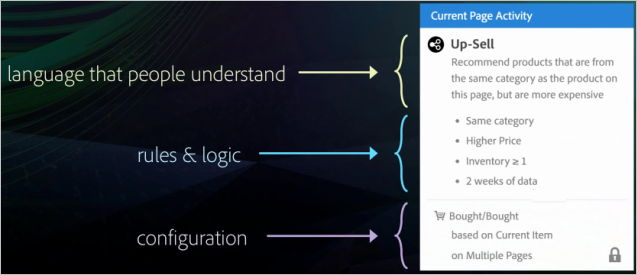
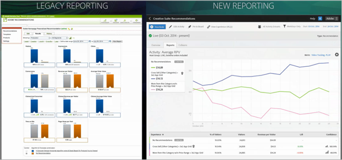

# Recommendations Classic與Recommendations活動在[!DNL Target] Premium中的比較

可協助您在 Target Premium 中的推薦經典版和推薦活動之間進行選擇的資訊。

>[!NOTE]
>
>推薦活動是 [!DNL Target Premium] 解決方案內建的功能。在沒有 [!DNL Target Standard] 授權的 [!DNL Target Premium] 中無法使用。

在 Classic 版 [!DNL Recommendations] 產品中，您需要在頁面上建立資料收集 mbox，然後在特定的頁面位置新增顯示 mbox，才能顯示建議。[!DNL Target Premium] 中的 [!DNL Recommendations] 活動可讓您收集訪客資訊，且隨處都可以建立建議，而不需要為您想要建議產品或內容的每個位置建立 mbox。只要在頁面標頭中加上簡單的 JavaScript 參照，即可在頁面上隨處啟用建議。使用此 JavaScript 參照將金鑰傳遞至全域 [!DNL Target] mbox，例如 `entity.id` 和 `entity.categoryId` 金鑰。

[!DNL Recommendations Classic] 在 [!DNL Experience Cloud] UI 中顯示為專用的卡片。可以從 [!DNL Recommendations] 工作流程內使用 [!DNL Target Premium] 活動。

[!DNL Recommendations Classic] 使用者可以繼續使用在 [!DNL Target Recommendations] 中使用 [!DNL Recommendations] mbox。他們可以保留 mbox，並在標頭中使用 JavaScript 程式碼，對頁面上的其他元素啟用 [!DNL Target] 功能，即可結合 Classic 版和 [!DNL Recommendations] 方法。但為了享受完整的 [!DNL Target] 功能，[!DNL Recommendations Classic] 使用者可能偏好刪除其 mbox，而完全依賴 [!DNL Target Recommendations]。

[!DNL Target] 中的 [!DNL Recommendations] 活動針對 [!DNL Recommendations Classic] 進行以下幾方面的改善:

## 推薦作為產品建議

您可以在[!UICONTROL A/B Test] （包括[!UICONTROL Auto-Allocate]和[!UICONTROL Auto-Target]）與[!UICONTROL Experience Targeting] (XT)活動中包含建議。

這項功能開啟了全新功能，例如:

* 在同一個活動內測試及鎖定建議與非建議內容。
* 輕鬆試驗建議在頁面中的放置方法，包括多個建議的排列順序。
* 使用[!UICONTROL Auto-Allocate]自動將流量推送到績效最好的建議體驗。
* 使用[!UICONTROL Auto-Target]，根據訪客的設定檔，以動態方式為訪客指派自訂建議體驗。

若要開始，請使用[!UICONTROL A/B Test]建立[!UICONTROL Experience Targeting]或[!UICONTROL Visual Experience Composer]活動，並使用[!UICONTROL Insert Before]、[!UICONTROL Insert After]或[!UICONTROL Replace With]動作將建議新增至體驗。

如需詳細資訊，請參閱 [推薦作為產品建議](/help/main/c-recommendations/recommendations-as-an-offer.md)。

## 條件 {#section_117709846DAA404580EBE879FFCBD9BA}

[!DNL Target Recommendations] 有一個條件庫包含數套預先封裝的規則和組態。在 [!DNL Recommendations Classic] 中，每個建議都是手動建立，需要填寫表單，然後從一長串規則中選擇。現在，建立 [!DNL Recommendations] 活動時，只要選擇預先設定的條件集即可。您仍可建立自訂建議，但條件庫包含許多預先建立的常用組態，以簡化處理程序，且採用人們可理解的語言。這些預先封裝的條件可直接使用，也可以複製再編輯，以符合您的特定需要。

條件都依照行業別、頁面類型和實施來預先設定和排序。例如，您可以尋找適合零售業的條件，以用於產品頁面，顯示來自特定類別的產品 (由 `entity.categoryID` 參數定義)。

如需使用和建立條件的相關資訊，請參閱[條件](/help/main/c-recommendations/c-algorithms/algorithms.md)。

## 工作流程 {#section_76B4A26297BF422382DE2C79A2713D3C}

[!DNL Recommendations] 工作流程已簡化。不需要填寫複雜的表單，您可以遵循可視化工作流程:

1. 選取條件。
1. 選取預先設定的[設計](/help/main/c-recommendations/c-design-overview/create-design.md#task_CC5BD28C364742218C1ACAF0D45E0E14)。
1. 預覽建議結果。

## 視覺預覽 {#section_639B9E38C9EC4093BF9023EE0F2A15AC}

設定建議之後即可預覽，並進行任何必要的變更，而不需要先在頁面上建立，然後再測試。從 [!DNL Target] 內可以使用預覽。

## 目標定位 {#section_93295EA0DBA14210B8518AF4802A459F}

[!DNL Recommendations Classic] 中有六個鎖定目標選項。建議活動會使用 Target 的一整套鎖定目標選項。使用 [!DNL Target] 或其他 [!DNL Adobe Experience Cloud] 客群 (例如 [!DNL Audience Manager] 和 [!DNL Analytics]) 來定義客群，然後選取可看見每個設計的活動加入者百分比，以及可看見控制項的活動加入者百分比。

## 報表 {#section_25C2FCCE4BC1488496C517C0470B5CD6}

在 [!DNL Target] 中，[!DNL Recommendations] 提供改良的報表，這些報表會利用 [!DNL Target] 和 [!DNL Experience Cloud] 所提供的功能。不單只是顯示 [!DNL Recommendations] 提供的提升度來對照沒有建議時的結果，您還可以檢視 [!DNL Recommendations] 活動的完整相關資訊。

