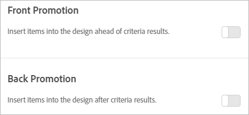

# 新增促銷活動

新增提示的專案並控制其在您[!DNL Adobe Target Recommendations]設計中的放置位置。 您可以新增靜態和動態促銷活動。

>[!IMPORTANT]
>
>靜態和動態排除規是可協助您從事行銷活動的強大功能。 如需詳細資訊、範例和使用案例，請參閱[使用動態和靜態包含規則](/help/main/c-recommendations/c-algorithms/use-dynamic-and-static-inclusion-rules.md#concept_4CB5C0FA705D4E449BD0B37B3D987F9F)。

建立 [!DNL Recommendations] 活動時，您有選項可在您的 [!DNL Recommendations] 設計中包括促銷的項目。 促銷活動使用設計中的可用位置，並且優先於條件結果和備用建議。 例如，如果您的設計有六個位置，並且您對促銷活動使用其中兩個，即有四個位置可供根據條件建議的項目使用。

促銷活動會根據活動條件所建議之項目取消重複，因此在單一建議匣中，指定項目不會顯示兩次。

您可以促銷特定項目、動態地促銷項目、根據屬性促銷項目或促銷集合。

[!DNL Target] UI中的[!UICONTROL 前端促銷活動]和[!UICONTROL 後端促銷活動]選項

>[!NOTE]
>
>使用促銷活動會變更 CSV 結構和輸出。 這些變更對牽涉到 CSV 的任何外部程序 (例如電子郵件) 會造成影響。

1. 在&#x200B;**[!UICONTROL 選項]**&#x200B;頁面上，按一下&#x200B;**[!UICONTROL 前端促銷活動]**&#x200B;或&#x200B;**[!UICONTROL 後端促銷活動]**&#x200B;切換。

   下圖顯示處於「開啟」位置的[!UICONTROL 前端促銷活動]切換按鈕。

   

   您可以將促銷活動插入在 *and* 之前與您的條件結果之後。

1. 設定要用於促銷的項目之設計位置的數量。

   根據您的 [!DNL Recommendations] 設計，您可以使用最多 20 個位置。 您使用的每個位置會變得無法供根據您的條件傳回的建議使用。

1. 設定您促銷項目的開始日期和結束日期。

   如果您未設定開始日期，則促銷活動會立即開始。 如果您未設定結束日期，則促銷活動會無限期地執行。

1. 選取&#x200B;**[!UICONTROL 促銷活動型別]**。

   * 選取&#x200B;**[!UICONTROL 專案清單]**，然後輸入要促銷之特定專案的`entity.id`值（以逗號分隔）。

   * 選取&#x200B;**[!UICONTROL 「依屬性促銷」]**，並新增規則以定義您要促銷的項目的屬性。

     如果您選取[!UICONTROL 依屬性促銷]，您可以建立動態相符專案。 如需詳細資訊，請參閱[使用動態和靜態包含規則](/help/main/c-recommendations/c-algorithms/use-dynamic-and-static-inclusion-rules.md#concept_4CB5C0FA705D4E449BD0B37B3D987F9F)。

   * 選取&#x200B;**[!UICONTROL 「促銷一個集合」]**，並選擇您要促銷的項目集合。

     您可以建立新的集合用於促銷活動。 如需詳細資訊，請參閱[建立集合](/help/main/c-recommendations/c-products/collections.md#task_1256DFF6842141FCAADD9E1428EF7F08)。

   如果您選擇&#x200B;**[!UICONTROL 專案清單]**&#x200B;作為&#x200B;**[!UICONTROL 促銷活動型別]**，您可以視需要選取&#x200B;**[!UICONTROL 隨機排列專案順序]**&#x200B;核取方塊。

   [!UICONTROL 專案清單]的預設排序順序是根據您在[!DNL Target] UI或API中輸入的順序而定。 如果您的清單包含的專案多於您為促銷活動設定的位置數量，[!UICONTROL 隨機排列專案順序]選項會隨機排列您的設計中顯示的促銷專案。 選擇此選項會導致[!DNL Target]從每次點選上設定的整個促銷活動中，隨機選取在範本中為促銷活動啟用的專案。

   如果您的實體沒有`entity.value`屬性（例如，您沒有銷售產品），您可以將數值傳遞至`entity.value`屬性（例如發佈日期）。 在此情況下，可根據最近發佈日期以降序提升已提升的專案。 `entity.value`屬性屬於雙精度型別；它不接受字串。

   若您選取&#x200B;**[!UICONTROL 依屬性促銷]**&#x200B;或&#x200B;**[!UICONTROL 促銷集合]**&#x200B;選項，則隨機排列順序的選項不適用。

   使用[!UICONTROL 依屬性促銷]或[!UICONTROL 促銷集合]選項促銷特定專案時，專案的預設顯示順序是以`entity.value`屬性為基礎，以遞減數字順序顯示。

   下表說明這些選項之間的差異：

   | 促銷活動型別 | 預設排序 | 備份排序 | 動態篩選選項 |
   | --- | --- | --- | --- |
   | [!UICONTROL 專案清單] | 在Target UI/API中輸入的訂單 | 隨機（透過UI/API選取時） | 否 |
   | [!UICONTROL 依屬性促銷] | `entity.value` （遞減順序） | 無隨機化 | 是 |
   | [!UICONTROL 提升集合] | `entity.value` （遞減順序） | 無隨機化 | 否 |

1. 按一下&#x200B;**[!UICONTROL 「儲存」]**。

促銷活動會套用至活動中的所有體驗。
