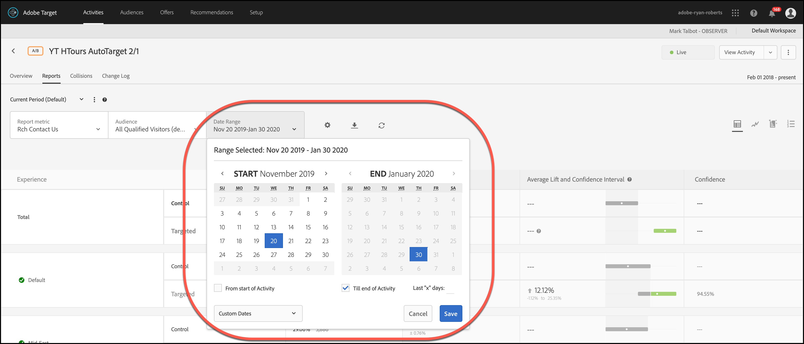
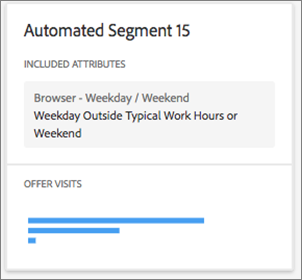

#  「自動化區段」報表

有關 [!UICONTROL 自動化段] 報告，向用戶提供的兩份專門報告之一 [!UICONTROL Automated Personalization] （美聯社） [!UICONTROL 自動目標] (AT)活動。

>[!NOTE]
>
>使用「個性化透視」報告時，請考慮以下事項：
>
>* AP 和 AT 活動是 [!DNL Target Premium] 解決方案內建的功能。若沒有 [!DNL Target Standard] 授權，[!DNL Target Premium] 便未隨附這些解決方案。
>
>* [!UICONTROL 「個人化前瞻分析」報表僅適用於使用轉換最佳化目標的 AP 與 AT 活動。]也不支援最佳化目標在活動上線後已從收入變更為轉換的活動。
>
>* [!UICONTROL 個性化見解] 僅當報告在 [!UICONTROL 主要目標] 從 [!UICONTROL 報表度量] 的子菜單。
>
>* 「個人化前瞻分析」報表僅支援於[預設環境](/help/main/administrating-target/hosts.md)中使用。
>
>* [!UICONTROL 個性化見解] 僅為位於 [!UICONTROL 實況] 已激活並接收至少15天的流量。

不同訪客對您的 AP/AT 活動中的選件/體驗有不同的反應。此報表顯示 Target 的個人化模型定義之不同自動化區段如何回應活動中的選件/體驗。

## 存取「自動化區段」報表 {#section_8E8F997AAAF44A1B9EE06EB6FB652801}

1. 按一下 **[!UICONTROL 活動]**，然後按一下所需的 [Automated Personalization](/help/main/c-activities/t-automated-personalization/automated-personalization.md#task_8AAF837796D74CF893CA2F88BA1491C9) 或 [自動目標](/help/main/c-activities/auto-target/auto-target-to-optimize.md) 的子菜單。

   如果您有許多活動，則可以通過從 [!UICONTROL 類型]。 [!UICONTROL 狀態]。 [!UICONTROL 屬性]。 [!UICONTROL 報告源]。 [!UICONTROL 體驗作曲家]。 [!UICONTROL 度量類型], [!UICONTROL 活動源] 下拉清單。

1. 按一下&#x200B;**[!UICONTROL 「報表」]**。

   的 [Automated Personalization摘要](/help/main/c-reports/reports-ap.md) 或 [自動目標摘要](/help/main/c-reports/auto-target-summary-report.md) 顯示報告，其中提供有關活動效能的資訊，由第一個螢幕表徵圖表示。 另外兩個圖示代表兩個「個人化前瞻分析」報表: 「自動化區段」和「重要屬性」。「自動目標」(Auto-Target)具有額外的圖形表徵圖，用於 [!UICONTROL 摘要] 報告。

   

   >[!IMPORTANT]
   >
   >您啟動活動後的至少 15 天內，將無法使用[!UICONTROL 「自動化區段」]報表。在初始期間，您將無法存取此報表，或點擊[!UICONTROL 「自動化區段」]圖示。15 天過後，假設您的活動中有足夠的個人化流量，即可使用[!UICONTROL 「自動化區段」]報表。

1. 啟動活動 15 天後，即可點擊&#x200B;**[!UICONTROL 「自動化區段」]**&#x200B;圖示。

   

1. 選取所需的日期範圍。

   與 [!UICONTROL 摘要] 報告（效能報告）, [!UICONTROL 個性化見解]，包括 [!UICONTROL 自動化段]，僅適用於固定日期範圍：15天，30天，60天。 這些固定日期範圍允許[!UICONTROL 「個人化前瞻分析」]使用足夠大的資料範圍來降低您從短期模式的活動中掌握情況的可能性。您可以為日期範圍做出兩個決定，「結束日期」和「持續時間」。您會注意到「開始」呈灰色。 開始日期會根據您對結束日期和持續時間的選擇自動變更。

   

   您可以從[!UICONTROL 「選擇持續時間」]下拉式清單中存取可用的固定日期範圍。

   

1. 檢閱[!UICONTROL 「自動化區段」]報表資料。

   

1. (選用) [下載 CSV 格式的報表](/help/main/c-reports/c-report-settings/report-settings.md#section_77E65C50BAAF4AB79242DB3A8778ADEF)，以便在 Excel 和其他工具中進行分析。

   >[!NOTE]
   >
   >「個人化前瞻分析 UI」報表包含指定資訊。「自動化區段」報表的 CSV 下載包含其他詳細資訊。「自動化區段」報表會下載包括 UI 中包含之常用區段以外的其他「自動化區段」，以及這些區段對選件或體驗的執行方式。

## 解譯「自動化區段」報表

下表說明如何解譯報表並描述其元素:

| 元素 | 詳細資料 |
|--- |--- |
| 左側面板 | 左側面板列出根據此活動之 Target 個人化模型找出的 20 個最大的「自動化區段」。「自動化區段」就像對象，但它是由 Target 的個人化模型 (而非行銷人員) 定義。每個自動化區段是由特定屬性的特定值 (或值範圍) 所組成。 自動段可以重疊。 自動化區段可以由一、二、三或四個屬性定義。如需詳細資訊，請參閱下列範例。 若要深入瞭解 Target 的個人化模型，請參閱[隨機森林演算法](/help/main/c-activities/t-automated-personalization/algo-random-forest.md)。若要深入瞭解用於建立自動化區段之屬性 Target 的個人化模型，請參閱 [Target 個人化演算法的資料收集](/help/main/c-activities/t-automated-personalization/ap-data.md)。 |
| 中心圖 | 中心圖形顯示活動內容如何為突出顯示的自動段執行。 當您按一下左側面板上的不同區段時，中心圖將隨之更新。 |
| 圓形圖 | 中心面板頂端的圓餅圖顯示自動化區段的大小，以及活動中的個人化造訪總數 (例如，個人化模型提供的活動流量。其不包括整體成功案例模型所提供的控制流量或流量)。該段的大小僅基於個性化訪問。  |
| 雙軸長條圖 | 雙軸長條圖包括根據該特定自動化區段之選件或體驗的造訪和轉換資訊。 |
| 粉紅色長條 | 粉紅色長條代表轉換率，並使用圖表的底部軸。您可以將游標移至長條上以獲取更多資訊 |
| 藍色長條 | 藍色長條代表造訪次數，並使用圖表的頂部軸。您可以將游標移至長條上以獲取更多資訊。 |
| 灰色虛線 | 灰色虛線代表活動中所有個人化造訪的轉換率，涵蓋所有選件/體驗和自動化區段。 |

**自動化區段範例 1**

此自動化區段僅根據一個屬性定義。此自動化區段中包含的訪客看到此 AP 活動在正常工作時間或週末以外的平日。

**自動化區段範例 2**

此自動化區段僅根據兩個屬性定義。此自動化區段中包括的訪客看到此 AP 活動在目前造訪中的頁面瀏覽次數少於三次，而且地理位置位於緯度 42.57 和 47.29 之間 (大約在新罕布夏州/奧勒崗州和華盛頓州/緬因州之間，是一家美國公司)。

## 「自動化區段」常見問題集 {#section_740910A52FA646B4AC9452F98C2F5719}

**「個人化前瞻分析」報表尚不適用於我的活動。是什麼原因?**

尚未針對您的活動提供[!UICONTROL 「個人化前瞻分析」]報表的數個原因如下:

* 激活該活動後15天未過。 「自動化區段」和「重要屬性」報表在開始活動後至少 15 天內無法使用。在初始期間，您將無法存取這些報表，或點擊「自動化區段」和「重要屬性」圖示。
* 您的活動在指定的時間範圍內沒有足夠的流量。15 天過後，假設您的活動中有足夠的個人化流量以建立個人化模型，即可使用自動化區段和重要屬性報表。
* 您的活動有收入最佳化目標。目前， [!UICONTROL 個性化見解] 僅可用於轉換優化目標活動。 Adobe將在未來版本中為收入優化目標活動增加支援。

**屬性是什麼?**

屬性是關於訪客或他/她的個人化演算法所使用的特定造訪資訊，以學習如何個人化流量。例如，屬性可能是瀏覽器類型、位置、造訪時間等。

如需 [!DNL Target] 在其個人化模型中使用之屬性的詳細資訊，請參閱 [Target 個人化演算法的資料收集](/help/main/c-activities/t-automated-personalization/ap-data.md)。如需如何將新屬性上傳到 Target，以在 Target 個人化模型中使用的更多資訊，請參閱[將資料傳入 Target 的方法](/help/main/c-implementing-target/c-considerations-before-you-implement-target/c-methods-to-get-data-into-target/methods-to-get-data-into-target.md#concept_0069C0EFB56C4700BB33F2F35C2B9B17)。

**何謂自動化區段?**

「自動化區段」就像對象，但它是由 Target 的個人化模型 (而非行銷人員) 定義。

自動化區段是由特定屬性的特定值 (或值範圍) 所組成。如需自動化區段的範例，請參閱上面的步驟 5。段可以重疊。

要瞭解有關隨機林個性化算法的詳細資訊，請參閱 [隨機森林算法](/help/main/c-activities/t-automated-personalization/algo-random-forest.md)。

**決定自動化區段順序的因素為何? **

根據每個區段的大小，及其對您活動內容執行方法的差異，計算每個區段的分數。這些輸入的組合決定自動化區段的順序，針對不同內容的回應方式，具有較大差異的大型區段會顯示在更接近區段清單的頂端。

**為什麼我的「自動化區段」報表中只顯示部分選件/體驗?**

AP 和 AT 活動為每個選件建置一個模型 (在 AP 的情況下)，並且為每個體驗建置一個模型 (在 AT 的情況下)。這些活動開始提供個人化流量，而且只需要建置兩個模型，即可建立您的[!UICONTROL 「個人化前瞻分析」]。如果您在[!UICONTROL 「個人化前瞻分析」]中沒有看到所有的選件/體驗，您可能沒有為這些特定選件/體驗建置的模型。您可以查看活動的[!UICONTROL 「摘要」]報表，看看該選件/體驗旁是否有時鐘圖示。此圖示表示尚未對該選件/體驗建置模型。

**與某些自動化區段的其他選件/體驗相比，為什麼某些具有較低轉換率的選件/體驗接收到較大量的流量?**

有多種可能原因會讓您在自動化區段中看到更多造訪較低轉換選件或體驗，包括：

* 針對某些自動化區段之部分或全部選件/體驗的少量檢視。
* 較少量的活動，其中某些選件/體驗未建置模型，或者某些選件/體驗比其他選件/體驗更快建立。
* 鎖定特定選件的規則目標，限制哪些訪客可以查看哪些選件/體驗。

**[!UICONTROL 「自動化區段」]和[!UICONTROL 「重要屬性」]報表中的資訊，是否與 CSV 下載中的資訊相同?**

否，UI 報表包含選取資訊。CSV 下載包含其他詳細資料。「自動化區段前瞻分析報表」下載包括 UI 中包含之常用區段以外的其他「自動化區段」，以及這些區段對選件或體驗的執行方式。「重要屬性」報表包括 100 個常見的訪客屬性及其相對重要性，而 UI 僅包括 10 個常見的訪客屬性。

**我可以看到自訂日期範圍的「個人化前瞻分析」嗎?**

個性化透視報告(兩者 [!UICONTROL 自動化段] 和 [!UICONTROL 重要屬性])僅適用於固定日期範圍：15天，30天，60天。 這些固定日期範圍允許[!UICONTROL 「個人化前瞻分析」]使用足夠大的資料範圍來降低您從短期模式的活動中掌握情況的可能性。您可以為任何結束日期選取這些持續時間 (其中這些活動中的資料足以滿足持續時間)。

**「個人化前瞻分析」是如何建立的?**

[!UICONTROL 「個人化前瞻分析」是使用 Adobe 正在申請專利的技術建立而成，該技術稱為 MAGIX (Model Agnostic Globally Interpretable Explanations) 。]您可以在 Adobe 研究團隊於 [arXiv.org 網站](https://arxiv.org/abs/1706.07160)上發表的文件中，瞭解有關 MAGIX 的更多資訊。

**為什麼[!UICONTROL 「自動化區段」]報表中的訪客流量資料總計與我的 AP 或 AT 摘要/效能報表不符?**

[!UICONTROL 「個人化前瞻分析」]報表僅包括看到由 Target 個人化模型所選取內容的訪客 (也就是說，它不會將整體成功案例模型所提供的控制流量或流量納入考量)。此流量類型稱為「個人化」流量。AP/AT 中的摘要效能報表包括控制與「鎖定目標」流量。鎖定目標流量包括個人化流量、使用整體成功案例模型提供的流量，以及用於持續學習的一些隨機提供流量。

**自動化區段是否互相排斥?**

否，自動化區段之間存在重疊。

**「個人化前瞻分析」是否可用於收入型模組化目標/主要目標?**

目前，[!UICONTROL 「個人化前瞻分析」]僅適用於轉換最佳化目標活動。Adobe將在未來版本中為收入優化目標活動增加支援。

**有哪些不同的方法可以利用「個人化前瞻分析」中的資訊?**

* 發現新的目標受眾：如果您看到某個特定的自動段執行良好，則可能會考慮建立訪問群體，以便您可以在其他報告中重新使用該段。
* Test你對哪類訪客會對你的哪些經歷做出反應的假設。
* 深入瞭解哪些內容適用於何種類型的訪客: 哪些選件負責提升訪客造訪次數。
* 識別表現不佳的內容。
* 瞭解哪些屬性對模型的學習方式最重要。
* 看看個人化模型中使用的屬性及其重要性。
* 找出您可以傳遞給 Target 之其他資料點的商機，以進一步告知您的個人化。

**屬性在區段卡片中的顯示順序是否有任何邏輯?**

否，卡片的順序僅根據上述排名。卡片內的屬性順序並未依據任何邏輯。
