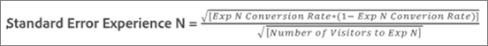

# 平均提升度、提升度界限和信賴區間

報告包括幾個資料點和可視化表示，這些資料點和可視化表示可幫助您瞭解與您的 [!DNL Adobe Target] 來幫助您更準確地確定獲勝者。

>[!NOTE]
>
>此功能僅在以下位置查看報告時可用 [!UICONTROL 表格] 。 此功能無法供以[ Analytics 作為報表來源 (A4T)](/help/main/c-integrating-target-with-mac/a4t/a4t.md#concept_7540C8C04259434AB6EE33B09F47A1DE) 的活動使用。

## 解釋資料 {#section_62C0D7E76F3D49A7B3C371C82AEF27D5}

下圖顯示 [!UICONTROL 提升界限和置信度] 資訊：

中的提升和置信度資訊 [!DNL Target] 報告UI包括：

### 提升度

大的數字和箭頭反映提升度的期望值。此數字是提升度界限範圍的中點。期望的提升度箭頭以灰色顯示，直到可信度超過 95% 為止。超過此臨界值之後，箭頭會顯示為紅色或綠色，分別根據負提升或正提升而定。

### 升程邊界

這是提升度的 95% 信賴區間。顯示成一個低於平均提升度的範圍。請參閱 [示例計算](#example) 下面是如何計算這些升程界限的示例。

### 框圖圖

框圖圖 [!DNL Target] interface表示所述成功度量的預期值和95%置信區間。 可視為以圖形來檢視提升度和提升度界限資訊。

有幾種關鍵方法 [!DNL Target] 幫助你解釋信心資訊，其中一種是顏色。 圖形以灰色顯示特定體驗與控制體驗的信賴區間中的任何重疊，特定體驗的信賴區間若有任何範圍高於或低於控制信賴區的範圍，則分別以綠色或紅色顯示。

盒形圖長度以簡單明瞭的方式表示信賴區間的大小。隨著您在活動中收集越多資料，直條會位移動和變更。信賴區間衍生自變數和樣本大小 (訪客數)。變數越小和樣本大小越大，信賴間區就越窄。

### 可信度

所顯示的經驗或建議的置信度是獲得結果的概率（以百分比表示） _更極端_ 比實際觀察到的要多， _如果空假設為真_，即該經驗或要約與控制經驗/要約之換算率並無差異。 就p值而言，所顯示的置信度 `1 - p-value`。 更簡單地說，置信度較高表明資料與控制和非控制提供/經驗具有相等轉換率的假設不一致。

## 瞭解如何確定提升的置信區間 {#pdf}

下載 [提升PDF檔案的置信間隔](/help/main/assets/confidence_interval_lift.pdf) 的子菜單。

## 如何計算升程界限？ {#section_1D360781D972483693680BE0F07AEAD1}

提升度界限代表特定體驗或選件的提升度超過控制體驗或選件的 95% 信賴區間。籠統來說，即實際提升度大約有 95% 的機會落在這些界限之間。

提升度界限是利用下列公式計算:

輸入我們的提升度界限時還會做一些其他計算:

* **t 值:** 95% 信賴水準的臨界統計量是 1.96。您可以在[此處](https://en.wikipedia.org/wiki/T-statistic)進一步瞭解 t 值。
* **提升度變異數:**&#x200B;需要體驗 N 成功量度的標準誤差和控制體驗成功量度的標準誤差，才能判斷使用下列公式計算的提升度變異數 (圖例中的成功量度為轉換)。

   

* **轉換率/成功量度標準誤差:**&#x200B;體驗 N 和控制體驗以相同方式計算標準誤差，採用下列公式 (圖例中的成功 度是轉換)。您可以在[此處](https://en.wikipedia.org/wiki/Standard_error)進一步瞭解標準誤差。

   

   >[!NOTE]
   >
   >收入成功量度活動的條件誤差是根據收入的樣本變數。

## 示例計算 {#example}

假設範例活動有兩個體驗和下列結果:

| 體驗 | 訪客 | 轉換 | 轉換率 |
|--- |--- |--- |--- |
| 體驗 A (控制) | 219, 328 | 2,466 | 1.12% |
| 體驗 B | 218, 362 | 3,040 | 1.39% |

根據公式，我們可以計算提升度界限所需的輸入。

**體驗 A (控制) 的標準誤差**

**體驗 B 的標準誤差**

**體驗 B 的提升度變數**

**體驗 B 的提升度界限**

體驗 B 的期望提升度:

因此，體驗 B 的提升度界限是:

>[!NOTE]
>
>若使用上述報表中顯示的公式與數字進行手動計算，可能會出現些微差異。此差異可歸因於手動計算中使用的頁面檢視數字為四捨五入。顯示在 [!DNL Target] 報告基於從總項目和項目計數中獲得的確切數字。 此參與數字可透過效能報表 API 取得。

## 何時不顯示提升界限？ {#section_C5622E1E94684DAD937249B51A9E42CC}

在某些情況下， [!DNL Target] 不顯示提升界限：

* 在任何活動中，當造訪或訪客總數少於 30 時。
* 對於 [!UICONTROL 自動分配] 活動，在一次經驗達到60%置信度之前，不顯示升降界限。
