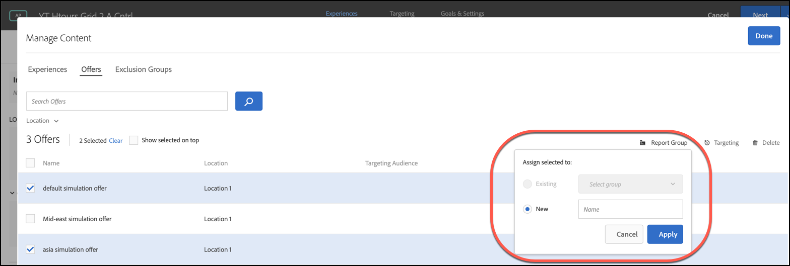

#  自動個人化中的選件報表群組

有關在中使用報告組的資訊 [Automated Personalization](/help/main/c-activities/t-automated-personalization/automated-personalization.md) （美聯社）活動。

報表群組執行兩個重要功能:

* 這些功能可讓您查看 AP 活動報表中分組的選件。
* 他們扮演了關鍵角色 [!DNL Target] 個性化模型函式。

使用報告組時， [!DNL Target] 僅為每個報告組建立一個個性化模型，而不是使用該組中所有優惠的資料為AP活動中的每個優惠建立一個個性化模型。

如果您的活動設定沒有足夠的資料來為每個選件建立個人化模型，則報表群組可幫助減少使用「自動個人化」的資料要求。報表群組也可以藉由分組類似選件來幫助解決新選件的「冷啟動」問題，以便每個模型獲得更多資料以進行訓練。模組化群組也可用於定期向 AP 活動提供新選件的活動。

如果訪客以相同的方式回應群組中的所有選件，則此方法很有效。最佳做法是對類似訪客群組以類似方式回應的選件進行分組。換句話說，群組選件具有類似的轉換率。您永遠不應將所有選件放置在單一報表群組中。將所有優惠或分組優惠與非常不同的轉換率分組可能會降低 [!DNL Target] 個性化模型。

>[!NOTE]
>
>如果從特定模組化群組中移除或替換選件，則也會從模組化群組中刪除看到該特定選件的歷史流量。換句話說，刪除的優惠不會影響用於 [!DNL Target] 個性化模型以便學習。

**若要設定報表群組:**

1. 在 [!UICONTROL 體驗] AP活動的頁面，按一下 **[!UICONTROL 管理內容]** 表徵圖

   

1. 按一下&#x200B;**[!UICONTROL 「管理內容」]**&#x200B;對話方塊頂端的[!UICONTROL 「選件」]索引標籤。
1. (條件性) 藉由將游標移至所需的選件上，然後按一下&#x200B;**[!UICONTROL 「報表群組」]**&#x200B;資料夾圖示，將特定體驗加入報表群組。

   

1. (條件性) 藉由選取相關體驗的核取方塊，然後按一下對話方塊右上角的&#x200B;**[!UICONTROL 「報表群組」]**&#x200B;資料夾圖示，將體驗批次加入報表群組。

   

1. （條件）要將所選要約分配給現有報告組，請選擇 **[!UICONTROL 現有]**，從下拉清單中選擇所需的報告組，然後按一下 **[!UICONTROL 應用]**。

   或

   若要建立新報表群組以將選定選件指派至該群組，請選取&#x200B;**[!UICONTROL 「新增」]**，命名新報表群組，然後按一下&#x200B;**[!UICONTROL 「套用」]**。

   
