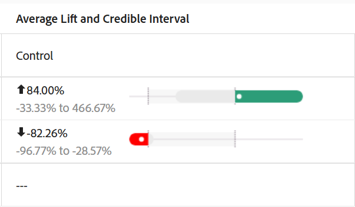

# A/Bn測試中的統計計算

本文記錄了[!DNL Adobe Target]中手動A/Bn測試使用的詳細統計計算。 已提供&#x200B;**[!UICONTROL 轉換率]**、**[!UICONTROL 轉換率的信賴區間]**、**[!UICONTROL 提升度]**、**[!UICONTROL 提升度的信賴區間]**、**[!UICONTROL 信賴度]**&#x200B;以及&#x200B;**[!UICONTROL 貝葉斯]**&#x200B;決定度量的定義。

**[!UICONTROL A/B測試]** （手動）活動支援兩種統計方法，在[目標與設定](/help/main/c-activities/t-test-ab/t-test-create-ab/ab-goals-and-settings.md#section_13119392051044FBA6387D9B3B1C43CF)中針對每個活動選取：

* [Welch的t檢定](#welchs-t-test)：一種頻率方法，會根據固定樣本大小的假設檢驗，報告&#x200B;**[!UICONTROL 信賴]**&#x200B;百分比和信賴區間。 用於具有&#x200B;**[!UICONTROL 收入]**&#x200B;或&#x200B;**[!UICONTROL 參與]**&#x200B;主要目標的活動。

* [Bayesian](#bayesian-statistics)：將結果報告為機率，例如&#x200B;**[!UICONTROL 勝出控制機會]**&#x200B;和可信間隔，由每個體驗的目標量度的完整後驗分佈計算。 此設定僅適用於主要目標量度為&#x200B;**[!UICONTROL 轉換]**&#x200B;的活動。

## 韋爾奇的t檢定

### 平均績效

下節將說明下圖中所使用的計算。

![顯示A/B測試活動的[!UICONTROL 轉換率]、[!UICONTROL 平均提升度和信賴區間]以及[!UICONTROL 信賴]的目標報告。](/help/main/c-reports/statistical-methodology/img/target_report.png)

#### 轉換率和每位訪客帶來的收入(RPV)行銷活動

下圖顯示[!DNL Target]報表中的&#x200B;**[!UICONTROL 轉換率]**、**[!UICONTROL 轉換率的信賴區間]**&#x200B;以及&#x200B;**[!UICONTROL 轉換]**&#x200B;的數目。 例如，第一行顯示對於體驗A： **[!UICONTROL 轉換率]**&#x200B;為25.81%，且&#x200B;**[!UICONTROL 信賴區間]**&#x200B;為±7.7%，並且已記錄32次轉換。 假設有124位訪客看過該體驗，則等於32/124 = 25.81%。

<p style="text-align:center;"></p>

實驗中的每個體驗&#x200B;*ν*&#x200B;的轉換率或&#x200B;**平均值**，*μ<sub>ν</sub>*，定義為量度總和相對於指派給該量度的單位數的比率，*N<sub>ν</sub>*：

<p style="text-align:center;"></p>

此處，

* *Y<sub>iν</sub>*&#x200B;是指派給指定體驗&#x200B;*ν*&#x200B;之每個單位&#x200B;*i*&#x200B;的量度值。

* 單位&#x200B;*i*&#x200B;的總和取決於計數方法的選擇。

  * 如果將&#x200B;**[!UICONTROL 訪客]**&#x200B;當做計數方法，則每個單位都是定義為活動終身不重複參與者的不重複訪客。
  * 如果使用&#x200B;**[!UICONTROL 造訪]**&#x200B;做為計數方法，則每個單位都是定義為在[!DNL Target]工作階段期間體驗中唯一參與者的唯一造訪（具有唯一的`sessionId`）。 當`sessionId`變更時，或訪客達到轉換步驟時，即會計為新造訪。
  * 如果使用&#x200B;**[!UICONTROL 活動曝光次數]**&#x200B;做為計數方法，則每個單位都是定義為每次訪客載入活動任何頁面時的唯一曝光次數。

### 平均]/[!UICONTROL 轉換率]的[!UICONTROL 信賴區間

轉換率的信賴區間在直覺上定義為與基礎資料一致的可能轉換率範圍。

執行實驗時，特定體驗的轉換率是&quot;true&quot;轉換率的&#x200B;*預估值*。 若要量化此估計中的不確定性，[!DNL Target]會使用信賴區間。 [!DNL Target]一律會報告95%的信賴區間，這表示到最後，95%的信賴區間都會包含體驗的真正轉換率。

目前領先或勝出的體驗旁邊也會報告「信賴度」數字。 此數字只會在領先體驗的&#x200B;**[!UICONTROL 信賴度]**&#x200B;達到至少60%時報告。 如果活動中存在兩個體驗，此數字代表體驗表現優於其他體驗的信賴等級。 如果活動中存在兩個以上的體驗，此數字代表體驗執行優於定義「控制」體驗的信賴等級。 如果「控制」體驗獲勝，則不會報告「信賴度」數字。

轉換率&#x200B;*μ<sub>ν</sub>*&#x200B;的95%信賴區間定義為值的範圍：

<p style="text-align:center;"></p>

其中平均值的標準誤差定義為

<p style="text-align:center;"></p>

其中使用樣本標準差的無偏估計值：

<p style="text-align:center;"></p>

當行銷活動為轉換率行銷活動時（即轉換量度為二進位），標準錯誤會減少為：

<p style="text-align:center;"></p>

### 提升度

下圖顯示[!DNL Target]報表中的&#x200B;**[!UICONTROL 提升度]**&#x200B;和&#x200B;**[!UICONTROL 提升度]**&#x200B;信賴區間。 數字代表提升度界限的平均值，而箭頭則反映提升度是正數或負數。 箭頭會以灰色顯示，直到信賴度超過95%為止。 信賴度超過臨界值後，箭頭會根據提升度為正值或負值，變成綠色或紅色。

<p style="text-align:center;"></p>

體驗&#x200B;*ν*&#x200B;與控制體驗&#x200B;*ν<sub>0</sub>*&#x200B;之間的提升度是轉換率的相對「差異」，定義為

<p style="text-align:center;"></p>

其中個別轉換率定義如上。 更簡單地說，

```
Lift(Experience N) = (Performance_Experience_N - Performance_Control)/ Performance_Control
```

如果控制體驗&#x200B;*ν<sub>0</sub>*&#x200B;的轉換率為0，則沒有提升度。

### [!DNL Confidence Interval of Lift]

**[!UICONTROL 平均提升度和信賴區間]**&#x200B;資料行中的箱形圖代表提升度的平均值和95% **[!UICONTROL 信賴區間]**。 指定非控制體驗的信賴區間與控制體驗的信賴區間發生任何重疊時，箱形圖就會呈現灰色。 當指定體驗的信賴區間範圍高於或低於控制體驗的信賴區間時，箱形圖就會呈現綠色或紅色。

體驗&#x200B;*ν*&#x200B;與控制體驗&#x200B;*ν<sub>0</sub>*&#x200B;之間提升度的標準錯誤定義為：

<p style="text-align:center;"></p>

提升度的95%信賴區間是：

<p style="text-align:center;"></p>

此計算使用「差異」方法，本檔案將詳細說明[](/help/main/assets/confidence_interval_lift.pdf)

### [!UICONTROL 信賴度]

最後一欄顯示[!DNL Target]報表中的可信度。 體驗的信賴度是一種取得極端結果的機率（以百分比表示），當作觀察到的結果，假設null假設為true。 就p值而言，顯示的信賴度為&#x200B;*1 - p值*。 直覺上，較高的信賴度表示控制體驗和非控制體驗擁有相同轉換率的可能性較低。

在[!DNL Target]中，會在測試體驗與控制體驗之間執行雙尾&#x200B;**Welch的t檢定**，以測試測試與控制體驗的方法是否相同。 因為在執行實驗之前，我們通常不知道兩個群組的樣本大小和差異是否相同，而且[!DNL Target]也允許您傳送到每個體驗的流量百分比不相等，因此我們不假設每個體驗的差異相等。 因此，選擇Welch的t檢驗，而非Student的t檢驗。

若要執行Welch的t檢定，我們先開始計算t統計值和自由度，然後執行雙尾t檢定，以產生p值。 最後，我們會根據p值計算可信度。

*t*&#x200B;統計值定義為任何兩個獨立隨機變數&#x200B;*ν*&#x200B;和&#x200B;*ν<sub>0</sub>*&#x200B;之平均值除以差異的標準誤差：

<p style="text-align:center;"></p>

其中&#x200B;*μ<sub>v</sub>*&#x200B;和&#x200B;*μ<sub>v0</sub>*&#x200B;分別為&#x200B;*ν*&#x200B;和&#x200B;*ν<sub>0</sub>*&#x200B;的均值，且&#x200B;*μ<sub>v</sub>*&#x200B;和&#x200B;*μ<sub>v0</sub>*&#x200B;之間差值的標準誤差由以下給出：

<p style="text-align:center;"></p>

其中&#x200B;*σ<sup>2</sup><sub>v</sub>*&#x200B;和&#x200B;*σ<sup>2</sup><sub>v<sub>0</sub></sub>*&#x200B;分別為兩個體驗&#x200B;*ν*&#x200B;和&#x200B;*ν<sub>0</sub>*&#x200B;的變異，而&#x200B;*N<sub>v</sub>*&#x200B;和&#x200B;*N<sub>v<sub>0</sub></sub>*&#x200B;分別為&#x200B;*ν*&#x200B;和&#x200B;*ν<sub>0</sub>*&#x200B;的樣本大小。

對於Welch的t檢定，自由度計算如下：

<p style="text-align:center;"></p>

*ν*&#x200B;和&#x200B;*ν<sub>0</sub>*&#x200B;的自由度定義為：

<p style="text-align:center;"></p>

<p style="text-align:center;"></p>

然後可以從&#x200B;*t* — 分佈尾部的區域計算p值：

<p style="text-align:center;"></p>

最後，[!DNL Target]中報告的信賴度定義為：

<p style="text-align:center;"></p>

## 貝葉斯統計資料

**[!UICONTROL Bayesian]**&#x200B;活動的報告不會從近似分佈計算p值，而是將結果表示為機率，從每個體驗的目標量度的完整後驗分佈計算。 如此一來，連續監視&#x200B;**[!UICONTROL Bayesian]**&#x200B;報告就變得安全了，因為在達到固定樣本大小之前檢查結果沒有統計上的懲罰，而且它在小樣本上的收斂速度比&#x200B;**[!UICONTROL Welch的t檢驗]**&#x200B;更快。

**[!UICONTROL Bayesian]**&#x200B;方法也讓行銷人員根據過去實驗和控制變體的結果提供假設。

**[!UICONTROL Bayesian]**&#x200B;方法僅適用於主要目標量度為&#x200B;**[!UICONTROL 轉換]**&#x200B;的活動，具有&#x200B;**[!UICONTROL 收入]**&#x200B;或&#x200B;**[!UICONTROL 參與]**&#x200B;主要目標的活動一律使用&#x200B;**[!UICONTROL Welch的t檢定]**。 如需選取方法的詳細資訊，請參閱[目標與設定](/help/main/c-activities/t-test-ab/t-test-create-ab/ab-goals-and-settings.md#section_13119392051044FBA6387D9B3B1C43CF)。

### 平均提升度和可信區間

<p style="text-align:center;"></p>

平均提升度和可信區間一起測量&#x200B;**[!UICONTROL Bayesian]**&#x200B;活動中的效能改善及其不確定性。 平均提升度是處理與控制之間的平均百分比變更，而可信區間則定義真實提升度以指定機率下降的範圍。

### [!UICONTROL 擊敗控制項]的機會

<p style="text-align:center;"></p>

**[!UICONTROL 擊敗控制項]**&#x200B;的機會是體驗的目標量度優於&#x200B;**[!UICONTROL 控制項]**&#x200B;體驗的機率，例如「92%的機會B會擊敗A」。 這是&#x200B;**[!UICONTROL Bayesian]**&#x200B;活動的主要決定量度：當其&#x200B;**[!UICONTROL 擊敗控制項的機會]**&#x200B;達到活動的決定臨界值時，挑戰者體驗是取代&#x200B;**[!UICONTROL 控制項]**&#x200B;的候選專案。

<!--
### [!UICONTROL Probability to be Best]

[!UICONTROL Probability to be Best] is the probability that an experience is the single best of all experiences in the activity. Use this decision metric to pick which winner to ship in a test with more than one challenger experience.
-->

## 離線執行計算

[下載的 CSV 報表](/help/main/c-reports/c-report-settings/downloading-data-in-csv-file.md)只包含原始資料，不含計算度量，例如每次造訪帶來的收入、提升度或用於 A/B 測試的信賴度。

若要計算這些統計數量，請下載[!DNL Target] [完整可信度電腦](/help/main/assets/complete_confidence_calculator.xlsx) Excel檔案來輸入活動的值。
