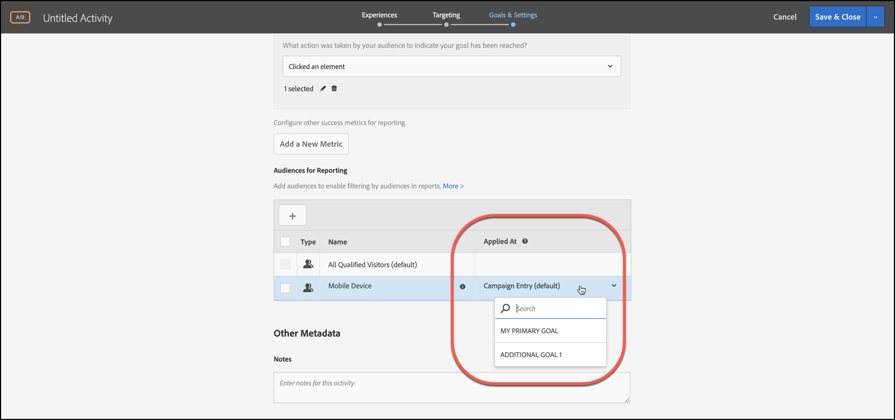

# 套用報表對象至成功量度

選擇符合以下條件的用戶報告受眾的成功度量 [!DNL Adobe Target]。

對於所有活動，[!UICONTROL 「套用於」]下拉式清單可讓您將對象套用至成功量度，在達到量度之後和針對後續動作，您就可以檢視報表數字。

例如，假設您已經為所有從首頁進入並抵達轉換頁面的訪客建立活動，但對於轉換之前已在購物車中增加 $50 以上的訪客，您還想要進一步向下鑽研。

的 [!UICONTROL 應用於] 下拉清單可能提供三個類別：任何參加活動的訪客，只有達到活動某一步驟的訪客，或只有達到轉換的訪客。 或者，換一種說法，您可以指定訪客必須到達活動進入頁面上的 Mbox、定義活動中途某一點的 Mbox，或活動最後的轉換 Mbox。

[成功量度](/help/main/c-activities/r-success-metrics/success-metrics.md#reference_D011575C85DA48E989A244593D9B9924)必須先設定給活動才可使用。如果尚未定義成功度量，則從下拉清單中只能看到兩個選項： [!UICONTROL 市場活動條目] 和 [!UICONTROL 轉換]。

將報表對象套用至成功量度時，請考量下列資訊:

* 對於操作之前的操作，以及應用的成功度量， [!DNL Target] 不應用分段受眾。
* 對於應用成功度量後的操作， [!DNL Target] 應用分段的受眾。

要查看報告中的分段，請從 [!UICONTROL 觀眾] 下拉清單。

