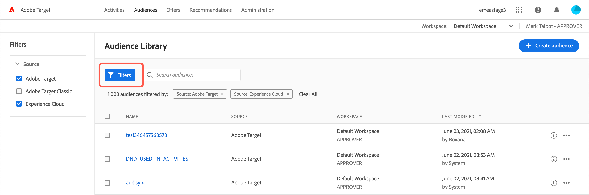

# 建立客群

[!DNL Adobe Target]中的對象會決定哪些人可以看到鎖定目標活動中的內容與體驗。

可使用鎖定目標之處皆可使用對象。鎖定目標活動時，您有以下選項：

* 從[!UICONTROL Audiences]清單中選取可重複使用的對象
* [建立活動特定對象](/help/main/c-target/creating-activity-only-audience.md)並鎖定該對象
* [結合多個對象](/help/main/c-target/combining-multiple-audiences.md#concept_A7386F1EA4394BD2AB72399C225981E5)以建立隨選對象

您也可以在[!DNL Target]和其他[!DNL Adobe Experience Cloud]應用程式中，使用[!DNL Adobe Analytics]所收集的對象資料進行即時目標定位和個人化。 請參閱&#x200B;*Experience Cloud中央介面元件*&#x200B;指南中的[Experience Cloud對象](https://experienceleague.adobe.com/docs/core-services/interface/audiences/audience-library.html??lang=zh-Hant)。

[!DNL Target]中有兩種型別的對象：

* **鎖定目標對象：**&#x200B;用來傳送不同的內容給不同型別的訪客。
* **報表對象：**&#x200B;用來判斷不同型別的訪客如何回應相同的內容，以便您分析測試結果。

  在 [!DNL Target] 中，只有在使用 [!DNL Target] 作為報表來源時，才可設定報表客群。如果您使用[Adobe Analytics作為您的報表來源](/help/main/c-integrating-target-with-mac/a4t/a4t.md) (A4T)，則必須在[!DNL Analytics]內設定您的報表對象。

## 使用[!UICONTROL Audiences]清單 {#use-list}

若要存取[!UICONTROL Audiences]清單，請按一下頂端功能表列中的&#x200B;**[!UICONTROL Audiences]**：

![[!UICONTROL Audiences]清單](assets/audiences_list.png)

[!UICONTROL Audiences]清單包含您可在活動中使用的對象。 使用[!UICONTROL Audiences]清單來建立、編輯、複製、複製或合併對象。 此清單也顯示原本建立對象的來源：

* [!DNL Adobe Target]
* [!DNL Adobe Target Classic]
* [!DNL Experience Cloud]
* [!DNL Adobe Experience Platform]

  >[!NOTE]
  >
  >[!DNL Adobe Experience Platform]來源可供所有使用[Adobe Experience Platform Web SDK](https://experienceleague.adobe.com/docs/target-dev/developer/client-side/aep-web-sdk.html){target=_blank}的[!DNL Target]客戶使用。 來自[!DNL Adobe Experience Platform]的可用對象可依原樣使用，或將[與現有對象](/help/main/c-target/combining-multiple-audiences.md)結合。
  >
  >使用者在[!DNL Target]中必須具有[!UICONTROL Approver]或以上的狀態，才能在AEP/RTCDP ([!DNL Real-time Customer Data Platform])中設定[!DNL Target] [!UICONTROL Destinations]卡片。
  >
  >如需詳細資訊，請參閱[使用來自Adobe Experience Platform的對象](#aep)。

無法重新命名預先定義的對象，例如&quot;[!UICONTROL New Visitors]&quot;和&quot;[!UICONTROL Returning Visitors]&quot;。

使用最初在[!DNL Experience Cloud]或[!DNL Adobe Experience Platform]中建立的對象時，如果您在[!DNL Target]個活動中參考對象，而這些活動後來在[!DNL Experience Cloud]或[!DNL Adobe Experience Platform]中被刪除，[!DNL Target]會警示您。

* 若對象已在[!DNL Experience Cloud]或[!DNL Adobe Experience Platform]中刪除，[!UICONTROL Audience]清單和對象選擇器中皆會顯示警告圖示。 [!DNL Target] UI中的工具提示也表示對象已在[!DNL Experience Cloud]或[!DNL Adobe Experience Platform]中刪除。
* 若嘗試將多個客群與已刪除的客群合併，或嘗試儲存參考已刪除客群的活動，系統會顯示警告訊息。

您也可以鎖定自訂設定檔參數和 `user.` 參數。建立對象時，請將您要用來鎖定活動的屬性拖曳至對象產生器視窗。 如果未顯示所需的屬性，表示該屬性並未由mbox觸發。 [!UICONTROL Custom Parameters]下拉式清單中有其他自訂mbox引數。

使用[!UICONTROL Filters]按鈕依來源篩選[!UICONTROL Audiences]清單： [!DNL Adobe Target]、[!DNL Adobe Target Classic]、[!DNL Experience Cloud]和[!DNL Adobe Experience Platform]。

[!UICONTROL Audiences]清單中的

使用[!UICONTROL Search audiences]方塊來搜尋您的[!UICONTROL Audiences]清單。 您可以搜尋對象名稱的任何部分，或您可以將特定字串放在引號內。

您可以依對象名稱或上次修改日期來排序[!UICONTROL Audiences]清單。 若要依名稱排序，請按一下欄標題，然後選擇依遞增或遞減順序來顯示客群。

## 檢視對象定義 {#section_11B9C4A777E14D36BA1E925021945780}

您可以在[!DNL Target] UI中不同位置的快顯示卡上檢視對象定義詳細資料，而不需開啟對象。 此功能適用於在[!DNL Target Standard/Premium]中建立的對象，以及從[!DNL Target Classic]匯入或透過API建立的對象。

例如，按一下所需對象的[!UICONTROL View Details]圖示，即可存取下列對象定義卡：

按一下活動[!UICONTROL Overview]頁面上的[!UICONTROL View Details]圖示，可存取下列對象定義卡：

對象定義卡片會顯示對象的型別、來源和屬性。 按一下&#x200B;**[!UICONTROL View full details]**&#x200B;以檢視參照該對象的其他活動（如果適用）。 如果您從活動的[!UICONTROL Overview]頁面檢視對象定義卡，請按一下&#x200B;**[!UICONTROL Audience Usage]**。

對象使用資訊可協助您在編輯對象時避免對其他活動造成意外影響。 資訊包括[!UICONTROL Live Activities]、[!UICONTROL Inactive Activities]、[!UICONTROL Archived Activities]和[!UICONTROL Syncing Activities]。 此功能適用於所有對象（資料庫對象和[僅限於此活動的對象](/help/main/c-target/creating-activity-only-audience.md#concept_A6BADCF530ED4AE1852E677FEBE68483)）。

如果對象是[與其他對象](/help/main/c-target/combining-multiple-audiences.md)結合，且結合的對象是用來建立活動，則兩個對象的使用資訊會列出該新建立的活動。

<!--The following audience definition card is for an audience imported from the Adobe Experience Cloud. In this instance, the audience was imported from Adobe Audience Manager (AAM).

The following details are available for these imported audience types:

| Audience Type | Details |
|--- |--- |
|Mobile audience|Marketing Name, Vendor, and Model. The `matches | does not match` operator displays instead of `equals | does not equal` .|
|Visitor-behavior audience|**user.categoryAffinity:** `categoryAffinity` with `FAVORITE` parameter.  **Monitoring:** Monitoring service equals true. **No Monitoring Service:** Monitoring service equals false. |
|Audiences using the NOT operator|**Single Rule:** Target displays the audience in the format `[All Visitor AND [NOT [rule]`. Single NOT rule displays with AND with `AllVisitor` audience. |

Keep the following points in mind as you work with imported audiences:

* Expression target audiences are no longer supported in Target Standard/Premium. 
* Target Standard/Premium does not support some deprecated audiences or has improved operators for ease of use. Because of this, the definition of an imported audience, although working as per definition, does not mean that same is now available for creation in the Standard/Premium interface. For example, Social Audiences are visible with their rules but Target Standard/Premium does not allow social audiences to be created.-->

## 使用來自 [!DNL Adobe Experience Platform] 的客群 {#aep}

使用在[!DNL Adobe Experience Platform]中建立的對象可提供更豐富的客戶資料，從而帶來更具影響力的個人化。

如需詳細資訊，請參閱[使用來自 [!DNL Adobe Experience Platform]](/help/main/c-integrating-target-with-mac/integrating-with-rtcdp.md#aep)的對象。

## 訓練影片：使用對象

此影片包括關於使用對象的資訊。

* 說明詞語「對象」
* 說明將對象用於最佳化的兩個方式
* 在對象清單中尋找對象
* 將活動鎖定至對象
* 對活動中的被動報表使用對象

>[!VIDEO](https://video.tv.adobe.com/v/17398)
