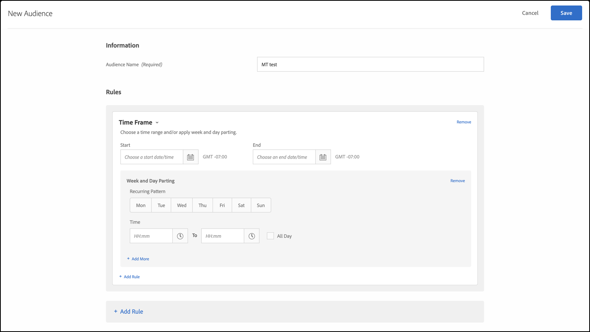

# 時間段

您可以在中添加開始和結束日期和時間 [!DNL Adobe Target] 目標用戶在特定時間範圍內訪問您的站點。 您也可以設定「週與日劃分」選項，來為對象鎖定目標建立週期性模式。

例如，使用 [組合的即席觀眾特徵](/help/main/c-target/combining-multiple-audiences.md#concept_A7386F1EA4394BD2AB72399C225981E5)在「黑色星期五」和「黑色星期五」之後的三天內，您可以針對包含特定內容的低消費者。

1. 在 [!DNL Target] 介面中，按一下&#x200B;**[!UICONTROL 「對象」]**>**[!UICONTROL 「建立對象」]**。
1. 命名訪問群體並添加可選說明。
1. 拖放 **[!UICONTROL 時間框]** 對話框。

   

1. 指定 [!UICONTROL 開始] 和 [!UICONTROL 結束] 觀眾的日期和時間。

   將開始日期保持空白，以根據活動的排程來鎖定目標。將結束日期保持空白，以繼續鎖定目標直到活動的結束日期和時間為止。

   您也可以將開始和結束日期都保持空白。此功能允許您在多個活動中使用相同的受眾（不製作受眾的副本），同時控制活動層的起始日期和終止日期。

   >[!NOTE]
   >
   >開始/結束日期的時區會顯示為 GMT +/- NN:NN；其中 NN:NN 是 GMT 時差，會反映帳戶層級時區，而非訪客的時區。例如，加州時區會顯示為 GMT -08:00。

1. （條件）按一下 **[!UICONTROL 設定頻率]** 設定循環模式，包括周和時間的天數。

   

   你可以 [!UICONTROL 頻率] 選項，例如，僅在呼叫中心工作的日期和時間向訪問者顯示「立即聊天」選項。

   選取一或多個星期幾，然後設定開始和結束時間。按一下 **[!UICONTROL 添加頻率]** 指定其他陣列。

   >[!NOTE]
   >
   >[!UICONTROL 週與日劃分]的時區會顯示為 GMT +/- NN:NN；其中 NN:NN 是 GMT 時差，會反映帳戶層級時區，而非訪客的時區。例如，California的太平洋夏令時時區將顯示為GMT -07:00。

1. （可選）為受眾設定其他規則。

   如果需要，可為每個規則重複步驟5。

1. 按一下&#x200B;**[!UICONTROL 「完成」]**。

## 培訓視頻：建立受眾 

此影片包括關於使用對象類別的資訊。

* 建立對象
* 定義對象類別

>[!VIDEO](https://video.tv.adobe.com/v/17392)
