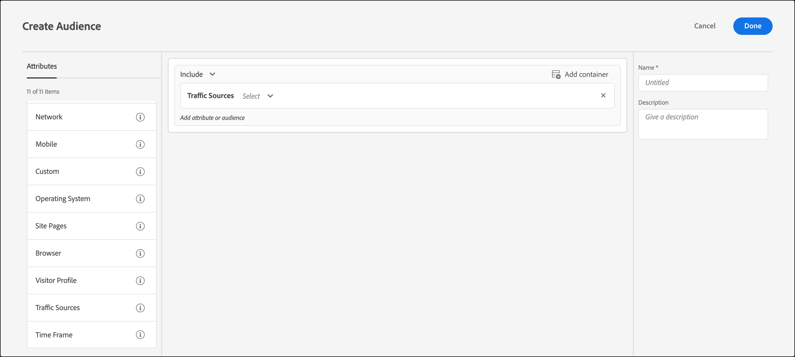

# 流量來源

在[!DNL Adobe Target]中建立受眾，根據參照至您網站的搜尋引擎或著陸頁面鎖定訪客。

例如，你可基於訪客瀏覽器、搜尋引擎或反向連結著陸頁面進行指向。 反向連結著陸頁面是訪客為存取本作業目前頁面而點按的頁面。 (例如，如果訪客在 Google 上按一下廣告，然後被帶往 `adobe.com` 的首頁，則引用登陸頁面就是 `google.com`。)

您可以合併多個流量來源建立一個複雜的目標規則。

1. 在[!DNL Target]介面中，按一下&#x200B;**[!UICONTROL 對象]** > **[!UICONTROL 建立對象]**。
1. 
   1. 為對象命名並新增選擇性說明。
1. 將&#x200B;**[!UICONTROL 流量來源]**&#x200B;拖放至對象產生器窗格。

   

1. 按一下&#x200B;**[!UICONTROL 「選取」]**，然後選取下列其中一個選項:

   * 來自Baidu ]**的**[!UICONTROL 
   * 來自Bing ]**的**[!UICONTROL 
   * 來自Google ]**的**[!UICONTROL 
   * 來自Yahoo ]**的**[!UICONTROL 
   * **[!UICONTROL 反向連結登陸頁面： URL]**
   * **[!UICONTROL 反向連結登陸頁面：網域]**
   * **[!UICONTROL 反向連結登陸頁面：查詢]**

   根據您的選擇，您可能需要提供其他資訊（求值器和/或值）。

1. （選用）為對象設定其他規則。
1. 按一下&#x200B;**[!UICONTROL 「完成」]**。

您可以將目標鎖定在由特定搜尋引擎轉介至您的網站，或來自特定登陸頁面的使用者。

## 訓練影片：建立對象

此影片包括關於使用對象類別的資訊。

* 建立客群
* 定義對象類別

>[!VIDEO](https://video.tv.adobe.com/v/17392)
