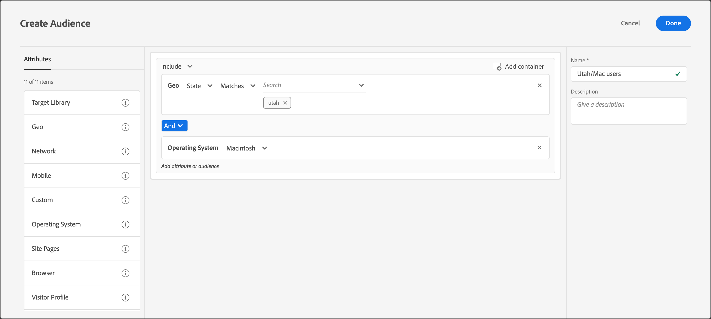

# 在 [!DNL Target] 中建立受眾 

您可以建立自訂對象，並將其儲存至 [!DNL Adobe Target] [!UICONTROL 受眾] 資料庫以供活動使用。 您也可以複製現有對象，然後編輯現有對象以建立類似的對象並合併多個對象。

## 對象概覽

對象是由可決定要從 [!DNL Target] 活動中包括或排除的規則定義。對象定義可以包括多個規則，並且每個規則可以包括多個參數。複雜的對象定義會使用布林值運算子 AND 和 OR 結合規則和參數，以讓您對哪些網站訪客會計入活動加入者能進行詳細控制。

將規則或引數與AND結合時，任何可能的對象成員都必須符合 *全部* 定義為加入者的條件。 例如，如果您定義作業系統規則 AND 瀏覽器規則，則只會在活動中包括同時使用已定義作業系統&#x200B;*與*&#x200B;已定義瀏覽器的訪客。

使用 OR 結合規則或參數時，任何潛在的對象成員只需符合任何單一定義的條件，即可包括為加入者。例如，如果您定義使用 OR 連接的多個行動規則，則將在活動中包括符合&#x200B;*任何*&#x200B;所定義條件的訪客。

您可以將這兩個布林運算子混合來建立複雜的規則; 不過，相同規則層級的運算子必須相符。使用者介面會自動套用至正確的運算子。

例如，下列規則會鎖定在 Windows 電腦上使用 Chrome *或* Firefox 的訪客:

>[!NOTE]
>
>請小心，避免建立規則來排除所有可能的對象成員。例如，某人無法同時使用 Chrome *與* Firefox 來造訪頁面。

## 建立對象

1. 按一下上方功能表列中的&#x200B;**[!UICONTROL 「對象」]**。

   

1. 從 [!UICONTROL 受眾] 清單，按一下 **[!UICONTROL 建立對象]**.

   或

   若要複製現有對象，請從 [!UICONTROL 受眾] 清單中，按一下 **[!UICONTROL 更多動作]** 圖示（省略符號圖示），然後按一下 **[!UICONTROL 複製]**. 然後您可以編輯受眾以建立類似的受眾。

1. 輸入唯一、描述性的對象名稱和選擇性說明。

   對象名稱的開頭不能是下列字元：

   `=  +  -  !  @`

   對象名稱不能包含下列任何字元順序：

   `;=  ;+  ;-  ;@  ,=  ,+  ,-  ,@  ["  "]  ['  ]'`

1. 從下列位置拖放所需的屬性： **[!UICONTROL 屬性]** 清單位於對象產生器窗格的右側。

   

   每個規則類型都有其專屬的參數。請參閱[對象的類別](/help/main/c-target/c-audiences/c-target-rules/target-rules.md#concept_E3A77E42F1644503A829B5107B20880D)，以取得關於設定每個類型的對象規則的詳細資訊。

1. 定義規則參數。

   例如，下列對象會鎖定使用Macintosh作業系統的猶他州訪客。

   

1. （視條件而定）繼續新增及定義所需的屬性。

   若要建立其他容器，請按一下 **[!UICONTROL 新增容器]** 或直接將另一個屬性拖曳至「對象產生器」窗格。 然後，您可以使用下拉式清單調整運運算元（AND或OR）。

1. 按一下&#x200B;**[!UICONTROL 「完成」]**。

   新建立的對象會在處理延遲幾秒之後出現在清單中。如果對象未立即在清單中顯示，請嘗試搜尋對象或重新整理清單。

## 訓練影片: 建立對象 

此影片包括關於建立對象的資訊。

* 建立對象
* 定義對象類別

>[!VIDEO](https://video.tv.adobe.com/v/17392)
