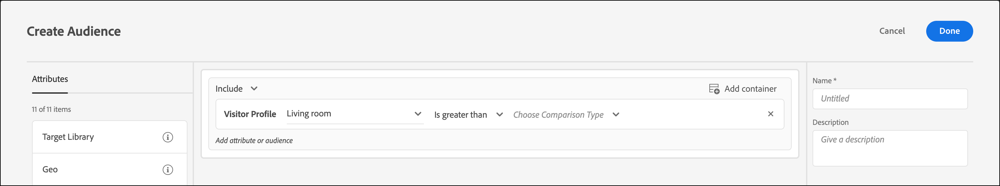

# 建立設定檔屬性比較客群

在[!DNL Adobe Target]中定義對象，以比較[對象庫](/help/main/c-target/c-audiences/audiences.md)或[僅限於此活動的對象](/help/main/c-target/creating-activity-only-audience.md)中的兩個設定檔屬性。 使用大於、小於或等於這類運算子來定義客群，以動態比較兩個不同設定檔屬性的值。

>[!NOTE]
>
>此功能僅適用於[[!UICONTROL Visitor Profile]](/help/main/c-target/c-audiences/c-target-rules/visitor-profile.md#concept_E972690B9A4C4372A34229FA37EDA38E)類別。

## 總覽 {#section_303CBC78194D49A2A004945D425441E1}

客群是由可決定要從 [!DNL Target] 活動中包括或排除的規則定義。對象定義可以包括多個規則，並且每個規則可以包括多個參數。如果您包含的其中一個規則使用[!UICONTROL Visitor Profile]類別，您可以根據訪客設定檔屬性的特定值來定義規則，或將該屬性的值與另一個訪客設定檔屬性進行比較。

例如，假設您在一家傢俱公司工作，並將兩個客戶傾向分數上傳至[!DNL Target]：

* 在接下來 90 天內購買餐廳家具的可能性
* 在接下來 90 天內購買客廳家具的可能性

您可以建立一個對象，定義成購買餐廳家具的傾向大於購買客廳家具的傾向。[!DNL Target]接著會動態比較特定訪客的餐廳和起居室的傾向分數，以判斷該訪客是否符合此對象的資格。

如需詳細資訊，請參閱[將資料傳入Target的方法](https://experienceleague.adobe.com/docs/target-dev/developer/implementation/methods/methods-to-get-data-into-target.html){target=_blank}。

## 建立設定檔屬性比較客群 {#section_7A62FD47D5C74C3EBC3417ACDBB85013}

1. 按一下&#x200B;**[!UICONTROL Audiences]** > **[!UICONTROL Create Audience]**。
1. 為對象命名並新增選擇性說明。
1. 將&#x200B;**[!UICONTROL Visitor Profile]**&#x200B;拖放至對象產生器窗格。
1. 從&#x200B;**[!UICONTROL Visitor Profile]**&#x200B;下拉式清單中選擇屬性：

   

1. 選取求值器:

   

1. 從&#x200B;**[!UICONTROL Choose Comparison Type]**&#x200B;下拉式清單中選擇&#x200B;**[!UICONTROL Attribute]**。

   「靜態值」比較型別可讓您將訪客設定檔屬性與特定值比較。

   

   >[!NOTE]
   >
   >如果您使用其中一個預設的訪客設定檔類別（例如「新訪客」或「回頭客」），您只能選擇靜態值選項。 預設類別無法使用動態比較選項。其他無法使用動態比較選項的範例包括「工作階段首頁」、「不在其他測試中」、「非工作階段首頁」和「類別相關性」。

1. 選取您要與初始屬性比較的額外屬性。

   

1. 按一下 **[!UICONTROL Done]**。

## 訓練影片 {#section_3BB8DBF3418F4520B3E274B6F40AF8F3}

觀看下列影片以獲得詳細資訊，並瞭解您可使用此功能的情況:

>[!VIDEO](https://video.tv.adobe.com/v/23218/)
