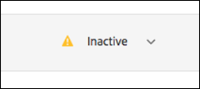

# 個人資料屬性

[!DNL Adobe Target] 中的個人資料屬性是訪客特有的參數。 這些屬性儲存於訪客的個人資料中，以提供可用於活動中的訪客相關資訊。

使用者個人資料包含網頁訪客的人口統計和行為資訊。 此資訊可以包括年齡、性別、購買的產品、上次造訪時間等。[!DNL Target] 使用此資訊來個人化提供給該訪客的內容。

當訪客瀏覽您的網站或在另一次作業中返回瀏覽時，可以使用個人資料中儲存的個人資料屬性來鎖定內容或記錄資訊，以進行區段篩選。

若要設定個人資料屬性：

1. 按一下&#x200B;**[!UICONTROL 受眾]** > **[!UICONTROL 個人資料指令碼。]**

   

1. 按一下&#x200B;**[!UICONTROL 建立指令碼]**。

   

   可用的個人資料屬性類型如下:

   | 參數類型 | 說明 |
   |--- |--- |
   | mbox | 建立 mbox 時透過頁面程式碼直接傳遞。請參閱 *Target 開發人員指南*&#x200B;中的[將參數傳遞到全域 Mbox](https://experienceleague.adobe.com/docs/target-dev/developer/client-side/global-mbox/pass-parameters-to-global-mbox.html){target=_blank}。<P>**注意**：[!DNL Target] 具有每個 mbox 呼叫 50 個獨特個人資料屬性的限制。如果您必須傳遞超過 50 個個人資料屬性給 [!DNL Target]，請使用[!UICONTROL 個人資料更新 API] 方法來傳遞。如需詳細資訊，請參閱 *Target 開發人員指南*&#x200B;中的[更新個人資料](https://experienceleague.adobe.com/docs/target-dev/developer/api/profile-apis/profile-api-overview.html){target=_blank}。 |
   | 個人資料 | 直接使用 JavaScript 程式碼片段定義。 這些片段可儲存累積總計 (例如消費者總花費金額)，並在每個 mbox 要求上執行。請參閱底下的&#x200B;*個人資料指令碼屬性*。 |

## 個人資料指令碼屬性 {#concept_8C07AEAB0A144FECA8B4FEB091AED4D2}

以相關聯的 JavaScript 程式碼片段定義個人資料指令碼屬性。

您可以使用個人資料指令碼來跨多次造訪擷取訪客屬性。個人資料指令碼是使用伺服器端 JavaScript 的某個形式定義在 [!DNL Target] 中的程式碼片段。 例如，您可能會使用個人資料指令碼來記錄訪客造訪您網站的頻率，以及該使用者上次造訪的時間。

個人資料指令碼與個人資料參數不同。 個人資料參數會使用 [!DNL Target] 的 mbox 程式碼實作來擷取訪客相關資訊。

## 建立個人資料指令碼 {#section_CB02F8B97CAF407DA84F7591A7504810}

在 [!UICONTROL  介面的]受眾[!DNL Target]索引標籤底下有提供個人資料指令碼。

若要新增個人資料指令碼，請按一下&#x200B;**[!UICONTROL 個人資料指令碼]**&#x200B;索引標籤、**[!UICONTROL 建立指令碼]**，然後撰寫您的指令碼。

或

若要複製現有的個人資料指令碼，請從[!UICONTROL 個人資料指令碼]清單中按一下所需指令碼的省略符號圖示，然後按一下&#x200B;**[!UICONTROL 複製]**。

然後您可以編輯受眾以建立類似的受眾。

個人資料指令碼會針對每個位置要求執行個人資料屬性「捕捉器」。 在收到位置要求時，[!DNL Target] 會判斷應該執行哪一個活動，並顯示適合該活動和該體驗的內容。 [!DNL Target] 也會追蹤該活動成功與否，並執行任何相關的個人資料指令碼。 此程序可讓您追蹤有關造訪的資訊，例如訪客的位置、當天時間、訪客已造訪網站的次數、先前是否曾經購買等。 這些資訊會接著新增到該訪客的個人資料中，以便您可以更有效地追蹤訪客在您網站上的活動。

個人資料指令碼屬性會將 `user.` 標籤插入在屬性名稱前。例如:

```
if (mbox.name == 'Track_Interest') { 
    if (profile.get('model') == "A5" &&; profile.get('subcat') == "KS6") { 
        return (user.get('A5KS6') || 0) + 1; 
    } 
}
```

請牢記以下資訊：

* 在程式碼中使用 `user.get('parameterName')` 來參照個人資料指令碼屬性 (包括其本身)。
* 使用 `user.setLocal('variable_name', 'value')` 儲存下次執行此指令碼時可存取的變數 (在下一個 mbox 要求上)。 使用 `user.getLocal('variable_name')` 參考變數。 當您想要參考上次要求的日期與時間時，此程序會非常有用。

  這些值就像個人資料指令碼一樣持續存在，但您只能在設定它們的指令碼中存取它們。

* 參數和值會區分大小寫。 請符合活動或測試期間所收到參數與值的大小寫。
* 如需更多 JavaScript 語法，請參閱以下「指令碼個人資料參數的 JavaScript 參考資料」一節。
* 在停用指令碼之後，此參數仍會留在個人資料中。 使用者的個人資料如果已包含用於某活動受眾的參數，該使用者將有資格參加該活動。
* 如果個人資料指令碼正在活動中使用，則無法將其刪除。
* 不建議將使用某個人資料指令碼結果建立的相依個人資料指令碼用於其他個人資料指令碼。 無法保證個人資料指令碼執行的順序。

## 檢視個人資料指令碼資訊卡 {#section_18EA3B919A8E49BBB09AA9215E1E3F17}

您可以檢視個人資料指令碼資訊快顯卡，這類似優惠方案資訊卡片。您可以透過個人資料指令碼資訊卡，檢視參考特定個人資料指令碼的活動，及其他實用中繼資料。

例如，若要存取以下個人資料指令碼資訊卡，請從清單中按一下所需個人資料指令碼的[!UICONTROL 資訊]圖示 ([!UICONTROL 受眾] > [!UICONTROL 個人資料指令碼])。

[!UICONTROL 指令碼資訊]索引標籤包含以下資訊：名稱、說明和指令碼。


按一下&#x200B;**[!UICONTROL 檢視完整詳細資料]**&#x200B;可查看參照所選個人資料指令碼的受眾和活動。


>[!NOTE]
>
>[!UICONTROL 指令碼使用方式]索引標籤在以下情況下不會顯示參照所選個人資料指令碼的活動：
>
> * 該活動處於[!UICONTROL 草稿]狀態。
> * 活動中使用的內容或優惠方案會使用指令碼變數 (活動中的內嵌優惠方案或優惠方案資料庫中的優惠方案)。

## Target 在某些情況下會停用個人資料指令碼 {#section_C0FCB702E60D4576AD1174D39FBBE1A7}

[!DNL Target] 在某些情況下會自動停用個人資料指令碼，例如指令碼執行太久或有太多指令。

個人資料指令碼停用時，Target UI 中的個人資料指令碼旁邊會出現黃色警示圖示，如下所示:



暫留時，會出現有關錯誤的詳細資料，如下所示:


系統停用個人資料指令碼的常見原因包括:

* 參照了未定義的變數。
* 參照了無效的值。這個錯誤通常起因於沒有適當驗證所參照的 URL 值和使用者輸入的其他資料。
* 使用了太多 JavaScript 指令。 [!DNL Target] 具有每個指令碼 2,000 個 JavaScript 指令的限制，但無法僅透過手動讀取 JavaScript 來計算此限制。 例如，Rhino 將所有函數呼叫和「新的」呼叫視為 100 個指令。 對任何函數的任何呼叫都會使用 100 個指令。 此外，任何輸入資料的大小，例如 URL 值，皆可能影響指示計數。
* 請注意下節[最佳做法](/help/main/c-target/c-visitor-profile/profile-parameters.md#section_64AFE5D2B0C8408A912FC2A832B3AAE0)中醒目提示的項目。

## 最佳做法 {#best}

下列準則主要是為了協助您撰寫儘可能不會出錯或失敗的簡化描述檔指令檔，透過撰寫適當失效的程式碼處理指令碼，而無須強迫系統或指令碼暫停。這些準則是最佳做法的結果，經證明最有執行效率。您可以套用這些準則並搭配由 Rhino 開發社群所擬的原則與建議。

* 在使用者指令碼中，將目前指令碼值設為本機變數，將容錯移轉設為空白字串。
* 透過確保本機變數不是空白字串來進行驗證。
* 使用字串架構操控函數與規則運算式的比較。
* 使用限制性 for 迴圈與開放式 for 或 while 迴圈的比較。
* 請勿超過 1,300 個字元或 50 個迴圈反覆。
* 請勿超過 2,000 個 JavaScript 指令。[!DNL Target] 具有每個指令碼 2,000 個 JavaScript 指令的限制，但無法僅透過手動讀取 JavaScript 來計算此限制。 例如，Rhino 將所有函數呼叫和「新的」呼叫視為 100 個指令。此外，任何輸入資料的大小，例如 URL 值，皆可能影響指示計數。
* 不僅要注意指令碼效能，還要注意所有指令碼的綜合效能。[!DNL Adobe] 建議的最佳作法是總共少於 5,000 條指示。 指示數量的計算並不明顯，但重要的是要注意，超過 2,000 條指示的指令碼會自動停用。 作用中個人資料指令碼的數目不應超過 300 個。 每個指令碼都是透過每個 mbox 呼叫來執行。 只有在需要的情況下才執行多個指令碼。
* 在規則運算式中，開頭幾乎永遠都不需要有點星號 (例如：`/.*match/`、`/a|.*b/`)。 規則運算式搜尋會從字串中的所有位置開始 (除非受到 `^` 限制)，因此已假設點星號。如果此類規則運算式符合長度足夠的輸入資料 (可能至少有數百個字元)，指令碼執行可能會中斷。
* 如果全部失敗，將指令碼包覆在 try/catch 中。
* 以下建議可幫助您限制個人資料指令碼的複雜性。 個人資料指令碼可以執行有限數量的指示。

  最佳做法：

   * 讓個人資料指令碼盡量小一點並且盡可能簡單。
   * 避免使用規則運算式或是只使用簡單規則運算式。 即便是簡單運算式也需要許多指示來求值。
   * 避免使用遞迴。
   * 個人資料指令碼在新增到 [!DNL Target] 之前應該進行效能測試。 所有個人資料指令碼都會在每個 mbox 要求上執行。 如果個人資料指令碼無法正確執行，執行 mbox 要求需要更長的時間，因而可能影響流量和轉換。
   * 如果個人資料指令碼變得太複雜，請考慮改用[回應 Token](/help/main/administrating-target/response-tokens.md)。

* 如需詳細資訊，請參閱 JS Rhino 引擎文件。

## 偵錯個人資料指令碼 {#section_E9F933DE47EC4B4E9AF2463B181CE2DA}

以下方法可用於偵錯個人資料指令碼：

>[!NOTE]
>
>在個人資料指令碼中使用 [!DNL console.log] 將不會輸出個人資料值，因為個人資料指令碼在伺服器端執行。

* **新增個人資料指令碼作為回應 Token 來偵錯個人資料指令碼：**

  在 [!DNL Target] 中，按一下&#x200B;**[!UICONTROL 管理]**，再按一下&#x200B;**[!UICONTROL 回應 Token]**，然後啟用您想要偵錯的個人資料指令碼。

  每當您在有 [!DNL Target] 的網站上載入頁面時，來自 [!DNL Target] 的部分回應將包含給定個人資料指令碼的值，如下所示：

  

* **使用 mboxTrace 偵錯工具可偵錯個人資料指令碼。**

  此方法需要授權 Token，您可以透過以下操作產生此 Token：按一下 **[!UICONTROL Target]** > **[!UICONTROL 管理]** > **[!UICONTROL 實作]** > **[!UICONTROL 偵錯工具]**&#x200B;區段中的[!UICONTROL 產生授權 Token]。

  然後，將這兩個參數加入頁面 URL 的「?」後面：`mboxTrace=window&authorization=YOURTOKEN`。

  加入這些參數比回應 Token 更能提供資訊，因為您可獲得個人資料執行前和執行後的快照。 這樣也會顯示所有可用的個人資料。

  

## 個人資料指令碼常見問題集 {#section_1389497BB6D84FC38958AE43AAA6E712}

**是否能夠使用個人資料指令碼從資料層中的頁面擷取資訊?**

由於個人資料指令碼於伺服器端執行，因此其無法直接讀取頁面。資料必須透過 mbox 要求或透過其他「[將資料取至 Target 的方法](https://experienceleague.adobe.com/docs/target-dev/developer/implementation/methods/methods-to-get-data-into-target.html){target=_blank}」傳入。將資料傳入 [!DNL Target] 後，個人資料指令碼即可讀取資料當作 mbox 參數或個人資料參數。

## 指令碼個人資料參數的 JavaScript 參考資料

您需要有基本 Javascript 知識，才能有效地使用指令碼個人資料參數。 本節可做為快速參考資料，只需要幾分鐘，就能讓您提高使用此功能的效率。

您可以在 mbox/個人資料標籤下找到指令碼個人資料參數。您可以撰寫傳回任何 Javascript 類型 (字串、整數、陣列等) 的 Javascript 程式。

### 指令碼個人資料參數範例 {#examples}

**名稱:** *user.recency*

```
var dayInMillis = 3600 * 24 * 1000;
if (mbox.name == 'orderThankyouPage') {
    user.setLocal('lastPurchaseTime', new Date().getTime());
}
var lastPurchaseTime = user.getLocal('lastPurchaseTime');
if (lastPurchaseTime) {
    return ((new Date()).getTime() - lastPurchaseTime) / dayInMillis;
}
```

建立一個日的變數 (以毫秒為測量單位)。如果 mbox 名稱為 `orderThankyouPage`，請設定名為 `lastPurchaseTime` 的本機 (隱藏) 使用者個人資料屬性，以顯示目前日期和時間的值。 系統會讀取上次購買時間的值，而如果有定義的話，[!DNL Target] 會傳回自上次購買以來經過的時間，除以一天中的毫秒數 (即自上次購買以來的天數)。

**名稱：** *user.frequency*

```
var frequency = user.get('frequency') || 0;
if (mbox.name == 'orderThankyouPage') {
    return frequency + 1;
}
```

建立稱為 `frequency` 的變數，將其初始化為先前的值，如果沒有先前的值則為 0。 如果 mbox 名稱為 `orderThankyouPage`，則會傳回遞增的值。

**名稱:** *user.monetaryValue*

```
var monetaryValue = user.get('monetaryValue') || 0;
if (mbox.name == 'orderThankyouPage') {
    return monetaryValue + parseInt(mbox.param('orderTotal'));
}
```

建立稱為 `monetaryValue` 的變數，查詢指定訪客目前的值 (或如果沒有先前的值，則設為 0)。如果 mbox 名稱為 `orderThankyouPage`，系統會將先前的值與傳遞給 mbox 的 `orderTotal` 參數的值相加，以傳回新貨幣值。

**名稱：** adobeQA

```
if (page.param("adobeQA"))
     return page.param("adobeQA");
else if (page.param("adobeqa"))
     return page.param("adobeqa");
else if (mbox.param("adobeQA"))
     return mbox.param("adobeQA");
```

建立稱為 `adobeQA` 的變數來追蹤[活動問答](/help/main/c-activities/c-activity-qa/activity-qa.md)的使用者。

### 物件和方法 {#objects}

指令碼個人資料參數可參照以下物件和方法：

| 物件或方法 | 詳細資料 |
| --- | --- |
| `page.url` | 目前的 URL。 |
| `page.protocol` | 用於頁面的通訊協定 (http 或 https)。 |
| `page.domain` | 目前的 URL 網域 (第一個正斜線之前的所有內容)。例如，`http://www.acme.com/categories/men_jeans?color=blue&size=small` 中的 `www.acme.com`。 |
| `page.query` | 目前頁面的查詢字串。「?」之後的所有內容。例如，`http://www.acme.com/categories/mens_jeans?color=blue&size=small` 中的 `blue&size=small`。 |
| `page.param('<par_name>')` | 由 `<par_name>` 指示之參數的值。如果您目前的 URL 是 Google 的搜尋頁面，而您已經輸入 `page.param('hl')`，則就 URL `http://www.google.com/search?hl=en& q=what+is+asdf&btnG=Google+Search` 而言會得到「en」。 |
| `page.referrer` | 上述同一組作業適用於反向連結和登陸 (亦即，referrer.url 將會是反向連結的 URL 位址)。 |
| `landing.url`, `landing.protocol`, `landing.query`, 和 `landing.param` | 與頁面的該項目類似，但適用於登陸頁面。<P>若要登陸頁面 URL 如預期般運作，請設定 `context` > `browser` > `host`。 |
| `mbox.name` | 使用中的 mbox 名稱。 |
| `mbox.param('<par_name>')` | 根據使用中 mbox 的指定名稱的 mbox 參數。 |
| `profile.get('<par_name>')` | 根據 `<par_name>` 名稱之由用戶端建立的使用者個人資料參數。例如，如果使用者設定名為「性別」的個人資料參數，可使用「profile.gender」擷取此值。傳回為目前訪客設定的「`profile.<par_name>`」的值；如果沒有設定任何值，則會傳回 null。請注意，`profile.get(<par_name>)` 被限定為函數呼叫。 |
| `user.get('<par_name>')` | 傳回為目前訪客設定的「`user.<par_name>`」的值；如果沒有設定任何值，則會傳回 null。 |
| `user.categoryAffinity` | 傳回最佳類別的名稱。 |
| `user.categoryAffinities` | 傳回具有最佳類別的陣列。 |
| `user.isFirstSession` | 如果這是訪客的第一個工作階段，則會傳回 true。 |
| `user.browser` | 傳回 HTTP 標頭中的使用者代理程式。舉例來說，您可以建立只將目標鎖定於 Safari 使用者的運算式目標: `if (user.browser != null && user.browser.indexOf('Safari') != -1) { return true; }` |

### 常見運算子

所有標準 JavaScript 運算子皆存在且可供使用。JavaScript 運算子可用於字串和數字 (以及其他資料類型)。 快速簡短說明:

| 運算子 | 說明 |
| --- | --- |
| `==` | 代表相等。當兩側運算元相等時，則為 true。 |
| `!=` | 代表不相等。當兩側運算元不相等時，則為 true。 |
| `<` | 代表左側的變數小於右側的變數。如果變數相等，則運算結果為 false。 |
| `>` | 代表左側的變數大於右側的變數。 如果變數相等，則運算結果為 false。 |
| `<=` | 與 `<` 相同，但如果變數相等，則運算結果為 true。 |
| `>=` | 與 `>` 相同，但如果變數相等，則運算結果為 true。 |
| `&&` | 邏輯上，「AND」左側和右側的運算式，只有在兩側皆為 true 時，才會是 true (否則為 false)。 |
| `||` | 邏輯上，「OR」左側和右側的運算式，只有在其中一側為 true 時，才會是 true (否則為 false)。 |
| `//` | 檢查來源是否包含目標布林值包含的所有元素 (陣列來源、陣列目標)。<br>`//` 會從 Target 擷取子字串 (對應至 regexp)，然後將其解碼 `Array/*String*/ decode(String encoding, String regexp, String target)`。<br>此功能也支援使用常數字串值、分組 (`condition1 || condition2) && condition3`，以及規則運算式 (`/[^a-z]$/.test(landing.referring.url)`。 |

## 培訓影片：個人資料指令碼 

此影片包含使用和建立個人資料指令碼的相關資訊。

* 解釋什麼是個人資料指令碼
* 解釋個人資料指令碼和個人資料參數有何不同
* 建立簡單的個人資料指令碼
* 使用「可用 Token」功能表來存取可用的選項
* 啟用和停用個人資料指令碼

>[!VIDEO](https://video.tv.adobe.com/v/17394)
