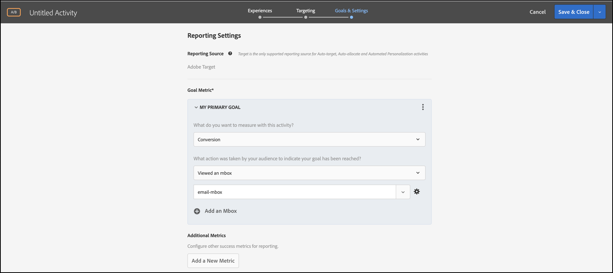

# 合併多個對象

合併多個觀眾(包括 [!DNL Adobe Experience Cloud]。 [!DNL Adobe Experience Platform], [!DNL Target] 即時建立臨時觀眾。 您也可以從規則建立排除規則和排除對象。

>[!NOTE]
>
>的 [!DNL Adobe Experience Platform] 源可供所有人使用 [!DNL Target] 客戶使用 [Adobe Experience PlatformWeb SDK](https://developer.adobe.com/target/implement/client-side/aep-web-sdk/)。 從 [!DNL Adobe Experience Platform] 可以按原樣使用或與現有受眾組合，如本主題中所述。
>
>有關詳細資訊，請參閱 [使用來自Adobe Experience Platform的觀眾](/help/main/c-target/c-audiences/audiences.md#aep)。

假設您有「新訪客」對象和「Chrome 使用者」對象。針對特定的活動，您可能想要合併這些現有對象，以鎖定使用 Chrome 瀏覽器的新訪客作為目標。您不需要建立第三個對象並儲存在[!UICONTROL 對象]資料庫中，僅需在建立活動或編輯現有活動時合併這兩個對象。

作為另一個例子，您可以瞄準所有忠誠客戶。 例如，您可以包括 [!DNL Audience Manager] 忠誠狀態的受眾，並將其與 [!DNL Target] 觀眾由在當前會話中註冊您的忠誠計畫的人組成。 把這兩個觀眾合二為一比創造第三個永久觀眾要容易得多

使用AND和OR運算子，最多可以組合20個受眾。

您可以在 [!DNL Target] UI 各處建立並使用合併的對象。

## 建立活動時建立合併的受眾 {#section_2F1CE9434CC04174B4BA2BFC89B85D77}

在三步驟引導式工作流程期間，您可以在活動的 [!UICONTROL Target] 頁面上建立隨選合併的對象。

1. 建立 [活動](/help/main/c-activities/activities.md#concept_D317A95A1AB54674BA7AB65C7985BA03)的 **[!UICONTROL 目標]** 頁面，按一下三個垂直橢圓，然後按一下 **[!UICONTROL 替換受眾]**。

   

1. 在&#x200B;**[!UICONTROL 「選擇對象」]**&#x200B;頁面上，選取所需對象旁的核取方塊，以使用這些對象作為合併對象的建置區塊。

   使用 [!UICONTROL 搜索受眾] 框，縮小您對所需受眾的搜索範圍。

   

1. 按一下 **[!UICONTROL 合併多個受眾]** 在右上角。

   

1. (條件式) 視需要編輯新的合併對象。

   的 [!UICONTROL 編輯受眾] 對話框，您可以將其他受眾構建塊從左側拖放到新組合的受眾中。 您還可以添加排除規則並排除受眾。

   1. 使用拖放功能將現有節中的受眾添加為級別2構建塊。

      例如，假設在上一個範例中，您現在想要將 Safari 使用者納入合併對象中。搜尋「Safari 瀏覽器」受眾並拖曳到右邊的「Firefox 瀏覽器」方塊中 (如下列範例所示)。

      

      請注意，兩個瀏覽器類型對象之間的運算子是 &quot;AND&quot;。選擇 [!UICONTROL 和] 下拉清單並將其更改為「或」，以便使用Firefox或Safari為新訪問者建立新的組合訪問群。 請小心，避免建立規則來排除所有可能的對象成員。例如，某人無法同時使用 Firefox 與 Safari 來造訪頁面。

      >[!NOTE]
      >
      >合併對象時，運算子 (AND 或 OR) 必須保持相同。您不能混用 &amp; 比對運算子。

   1. 要將排除添加到規則，請按一下 **[!UICONTROL 排除]**。

      

      拖放觀眾。

      例如，要將美國訪問者排除在新訪問者之外，您可以拖動市場：美國觀眾進入這個盒子。

      此合併對象包含您的網站上所有使用 Safari 或 Firefox 的新訪客 (排除來自 San Francisco 的新訪客)。

   1. 若要從規則中排除對象，請按一下&#x200B;**[!UICONTROL 「排除項目」]** > **[!UICONTROL 「排除此對象」]**。

      例如，您可以建立合併的對象來包含網站的所有新訪客，但排除使用 Firefox 的新訪客。不需要建立合併的對象來明確包含多個瀏覽器 (Safari、Chrome 和 Internet Explorer)，但又不包含 Firefox，直接排除使用 Firefox 的訪客更輕鬆又快速。

1. 為組合受眾提供描述性名稱，然後按一下 **[!UICONTROL 完成]**。

## 建立合併的受眾以用於量度鎖定目標 {#section_A42E795AFCBD4575809C5942039910F0}

您可以在活動的[!UICONTROL 「目標與設定」]頁面上建立隨選合併對象，以用於量度鎖定目標。例如，若要使用合併的對象以根據轉換來建立鎖定目標，請執行下列動作:

1. 編輯或建立[活動](/help/main/c-activities/activities.md#concept_D317A95A1AB54674BA7AB65C7985BA03)，在&#x200B;**[!UICONTROL 「目標與設定」]**&#x200B;頁面上，選取&#x200B;**[!UICONTROL 「轉換」]**&#x200B;作為成功量度，然後選取「已檢視 Mbox」**[!UICONTROL 作為動作。]**
1. 在&#x200B;**[!UICONTROL 「搜尋 Mbox」]**&#x200B;欄位中選取所需的 Mbox。

   

1. 按一下齒輪圖示，然後按一下&#x200B;**[!UICONTROL 「新增對象鎖定目標」]**。
1. 按一下&#x200B;**[!UICONTROL 「新增對象/目標狀況」]**&#x200B;連結，以顯示[!UICONTROL 「選擇對象」]對話方塊。

   

1. 繼續進行[步驟 2](/help/main/c-target/combining-multiple-audiences.md#section_2F1CE9434CC04174B4BA2BFC89B85D77)「在建立活動時建立結合的對象」以建立結合的對象。

## 建立用於報告的組合受眾 {#section_4682D342EFBB43C38E54B99B3A1E14CD}

您可以在活動的[!UICONTROL 「目標與設定」]頁面上建立隨選合併對象，以用於報表。

1. 編輯或建立[活動](/help/main/c-activities/activities.md#concept_D317A95A1AB54674BA7AB65C7985BA03)，在&#x200B;**[!UICONTROL 「目標與設定」]**&#x200B;頁面上，按一下&#x200B;**[!UICONTROL 「報表對象」]**&#x200B;下的[!UICONTROL 「新增對象」]圖示，以顯示[!UICONTROL 「選擇對象」]頁面。

   

1. 繼續進行[步驟 2](/help/main/c-target/combining-multiple-audiences.md#section_2F1CE9434CC04174B4BA2BFC89B85D77)「在建立活動時建立結合的對象」以建立結合的對象。

## 編輯活動時建立合併的受眾 {#section_364A12CE96E04B61B7C18113AA586C2C}

您可以在編輯現有活動時建立隨選合併對象。

1. 在[!UICONTROL 「活動」]頁面中，暫留在所需的活動上，然後按一下&#x200B;**[!UICONTROL 「編輯」]** 圖示。

   或

   按一下所需的活動以開啟，然後按一下&#x200B;**[!UICONTROL 「編輯活動」]**。

1. 按一下 **[!UICONTROL 配置]** > **[!UICONTROL 觀眾]** > **[!UICONTROL 多個受眾]**。

   

1. 按一下活動目前對象旁的更多選項圖示 (垂直三個點)，然後按一下&#x200B;**[!UICONTROL 「變更對象」]**。

   

1. 繼續進行[步驟 2](/help/main/c-target/combining-multiple-audiences.md#section_2F1CE9434CC04174B4BA2BFC89B85D77)「在建立活動時建立結合的對象」以建立結合的對象。
