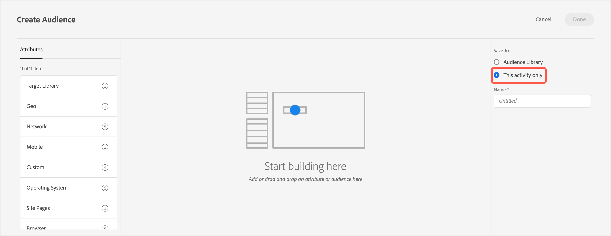

# 建立僅限活動的客群

在建立活動時，從[!DNL Adobe Target]三步驟引導式工作流程內建立僅限活動的對象。 這些隨選對象可用於相同活動內的其他位置，但不會儲存在[!UICONTROL Audiences Library]以用於其他活動。

僅限於此活動的客群提供下列優點:

* 您可以使用僅限於此活動的受眾，建立您僅要使用一次且不想儲存在[!UICONTROL Audiences Library]中的受眾。 僅限於此活動的對象有助於防止[!UICONTROL Audiences Library]雜亂地棧滿您絕不想再次使用的對象。
* [!UICONTROL Audiences Library]中看不到僅限於此活動的對象。 由於資料庫中不會顯示這些對象，因此可以避免組織中的其他人進行不必要的變更。

1. 建立[活動](/help/main/c-activities/activities.md#concept_D317A95A1AB54674BA7AB65C7985BA03)時，請在&#x200B;**[!UICONTROL Targeting]**&#x200B;頁面上按一下三個垂直的點，然後按一下&#x200B;**[!UICONTROL Replace Audience]**。

   

1. 按一下 **[!UICONTROL Create Audience]**。

1. 按一下 **[!UICONTROL This activity only]**。

   

1. 輸入描述性的客群名稱。
1. 將所需的屬性拖放到對象產生器中。

   規則可讓您將對象限製為您的網站訪客的子集。 每個規則類型都有其專屬的參數。請參閱[客群的類別](/help/main/c-target/c-audiences/c-target-rules/target-rules.md#concept_E3A77E42F1644503A829B5107B20880D)，以取得關於設定每個類型的客群規則的詳細資訊。

1. 按一下 **[!UICONTROL Done]**。

## 考量事項

處理僅限於此活動的對象時，請記得下列資訊:

* 您可以在[!UICONTROL Visual Experience Composer] (VEC)或[!UICONTROL Form-Based Experience Composer]中建立僅限於此活動的對象。 此功能取代舊版[!DNL Target]中的精簡規則。
* 您可以建立要在[!UICONTROL Audience Library]中儲存的活動，以在其他活動中重複使用，或您可以建立僅限於此活動的對象。 儲存對象之後，您無法變更對象類型。
* 現有活動的細分已移轉至僅限於此活動的對象。
* 僅限於此活動的對象具有[!UICONTROL Used]或[!UICONTROL Unused]狀態。 在儲存活動之前，會將僅限於此活動的對象顯示為「未使用」。如果維持未使用而您嘗試儲存活動，會顯示警告訊息，通知您將刪除未使用的僅限於此活動的對象。
* 您可以在可透過對象選擇器存取的快顯卡上檢視對象定義詳細資料，而不需開啟對象。
* 您可以[合併多個對象](/help/main/c-target/combining-multiple-audiences.md#concept_A7386F1EA4394BD2AB72399C225981E5)以建立僅限於此活動的對象。
* 僅限於此活動的對象不支援排除規則。

  您可以使用下列替代方式來使用排除規則：

   * [建立及使用資料庫對象](/help/main/c-target/c-audiences/create-audience.md)，而非僅限於此活動的對象。
   * [將多個](/help/main/c-target/combining-multiple-audiences.md#concept_A7386F1EA4394BD2AB72399C225981E5) （最多20個）資料庫對象合併為僅限於此活動的對象。 結合受眾時，即使結合的受眾儲存為僅限於此活動的受眾，仍可在個別資料庫受眾中使用包含和排除規則。
