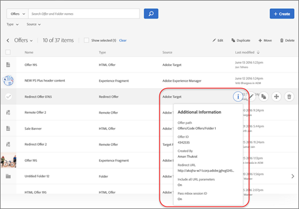
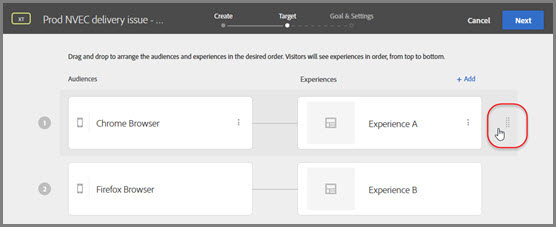

# 舊版發行說明

舊版 [!DNL Adobe Target] 的發行說明包括 [!DNL Target Standard/Premium]、[!DNL Target] 平台和 [!DNL Target]Javascript 程式庫 (at.js) 的發行說明。

發行說明以發行年月由新到舊排序。

>[!NOTE]
>
>請參閱 [Target 發行說明 (最新)](/help/main/r-release-notes/release-notes.md#reference_8FE40B43A5A34DDF8F26A53D55EE036A)，以取得本月 Target 版本 (平台和 Target Standard/Premium) 的資訊。

## 發行說明 - 2024

### at.js 2.11.6版（2024年9月29日）

* 已修正導致[!DNL Target]無法在[!UICONTROL Visual Experience Composer] (VEC)或[!UICONTROL Form-Based Experience Composer]內以重新導向選件正確運作的問題。

如需at.js發行版本的詳細資訊，請參閱&#x200B;*Adobe Target開發人員指南*&#x200B;中的[at.js版本詳細資料](https://experienceleague.adobe.com/en/docs/target-dev/developer/client-side/at-js-implementation/target-atjs-versions){target=_blank}。

### [!DNL Target]報告於[!DNL Adobe Customer Journey Analytics] （2024年5月8日）

[Adobe Customer Journey Analytics](https://experienceleague.adobe.com/en/docs/customer-journey-analytics){target=_blank}與[!DNL Target]之間的整合為您的最佳化程式提供強大的分析與省時的工具。

使用 [!DNL Customer Journey Analytics] 作為 [!DNL Target] 的報告來源的主要優點如下：

* 市場行銷人員可隨時動態地將 [!DNL Customer Journey Analytics] 成功量度套用至 [!DNL Target] 活動報告。執行活動之前完全不需要指定。
* 行銷人員可利用[!DNL Customer Journey Analytics]功能（例如[實驗面板](https://experienceleague.adobe.com/en/docs/analytics-platform/using/cja-workspace/panels/experimentation){target=_blank}）來進一步分析其網站個人化。
* 行銷人員可以有[[!DNL Adobe Journey Optimizer]](https://experienceleague.adobe.com/en/docs/journey-optimizer/using/reporting/cja-ajo){target=_blank}和[!DNL Target]的單一報告來源。 兩種個人化產品都可以連接到 [!DNL Customer Journey Analytics] 以更全面地了解您的網頁個人化。

如需詳細資訊，請參閱[Adobe Customer Journey Analytics中的Target報告](/help/main/c-integrating-target-with-mac/cja/target-reporting-in-cja.md)。

### [!UICONTROL Visual Experience Composer]協助程式擴充功能（2024年4月23日）

舊版[!DNL Target]視覺化體驗撰寫器Helper擴充功能是使用Manifest V2建立的。 [!DNL Google]宣佈從2024年6月起，將不再允許使用資訊清單V2建立的擴充功能。 如需詳細資訊，請參閱[[!UICONTROL Visual Experience Composer]協助程式擴充功能](/help/main/c-experiences/c-visual-experience-composer/r-troubleshoot-composer/vec-helper-browser-extension.md)。

[!DNL Adobe]建議客戶儘快改用較新的[Visual Editing Helper擴充功能](/help/main/c-experiences/c-visual-experience-composer/r-troubleshoot-composer/visual-editing-helper-extension.md)。

### [!UICONTROL Browser]對象屬性（2024年4月30日）中`Browser:iPad`和`Browser:iPhone`的更新

| 更新 | 詳細資料 |
|--- |--- |
| [!UICONTROL Browser:iPad]和[!UICONTROL Browser:iPhone]已在建立對象時所使用的[瀏覽器屬性](/help/main/c-target/c-audiences/c-target-rules/browser.md)中更新。 | [!DNL Adobe Target]可讓您[鎖定數個類別屬性中的任何一個](/help/main/c-target/c-audiences/c-target-rules/target-rules.md)，包括瀏覽您的頁面時使用特定[瀏覽器或瀏覽器選項](/help/main/c-target/c-audiences/c-target-rules/browser.md)的訪客。<P>從[!DNL Target] Standard/Premium 24.3.1 （2024年3月4至6日）開始，使用Target UI建立的內建對象（例如`Browser:iPad`和`Browser:iPhone`）將會更新，以便使用`profile.mobile.deviceVendor`、`profile.mobile.isMobilePhone`和`profile.mobile.isTablet`為[!DNL iPad]和[!DNL iPhone]執行適當的鎖定目標。<P>此更新不需要客戶採取任何動作。<p><B>重要</b>：若要讓客戶在設定檔指令碼(和JavaScript區段)中針對[!DNL iPad]和[!DNL iPhone]執行適當的目標定位，客戶必須在&#x200B;**2024年4月30日**&#x200B;之前進行手動變更。 如需必須手動變更的替代設定範例，請參閱[!UICONTROL Browser]對象屬性](/help/main/c-target/c-audiences/c-target-rules/browser.md#updates)中 [!DNL iPad] 和 [!DNL iPhone] 的[更新。 |

### [!UICONTROL Visual Editing Helper]副檔名（2024年3月14日）

此版本包含[!DNL Google Chrome]之[[!DNL Adobe Experience Cloud Editing Helper]](/help/main/c-experiences/c-visual-experience-composer/r-troubleshoot-composer/visual-editing-helper-extension.md)擴充功能的下列增強功能和修正：

* 增強在客戶網站中執行編寫作業時的iFrame載入機制。
* 修正在[!UICONTROL Visual Experience Composer] (VEC)中執行編寫時，導致擴充功能重複Cookie的問題。

### [!DNL Target] Standard/Premium 24.3.1 （2024年3月4日至6日）

此版本包含下列增強功能和修正：

* 修正計算活動中不重複選取器數目的邏輯。 (TGT-47878)
* 修正造成以[!UICONTROL Analytics for Target] (A4T)報告設定的[!UICONTROL Multivariate] (MVT)活動無法正確顯示的問題。 (TGT-47490)
* 改善當沒有流量的體驗用作控制體驗時，報告中顯示的警告訊息。 (TGT-47537)
* 新增許多後端和本地化修正。

### [!DNL Target] Standard/Premium 24.1.1 (2024 年 1 月 22、23 和 25 日)

此版本包含下列增強功能和修正：

* 具有收入目標量度的[!UICONTROL Analytics for Target] (A4T)活動未將「收入」顯示為欄名稱，且收入量度未在報表中以($)格式顯示。 這是已經解決的外觀問題。(TGT-46995)
* 修正導致報告日期間隔無法正常運作的問題。(TGT-47396)
* 修正客戶使用[!UICONTROL More Actions]圖示啟動或停用活動後，[!UICONTROL All Activities]頁面上顯示錯誤狀態的問題。 (TGT-47367)
* 修正造成[!UICONTROL Important Attributes]報告無法顯示給單一客戶的問題。 (TGT-47272)
* 修正當單一客戶嘗試啟用「需要驗證」時，導致系統顯示「無效的承載」訊息的問題。(TGT-47195)
* 更新 [!DNL Target] UI 中的大量本地化字串。

## 發行說明 - 2023

### [!DNL Target] Standard/Premium 23.11.1 (2023 年 11 月 13 和 14 日)

此版本預定在下列日期發佈：

* **11 月 13 日**：亞太 (APAC) 區域
* **11 月 14 日**：美洲區域
* **11 月 14 日**：歐洲、中東和非洲 (EMEA) 區域

此版本包含下列增強功能和修正：

* 已增強[活動QA](/help/main/c-activities/c-activity-qa/activity-qa.md)功能，以支援[!UICONTROL Automated Personalization]活動中的體驗不允許重複選件](/help/main/c-activities/t-automated-personalization/managing-exclusions.md)。 [(TGT-46627)
* 在 [!DNL Target] UI 中新增工具提示，可協助客戶了解為什麼在沒有流量分配給控制體驗時，活動報告可能沒有資料。工具提示中包含詳細資訊連結：[為什麼我的活動報告沒有資料？](/help/main/c-reports/reporting-frequently-asked-questions.md#section_E4722F6445884130951DF79981C8289B)。(TGT-46610)
* 已修正導致活動無法在少數客戶的[!UICONTROL Activities]頁面上正確顯示的問題。 (TGT-46830)
* 修正下列對使用[[!UICONTROL Analytics for Target]](/help/main/c-integrating-target-with-mac/a4t/a4t.md) (A4T)作為報表來源的活動造成影響的問題：
   * 已修正導致部分客戶無法查看報告資料的問題。(TGT-46557)
   * 修正有時候造成活動報告頁面上[!UICONTROL View in Analytics]連結無法正常運作的問題。 (TGT-46731)
   * 修正導致[!UICONTROL Lift]和[!UICONTROL Confidence]的資料無法在[!DNL Target] UI中正確顯示的問題。 (TGT-46592、TGT-46554 和 TGT-46586)

### [!UICONTROL Activities]頁使用者介面重新整理（2023年10月25日）

作為[!DNL Adobe Target]團隊持續努力改善[!DNL Target]個使用者的使用者體驗的一部分，此版本重新整理[!DNL Target] UI中的[!UICONTROL Activities]頁面。 本次更新統一並標準化先前不一致的設計模式，同時加入了新的增強功能。

從 10 月 25 日星期三開始，一定比例的客戶將可以存取新的 UI，更多客戶將在接下來的幾天內獲得存取權。

如需詳細資訊，請參閱[活動](/help/main/c-activities/activities.md)。

### [!DNL Target] Standard/Premium 23.10.2 (2023 年 10 月 24 日)

此版本包含下列增強功能和修正：

* 已增強新的[!UICONTROL Activities] UI，以便在建立新活動時，[!UICONTROL Visual Experience Composer] (VEC)會以`selectorCriteria`的預設設定開啟。 (TGT-46586)
* 已修正導致某些客戶在使用VEC時無法在[!UICONTROL Composer]模式中編輯元素的問題。 (TGT-46470)
* 已新增使用自訂屬性時可指定通用偏好選擇器的功能。(TGT-46545)
* 修正有時候使用[!UICONTROL Analytics for Target] (A4T)的[!UICONTROL Auto-Target]報告無法在[!DNL Target] UI中顯示的問題，即使該報告在[!DNL Adobe Analysis Workspace]中正確顯示亦然。 (TGT-46494)
* 已更新 Target UI 的多種語言本地化字串。(TGT-18899)

### [!DNL Target] Standard/Premium 23.9.4 (2023 年 10 月 4-6 日)

此版本包含下列增強功能和修正：

| 功能 | 詳細資料 |
| --- | --- |
| [!DNL Recommendations] 實作模式 | 「*使用 at.js 的 Recommendations 實作模式*」文章可協助您在使用 at.js JavaScript 程式庫時理解並建立您的 [!DNL Adobe Target Recommendations] 實作。<P>如需更多資訊，請參閱 *Adobe Target 開發人員指南*&#x200B;中的[使用 at.js 的 Recommendations 實作模式概觀](https://experienceleague.adobe.com/docs/target-dev/developer/implementation-patterns/atjs/recs-implementation-pattern-atjs.html){target=_blank}。 |

* 已新增動態架構的[!UICONTROL Visual Experience Composer] (VEC)增強功能。 (TGT-44064)
* 已修正造成 `getViewInAnalyticsId` 要求中的所選日期無法正確更新的問題。此修正有助於當日期範圍和量度報告設定變更時重新計算報告中的 [!DNL Analytics] 連結。(TGT-46246)

### [!DNL Target] Standard/Premium 23.9.3 (2023 年 9 月 18 日)

此版本包含下列增強功能和修正：

* 增強[!UICONTROL Visual Experience Composer] (VEC)以支援Lightning Web元件（輕型DOM）。 (TGT-45422)
* 已修復使 VEC 操作以錯誤順序應用的問題。在某些情況下，VEC以非同步方式套用了一些修改，而且如果元素在[!UICONTROL Insert]動作之後顯示，則對元素新增額外修改會導致錯誤。 也修復了 VEC URL，現在按一下錨點連結時就會更新。(TGT-45983)
* 已修正VEC [!UICONTROL Overlay]功能的問題，此功能現在支援影子DOM中的元素。 (TGT-45202 和 TGT-45262)
* 修正在VEC中開啟單頁應用程式(SPA)頁面，然後移至[!UICONTROL Browse]模式時，導致「上一步」和「下一步」箭頭無法正常運作的問題。 (TGT-45956)
* 已修復導致某些網頁無法在 VEC 中載入的問題。(TGT-45983)

### [!DNL Target] Standard/Premium 23.9.2 (2023 年 9 月 12-14 日)

此版本包含下列增強功能和修正：

* 已將 [!DNL Analytics]API 改成新的[!DNL Analytics] API 2.0 版。(TGT-45345)
* 已修正影響部分客戶的[!UICONTROL Automated Personalization] (AP)活動的問題，包括及時同步[!DNL Target]後端上的活動以及在預覽連結中傳遞預期的體驗。 (TGT-46202)

### [!DNL Target] Standard/Premium 23.9.1 (2023 年 9 月 6-11 日)

此版本包含下列增強功能和修正：

* 針對使用[!UICONTROL Analytics for Target] (A4T)作為報表來源的[!UICONTROL Auto-Allocate]活動，修正在[!DNL Target] UI和[!DNL Adobe Analytics] UI中造成不一致的報表資料的問題。 (TGT-46112)
* 將 PUT 呼叫 Target 傳遞 API 的逾時時間增加到 15 秒，以避免發生逾時錯誤。(TGT-46091)
* 已修復瀏覽單次頁面應用程式 (SPA) 網站時 URL 無法持續&#x200B;&#x200B;更新的問題。(TGT-45417)

### [!DNL Adobe Target] 邊緣已規劃基礎設施的升級 {#edge}

已規劃的邊緣基礎設施升級需要已加入允許清單的其他 IP 位址或網域。檢查邊緣部署 41-48 的 NAT 和 IP 位址/網域，並將其加入允許清單。基礎設施升級將於 2023 年 8 月 9 日開始。


如需詳細資訊，請參閱 *Adobe Target 開發人員指南*&#x200B;中的「[允許清單 Target 邊緣節點](https://experienceleague.adobe.com/docs/target-dev/developer/implementation/privacy/allowlist-edges.html){target=_blank}」。

### [!DNL Target] Standard/Premium 23.8.1 (2023 年 8 月 9 日)

此版本包含下列增強功能和修正：

* 修正有時會導致活動無法正確同步的問題，如[!UICONTROL Activity]清單頁面上的「[!UICONTROL Status]」欄中所示。 (TGT-46010 和 TGT-44831)
* 修正在使用[!UICONTROL Analytics for Target] (A4T)作為報告來源的活動的[!UICONTROL Reports]頁面上有時無法顯示&quot;[!UICONTROL View in Analytics]&quot;連結的問題。 (TGT-45808)
* 調整表格中值的顯示方式，現在以百分比形式顯示，而不是帶小數點的數字。例如，顯示 8%，而非顯示 .08。(TGT-45548)
* 已修正導致客戶無法使用鍵盤焦點移至[!UICONTROL Experience Targeting] (XT)活動[!UICONTROL Goals & Settings]頁面中下一個元素的問題。 (TGT-44526)
* 修正在建立活動時開啟&quot;[!UICONTROL Add audiences]&quot;對話方塊後，導致鍵盤失去焦點的問題。 (TGT-44525)

### [!DNL Target] Standard/Premium 23.7.1 (7 月 24-26 日)

此版本包含下列增強功能和修正：

* 改善在[使用[!UICONTROL Visual Experience Composer] (VEC)中的DOM路徑](/help/main/c-experiences/c-visual-experience-composer/viztarget-options.md#dom-path)導覽元素以包含陰影DOM元素時的搜尋。 (TGT-45262)
* 已修正[變更覆蓋](/help/main/c-experiences/c-visual-experience-composer/visual-experience-composer.md)設定無法正常運作的問題。(TGT-45202)
* 已修正一些客戶在收到以下錯誤訊息：「使用者無權存取報告」後無法下載活動報告的問題。(TGT-45724 和 TGT-45747)

### [!DNL Target] Standard/Premium 23.6.1 (6 月 27-29 日)

此版本包含下列增強功能：

| 功能 | 詳細資料 |
|--- |--- |
| [!UICONTROL Automated Personalization]活動的[!UICONTROL QA mode] | [!DNL Adobe Target] [!UICONTROL QA mode]現在可用於[!UICONTROL Automated Personalization]個活動，取代[!UICONTROL Preview links]功能。<P>如需詳細資訊，請參閱[活動 QA](/help/main/c-activities/c-activity-qa/activity-qa.md)。 |

* 效能增強功能，在[管理[!UICONTROL Automated Personalization]活動中的排除專案](/help/main/c-activities/t-automated-personalization/managing-exclusions.md#concept_4EF78013F80E48EFA024AE0274C9F037)時，不允許重複功能（包括減少載入時間）。

### [!DNL Target] Standard/Premium 23.5.2 (2023 年 5 月 31 日)

此版本包含下列增強功能和修正：

* 已修復在產生輪廓 API 授權權杖時造成顯示空白頁面的問題。(TGT-45387 和 TGT-45423)
* 修正當影像名稱包含GB 18030字元時，[!UICONTROL Create Design]面板無法顯示影像的問題。 (TGT-44614)
* 已修正體驗中某些 GB 18030 符號字元在文字/HTML 中錯誤逸出的問題。(TGT-44600)
* 修正分析期間導致[!UICONTROL Auto Personalization]活動報告凍結的問題。 (TGT-44820)
* 修正當活動名稱包含方括弧（ [或] ）時，無法在[!UICONTROL Activity]頁面上搜尋活動的問題。 (TGT-44777)
* 已修復活動的主旨包含特殊字元時便無法進行活動同步的問題。(TGT-44982)
* 已修正導致某些客戶預設工作區的 [!DNL Target] UI 中未顯示任何活動的問題。(TGT-45286)
* 已更新「不允許重複」標幟的行為。 已更新排除的重複優惠方案標幟，以允許預設內容優惠方案的重複優惠方案 (適用於 API v3、v4)，並且如果選項參考預設內容優惠方案且未定義範本，則允許重複選項。 (TNT-46617)
* 修正在URL中新增查詢引數，導致頁面無法在[!UICONTROL Visual Experience Composer] (VEC)中載入的問題。 (TGT-44873)
* 對整個 [!DNL Target] UI 進行了各種本地化修正。

### 與[!DNL Target] [!UICONTROL Real-Time CDP Profile Attributes]共用的Real-Time CDP設定檔屬性（2023年6月13日）

此版本包含下列增強功能：

| 功能 | 詳細資料 |
|--- |--- |
| 與 [!DNL Target] 共用 Real-Time CDP 輪廓屬性 | [!UICONTROL Real-Time CDP Profile Attributes]可以與[!DNL Target]共用，以用於HTML和JSON選件。<P>如需詳細資訊，請參閱[與  [!DNL Target]](/help/main/c-integrating-target-with-mac/integrating-with-rtcdp.md#rtcdp-profile-attributes) 共用 Real-time CDP 輪廓屬性。 |

### [!DNL Target] Standard/Premium 23.5.1 (2023 年 5 月 23-25 日)

此版本包含以下新的增強功能和修正：

* 已修復讓特定客戶無法使用「大於」或「小於」運算符號，建立具有訪客資料的客群問題。(TGT-45271)
* 對整個 [!DNL Target] UI 進行了各種本地化修正。
* 為即將到來的 UI 重新整理更新了不同位置的 Target UI (在發行更新之前，變更隱藏在功能標幟之後)。

### [!DNL Target] Standard/Premium 23.4.1 (2023 年 4 月 25-27 日)

此版本包含安全性更新和以下新功能：

| 功能 | 詳細資料 |
|--- |--- |
| 用於Headless個人化和實驗的AEM [!UICONTROL Content Fragments] | 在[!DNL Target]個活動中使用[!DNL Adobe Experience Manager] (AEM) [!UICONTROL Content Fragments]。 將 AEM 的易用性和強大功能與 [!DNL Target] 的強大人工智慧 (AI) 和機器學習 (ML) 功能相結合，以協助 Headless 個人化和實驗。<P>如需詳細資訊，請參閱[AEM [!UICONTROL Content Fragments]](/help/main/c-integrating-target-with-mac/aem/content-fragments-aem.md)。 |
| [*Adobe Target 開發人員指南*](https://experienceleague.adobe.com/docs/target-dev/developer/overview.html){target=_blank} | *Adobe Target開發人員指南*&#x200B;已重新放置到&#x200B;*[!UICONTROL Adobe Experience League]*。 移至&#x200B;*[!UICONTROL Experience League]*&#x200B;有助於當地語系化其他語言的文字，在&#x200B;*Experience League*&#x200B;中統一搜尋範圍並提供&#x200B;*[!UICONTROL Adobe Target Business Practitioner Guide]*&#x200B;和&#x200B;*[!UICONTROL Adobe Target Developer Guide]*&#x200B;的搜尋結果，並提供額外的好處。<P>系統會自動將您從先前的位置重新導向至&#x200B;*[!UICONTROL Experience League]*。 請視需要更新您的書籤。 |

### [!DNL Target] Standard/Premium 23.3.1 (2023 年 3 月 28 至 30 日)

此版本包含以下新功能、增強功能和修正：

| 功能 | 詳細資料 |
|--- |--- |
| 已針對[!UICONTROL Auto-Allocate]和[!UICONTROL Auto-Target]最佳化A4T量度<p> (發行日期：2023 年 3 月 30 日) | 針對[!UICONTROL Auto-Allocate]和[!UICONTROL Auto-Target]活動使用[!UICONTROL A4T]時，[!DNL Target]可讓您根據二項式事件選擇量度，或根據連續事件選擇量度。<P>請注意受支援量度的以下變更：<ul><li>[!DNL Target] 已保留現有活動的先前行為，直到 2023 年 9 月 9 日。在此日期之後，將停止使用非支援之量度的活動，以強制現有活動遷移至新行為。</li></ul>如需詳細資訊，請參閱[!UICONTROL Auto-Allocate]和[!UICONTROL Auto-Target]活動的[A4T支援](/help/main/c-integrating-target-with-mac/a4t/a4t-at-aa.md#supported)中的「支援的目標量度」。<br>因為此功能，已更新以下教學課程：<ul><li>[在 [!DNL Analysis Workspace] 中為[!UICONTROL Auto-Allocate]個活動設定A4T報告](https://experienceleague.adobe.com/docs/target-learn/tutorials/integrations/set-up-a4t-reports-in-analysis-workspace-for-auto-allocate-activities.html){target=_blank}</li><li>[在 [!DNL Analysis Workspace] 中為[!UICONTROL Auto-Target]個活動設定A4T報告](https://experienceleague.adobe.com/docs/target-learn/tutorials/integrations/set-up-a4t-reports-in-analysis-workspace-for-auto-target-activities.html){target=_blank}</li></ul> |

* 增強客群和活動同步，以便在 [!DNL Adobe Experience Platform] 和 [!DNL Adobe Audience Manager] 中建立的項目可更快地在 [!DNL Target] UI 中使用。(TGT-44568)
* 增強UI，可讓使用者移除[!UICONTROL Administration] > [!UICONTROL Visual Experience Composer] > [!UICONTROL Default URL]下的[!UICONTROL Default URL]。 此變更可讓客戶將預設 URL 變更回空字串，這在以前於初始設定後是不可能的。(TGT-44577)
* 刪除禁止客戶編輯或刪除現成可用客群 (具有保留名稱的客群) 的限制。(TGT-44655)
* 已停用[!UICONTROL Done]選項，但載入旋轉器時，建立[合併的對象](/help/main/c-target/combining-multiple-audiences.md)時，可在[!DNL Target] UI中看到。 (TGT-44079)
* 修正[!UICONTROL Audiences]頁面底部的[!UICONTROL Language]連結，使其正確連結至&quot;[!UICONTROL Account communication preferences]&quot;頁面。 (TGT-43562)
* 解決在[!UICONTROL Administration] > [!UICONTROL Reporting] > [!UICONTROL Reporting Experience Cloud Solution]下選取[!UICONTROL Adobe Analytics]選項後，有時無法讓客戶建立[!UICONTROL A/B Test]活動的問題。 (TGT-44844)
* 已修正導致客戶無法從[!UICONTROL Visual Experience Composer] (VEC)內檢視具有多個體驗的[!UICONTROL Multivariate Test]活動中的最後一個體驗的問題。 VEC 底部的 [DOM 路徑](/help/main/c-experiences/c-visual-experience-composer/viztarget-options.md#dom-path)有時會造成客戶無法看到最後一個體驗。(TGT-44578)
* 如果頁面要求授權或叫用重新導向，VEC 中的瀏覽 URL 無法反映目前頁面，而此頁面在正常瀏覽器工作階段是可見的，這個問題已經修正。(TGT-44350)
* 已修正導致客戶無法在[!UICONTROL Recommendations] > [!UICONTROL Settings]中變更[!UICONTROL Filter Incompatible Criteria]設定的問題。 (TGT-44398)
* 修正使用名稱中包含點的[!UICONTROL Analytics Classifications]報表套裝時，導致POST要求建立[!DNL Recommendations]摘要失敗的問題。 (TGT-44598)
* 更新 [!DNL Target] UI 中的連結以指向新的 [Visual Editing Helper 擴充功能](/help/main/c-experiences/c-visual-experience-composer/r-troubleshoot-composer/visual-editing-helper-extension.md)。(TGT-44459)
* 增強安全性以防止在 [!DNL Recommendations] 摘要中嘗試伺服器端請求偽造 (SSRF)。(TGT-43769)
* 對整個 [!DNL Target] UI 進行了各種本地化修正。

### at.js 版本 2.10.2 (2023 年 3 月 7 日)

* 修正造成 `trackEvent` 函數總是傳回錯誤的問題。

如需有關所有at.js版本的資訊，請參閱[Adobe Target開發人員指南](https://experienceleague.adobe.com/docs/target-dev/developer/overview.html){target=_blank}中的[at.js版本詳細資料](https://experienceleague.adobe.com/docs/target-dev/developer/client-side/at-js-implementation/target-atjs-versions.html){target=_blank}。

### [!DNL Target] Standard/Premium 22.15.1 (2023 年 3 月 8 日和 9 日)

我們將根據以下排程分批發行此版本：

* **3 月 8 日**：美洲區域
* **3 月 9 日**：歐洲、中東和非洲 (EMEA) 區域
* **3 月 9 日**：亞太 (APAC) 區域

此版本包含下列修正：

* 使用[!UICONTROL Visual Experience Composer] (VEC)編寫自訂Web元件的更新：

   * 透過改進編寫程序來修正 VEC 中選取 Shadow DOM 元素的問題，因此在編寫 Shadow 根時不依賴 [!DNL Target] 實作類型。現在，在 VEC 中選取 Shadow DOM 元素應該適用於任何網站。
   * 已修正在 VEC 中使用 #Shadow DOM 無法載入 HTML 元素的問題。(TGT-35801)
   * 已修正 SPA 網站使用 ShadowDOM 的 VEC 問題。(TGT-43169)
   * 已修正最佳化目標的問題：「點擊元素」未正確識別 ShadowDOM 中的 CSS 選取器。

>[!NOTE]
>
>若要確保傳遞在VEC中撰寫的變更，請確定您使用的是版本高於2.8的[!DNL Target] SDK ([at.js](https://experienceleague.adobe.com/docs/target-dev/developer/client-side/at-js-implementation/target-atjs-versions.html){target=_blank}或[Adobe Experience Platform Web SDK](https://experienceleague.adobe.com/docs/experience-platform/edge/release-notes.html){target=_blank} (alloy.js))。

**已知問題**：使用 [!DNL Adobe Experience Platform Web SDK] 時，對 Shadow 根元素的點擊追蹤無法正常運作。(TNT-47012)

### at.js 版本 2.10.2 (2023 年 3 月 7 日)

* 修正造成 `trackEvent` 函數總是傳回錯誤的問題。

如需有關所有at.js版本的資訊，請參閱[Adobe Target開發人員指南](https://experienceleague.adobe.com/docs/target-dev/developer/overview.html){target=_blank}中的[at.js版本詳細資料](https://experienceleague.adobe.com/docs/target-dev/developer/client-side/at-js-implementation/target-atjs-versions.html){target=_blank}。

### [!DNL Target] Standard/Premium 22.14.5 (2023 年 2 月 13-15 日)

我們將根據以下排程分批發行此版本：

* **2 月 13 日**：美洲區域
* **2 月 15 日**：歐洲、中東和非洲 (EMEA) 區域
* **2 月 15 日**：亞太 (APAC) 區域

此版本包含下列修正：

* 修正了即使在 Automated Personalization (AP) 活動中指定了屬性也會導致以下錯誤訊息的問題：「錯誤：至少一個屬性必須屬於非預設工作區」(TGT-44607)
* 修正了影響伺服器端 Recommendations 摘要的潛在安全性問題。 (TGT-43769)

### at.js 版本 2.10.1 (2023 年 2 月 2 日)

* 已修正涉及客群規則 (包含名稱中帶有點的參數) 的活動中未傳回預期體驗以進行裝置上決策的錯誤。
* 已修正 at.js 2.6.0 中引進的錯誤，亦即即使已啟用 `mboxDisable`，at.js 仍會觸發傳送呼叫。

如需有關所有at.js版本的資訊，請參閱[Adobe Target開發人員指南](https://experienceleague.adobe.com/docs/target-dev/developer/overview.html){target=_blank}中的[at.js版本詳細資料](https://experienceleague.adobe.com/docs/target-dev/developer/client-side/at-js-implementation/target-atjs-versions.html){target=_blank}。

### [!DNL Target] Standard/Premium 22.13.3 (2023 年 1 月 25 - 26 日)

我們將根據以下排程分批發行此版本：

* **1 月 25 日**：歐洲、中東和非洲 (EMEA) 區域
* **1 月 25 日**：亞太 (APAC) 區域
* **1 月 26 日**：美洲區域

此版本包含以下新功能、增強功能和修正：

| 功能 | 詳細資料 |
| --- | --- |
| Automated Personalization (AP) 支援 [JSON 選件](/help/main/c-experiences/c-manage-content/create-json-offer.md) | 使用表單式體驗撰寫器在[!UICONTROL Automated Personalization] (AP)活動中新增對JSON選件的支援。 (TGT-41460) |
| [AEM 體驗片段](/help/main/c-experiences/c-manage-content/aem-experience-fragments.md) | 新增了區分匯出到 [!DNL Target] 的 [!DNL Adobe Experience Manager] 片段 (AEM XF) 類型的功能。[!DNL Target]現在可讓您透過「HTML XF」和「JSON XF」進行篩選和搜尋，而不是透過「體驗片段」選項。(TGT-44132) |

* 已修正在[!UICONTROL A/B Test]和包含建議的[!UICONTROL Experience Targeting] (XT)活動中導致「500錯誤」的問題。 當 [!DNL Target] 無法從 [!DNL Target] UI 和 [!DNL Recommendations] 後端正確地刪除不再使用的標準物件時，即導致此問題。(TGT-44383)
* 已從[!UICONTROL Offer Level]報告中移除[!UICONTROL Automated Personalization]個活動顯示的選件名稱中移除位置。 此變更使報告更易讀取。(TGT-44294)
* 已從AP以及[!DNL Target] UI中的[!UICONTROL Auto-Target] [!UICONTROL Personalization Insights]和[!UICONTROL Important Attributes]報告移除45天和90天行事曆選項。 由於使用模式並且為了改善效能，這些日期範圍已被取代。 UI 已更新以反映目前允許的範圍：15、30 和 60 天。 (TGT-39357)
* 已不允許在活動上線後變更[!UICONTROL Goals & Settings]頁面上的[!UICONTROL Same as Optimization Goal]設定的功能。 (TGT-43923)
* 已修正從 [!DNL Target Standard] 升級到 [!DNL Target Premium] 時導致 [!DNL Target] 後端中預設工作區出現問題的問題。(TGT-44081 和 TGT-44306)
* 已進行變更以使名稱包含點字元「.」的 [!DNL Analytics] 報告套裝可用於 [!DNL Target] UI 以建立 [!DNL Analytics] 分類摘要。
* 已變更[!UICONTROL Implementation]頁面([!UICONTROL Administration] > [!UICONTROL Implementation])上「使用裝置上決策的實作方法」的連結，以指向說明如何使用裝置上決策來操作所有受支援SDK （Node.js、Java、.NET和Python）的頁面。 如需詳細資訊，請參閱[Adobe Target開發人員指南](https://experienceleague.adobe.com/docs/target-dev/developer/overview.html){target=_blank}中的[Target SDK快速入門](https://experienceleague.adobe.com/docs/target-dev/developer/server-side/getting-started.html){target=_blank}。
* 已修正使用 [!DNL Scene7] 和 [!DNL Target] 時導致檔案上傳問題的問題。
* 已透過使用內部可用性稽核的結果，增強了 [!DNL Target] UI 對殘障人士的無障礙支援。這些無障礙支援增強功能包括存取以前無法透過鍵盤存取的功能、替代文字增強功能、縮放 UI 部分以提高可用性的能力、提升的鍵盤焦點等等。(TGT-42759)
* 對整個 [!DNL Target] UI 進行了各種本地化修正。

## 發行說明 - 2022

### 模型 API 版本 (2022 年 11 月 23 日)

新的[!DNL Adobe Target]模型API （也稱為Blocklist API）可讓使用者檢視和管理機器學習模型中用於[!UICONTROL Automated Personalization] (AP)和[!UICONTROL Auto-Target] (AT)活動的功能清單。

如需詳細資訊，請參閱&#x200B;*Adobe Target開發人員指南*&#x200B;中的[模型API概觀](https://experienceleague.adobe.com/docs/target-dev/developer/api/models-api/models-api.html){target=_blank}。

### [!DNL Target] Standard/Premium 22.10.3 (分批發行：2022 年 10 月 25 至 27 日)

此版本包含下列修正：

* 在 [!DNL Target] UI 中新增工具提示，以幫助客戶更有效地瀏覽客群產生器，並了解如何使用不熟悉的功能。(TGT-44139)
* 新增功能，此功能可防止客戶編輯因使用不受支援的量度而被 [!DNL Target] 停用的活動。UI 中的訊息，可指引客戶複製活動，然後更新轉換量度。

  在此版本中，[!DNL Target] 活動中的 `averagetimespentonsite`、`bouncerate` 和 `entries` 量度，新活動將停止使用。現有活動可以繼續使用這些量度直到 2023 年 5 月。

* 在[!DNL Target] UI中新增工具提示，以幫助客戶在建立或編輯使用A4T的[!UICONTROL Auto-Target]活動時選取最佳化條件。

### [!DNL Target] Standard/Premium 22.10.1 (分批發行：2022 年 10 月 10 至 13 日)

此版本包含以下新功能、增強功能和修正：

| 功能 | 詳細資料 |
| --- | --- |
| [!DNL Adobe Experience Manager] (AEM) 體驗片段 | AEM 體驗片段功能的更新包括以下內容：<ul><li>已新增在[!UICONTROL Offers]清單中按型別(HTML或JSON)篩選AEM體驗片段的功能。 (TGT-43121)</li><li>已修正允許客戶在使用VEC時插入JSON [!UICONTROL Experience Fragment]選件的問題，此狀況不受支援。 只有在使用[!UICONTROL Form-Based Experience]撰寫器時才能插入JSON選件。 (TGT-43846)</li></ul>如需詳細資訊，請參閱 AEM [體驗片段](/help/main/c-experiences/c-manage-content/aem-experience-fragments.md)。 |
| 適用於Google Chrome的新[!UICONTROL Visual Experience Composer]擴充功能 | Chrome網站商店提供Chrome的新[!DNL Adobe Target] [!UICONTROL Visual Experience Composer] (VEC)擴充功能。<br>2023 年 1 月起，目前 [!DNL Target] VEC Helper 擴充功能將停止在 Google Chrome 中運作，因為 Google 不允許使用 Manifest V2 的擴充功能。下載新的擴充功能，從新的一年開始，繼續在 [!DNL Target] 中以視覺方式創作您的網站。<br>以下連結顯示 Chrome 網站商店中的兩個擴充功能：<ul><li>[新擴充功能](https://chrome.google.com/webstore/detail/adobe-experience-cloud-vi/kgmjjkfjacffaebgpkpcllakjifppnca){target=_blank}</li><li>[舊的擴充功能](https://chrome.google.com/webstore/detail/adobe-target-vec-helper/ggjpideecfnbipkacplkhhaflkdjagak){target=_blank}</li></ul>如需詳細資訊，請參閱「[Visual Editing Helper 擴充功能](/help/main/c-experiences/c-visual-experience-composer/r-troubleshoot-composer/visual-editing-helper-extension.md)」。 |

* 已修正導致對象規則資訊無法在[!UICONTROL Audiences Refinements]資訊視窗中正確顯示的問題。 (TGT-43917)
* 已改進當載入客群人數接近[目標選擇規則的建議上限](/help/main/r-troubleshooting-target/target-limits.md#targeting-rules)時的 [!DNL Target] UI 效能。(TGT-43675)
* 修正從[!UICONTROL Compose]切換到[!UICONTROL Browse]模式後，在VEC中建立或編輯活動時，造成[!UICONTROL Experiences]頁面上[!UICONTROL Modifications]面板中無法正確顯示某些元件的問題。 (TGT-43300)
* 已修正導致部分客戶無法封存使用[!UICONTROL Auto-Target]的[!UICONTROL A/B Test]活動的問題。 (TGT-40978)
* 已新增在單一報表群組內的多個位置自動使用單一選件的功能。(TGT-40689)

### [!DNL Target] Standard/Premium 22.9.1 (分批發行：2022 年 9 月 13 至 15 日)

我們將根據以下排程分批發行此版本：

* **9 月 13 日**：歐洲、中東和非洲 (EMEA) 區域
* **9 月 14 日**：美洲區域
* **9 月 15 日**：亞太 (APAC) 區域

此版本包含下列增強功能和修正：

* 在下載at.js 2.10.0 （及更新版本）以允許或停用設定第三方Cookie時新增[!UICONTROL Cross-Domain]選項。 (TGT-43674)
* 更新 [!DNL Target] UI 中的通知以在匯入 [!DNL Recommendations] 摘要失敗時告知客戶。 (TGT-35811)
* 修正導致[!UICONTROL Decision Offers]無法在[!UICONTROL Visual Experience Composer] (VEC)內正常運作的問題。 (TGT-43866)
* 修正在建立[!UICONTROL Multivariate Testing] (MVT)活動時，選取[!UICONTROL Clicked an Element]轉換目標時導致顯示錯誤訊息的問題。 (TGT-43842)
* 修正無法針對[!UICONTROL Automated Personalization] (AP)活動在下載的CSV報告檔案中顯示[!UICONTROL Impressions]欄的問題。 (TGT-43780)
* 修正當使用[!UICONTROL Form-Based Experience Composer]時，客戶在複製體驗後無法編輯HTML/JSON優惠的問題。 (TGT-43633)
* 修正客戶無法從非預設工作區複製[!UICONTROL A/B Test]活動至另一個非預設工作區的問題。 (TGT-41910)
* 修正了一個問題，以確保客戶可以在[!UICONTROL A/B Test]和[!UICONTROL Experience Targeting] (XT)活動中正確顯示包含建議的[!DNL Recommendations]物件（設計、條件、集合等）的使用情況，並從[!DNL Target] UI和[!DNL Recommendations]後端刪除不再使用的條件物件。 (TGT-42331)
* 修正在擷取參數時造成網路逾時警報在 [!DNL Target] UI 中出現的問題。(TGT-43737)
* 已進行 UI 更新，以確保可以使用鍵盤存取某些拖放動作。(TGT-42969)
* 已進行 UI 更新，以確保文字字串正確本地化。

### at.js 2.10.0 版 (2022 年 9 月 13 日)

* 在下載at.js 2.10.0 （及更新版本）以允許或停用設定第三方Cookie時新增[!UICONTROL Cross-Domain]選項。 (TGT-43674)

### [!DNL Target Standard/Premium] 22.8.1 (分批發行：2022 年 8 月 17 至 18 日)

此維護發行版本包括後端和本地化修正。

### [!DNL Target] 平台發行版本 (2022 年 7 月 20 日)

此版本包含以下功能、增強功能和修正：

| 功能 | 說明 |
| --- | --- |
| 透過 IPv6 支援提高客群評估準確性並降低最終使用者延遲 (TNT-43364、TNT-44692) | 訪客的地理位置現在由 IPv6 位址決定 (如果可用)，而不是僅由 IPv4 位址決定。 傳送 API 也支援 IPv6 輸入參數。 篩選和加入允許清單同時支援 IPv4 和 IPv6 位址。 此版本中的 IPv6 支援代表訪客將更準確地包含在客群中 (更準確地符合活動資格或包含在篩選條件中)。 同時改善了資料延遲，因為 IPv6 用戶端將直接路由，避免 IPv6 到 IPv4 閘道的額外負荷。 |
| 修正 A4T 用戶端裝載處理問題 (TNT-44926) | 透過 A4T 伺服器端整合，如果 Adobe Target 將請求識別為來自機器人，則不會將裝載轉送到 Analytics，並且 [!DNL Target] 日誌中不會記錄 mod_stats 事件。 在此版本中，A4T 用戶端記錄已增強，因此有關 A4T 裝載的行為與 A4T 伺服器端相同：被識別為機器人的訪客會排除在 [!DNL Target] 計數/報告之外。 (請注意，討論中的問題僅限於使用用戶端裝載處理的實作；伺服器端不受影響。 在此版本中，伺服器端和用戶端負載處理的行為現在是一致的。) |

### [!DNL Target Standard/Premium]22.6.2 (2022 年 6 月 30 日)

此版本包含以下功能、增強功能和修正：

| 功能 | 說明 |
| --- | ---  |
| 產品內通知 | 獲取以下相關的產品內通知：<ul><li>**活動**：當活動被批准或停用時（手動或達到其開始或結束日期時），所有活動類型的通知。 通知包含具有活動概述頁面連結的活動名稱。</li><li>**配置檔案指令碼** 在手動或目標激活或停用配置檔案指令碼時通知。</li><li>**建議摘要**：手動或由目標啟用或停用建議摘要時通知。 當建議摘要失敗時也會傳送送通知。</li></ul> 預設情況下，產品管理員、發佈者和批准者會接收通知。 通知可在 Experience Cloud 首選項內配置。<br>有關詳細資訊，請參閱[通知和公告](/help/main/c-intro/understand-the-target-ui.md#notifications-announcements)。 |
| *Adobe Target 開發人員指南* | 的 *Adobe Target開發人員指南* 合併所有 [!DNL Target] 開發人員內容。 指南包含實施 [!DNL Target] 和 [!DNL Recommendations]、[!DNL Target] SDK 及 [!DNL Target] API 的資訊。<br>如需詳細資訊，請參閱[Adobe Target開發人員指南](https://experienceleague.adobe.com/docs/target-dev/developer/overview.html){target=_blank}。 |

* 具有[!UICONTROL Editor]角色的使用者無法再編輯已上線活動中的對象。 (TGT-43582)
* 如果客戶嘗試儲存具有驚歎號( ！)作為對象名稱的第一個字元（例如！London）。 (TGT-43643)
* 修正導致一些客戶的客群定義細節卡顯示已結束活動仍然在進行中的問題。 (TGT-43527)

### [!DNL Target Standard/Premium] 22.6.1 (分批發行；2022 年 6 月 7 日至 9 日)

我們將根據以下排程分批發行此版本：

* **6 月 7 日**：亞太 (APAC) 區域
* **6 月 8 日**：美洲區域
* **6 月 9 日**：歐洲、中東和非洲 (EMEA) 區域

此版本包含下列增強功能和修正：

* 已針對新[!UICONTROL Audiences]頁面提供增強功能，以防止過去儲存對象的舊資料庫與直接從後端擷取資訊的新架構之間出現不一致的狀態。 (TGT-43552)
* 已修正導致某些客戶無法儲存由 Target UI 建立「空」容器所引起之合併客群的問題。 (TGT-43588)

### Target 平台發行版本 (2022 年 5 月 25 日)

此版本包含下列增強功能和修正：

* 已新增[使用者代理使用者端提示](https://experienceleague.adobe.com/docs/target-dev/developer/client-side/user-agent-and-client-hints.html){target=_blank}支援。
* 修正在[!UICONTROL Experience Targeting] (XT)活動中呈現[!UICONTROL Offer Decisions]時斷斷續續造成逾時的問題。 (TNT-44611)

### at.js 2.9.0 版 (2022 年 5 月 27 日)

* 已新增[使用者代理使用者端提示](https://experienceleague.adobe.com/docs/target-dev/developer/client-side/user-agent-and-client-hints.html){target=_blank}支援。
* 修正了同一個頁面上多個 mbox 請求有不同印象 ID 的問題。

### [!DNL Target Standard/Premium] 22.5.1 (分批發行；2022 年 5 月 11 至 13 日)

我們將根據以下排程分批發行此版本：

* **5 月 11 日**：亞太 (APAC) 區域
* **5 月 12 日**：美洲區域
* **5 月 13 日**：歐洲、中東和非洲 (EMEA) 區域

此版本包含下列增強功能和修正：

* 已修正造成JavaScript錯誤以及部分客戶無法存取特定[!UICONTROL Automated Personalization] (AP)活動的活動詳細資料的問題。 (TGT-43526)
* 已修正導致部分客戶無法新增 (或編輯) 特定優惠方案至 AP 活動的問題。 (TGT-43503)
* 已修正 [!DNL Target] UI 中顯示下列錯誤訊息的問題：「您的全域 mbox 可能不同步。 請嘗試重新儲存。」這個問題是 UI 問題，並不會影響客戶的實作。 (TGT-43475)
* 已修正導致一位客戶無法編輯活動的體驗層級微調和受眾的問題（若該微調和受眾是在部署新的[!UICONTROL Audiences] UI之前建立的）。 (TGT-43433)
* 已修正允許客戶在編輯活動的通報客群時可選取重複 [!DNL Adobe Audience Manager] (AAM) 客群的問題。 (TGT-43430)
* 已修正導致客戶除了在不同的工作區外無法建立重複客群的問題。 (TGT-43423)
* 已修正導致客戶無法刪除在[!UICONTROL Form-Based Experience Composer]中建立的活動中擁有臨時優惠方案的位置的問題。 (TGT-43315)
* 已修正導致客戶在按下影像優惠方案然後重新整理 UI 之後無法存取代碼優惠方案的問題。 (TGT-43566)
* 已修正導致對個人資料指令碼的編輯在編輯、啟動然後停用該指令碼後恢復為原始、未編輯的指令碼的問題。 該個人資料指令碼現在保持在其已編輯狀態。 (TGT-43249)
* 已修正在嘗試將客群移動到另一個工作區時導致以下錯誤的問題：「我們無法完成您的請求。 如果問題仍然存在，請聯絡 Adobe 客戶服務」。 (TGT-43212)
* 已修正在複製單次頁面應用程式 (SPA) 頁面的自訂代碼修正時導致錯誤的錯誤。 (TGT-43137)
* 已修正導致在複製體驗接著編輯促銷後原始促銷受到影響的問題。 (TGT-41775)

### [!DNL Target Standard/Premium] 22.4.1 (2022 年 4 月 28 月)

此版本包含下列修正：

* 已修正導致三個購物車型演算法在 [!DNL Target] 後端使用相同購買/購買條件的問題。 (TGT-43456)
* 已啟用[!DNL Target] UI權杖重新整理，組織已啟用[Business ID帳戶](https://helpx.adobe.com/enterprise/using/identity.html){target=_blank}和原則型驗證(PBA)。 (TGT-42590)

### [!DNL Target]平台發行版本（2022年4月27日）

此版本包含下列變更：

* 在此版本中，您可以預先擷取[!UICONTROL Auto Personalization] (AP)和[!UICONTROL Auto-Target] (AT)活動（先前未由[!DNL Target]傳回）的內容。 如果AP/AT活動在傳送路徑上，且優先順序高於使用相同位置進行內容傳送的其他AB/XT活動，這可能會變更一般使用者在預先擷取呼叫情況下看到的體驗（不會變更「執行」流程）。

### [!DNL Target]平台發行版本（3月30日）

此版本包含下列增強功能：

* 點選追蹤量度將會針對使用Analytics作為報告來源(A4T)的活動，在傳送API要求中包含分析裝載，以及在使用者端處理事件。 (TNT-43073)

### [!DNL Target Standard]個對象重新整理（3月28日）

此版本包含下列更新：

* 將為所有[!DNL Target Standard]客戶啟用新的[!UICONTROL Audiences] UI。

### Target Standard/Premium客戶工程修正（2022年3月22日）

此維護發行包含下列增強功能：

* 新增在將[!UICONTROL Delivery API]用於使用[!UICONTROL Analytics as the reporting source] (A4T)的活動時，傳回`prefetch`檢視和`pageLoad`點選量度的[!DNL Analytics]裝載資料的功能。 (TNT-43198)
* 更新機器人篩選使用者代理清單，允許日本常用的瀏覽器型別。 (TNT-43867)

### Target Standard/Premium 22.2.1 (2022 年 2 月 1 日)

此維護版本包含以下針對Target Standard/Premium 22.1.2版本中宣佈的新[!UICONTROL Audiences] UI的修復和增強功能，該版本將在未來六週內向所有地區的客戶推出。 此修正調整了在 [!DNL Adobe Target Standard/Premium] 中建立的客群功能。

* 修復了無法將從 [!DNL Adobe Experience Platform]、[!DNL Adobe Experience Cloud] 和 [!DNL Adobe Target Classic] 匯入的客群指派為報告客群的問題。(TGT-43140)
* 針對從[!DNL Adobe Experience Platform]、[!DNL Adobe Experience Cloud]和[!DNL Adobe Target Classic]匯入的對象，在[!UICONTROL Audiences]清單中新增[!UICONTROL Delete]選項。 還新增了大量刪除功能。(TGT-42914)

### at.js 2.8.1 版 (2022 年 1 月 28 日)

* 修正`pageLoad`在[!UICONTROL On Device Decisioning] (ODD)混合執行模式中未對應到target-global-mbox的問題。
* 已修正 mbox 要求的分析詳細資料問題。
* 已升級 dev 相依項目，修正安全漏洞。

### [!DNL Target Standard/Premium] 22.1.2 (2022 年 1 月 26 日)

| 功能 | 詳細資料 |
| --- | --- |
| [!DNL Target] 中的 [!DNL Adobe Experience Platform] 客群 | 您現在可以在 [!DNL Target] 中消費和使用 [!DNL Adobe Experience Platform] 客群。[!DNL Target]團隊、[!DNL Experience Platform] [!DNL Destinations]團隊和[!DNL Unified Profile Service]團隊很高興地宣佈推出「相同頁面/下一頁Personalization」使用案例的正式版本。<br>使用在 [!DNL Adobe Experience Platform] 中建立的客群可提供更豐富的客戶資料，從而帶來更具影響力的個人化。[Real-time Customer Data Platform](https://experienceleague.adobe.com/docs/experience-platform/rtcdp/overview.html?lang=zh-Hant){target=_blank} (RTCP)是以[!DNL Adobe Experience Platform]為基礎打造，可讓公司整合來自多個企業來源的已知和匿名資料，以建立客戶設定檔，其可用於跨所有管道和裝置即時提供個人化客戶體驗。<br>如需詳細資訊，請參閱[在&#x200B;*建立客群*&#x200B;中使用來自 Adobe Experience Platform](/help/main/c-target/c-audiences/audiences.md#aep) 的客群。<br>請務必閱讀Adobe部落格並觀看影片：[[!DNL Adobe] 宣佈使用 [!DNL Adobe Target] 和 [!DNL Real-time Customer Data Platform]](https://blog.adobe.com/en/publish/2021/10/05/adobe-announces-same-page-enhanced-personalization-with-adobe-target-real-time-customer-data-platform){target=_blank}推出相同頁面增強型Personalization。 |
| [!UICONTROL Audiences] UI重新整理 | 作為[!DNL Adobe Target]團隊持續努力改善[!DNL Target]個使用者的使用者體驗的一部分，此版本重新整理[!DNL Target] UI中的[!UICONTROL Audiences]和[!UICONTROL Profile Scripts]頁面。 本次更新統一並標準化先前不一致的設計模式，同時加入了新的增強功能，例如：<ul><li>能夠同時選擇和刪除多個客群</li><li>重新整理的[客群建立器設計](/help/main/c-target/c-audiences/create-audience.md)</li><li>[!UICONTROL Audience]資料庫規則產生器中的排除規則支援</li><li>全新的「對象Source」篩選器，能更快速地探索對象</li><li>工作階段持續搜尋和篩選器選項</li><li>為 [!DNL Target Premium] 客戶在工作區之間移動客群的功能。</li></ul>如需詳細資訊，請參閱[客群](/help/main/c-target/target.md)。<br>**請注意**：此功能將在未來八週內向不同區域的客戶推出。 |
| [!UICONTROL Profile Scripts] UI重新整理 | [!UICONTROL Profile Scripts]資料庫也已更新，且包含重新整理的介面和數項生產力更新：<ul><li>能夠同時選擇和刪除多個輪廓指令碼</li><li>輪廓指令碼的新代碼編輯器</li><li>代碼編輯器中的語法醒目提示和錯誤檢查</li><li>透過鍵盤快捷鍵自動完成權杖 (mbox 或輪廓) 參數</li></ul>如需詳細資訊，請參閱[訪客輪廓](/help/main/c-target/c-visitor-profile/visitor-profile.md)。<br>**請注意**：此功能將在未來八週內向不同區域的客戶推出。 |

### [!DNL Target Standard/Premium] 22.1.1 (2022 年 1 月 12 日)

此版本包括錯誤修復和未來整合功能的先決條件。

### Target 平台發行版本 (2022 年 4 月 13 日)

此版本包含下列更新：

* 已修正問題，以確保在使用個人資料指令碼擷取 IP 位址時，IP 位址的最後一個八位元會適當地模糊化。 (TNT-44076)

### [!DNL Target Standard/Premium] 22.3.1 (2022 年 4 月 5 日)

此版本包含下列變更和增強功能：

* 已修正在編輯活動時，導致合併的受眾停用[!UICONTROL Include]和[!UICONTROL Exclude]選項的問題。 (TGT-43422)
* 已修正導致某些客戶在編輯活動時無法看到可用客群清單的問題。 (TGT-43404)
* 已修正導致某些客戶無法從[!UICONTROL Administration] > [!UICONTROL Reporting]中的「[!UICONTROL IPs to exclude from [!DNL Target] reporting data]」清單刪除IP位址的問題。 (TGT-43384)
* 已修正導致無法在檢查任何變數為「大於」、「大於或等於」、「小於」或「小於或等於」的客群條件中使用負數的問題。 (TGT-43367)
* 已修正導致客戶在建立合併受眾時無法看到[!UICONTROL Audience Details]卡片的問題。 (TGT-43303)

### at.js 2.8.0 版 (2022 年 1 月 7 日)

[!DNL Target] at.js JavaScript 程式庫現在會收集功能使用情況和效能遙測資料。不會收集個人資料。可透過將 `targetGlobalSettings` 中的 `telemetryEnabled` 設定為 False，選擇退出此功能。如需詳細資訊，請參閱targetGlobalSettings](https://experienceleague.adobe.com/docs/target-dev/developer/client-side/at-js-implementation/functions-overview/targetglobalsettings.html){target=_blank}中的[telemetryEnabled。

## 發行說明 - 2021

### at.js 2.7.0 版 (2021 年 10 月 28 日)

此版本包含下列增強功能：

* 新增 [Web 元件](https://developer.mozilla.org/en-US/docs/Web/Web_Components)的支援。在自訂元素及其內部元素上建立和測試個人化體驗和選件，必須有此版本的 at.js。此功能包含在 [!DNL Target Standard/Premium] 21.10.5 版。

### [!DNL Target Standard/Premium] 21.10.5 (2021 年 10 月 28 日)

此維護版本包含下列增強功能：

| 功能 | 詳細資料 |
| --- | --- |
| [!UICONTROL Visual Experience Composer] (VEC) | 新增 [Web 元件](https://developer.mozilla.org/en-US/docs/Web/Web_Components)的支援。在自訂元素及其內部元素上，可建立和測試個人化體驗和選件。<br>如需詳細資訊，請參閱[可視化體驗撰寫器選項](/help/main/c-experiences/c-visual-experience-composer/viztarget-options.md#custom)。 |

### [!DNL Target Standard/Premium] 21.10.4 (2021 年 10 月 21 日)

此維護版本包含下列增強功能：

| 功能 | 詳細資料 |
| --- | --- |
| 購物車型推薦 | 新增一系列演算法，以根據訪客購物車的內容提供推薦。<br>如需詳細資訊，請參閱[建立條件](/help/main/c-recommendations/c-algorithms/create-new-algorithm.md)中的「購物車型」、[計畫和實作Recommendations](https://experienceleague.adobe.com/docs/target-dev/developer/recommendations.html){target=_blank}中的「購物車新增/購物車檢視/結帳頁面」和「排除訪客購物車中已有的專案」，以及[根據建議索引鍵](/help/main/c-recommendations/c-algorithms/base-the-recommendation-on-a-recommendation-key.md)中的「購物車型」。 |

### [!DNL Target Standard/Premium] 21.10.3 (2021 年 10 月 19 日)

此維護發行包含下列增強功能、修正和變更。

* 已修正導致客戶無法透過按一下[!DNL Target]活動報告中的[!UICONTROL View in Analytics]按鈕在[!DNL Analysis Workspace]中開啟[!UICONTROL A4T]面板的問題。 (TGT-42099 和 TGT-42100)
* 修正使用[!UICONTROL Form-Based Experience Composer]編輯[!UICONTROL A/B Test]和[!UICONTROL Experience Targeting] (XT)活動時，[!UICONTROL Edit Design]按鈕不顯示的問題。 (TGT-41980)
* 修正在建立新的[!UICONTROL Recommendations]活動時，[!UICONTROL Compatible]核取方塊無法顯示在條件選取中的問題。 (TGT-42053)
* 修正因為缺少 [!DNL Analytics] 權限而無法選取 [!DNL Analytics] 做為報告來源 (A4T) 時所顯示的不正確錯誤訊息。(TGT-41954)
* 實作多項協助工具修正，以改善 [!DNL Target] UI 鍵盤導覽。

### [!DNL Target Standard/Premium] 21.10.2 (2021 年 10 月 13 日)

透過[!DNL Adobe Experience Platform Web SDK]使用[!DNL Target] [!UICONTROL Audiences]時，已新增下列增強功能：

* 在 [!DNL Target]UI 的不同位置中，加入了警告圖示、彈出視窗和訊息，指示該客群已在來源刪除，並且不再可用於[!DNL Target]活動。

  下方插圖顯示了圖示、彈出視窗和訊息顯示的一些位置：

   * [!UICONTROL Activity]清單頁面

     

   * 活動[!UICONTROL Overview]頁面：

     

   * 活動建立工作流程的[!UICONTROL Experiences]步驟：

     ![在[!UICONTROL Experiences]頁面](assets/deleted-at-source-experiences.png)上的來源訊息中刪除了對象

   * 活動建立工作流程的[!UICONTROL Targeting]步驟：

     ![在[!UICONTROL Targeting]頁面](assets/deleted-at-source-targeting.png)上的來源訊息中刪除了對象

   * 活動建立工作流程的[!UICONTROL Goals & Settings]步驟：

     ![在[!UICONTROL Goals & Settings]頁面](assets/deleted-at-source-goals-settings.png)上的來源訊息中刪除了對象

   * 對象細分（活動建立工作流程[!UICONTROL Targeting]步驟上的[!UICONTROL Replace Audience]）：

* 如果您嘗試使用「合併Audiences」功能，並且在來源中刪除了其中一個對象，則會停用[!UICONTROL Save]。

### [!DNL Target Standard/Premium]21.10.1 (2021 年 10 月 6 日)

此版本包含下列新功能：

| 功能 | 詳細資料 |
| --- | --- |
| [!UICONTROL Audiences] UI重新整理 | 作為[!DNL Adobe Target]團隊持續努力改善[!DNL Target]個使用者的使用者體驗的一部分，此版本重新整理[!DNL Target] UI中的[!UICONTROL Audiences]和[!UICONTROL Profile Scripts]頁面。 本次更新統一並標準化先前不一致的設計模式，同時加入了新的增強功能，例如：<ul><li>能夠同時選擇和刪除多個客群</li><li>重新整理的[客群建立器設計](/help/main/c-target/c-audiences/create-audience.md)</li><li>[!UICONTROL Audience]資料庫規則產生器中的排除規則支援</li><li>全新的「對象Source」篩選器，能更快速地探索對象</li><li>工作階段持續搜尋和篩選器選項</li></ul>如需詳細資訊，請參閱[客群](/help/main/c-target/target.md)。 |
| [!UICONTROL Profile Scripts] UI重新整理 | [!UICONTROL Profile Scripts]資料庫也已更新，且包含重新整理的介面和數項生產力更新：<ul><li>能夠同時選擇和刪除多個輪廓指令碼</li><li>輪廓指令碼的新代碼編輯器</li><li>代碼編輯器中的語法醒目提示和錯誤檢查</li><li>透過鍵盤快捷鍵自動完成權杖 (mbox 或輪廓) 參數</li></ul>如需詳細資訊，請參閱[訪客輪廓](/help/main/c-target/c-visitor-profile/visitor-profile.md)。 |
| [!BADGE Premium]{type=Positive url=&quot;/help/main/c-intro/intro.md#premium newtab=true&quot; tooltip=&quot;檢視Target Premium包含的內容。&quot;} Recommendations條件建立和編輯 | [!UICONTROL Recommendations Criteria]的建立與編輯工作流程已經過簡化，以精簡選擇正確的建議演演算法和設定以達成目標的過程。<br>如需詳細資訊，請參閱[建立準則](/help/main/c-recommendations/c-algorithms/create-new-algorithm.md)。 |
| 建議回顧視窗和演算法更新率改進 | 您現在可以執行具有 6 小時回顧視窗的「最多觀看次數」和「最暢銷」演算法，擷取近期最受歡迎的內容。選擇 6 小時回顧視窗後，您的推薦結果在一天之中每 3-6 小時會更新一次。<br>如需詳細資訊，請參閱&#x200B;*建立準則*&#x200B;中的[資料來源](/help/main/c-recommendations/c-algorithms/create-new-algorithm.md#data-source)。 |

### [!DNL Target Standard/Premium] 21.9.1 (2021 年 9 月 14 日)

此維護發行包含下列增強功能、修正和變更。

* 修正由於某些網頁瀏覽器中針對第三方Cookie的新安全性原則而導致客戶無法登入[!UICONTROL Visual Experience Composer] (VEC)的問題。 此問題已在[疑難排解可視化體驗撰寫器和增強體驗撰寫器的相關問題](/help/main/c-experiences/c-visual-experience-composer/r-troubleshoot-composer/issues-related-to-the-visual-experience-composer-vec-and-enhanced-experience-composer-eec.md)的「使用 Google Chrome 80+ 版時，未在可視化體驗撰寫器 (VEC) 或增強體驗撰寫器 (EEC) 中載入的頁面」中進行了討論。
* 修正了導致 VEC 中的產品名稱顯示的是產品路徑而不是產品易記名稱的問題。 (TGT-41300)
* 體驗名稱現在反映在 [!DNL Analysis Workspace] A4T 活動中 (TGT-38674)
* 修正了 [!DNL Recommendations] 中，將重複活動的促銷中的實體 ID 變更錯誤地套用至原始活動的問題。 (TGT-41482)
* 已修正導致VEC中[!DNL Recommendations]個活動的「編輯條件」按鈕無法在[!UICONTROL Experiences]頁面上正確顯示的問題。 (TGT-39512)
* 修正了在重複和複製到測試工作區時阻止活動同步的問題。 (TGT-40686)
* 修正了無法在VEC中使用&quot;[!UICONTROL Insert After]&quot;時修改具有[體驗片段](/help/main/c-experiences/c-manage-content/aem-experience-fragments.md)的選擇器的問題。 (TGT-41802)
* 修正了阻止將產品中的空 JSON 內容傳送到後端的問題。 [!DNL Target] 現在會傳送 JSON 物件，即使它是空的。 (TGT-41555)
* 修正了導致舊版[!DNL Analytics]報告開啟而非[!DNL Analysis Workspace]的問題（當客戶在檢視報告時點選&quot;[!UICONTROL View in Analytics]&quot;）。 (TGT-41867)
* 當客戶嘗試選取[!DNL Analytics]作為[!UICONTROL Automated Personalization]活動的報告來源(A4T)時，向顯示的UI訊息新增了額外說明。 訊息指出，「[!DNL Target]是[!UICONTROL Automated Personalization]活動唯一支援的來源。」 (TGT-41954)
* 當客戶嘗試使用「新行」而不是逗號分隔主機時，對錯誤訊息新增了額外的說明。 (TGT-40671)
* 修正了導致某些活動的「[!UICONTROL Last Updated]」日期在西班牙文和日文客戶的英文UI中不同的問題（以西班牙文和日文檢視UI時）。 (TGT-38980)

### at.js 2.6.1 (2021 年 8 月 16 日)

* 當使用裝置上決策功能時，發生「沒有適用於混合模式的緩存成品」的錯誤修正。

### [!DNL Target] node.js SDK 2.2.0 (2021 年 8 月 11 日)

* 新增 SDK 遙測資料彙集
* 自動化傳送 API 客戶端 Openapi Codegen

有關本版本和先前版本的更多資訊，請參閱 Github 上的 [Target node.js SDK 文件](https://github.com/adobe/target-nodejs-sdk) 內的 [變更記錄](https://github.com/adobe/target-nodejs-sdk/blob/main/CHANGELOG.md)。

### [!DNL Target Standard/Premium] 21.8.1 (2021 年 8 月 10 日)

此維護發行包含許多後端增強功能，包括下列客戶面向的變更：

* 修正在[!UICONTROL Form-Based Experience Composer]中建立之[!UICONTROL Auto Personalization]活動的報表，會參照報表中已刪除之優惠的問題。 此問題會導致顯示以下錯誤訊息：「擷取此報表的資料時遇到問題。如果問題仍然存在，請聯絡 Adobe 客戶服務。」(TGT-41028)

### Target Delivery API (2021 年 8 月 3 日)

此版本包含下列增強功能：

* mbox 參數限制已提高為 100 個參數。先前的限制為 50 個參數。(TNT-41717)
* `categoryId` 的限制已增加為 256 個字元。先前的限制為 128 個字元。
* 下列 [!DNL Adobe Audience Manager] (AAM) 詳細資料已新增至 Delivery API：

   * AAM UUID：用來唯一識別用戶的內部 AAM ID。
   * dataPartnerId：資料合作夥伴的 ID。
   * dataPartnerUserId：資料合作夥伴所提供的用戶 ID。

  先前的 Delivery API 只包含 `dcsLocationHint` 和 `blob`。(TNT-41644)

### [!DNL Target Standard/Premium] 21.6.1 (2021 年 6 月 30 日)

此版本包含下列新功能和增強功能。 括號內的問題編號供 [!DNL Adobe] 內部使用。

| 功能 | 詳細資料 |
| --- | --- |
| [!UICONTROL Analytics for Target] (A4T) | 從使用[!DNL Analytics]作為報告來源(A4T)的活動按一下[!UICONTROL Reports]頁面上的&quot;[!UICONTROL View in Analytics]&quot;連結，[!DNL Analysis Workspace]現在會開啟。 之前，連結會開啟 [!DNL Analytics] 報告。(TGT-36959) |

### Python SDK 1.0.0 (2021 年 6 月 16 日)

具有裝置上決策功能的新 [!DNL Adobe Target] Python SDK 現已提供。這個最新的新增項目增強了 [!DNL Target] 伺服器端 SDK 套件。這些 SDKS 可協助您以您選擇的語言整合 [!DNL Target] 並加快實現價值的時間。鑑於市場正在轉向第一方資料很有價值的無 Cookie 世界，伺服器端整合正成為一個熱門的選擇。Target SDK 可用於市場上最熱門的程式設計語言 (Python、Java、JavaScript、C# / .Net)。

如需詳細資訊，請參閱[Adobe Target開發人員指南](https://experienceleague.adobe.com/docs/target-dev/developer/overview.html){target=_blank}中的[Python SDK檔案](https://experienceleague.adobe.com/docs/target-dev/developer/server-side/python/overview.html){target=_blank}。

### Target Standard/Premium 21.5.1 (2021 年 6 月 7 日)

此版本包含下列增強功能:

| 功能 | 詳細資料 |
| --- | --- |
|  [!DNL Recommendations] [!UICONTROL Catalog Search] API | 透過 API 以程式設計方式搜尋您的 [!DNL Recommendations] 產品和內容目錄，以識別符合搜尋條件的項目並簡化目錄管理。<br>**限制和備註**：<ul><li>具有超過 2,000,000 個項目的環境不支援透過 API 進行目錄搜尋。</li><li>透過 API 的目錄搜尋結果，比透過 [!DNL Target] UI 的目錄搜尋結果更新得更快。[!DNL Target] UI 中的目錄搜索可能需要額外的時間來反映最新結果。</li></ul>如需詳細資訊，請參閱&#x200B;*[!DNL Adobe Target][!DNL Recommendations] API* 指南中的「[搜尋實體](https://developers.adobetarget.com/api/recommendations/#tag/Searching-Entities)」。 |

此版本維護發行包含下列修正。

* 修正當重新整理[!UICONTROL Audiences]頁面時導致預設工作區變更為其他工作區的問題。 (TGT-38871)
* 修正「[!UICONTROL Administration] > [!UICONTROL Implementation]」中的問題，有時會導致出現錯誤訊息，指出「您的全域mbox可能不同步。 請嘗試重新儲存。」

###  [!DNL Adobe Experience Platform Web SDK] 2.5.0 版 (2021 年 6 月 1 日)

此版本的 [!DNL Platform Web SDK] 支援下列項目：

| 功能 | 詳細資料 |
| --- | --- |
| [!UICONTROL Analytics for Target] (A4T)的重新導向支援 | 使用 [A4T](/help/main/c-integrating-target-with-mac/a4t/a4t.md) 時，Platform Web SDK 現在支援 [!DNL Target] 重新導向。<br>如需詳細資訊，請參閱 [Analytics for [!DNL Target] 實施](/help/main/c-integrating-target-with-mac/a4t/a4timplementation.md)。 |

### at.js 2.5.0 版 (2021 年 5 月 13 日)

此 at.js 版本包含下列增強功能和變更：

* [裝置上決策](https://experienceleague.adobe.com/docs/target-dev/developer/server-side/on-device-decisioning/overview.html){target=_blank}支援at.js。
* [預覽連結](/help/main/c-activities/c-activity-qa/activity-qa.md)對 Automated Personalization 活動的支援

此版本也移除了對 Microsoft Internet Explorer 10、Internet Explorer 11 和所有舊版本的支援。at.js 2.5.0 及更高版本繼續支援 Microsoft Edge。

### Target Standard/Premium 21.4.1 (2021 年 4 月 19 日)

此版本包含下列新功能和增強功能。 括號內的問題編號供 [!DNL Adobe] 內部使用。

| 功能 | 詳細資料 |
| --- | --- |
| 針對 at.js 的裝置上決策支援<br>(日期有待宣佈) | 裝置上決策可讓行銷人員和開發人員以幾乎零延遲的方式，在使用者的瀏覽器上提供測試和個人化。<br>如需詳細資訊，請參閱[針對at.js的裝置上決策。](https://experienceleague.adobe.com/docs/target-dev/developer/server-side/on-device-decisioning/overview.html){target=_blank} |
|  實體篩選規則適用的清單型運算子 | [!DNL Target Recommendations] 支援實體篩選規則適用的全新清單型運算子。 (TGT-39234)<br>最近新增的運算子包括：<br><ul><li>包含在清單中</li><li>不包含在清單中</li><li>清單中包含某個項目</li><li>清單中不包含某個項目</li><li>清單中包含所有項目</li><li>清單中不包含所有項目</li></ul>如需詳細資訊，請參閱「[使用動態和靜態包含規則](/help/main/c-recommendations/c-algorithms/use-dynamic-and-static-inclusion-rules.md#operators)」中的「可用運算子」。 |

此版本包含下列修正。

* 修正將對象變更為[!UICONTROL All Visitors]後，活動無法同步的問題。 (TGT-40259)
* 修正在[!UICONTROL Automated Personalization]活動中的不同位置使用選件時，導致無法複製選件的問題（即便已啟用[!UICONTROL Disallow Duplicates]選項）。 (TGT-39567)
* 修正導致[!UICONTROL Administration] > [!UICONTROL Scene7 configuration]頁面無法正確載入的問題。 (TGT-39918)
* 已修正導致屬性對應到不正確的工作區的問題。 (TGT-39869)
* 已修正在建立建議排除時，要求在變更環境後失敗的情況下造成無限載入的問題。 (TGT-39948)

### at.js 2.4.1 (2021 年 3 月 23 日)

此 at.js 版本為維護版本，包含下列增強功能和修正：

* 已修正 `targetPageParams` 包含在 mbox 要求中的問題。 `targetPageParams` 應該只能包含在 `pageLoad` 要求中。 (TNT-40247)
* 已修正 [!DNL Adobe Experience Platform Launch] 擴充功能中的文件和視窗全域物件的問題，修正方式為將 Platform Launch 全域物件相依性取代為該相依性的直接參照。 (TNT-37124)

### Recommendations 摘要處理伺服器的 IP 位址變更 (2021 年 3 月 16 日)

[!DNL Target Recommendations] 摘要處理伺服器的 IP 位址已於 2021 年 3 月 16 日更新。 如需詳細資訊，請參閱「[Recommendations 摘要處理伺服器使用的 IP 位址](/help/main/c-recommendations/c-recommendations-faq/ip-addresses-marketing-cloud.md)」。

### Target Standard/Premium 21.2.1 (2021 年 3 月 9 日)

此維護發行包含下列增強功能、修正和變更。

括號內的問題編號供 [!DNL Adobe] 內部使用。

* 增加允許的選件大小限制 (TGT-38304)：

  | 類型 | 先前的限制 | 新限制 |
  | --- | --- | --- |
  | HTML | 256 KB | 1024 KB |
  | Target UI 的視覺選件 | 64 KB | 每個體驗 1024 KB |
  | 透過 API | 512 KB | 1024 KB |

* [!UICONTROL Auto-Target] (AT)和[!UICONTROL Automated Personalization] (AP)活動的[!UICONTROL Personalization Insights]報告現在每日產生。 您可以選擇過去15、30和60天提供[!UICONTROL Automated Segments]或[!UICONTROL Important Attributes]的報告。 45 天與 90 天選項已經移除，讓其他的回顧視窗設定可以每日執行。(TGT-39472)
* 修正造成目前相依性在客戶在活動的[!UICONTROL Goals & Settings]頁面上按一下[!UICONTROL Edit Dependency]時不顯示的問題。 (TGT-39340)
* 修正當重新整理工作區的[!UICONTROL Audience Library]時發生的問題。 在重新整理前，目前所選工作區的客群已顯示。重新整理後，[!UICONTROL Default Workspace]及其對象已顯示。 目前工作區及其客群在重新整理後持續存在。(TGT-38871)
* 修正當複製[!UICONTROL Recommendations]活動且後來透過變更其條件順序來編輯原始活動時發生的問題。 該原活動中條件序列的變更也不正確地套用至複製的活動。(TGT-39155)
* 修正造成[!UICONTROL Recommendations]排除專案的產品數量顯示不正確的問題。 (TGT-39599)

### Target Standard/Premium 21.1.1 (2021 年 1 月 19 日)

此維護發行包含下列增強功能、修正和變更。

括號內的問題編號供 [!DNL Adobe] 內部使用。

* 在[!UICONTROL Auto-Target]活動中使用[!UICONTROL Analytics as the reporting source] (A4T)時，在選取[!DNL Adobe Analytics]量度時新增警告。 [!UICONTROL Auto-Target]模型已最佳化，以搭配二進位（轉換型）量度。 選取連續量度（例如收入）可能會有次優結果，而[!UICONTROL Personalization Insights]報告可能不準確。 (TGT-38926)
* 已在[!UICONTROL Auto-Target Summary]報告中為使用A4T的[!UICONTROL Auto-Target]活動新增狀態圖示。 在報告中，每個體驗旁的綠色勾號圖示表示已為該體驗產生的個人化機器學習模型。時鐘圖示表示，提供的流量還不足以建立模型。(TGT-38925)
* 已產生使用A4T和[!DNL Analytics]轉換量度之[!UICONTROL Auto-Target]活動的[!UICONTROL Automated Segments]和[!UICONTROL Important Attributes]報告，且看起來與使用[!DNL Target]作為報告來源時相同。 (TGT-38931)
* 已在[!UICONTROL Recommendations] [!UICONTROL Collections]清單中新增環境篩選選項。 (TGT-38353)
* 修正造成[!UICONTROL Recommendations]個集合中顯示錯誤產品計數的問題。 (TGT-39162)
* 已新增[!UICONTROL Last Updated]篩選器至[!UICONTROL Recommendations] [!UICONTROL Catalog Search]。 (TGT-38340)
* 修正[!UICONTROL Recommendations]中在變更產業垂直後導致[!UICONTROL Create Sequence]頁面擱置的問題。 (TGT-38160)
* 修正使用者無法從[!UICONTROL Automated Personalization] (AP)活動的選件移除對象的問題。 (TGT-39058)
* 修正造成某些客戶的[!UICONTROL Audience Info]卡顯示錯誤時段（開始和結束日期）的問題。 (TGT-39150)
* 已修正導致某些客戶無法在[!UICONTROL Default Workspace]中看到活動清單的問題。 (TGT-38526)

### at.js 2.4.0 (2021 年 1 月 14 日)

此 at.js 版本為維護版本，包含下列修正：

* 新增對傳送 API customerId 的統一輪廓／平台 ID 支援。
* 修正無效樣式標籤插入。

## 發行說明——2020

### Target Standard/Premium 20.10.1 (2020 年 10 月 27 日)

此版本包含下列新功能：

| 功能 | 詳細資料 |
| --- | --- |
| 裝置上決策 | 裝置上決策可讓行銷人員和產品開發人員在使用者的裝置內、跨通道、幾乎零延遲的情況下，提供實驗和機器學習驅動的個人化。<br>速度與效能至關重要——在客戶見解與使用者滿意度方面。<br>裝置上決策可讓您將 A/B 測試與體驗鎖定 (XT) 活動類型中的關鍵個人化和實驗指示編譯為「最佳化成品」。JSON 物件會透過 CDN 載入到客戶裝置上。而且，由於裝置上的決策功能會以原生方式與 [!DNL Adobe Experience Cloud] 產品連接，[!DNL Target] 使用者可獲得快速分析和更快速的體驗互動。<br>如需詳細資訊，請參閱*[at.js的裝置上決策](https://experienceleague.adobe.com/docs/target-dev/developer/client-side/at-js-implementation/on-device-decisioning/on-device-decisioning.html){target=_blank}和伺服器端的[裝置上決策簡介](https://experienceleague.adobe.com/docs/target-dev/developer/server-side/on-device-decisioning/overview.html){target=_blank}。 |

此發行包含下列增強功能、修正和變更：

* 修正了無法在[!UICONTROL Total]列之[!DNL Auto-Target]報告中顯示[!UICONTROL Average Lift Confidence Interval]和[!UICONTROL Confidence]的問題。 所有個別體驗的量度都會正確顯示。(TGT-37301)
* 修正自9月15日下午2:30至10月6日上午9:25 （太平洋夏令時間）影響[!DNL Adobe Target Premium]使用者的[!UICONTROL Auto-Target]報告的問題。 檢視受影響的轉換量度（使用&quot;[!UICONTROL Viewed a page]&quot;或&quot;[!UICONTROL Clicked on mbox]&quot;選項設定）的報告時，轉換率報告不正確。 目前沒有已知的傳送問題。
* 已在[!UICONTROL Catalog Search]表格中新增可選取的[!UICONTROL Last Updated At]欄及[!UICONTROL Last Updated At]篩選器。 此增強功能可節省時間和精力，因為您不需要開啟每個個別項目來查看上次更新時間，而且您可以依上次更新項目的日期進行篩選。

  

* 已進行更新，以協助 Target UI 符合 [Web Content Accessibility Guidelines](https://www.w3.org/WAI/standards-guidelines/wcag/) 2.0 Level A 和 AA Success Criteria (WCAG 2.0 AA)。(TGT-34384 和 TGT-24679)
* 對內容安全性政策 (CSP) 進行改進。(TGT-37035)
* 引入一種方式，指定用戶端程式碼為使用 CNAME 的客戶的參數。(TNT-38571)
* [!DNL Adobe Experience Cloud] 文檔正在移至[!DNL Experience League]。在 10 月期間，所有發行說明、文章、影片和教學課程都將從目前位於 `docs.adobe.com` 的位置移至[!DNL Experience League]。 此舉可確保從單一位置提供所有學習、自助、啟用和社群內容。發生此變更時，您不需要執行任何動作，因為所有連結都會重新導向至 [!DNL Experience League]。當切換開始時，我們會更新發行說明。

### Target Standard/Premium 20.9.1 (2020 年 9 月 30 日)

此維護發行包含下列增強功能、修正和變更。

* 已改善僅限鍵盤使用者的導覽和功能。(TGT-34487、TGT-34516、TGT-34517、TGT-34514)
* 在 UI 中新增標籤，以協助使用者使用輔助技術。(TGT-34500、TGT-34501、TGT-34502、TGT-24504)
* 改善 UI 中影像和文字的文字和色彩對比。(TGT-34513)

### Target Standard/Premium 20.8.3 (2020 年 9 月 15 日)

| 功能 | 詳細資料 |
| --- | --- |
|  自動鎖定目標活動的 Analytics for Target (A4T) 支援 | [!UICONTROL Auto-Target]活動現在支援[Analytics for Target](/help/main/c-integrating-target-with-mac/a4t/a4t.md)。<br>這項整合可讓您使用[!UICONTROL Auto-Target]整體機器學習演演算法，根據每位訪客的設定檔、行為和內容來選擇最佳體驗。<br>如果您已[實作A4T](/help/main/c-integrating-target-with-mac/a4t/a4timplementation.md)以便與A/B測試和體驗鎖定活動搭配使用，則您已準備就緒！<br>如需詳細資訊，請參閱[「自動分配」和「自動鎖定目標」活動的 A4T 支援](/help/main/c-integrating-target-with-mac/a4t/a4t-at-aa.md)。 |

### Target Standard/Premium 20.8.2 (2020 年 9 月 10 日)

| 功能 | 詳細資料 |
| --- | --- |
|  控制標準序列中的推薦槽 | 標準序列現在可讓您控制每個推薦條件佔用的槽數，讓您混合和比對不同類型的項目或不同演算法邏輯。請<br>參閱[建立標準序列](/help/main/c-recommendations/c-algorithms/create-criteria-sequence.md#sequence)以了解更多。 |

### Target Standard/Premium 20.8.1 (2020 年 9 月 2 日)

此發行包含下列增強功能、修正和變更：

* 修正在切換組織後載入新[!UICONTROL Administration]頁面時造成錯誤顯示的問題。 (TGT-37730)
* 修正造成在[!UICONTROL Administration > Implementation]頁面上顯示錯誤使用者端代碼的問題。 (TGT-37849)
* 修正使用者在成功載入VEC後有時無法在[!UICONTROL Visual Experience Composer] (VEC)中使用編輯功能的問題。 (TGT-37162)
* 修正即使已安裝 VEC Helper 擴充功能，仍無法在 VEC 和 Enhanced Experience Composer (EEC) 中載入頁面的問題。這是由於 Google Chrome 80+的變更。下載[更新的 VEC Helper 擴充功能](/help/main/c-experiences/c-visual-experience-composer/r-troubleshoot-composer/issues-related-to-the-visual-experience-composer-vec-and-enhanced-experience-composer-eec.md)。(TGT-37893)
* 修正造成使用者在切換組織後有時無法從[!UICONTROL Administration > Implementation]頁面下載at.js的問題。 (TGT-37668)
* 現在載入時會停用 at.js 下載按鈕，以防止 [!DNL Target] 在使用者多次按一下下載按鈕時傳送多個請求。(TGT-37633)
* 修正[!UICONTROL Experience Targeting] (XT)活動中造成體驗在較長時間內顯示「擷取結果」的問題。 (TGT-37684)
* 已改善僅限鍵盤使用者的導覽和功能。(TGT-34479 和 TGT-34473)
* 在 UI 中新增標籤，以協助使用者使用輔助技術。(TGT-34480)
* 改進刪除活動中目前使用的行動檢視區時的錯誤訊息。該錯誤訊息現在會顯示：「此視區目前與一或多個活動相關聯。您必須先從這些活動中移除視區，才能刪除它。」(TGT-37030)
* 在 VEC 中新增支援，可允許在符合頁面中多個元素的 css 選擇器上的點擊追蹤。 (TGT-37323)
* 修正阻止某些使用者無法顯示[!UICONTROL Activity]清單的問題。 以下的錯誤消息會顯示：「無法擷取 URLsuggestions。」在 Adobe 後端系統中，使用者在 其 FirstName(FirstName/r/n) 中使用歸位的使用者發生錯誤。(TGT-37330)
* 修正當工作區名稱（在[!UICONTROL Adobe Admin Console for Enterprise]中指定）包含撇號時，使用者無法顯示[!UICONTROL Activity]頁面的問題。 (TGT-37709)
* 修正在選取最佳化和轉換量度時， [!UICONTROL Auto-Allocate]個活動中即使已指定報表套裝，錯誤訊息仍錯誤地通知使用者選取報表套裝的問題。 (TGT-37689)
* 修正在導覽至[!UICONTROL Targeting]頁面後，有時導致[!UICONTROL Goals and Settings]頁面上的量度空白的問題。 (TGT-37691)
* 修正導致 [!DNL Recommendations]標準上次修改的值不正確的問題。(TGT-37666)
* 修正造成 mbox ID 在「mbox」下拉式清單中顯示，而非在 mbox 名稱中顯示的問題。(TGT-37739)

### at.js 2.3.2 (2020 年 7 月 24 日)

此 at.js 版本為維護版本，包含下列修正：

* 修正指令碼或程式碼新增預設屬性至視窗或檔案時的錯誤。

### Target Standard/Premium 20.7.1 (2020 年 7 月 27 日)

此版本包含下列變更：

#### [!UICONTROL Administration]節UI重新整理

我們使用新技術堆疊逐漸重寫整個 [!DNL Target] UI，以提供改善的效能、縮短發布新功能時所需的維護時間，並改善整個產品的使用者體驗。重新整理的第一個區段是[!UICONTROL Setup]區段，已重新命名為[!UICONTROL Administration]。

在此重新整理中，您將能夠使用[!UICONTROL Administration]區段中的頁面輕鬆執行許多動作，例如：

* 從[!UICONTROL Implementation]索引標籤(**[!UICONTROL Administration]** > **[!UICONTROL Implementation]**)下載最新的at.js檔案。
* 自訂您的at.js設定，並可輕鬆檢閱變更(**[!UICONTROL Administration]** > **[!UICONTROL Implementation]**)。
* 修改增強的報告設定，例如預設貨幣和時區、要從報告中排除的IP等等。(**[!UICONTROL Administration]** > **[!UICONTROL Reporting]**)
* 基於隱私權原因模糊化訪客IP位址(**[!UICONTROL Administration]** > **[!UICONTROL Implementation]**)
* 在Adobe Admin Console中管理每個工作區及其角色之前，檢視現有的使用者清單(**[!UICONTROL Administration]** > **[!UICONTROL Users]**)。
* 搜尋並篩選[!UICONTROL Administration]區段中的所有表格。

如需更多資訊，請參閱 [管理 Target 簡介](/help/main/administrating-target/administrating-target.md)。

#### 增強功能、修正和變更

此發行包含下列增強功能、修正和變更：

* 修正重新整理後網站偏好設定無法保留的問題。(TGT-37239)
* 修正使用可縮放向量圖形(SVG)影像時導致[!UICONTROL Insert After] > [!UICONTROL Image]無法正常運作的問題。 (TGT-37242)
* 修正具有[!UICONTROL Publisher]角色的使用者無法刪除草稿活動的問題。 (TGT-37358)
* 修正當選取[!UICONTROL All My Workspaces]時，使用者無法編輯活動的問題。 (TGT-37276)

### Target Standard/Premium 20.5.1 (2020 年 6 月 17 日)

| 功能/增強功能 | 說明 |
| --- | --- |
| [!UICONTROL Auto-Allocate]活動的Analytics for Target (A4T)支援 | [!UICONTROL Auto-Allocate]活動現在支援[Analytics for Target](/help/main/c-integrating-target-with-mac/a4t/a4t.md)。<br>此整合可讓您使用[!UICONTROL Auto-Allocate]多臂吃角子老虎機功能，將流量引導至成功體驗，同時使用[!UICONTROL Adobe Analytics]目標量度和/或[!UICONTROL Adobe Analytics]報告與分析功能。<br>如果您已[實作A4T](/help/main/c-integrating-target-with-mac/a4t/a4timplementation.md)以便與A/B測試和體驗鎖定活動搭配使用，則您已準備就緒！<br>如需詳細資訊，請參閱[「自動分配」和「自動鎖定目標」活動的 A4T 支援](/help/main/c-integrating-target-with-mac/a4t/a4t-at-aa.md)。 |
| 自動鎖動目標和 Automated Personalization 活動的流量分配方法的回應權杖 | 已將兩個[回應Token](/help/main/administrating-target/response-tokens.md)新增至[!UICONTROL Auto-Target]和[!UICONTROL Automated Personalization]活動，以判斷訪客是因為被指派至「控制」或「目標」流量而收到特定體驗。<ul><li>如果訪客從「控制」流量中收到體驗，`experience.trafficAllocationId`將傳回0；如果訪客從「已鎖定目標」流量分佈中收到體驗，則傳回1。</li><li>`experience.trafficAllocationType`將傳回「控制」或「已鎖定目標」。</li></ul>如需控制項與目標鎖定流量的詳細資訊，請參閱[為 Automated Personalization 或自動鎖定目標活動選擇控制項](/help/main/c-activities/t-automated-personalization/experience-as-control.md)。 |
| [!UICONTROL Publisher]角色 | 此新角色類似於目前[!UICONTROL Observer]角色（可以檢視活動，但不能建立或編輯活動）。 但是，[!UICONTROL Publisher]角色具有啟用活動的額外許可權。<br>如需詳細資訊，請參閱： <ul><li>**Target Standard 使用者**：在&#x200B;*使用者*&#x200B;中[指定其角色和權限](/help/main/administrating-target/c-user-management/c-user-management/user-management.md#roles-permissions)。</li><li>**Target Premium 使用者**：步驟 6：在&#x200B;*「設定企業權限」*&#x200B;中[指定角色和權限](/help/main/administrating-target/c-user-management/property-channel/properties-overview.md#section_8C425E43E5DD4111BBFC734A2B7ABC80)。</li></ul> |
| [!DNL Analysis Workspace]<br>2020 年 6月 25 日的 A4T 支援 | [!DNL Analysis Workspace]現在支援[!UICONTROL Anaytics for Target] (A4T)。 [!UICONTROL Analytics for Target (A4T) panel]可讓您在[!DNL Analysis Workspace]中分析您的[!DNL Adobe Target]活動和體驗。<br>如需詳細資訊，請參閱&#x200B;*《 Analytics 工具指南》*&#x200B;中的 *A4T 報告*&#x200B;和 [Analytics for Target (A4T)](https://experienceleague.adobe.com/docs/analytics/analyze/analysis-workspace/panels/a4t-panel.html??lang=zh-Hant)面板的 [Analytics 的報告 (A4T)](/help/main/c-integrating-target-with-mac/a4t/reporting.md)。 |

**增強功能、修正和變更**

* 修正造成「訪客」量度儲存在活動定義而非「獨特訪客」中的問題。(TGT-37098)
* 修正[!DNL Target] UI中造成[!UICONTROL Audiences]頁面上垂直卷軸無法正確運作的問題。 (TGT-36968)

### at.js 1.8.2 和 at.js 2.3.1 版本 (2020 年 6 月 15 日)

[!DNL Target] at.js 程式庫已進行下列改進和修正：

| 功能/增強功能 | 說明 |
| --- | --- |
| at.js 1.8.2 | 此 at.js 版本為維護版本，包含下列修正：<ul><li>修正使用 CNAME 和 Edge Override (at.js 1) 時的問題。*x* 可能會錯誤建立伺服器網域，導致請 [!DNL Target] 請求失敗。(TNT-35064)</li></ul>如需詳細資訊，請參閱[at.js版本詳細資料](https://experienceleague.adobe.com/docs/target-dev/developer/client-side/at-js-implementation/target-atjs-versions.html){target=_blank}。 |
| at.js 2.3.1 | 此 at.js 版本為維護版本，包含下列增強功能和修正：<ul><li>已透過[targetGlobalSettings](https://experienceleague.adobe.com/docs/target-dev/developer/client-side/at-js-implementation/functions-overview/targetglobalsettings.html){target=_blank}將`deviceIdLifetime`設定設為可覆寫。 (TNT-36349)</li><li>修正使用 CNAME 和 Edge Override (at.js 2) 時的問題。*x* 可能會錯誤建立伺服器網域，導致請 [!DNL Target] 請求失敗。(TNT-35065)</li><li>修正使用 [!DNL Target] [!DNL Launch]擴充功能 v2 和 [!DNL Adobe Analytics] [!DNL Launch]擴充功能時，[!DNL Target] 延遲 [!DNL Analytics]`sendBeacon` 呼叫的問題。(TNT-36407、TNT-35990、TNT-36000)</li></ul>如需詳細資訊，請參閱[at.js版本詳細資料](https://experienceleague.adobe.com/docs/target-dev/developer/client-side/at-js-implementation/target-atjs-versions.html){target=_blank}。 |

### 輪廓批次狀態 API v2 變更（2020 年 5 月 14 日）

在 5 月 20 日的發行中，輪廓批次狀態將只會傳回行層級失敗資料 (不會傳回成功資料)。API 將會傳回失敗的輪廓 ID。

舊版和新版 API 回應如下：

`ProfileBatchStatus Api`
`http://<<edge>>/m2/<<client>>/profile/batchStatus?batchId=<batchid>`

**我們目前將回應視為：**

```
<response>
 
    <batchId>samplebatch-1585929692655-59449976</batchId>
 
    <status>complete</status>
 
    <batchSize>164</batchSize>
 
    <profile>
 
        <id>1514187733806-729395</id>
 
        <status>success</status>
 
    </profile>
 
    <profile>
 
        <id>1573612762055-214017</id>
 
        <status>success</status>
 
    </profile>
 
    <profile>
 
        <id>some profile id</id>
 
        <status>failed</status>
 
    </profile>
 
</response>
```

**在 5 月 4 日之後，我們將做出回應：**

```
<response>
 
    <batchId>samplebatch-1585929692655-59449976</batchId>
 
    <status>complete</status>
 
    <batchSize>164</batchSize>
 
    <profile>
 
        <id>some profile id</id>
 
        <status>failed</status>
 
    </profile>
 
</response>
```

### Target Standard/Premium 20.4.1 (2020 年 5 月 6 日)

此發行包含下列增強功能、修正和變更：

* 修正對客群不正確限定裝置和瀏覽器類型的問題。(TGT-36266)
* 修正造成報告資料在寬度小於 963 像素的螢幕上檢視時無法顯示的問題。(TGT-36549)
* 修正造成 Auto Personalization 報告無法正確呈現的問題。(TGT-36619)
* 修正在使用 Analytics for Target (A4t) 的「自動分配」和「自動鎖定目標」活動中，允許選取不相容量度的問題。(TGT-36646)
* 修正造成某些選項在 Visual Experience Composer (VEC) 中無法正確顯示的問題。(TGT-36571)
* 修正 Target UI 中，當使用者在單一體驗中取代內容後，導致其他 Recommendations 選件預覽顯示已編輯內容的問題。(TGT-36053 和 TGT-36894)
* 修正造成部分使用者無法從 Recommendations 目錄刪除項目的問題。 (TGT-36455)
* 修正造成使用者無法將 Recommendations 標準儲存在多頁活動上的問題。(TGT-36249)
* 修正造成行為資料來源選項按鈕在第二次連續編輯標準時消失的問題。(TGT-36796)
* 修正造成 Recommendations 演算法在延長期間內顯示「擷取結果」的顯示問題。(TGT-36550 和 TGT-36551)
* 已更新多種語言本地化的大量 UI 字串。

### Target at.js (2020 年 3 月 25 日)

下列是 Target at.js JavaScript 程式庫的新版本：

* at.js 2.3.0版
* at.js 1.8.1 版

如需詳細資訊，請參閱[at.js版本詳細資料](https://experienceleague.adobe.com/docs/target-dev/developer/client-side/at-js-implementation/target-atjs-versions.html){target=_blank}。

### Target Standard/Premium 20.2.1 (2020 年 3 月 23 日)

此發行包含下列增強功能、修正和變更：

* 修正使客戶在執行目錄搜尋時無法選取集合的問題。(TGT-36230)
* 修正透過 API 建立但未由 Target UI 中建立之活動所參照的標準，可能會從 UI 中錯誤刪除的問題。(TGT-35917)
* 實施安全性政策 (CSP) 的安全性改進。(TGT-36190)
* 修正當「屬性加權」百分比列滑至最左側時，造成「NaN%」顯示的問題。(TGT-36211)
* 已解決本地化問題，讓各種語言的 UI 文字可正確顯示。
* 我們淘汰目前版本的Adobe Analytics API不支援的Adobe AnalyticsAdobe Analytics量度，並將Target (A4T)活動的可用量度清單標準化。 這將使我們在未來的 Adobe Target 版本中可擴充 A4T 支援。

  下列變更已進行：

   * 「頁面平均逗留時間」已被「網站平均逗留時間」所取代。任何使用此作為主要目標量度的活動都會有「網站平均逗留時間」(注意：測量單位為分鐘 (而非秒)，在下次編輯活動時選取為主要目標量度。
   * 「訪客」已由「獨特訪客」所取代。使用此量度作為主要目標量度的任何活動，在下次編輯活動時，都會將「獨特訪客」選為主要目標量度。

* 下列量度已過時，在建立新的 A4T 活動時，無法再被選為主要目標量度。

  | 過時的量度 | 建議的取代量度 |
  |--- |--- |
  | 每日訪客、每小時訪客、每月訪客、每季訪客、每週訪客、每年訪客 | 獨特訪客 |
  | 平均存取深度 | n/a。未建議作為主要目標量度 |
  | 機器人 | n/a。未建議作為主要目標量度 |
  | 行動裝置當機率、行動裝置平均上一階段作業長度、行動應用程式商店平均排名、行動裝置應用程式效能當機率、行動裝置應用程式商店平均評分 | n/a。未建議作為主要目標量度 |

### Adobe Experience Cloud 導覽 ( 2019 年 2 月 22 日)

* 當您登入 [!DNL Adobe Experience Cloud] 時，將會進入新的標題導覽。它看起來與先前的導覽非常類似，頂端有黑色列，但提供下列改良功能：

   * 更輕鬆地在 [!DNL Identity Management System] (IMS) 組織之間切換，或切換至不同的解決方案。
   * 改進的使用者說明：搜尋結果包括 [!DNL Target] 產品檔案、社群論壇和更多視訊內容，讓您更輕鬆地存取更多內容，以協助您充份運用 [!DNL Target]。我們也在[!UICONTROL Help]功能表中新增了意見回應機制，讓您更輕鬆地報告問題或分享您的想法。

   * 改善網路推廣者分數(NPS)回饋功能，讓調查模式不會干擾您的工作流程。

   * 標頭的[!UICONTROL Notifications]下拉式清單中目前無法使用[!DNL Target]的通知。

  >[!NOTE]
  >
  >在新導覽列的推出過程中，您也會注意到一些URL變更。所有先前的書籤化連結都會繼續運作，但我們鼓勵您將新連結加入書籤，以加快開啟速度。

### Target Standard/Premium 20.1.1 (2020 年 2 月 4 日)

Target Standard/Premium 20.1.1版是維護發行，包含後端增強功能與改進。此外，還包含下列修正：

* 修正造成 Target (A4T) 活動的現有Adobe的「目標與設定」頁面上，Adobe Analytics追蹤伺服器欄位空白的問題。(TGT-35960)
* 修正在使用者介面中，造成在建立類別相似性客群時，第二個下拉式清單中無法顯示您選取範圍的問題。(TGT-36098)

## 發行說明 - 2019 {#releases-2019}

### Target Java SDK 1.1.0 版 (2019 年 12 月 16 日)

* 由於 @hisham-hassan 提供開放原始碼貢獻，所以新增了對 proxy 設定的支援。

### Target Java SDK 1.0.1 版 (2019 年 11 月 11 日)

Target 1.0.1 版本已修正下列問題：

* 即使沒有訪客 API Cookie 存在，仍可在 Target 請求中傳送補充資料 ID。

### Target 平台 (2019 年 10 月 31 日)

| 功能/增強功能 | 說明 |
| --- | --- |
| Java SDK | [!DNL Target] Java SDK 可讓您部署 [!DNL Target] 伺服器端。此 Java SDK 可協助您輕鬆將 [!DNL Target] 與其他 [!DNL Adobe Experience Cloud] 解決方案整合，例如 [!DNL Adobe Experience Cloud Identity Service]、[!DNL Adobe Analytics] 和 [!DNL Adobe Audience Manager]。<br>Java SDK 透過我們的傳送 API 與整合時引入最佳實務並免除 [!DNL Target] 複雜性，讓您的工程團隊可專注於商業邏輯。以下是我們在最新版本中推出的主要功能：<ul><li>支援預取和通知，讓您透過快取最佳化效能。</li><li>支援在網頁和伺服器端混合整合 [!DNL Target] 時最佳化效能。我們將引入名為 `serverState` 的設定，此設定由透過伺服器端擷取的體驗填入，如此 at.js 2.2 就不會再進行額外的伺服器呼叫來擷取體驗。此方法可最佳化頁面載入效能。</li><li>支援透過 Java SDK 擷取 VEC 建立的活動，此為全新的傳送 API 所提供。</li><li>開放來源，讓您的開發人員可以貢獻 [Target Java SDK](https://github.com/adobe/target-java-sdk)。</li></ul>在 Adobe 技術部落格—— [伺服器端最佳化與全新 Target Java SDK](https://medium.com/adobetech/server-side-optimization-with-the-new-target-java-sdk-421dc418a3f2) 上進一步瞭解 Target Java SDK。 |

### Target Standard/Premium 19.10.2 (2019 年 10 月 31 日)

| 功能/增強功能 | 說明 |
| --- | --- |
|  多值屬性 | 有時，您想要使用多值欄位。 考量下列範例：<ul><li>您提供影片給使用者。某部電影有多位演員。</li><li>你賣音樂會的票。給定用戶有多個喜愛的樂隊。</li><li>你賣衣服。襯衫有多種尺寸。</li></ul>若要處理這些案例中的推薦，您可以將多值資料傳遞至 Target Recommendations，並使用特殊的多值運算子。<br>如需詳細資訊，請參閱[使用多值屬性](/help/main/c-recommendations/c-algorithms/work-with-multi-value-attributes.md)。 |

### Target Standard/Premium 19.10.1 (2019 年 10 月 22 日)

| 功能/增強功能 | 說明 |
| --- | --- |
| 以使用者為基礎的 Recommendations<br> (2019 年 10 月 24 日) | 根據每位訪客的瀏覽、檢視和購買記錄來建議項目。這些項目通常稱為「為您推薦」。<br>此標準可讓您為新訪客和回訪訪客提供個人化內容和體驗。建議清單會針對訪客的最近活動加權，並會在工作階段中更新，當訪客瀏覽您的網站時，推薦清單會變得更個人化。<br>如需詳細資訊，請參閱[「標準／演算法」](/help/main/c-recommendations/c-algorithms/algorithms.md#criteria-algorithms)中的「使用者導向的 Recommendations」。 |

**Adobe Experience Cloud 導覽**

* 當您登入 [!DNL Adobe Experience Cloud] 時，將會進入新的標題導覽。它看起來與先前的導覽非常類似，頂端有黑色列，但提供下列改良功能：

   * 更輕鬆地在 [!DNL Identity Management System] (IMS) 組織之間切換，或切換至不同的解決方案。
   * 改進的使用者說明：搜尋結果包括 [!DNL Target] 產品檔案、社群論壇和更多視訊內容，讓您更輕鬆地存取更多內容，以協助您充份運用 [!DNL Target]。我們也在[!UICONTROL Help]功能表中新增了意見回應機制，讓您更輕鬆地報告問題或分享您的想法。

   * 改善網路推廣者分數(NPS)回饋功能，讓調查模式不會干擾您的工作流程。

   * 標頭的[!UICONTROL Notifications]下拉式清單中目前無法使用[!DNL Target]的通知。

  >[!NOTE]
  >
  >這些功能不會一次推出，也不會一起推出給所有客戶。我們將在未來幾週推出這些功能，從 [!DNL Target Standard/Premium] 19.10.1 (2019 年 10 月 22 日) 版本開始。
  >
  >在新導覽列的推出過程中，您也會注意到一些URL變更。所有先前的書籤化連結都會繼續運作，但我們鼓勵您將新連結加入書籤，以加快開啟速度。

### at.js 2.2 和 1.8 版 (2019 年 10 月 10 日)

| 功能/增強功能 | 說明 |
| --- | --- |
| at.js 2.2 版<br>和<br> at.js 1.8 版 | 這些版本的at.js提供：<ul><li>已改善在網頁上同時使用 Experience Cloud ID 服務 (ECID) v4.4 和 at.js 2.2 或 at.js 1.8 時的效能。</li><li>之前，ECID 曾進行兩次封鎖呼叫，之後 at.js 才能擷取體驗。 這已簡化為單一呼叫，可大幅提升效能。</li></ul> 為善用這些效能改良功能，請升級至 at.js 2.2 或 at.js 1.8 以及 ECID 程式庫 v4.4。<br><ul><li>**serverState**：at.js v2.2+ 中提供的設定，可在實施 Target 的混合整合時用來最佳化頁面效能。混合整合意指您在用戶端上同時使用 at.js v2.2+ 和伺服器端的傳送 API 或 Target SDK 來傳送體驗。`serverState` 讓 at.js v2.2+ 能夠直接從伺服器端擷取並傳回至用戶端的內容套用體驗，做為所提供頁面的一部分。<br>如需詳細資訊，請參閱[targetGlobalSettings](https://experienceleague.adobe.com/docs/target-dev/developer/client-side/at-js-implementation/functions-overview/targetglobalsettings.html){target=_blank}中的[serverState]。</li></ul> |

### Target 平台 (2019 年 10 月 9 日)

| 功能/增強功能 | 說明 |
| --- | --- |
| Node.js SDK 1.0 版 | Target Node.js SDK 可讓您部署 Target 伺服器端。<br>此 Node.js SDK 可協助您輕鬆將 Target 與其他 Experience Cloud 解決方案整合，例如 Adobe Experience Cloud 身分服務、Adobe Analytics 和 Adobe Audience Manager。<br>Node.js SDK 透過我們的傳送 API 與 Adobe Target 整合時，引入最佳實務並免除複雜性，讓您的工程團隊可專注在商業邏輯上。以下是我們在最新版本中推出的主要功能：<ul><li>支援預取和通知，讓您透過快取最佳化效能。</li><li>支援在網頁和伺服器端混合整合 Target 時最佳化效能。我們將引入名為 `serverState` 的設定，此設定由透過伺服器端擷取的體驗填入，如此 at.js 2.2 就不會再進行額外的伺服器呼叫來擷取體驗。此方法可最佳化頁面載入效能。</li><li> 支援透過 Node.js SDK 擷取 VEC 建立的活動，此為全新的傳送 API 所提供。</li><li>開放來源，讓您的開發人員可以貢獻 Node.js SDK。</li></ul> |
| 傳送 API | 生產環境中提供全新的傳送 API 端點（/v1/傳送）。主要功能包括：<ul><li>一個端點，可擷取一或多個mbox的體驗。</li><li>透過 API 擷取 VEC 建立的活動。</li><li>支援稱為「檢視」的全新物件，用於「單頁應用程式」(SPA) 和「行動應用程式」。</li></ul> |

### Target Standard/Premium 19.9.2 (2019 年 9 月 30 日)

本次維護發行包含下列增強功能:

* 多個安全性修正，包括可視化體驗撰寫器 (VEC) 中 RTF 編輯器 (RTE) 的安全新更新。(TGT-35383)
* Recommendations 選件現在可新增至 A/B 測試與體驗定位活動中除 DIV 以外的元素 (例如P、UL、H1)。(TGT-34333)
* 事件通知 (Target UI 中的鈴鐺圖示) 已不再可用。新的通知功能即將推出。

### Target Standard/Premium 19.9.1 (2019 年 9 月 10 日)

| 功能/增強功能 | 說明 |
| --- | --- |
|  企業權限 | 在 Target 2019 年 9 月發行中，「企業權限」為客戶提供下列存取控制項：<UL><li>您可以選擇要將整合套用到哪個工作區。</li><li>您可以將角色套用至 Adobe I/O 整合功能：核准者、編輯者或觀察者。</li></ul>如需逐步指示和詳細資訊，請參閱[授予 Adobe I/O 整合功能對工作區的存取權並指派角色](/help/main/administrating-target/c-user-management/property-channel/configure-adobe-io-integration.md)。 |

### Target Standard/Premium 19.7.1 (2019 年 7 月 24 日) {#tgt-19-7-1}

此版本包含下列新功能和增強功能:

(括號內的問題編號供 Adobe 內部使用。)

| 功能/增強功能 | 說明 |
| --- | --- |
| <br>在 A/B 測試與體驗鎖定 (XT) 活動中的推薦 | Recommendations 選件 (運算法) 狀態會顯示在包含 Recommendations 選件之 A/B 測試和 XT 活動的概述頁面上。狀態包括：可用結果、不可用結果和摘要失敗(TGT-33649)<br>請參閱「[Recommendations 作為選件](/help/main/c-recommendations/recommendations-as-an-offer.md#status)」。 |
| 透過 Experience Cloud ID (ECID) 資料庫提供 at.js 2.0 以上版本的跨網域追蹤支援 | 之前的 at.js 2 不支援跨網域追蹤。*x* 版本不支援此函數。透過此版本，使用 at.js 2.0 或以上版本的客戶現在可以透過 ECID 資料庫利用跨網域追蹤功能。ECID 資料庫必須安裝在頁面上並搭配使用 at.js 2.0 或以上版本，這樣跨網域追蹤功能才能運作。必須使用 [Experience Cloud ID library 4.3.0+](https://experienceleague.adobe.com/docs/id-service/using/release-notes/release-notes.html??lang=zh-Hant)。<br>請參閱at.js 2.x](https://experienceleague.adobe.com/docs/target-dev/developer/client-side/at-js-implementation/target-atjs-versions.html){target=_blank}中的[跨網域追蹤支援。 |
| Target可透過Experience CloudID (ECID)資料庫4.3支援Apple的ITP 2.1和ITP 2.2 | 現在，Target客戶可以利用Apple的CNAME認證計畫，減少Adobe的ITP 2.1和ITP 2.2的影響。<br>透過此版本，Target推出與ECID資料庫4.3的流暢整合，利用伺服器端Cookie減少ITP 2.1和ITP 2.2的影響。強烈建議Target客戶部署[ECID library 4.3+](https://experienceleague.adobe.com/docs/id-service/using/release-notes/release-notes.html??lang=zh-Hant)並搭配使用Target的JavaScript資料庫，以緩解任何未來ITP版本的影響。 ECID 資料庫將繼續推出增強功能，針對瀏覽器所推出的不斷變化的 Cookie 原則，提供完善的解決方案。<br>請參閱[Apple智慧型追蹤預防(ITP) 2.x](https://experienceleague.adobe.com/docs/target-dev/developer/implementation/privacy/apple-itp-2x.html){target=_blank}。 |

**增強功能、修正和變更**

* 修正在新增重複值時會阻止清除 Recommendations 活動中的排除值的問題。(TGT-34996)
* 您現在可以從 Targeting 頁面移除 Recommendations 活動中的設計 (三步驟引導式工作流程的步驟 2)。請注意，若要移除設計，必須選取一個以上的設計。(TGT-35118)
* 修正阻止某些客戶的自訂條件卡片在 Target UI 中正確載入或可進行編輯的問題。(TGT-35170)

### at.js 版本 2.1.1 (2019 年 7 月 24 日)

此 at.js 版本為維護版本，包含下列增強功能和修正:

(括號內的問題編號供 Adobe 內部使用。)

* 修正在可視化體驗撰寫器 (VEC) 的目標與設定頁面上使用點擊追蹤量度時，導致多個指標引發的問題。(TNT-32812)
* 修正導致 `triggerView()` 無法多次呈現選件的問題。(TNT-32780)
* 修正 `triggerView()` 的問題，確保要求包含 Marketing Cloud ID (MCID) 資訊。(TNT-32776)
* 修正在即使沒有已儲存的視圖時，仍阻止 `triggerView()` 通知引發的問題。(TNT-32614)
* 修正由於使用 decodeURIcomponent 而導致錯誤的問題，在 URL 包含故障的查詢字串參數時會造成問題。(TNT-32710)
* 在透過 `Navigator.sendBeacon()` API 傳送的傳送要求內容中，指標標幟現已設定為「true」。(TNT-32683)
* 修正 Recommendations 選件無法在一些客戶的網站上顯示的問題。客戶可以看到傳送 API 呼叫中的選件內容，但網站上未套用該選件。(TNT-32680)
* 修正導致多個體驗中點擊追蹤無法如運期般運作的問題。(TNT-32644)
* 修正在無法呈現第一個量度後，阻止 at.js 套用第二個量度的問題。(TNT-32628)
* 修正使用 `targetPageParams` 函數傳送 `mboxThirdPartyId` 時發生的問題，導致要求裝載無法出現於查詢參數或要求裝載中。(TNT-32613)
* 修正導致基於 Chromium 的瀏覽器 (包括 Google Chrome) 封鎖顯示和點按通知回應的問題。(TNT-32290)

如需此版本和舊版at.js的相關資訊，請參閱[at.js版本詳細資料](https://experienceleague.adobe.com/docs/target-dev/developer/client-side/at-js-implementation/target-atjs-versions.html){target=_blank}。

### Target Standard/Premium 19.6.1 (2019 年 6 月 26 日) {#tgt-19-6-1-historical}

此版本包含下列新功能和增強功能:

(括號內的問題編號供 Adobe 內部使用。)

| 功能/增強功能 | 說明 |
| --- | --- |
| 可視化體驗撰寫器 (VEC) | **新增 VEC 功能表選項**：當您在 VEC 中按一下頁面元素時，會出現一個功能表，顯示該元素類型的可用選項。<ul><li>您現在可以使用[!UICONTROL Styles > Background]選項，變更背景影像和所選元素的顏色。 (TGT-15001)</li></ul>請參閱[可視化體驗選項](/help/main/c-experiences/c-visual-experience-composer/viztarget-options.md#styles)中的&#x200B;*樣式*。<br>**點擊追蹤改善**：我們已改善 VEC 和單頁應用程式 (SPA) VEC 內設定點擊追蹤的程序。<ul><li>選取要在點擊追蹤中使用的元素時，所有可用元素的名稱都會顯示在右側的修改面板中，讓您快速輕鬆地選取所需元素。</li><li>三步驟引導式活動工作流程的[!UICONTROL Goals & Settings]頁面會顯示數字，代表針對點選追蹤所選取的元素數目。 您可以將游標移至此數字上，查看所有所選元素的名稱。(TGT-33878)</li></ul>請參閱[點擊追蹤](/help/main/c-activities/r-success-metrics/click-tracking.md)。 |
| 單頁應用程式視覺化體驗撰寫器 (SPA VEC) | **引導式工作流程**：此全新引導式工作流程可協助您瞭解應如何設定頁面傳送規則設定，以讓活動在單頁應用程式中成功執行和運作。(TGT-33718)<br> 請參閱[單頁應用程式 (SPA) 可視化體驗撰寫器](/help/main/c-experiences/spa-visual-experience-composer.md#page-delivery-settings)。<br>**原地複製修改**：您現在可以使用 SPA VEC 定義修改，然後原地複製該修改，以用於單頁應用程式中的其他檢視。(TGT-33882)<br>請參閱[單頁應用程式 (SPA) Visual Experience Composer](/help/main/c-experiences/spa-visual-experience-composer.md)。 |
|  Automated Personalization (AP) 和自動鎖定目標 | **使用特定體驗作為控制**：建立 AP 或自動鎖定目標活動時，您可以選取要用來作為控制的體驗。此功能可讓您根據活動中設定的流量配置百分比，將整個控制流量傳送至特定體驗。接著，您可以根據該體驗之控制流量，評估個人化流量的效能報表。將繼續提供目前的控制選項 (隨機提供的體驗)。(TGT-32801、TGT-26572和TGT-26571)<br>請參閱[選取Automated Personalization或自動鎖定目標活動的控制權](/help/main/c-activities/t-automated-personalization/experience-as-control.md)。<br>**個人化前瞻分析報告**：這是可讓行銷人員方便使用的屬性命名，當訪客看到特定位置中的特定內容時，可提供更具意義的資訊。(TGT-33421 和 TGT-34957)<br>請參閱[Target 個人化演算法的資料收集](/help/main/c-activities/t-automated-personalization/ap-data.md)。 |
|  Recommendations | 建立「最近查看的項目」邏輯時，您可以使用「先前建議購買的項目」切換按鈕。(TGT-34030)<br>如需詳細資訊，請參閱「建立條件」中的[最近檢視的專案](/help/main/c-recommendations/c-algorithms/create-new-algorithm.md#previously-purchased)。 |
| Google Chrome SameSite Cookie 原則 | Google 最近宣佈自 Chrome 76 起 (該版本預定在 2019 年 7 月 30 日發行)，開發人員必須明確指定哪些 Cookie 可以跨多個網站運作，以及哪些 Cookie 可以追蹤使用者。<br>在產業大幅演進並為消費者打造更安全 Web 環境的同時，Target 全心致力於提供個人化體驗，同時符合並超越訪客對於隱私權的期望。<br>請參閱[Google Chrome SameSite Cookie原則](https://experienceleague.adobe.com/docs/target-dev/developer/implementation/privacy/google-chrome-samesite-cookie-policies.html){target=_blank}。 |

### at.js 2.1.0 版 (2019 年 6 月 3 日) {#atjs-210}

我們很高興宣佈在 at.js 2.1.0 中推出下列令人期待的功能:

| 功能/增強功能 | 說明 |
| --- | --- |
| Adobe 選擇加入支援 | 「Adobe 選擇加入」是簡化 Adobe 解決方案與同意管理平台整合的方法。<br>如需Adobe選擇加入的詳細資訊，請參閱[隱私權與一般資料保護規範(GDPR)](https://experienceleague.adobe.com/docs/target-dev/developer/implementation/privacy/cmp-privacy-and-general-data-protection-regulation.html){target=_blank}。 |
| 符合 CSP 產業標準 | at.js 不再使用 eval() 執行 JavaScript。 |
| 用戶端分析記錄 | 無論是在用戶端或伺服器端，皆可讓客戶完全掌控要以何種方式將分析資料傳送至 Adobe Analytics。<br>如需詳細資訊，請參閱&#x200B;*實作之前*&#x200B;中的[用戶端 Analytics 記錄](/help/main/c-integrating-target-with-mac/a4t/before-implement.md#client-side)。 |
| 傳送通知 | 可讓開發人員在透過體驗的程式碼 (而不是透過 `applyOffer()` 或 `applyOffers()`) 呈現。<br>如需詳細資訊，請參閱[adobe.target.sendNotifications(options)](https://experienceleague.adobe.com/docs/target-dev/developer/client-side/at-js-implementation/functions-overview/adobe-target-sendnotifications-atjs-21.html){target=_blank}。 |
| 縮小的檔案大小 | at.js 的大小約縮小了約 24%。較小的檔案大小可改善頁面載入效能，並縮短在頁面上載入 at.js 的時間。 |
| at.js 文件更新 | 如需因 at.js 2.1.0 版本而更新的所有文章完整清單，請參閱[文件變更](/help/main/r-release-notes/doc-change.md)中的 2019 年 6 月 3 日相關項目。 |

### [!DNL Target] Standard/Premium 19.5.1 (2019 年 5 月 21 日) {#tgt-19-5-1-historical}

(括號內的問題編號供 [!DNL Adobe] 內部使用。)

#### 功能更新

| 功能/增強功能 | 說明 |
| --- | --- |
| 單頁應用程式視覺化體驗撰寫器 (SPA VEC) | SPA VEC 已改良下列項目，讓您的工作更快更有效率：<ul><li>按一下 SPA 中的動作，即將套用該動作的網站元素將會醒目顯示。在檢視下建立的每個 VEC 動作都有四個對應的圖示：資訊、編輯、移動和刪除。此版本新增的「移動」功能可讓您將動作移動至「頁面載入事件」，或修改面板中已存在的其他任何檢視。(TGT-33746)</li><li>您可以在 VEC 中的頁面載入前，或甚至頁面完全無法載入時 (例如自訂程式碼無法繼續正常運作) 執行許多動作。無法在網站載入前編輯的動作，都會在 Target UI 中停用。(TGT-33851 和 TGT-34149)</li></ul>如需詳細資訊，請參閱[單頁應用程式 (SPA) 可視化體驗撰寫器](/help/main/c-experiences/spa-visual-experience-composer.md)。 |

#### 增強功能、修正和變更

* 在 VEC 中取消載入頁面後，工具列圖示會正常顯示。如果在完全載入頁面前無法執行特定動作，系統會停用相關工具列圖示。(TGT-33811)

### [!DNL Target] Standard/Premium 19.4.2 (2019 年 4 月 30 日) {#release-19-4-2}

此版本包含下列功能、變更和增強功能:

(括號內的問題編號供 [!DNL Adobe] 內部使用。)

#### 功能更新

| 功能/增強功能 | 說明 |
| --- | --- |
| [!UICONTROL Visual Experience Composer] | [!UICONTROL Visual Experience Composer] (VEC)包含以下增強功能，讓您的工作更快更有效率：<ul><li>設定點擊追蹤時，現在已可使用 DOM 路徑功能。<br>如需詳細資訊，請參閱[點擊追蹤](/help/main/c-activities/r-success-metrics/click-tracking.md#considerations)。</li><li>使用樣式面板檢視或編輯所選元素的現有樣式的值。您也可以新增其他樣式。<br>若要存取樣式面板，請按一下VEC中的頁面元素，然後按一下[!UICONTROL Edit] > [!UICONTROL Styles]。<br>樣式面板會顯示在 VEC 的右側。此面板包含可讓您編輯或新增至所選元素的樣式清單。如果您習慣使用階層式樣式表 (CSS) 或如果您收到來自開發人員的程式碼，即時 CSS 編輯器可讓您檢視變更及新增樣式。<br>如需詳細資訊，請參閱&#x200B;*可視化體驗撰寫器選項*&#x200B;中的[樣式](/help/main/c-experiences/c-visual-experience-composer/viztarget-options.md#styles)。</li><li>RTF 編輯器現可支援巢狀 HTML5 元素。<br>HTML5 規範可允許巢狀專用的全新標記組合。舊版 RTF 編輯器不支援 HTML5 規範允許的全新巢狀標記。因此，VEC 中選取的所有巢狀元素無法正確地處理，導致了意外的 HTML 變更。(TGT-33618)<br>如需詳細資訊，請參閱&#x200B;*可視化體驗撰寫器選項*&#x200B;中的[編輯文字/HTML](/help/main/c-experiences/c-visual-experience-composer/viztarget-options.md#edit-text-html)。</li> |

#### 增強功能、修正和變更

* 改善您使用 VEC 刪除資產時的工作流程。已刪除的資產現在會從[!UICONTROL Offers library]和[!DNL Scene7] （若適用）中移除。 刪除的資產不再續顯示於搜尋結果中。(TGT-31981)
* 現在即使資產資料夾包含影像 (非空白資料夾)，您也可以將其刪除。(TGT-33265)

  之前，您無法從Target影像選件資料庫([!UICONTROL Offers] > [!UICONTROL Image Offers])中刪除非空白資料夾。 您會收到「資料夾不是空的！」 通知。透過此功能，我們加入可讓您執行資料夾刪除的功能，移除包含任何資產和子資料夾數量的整個資料夾。Target UI 與 Adobe Experience Cloud 資產 UI 皆提供此功能。

   * 您可以刪除影像選件資料庫中的非空白資料夾。如果沒有任何活動參照資料夾中的所有影像，則會刪除整個資料夾及其內容。如果有任何活動參照了資料夾中的某些影像，則會刪除所有未參照的影像，但會保留包含這些影像的參照影像和資料夾。
   * 影像資產選擇器中的影像選件呈現已提高速度和效率。

  如需詳細資訊，請參閱[使用資料庫中的內容](/help/main/c-experiences/c-manage-content/assets-working.md)。(TGT-32897)

* 改善「資產」選擇器中影像供應項目的顯示效能。現在顯示和選取影像供應項目會更快更有效率。(TGT-32897)
* 改善在 VEC 中取消載入頁面時處理重新導向至 URL 的效能。(TGT-33815)
* 現在當您從「集合」選擇器選取[!UICONTROL Recommendations]集合後，必須按一下[!UICONTROL Save]按鈕。 此工作流程與 [!DNL Target] 內其他工作流程相同。(TGT-33205)
* 修正導致一小組分析報表傳回 0% 轉換率 (而非實際轉換率) 的問題。(TNT-32125)

### [!DNL Target] Standard/Premium 19.4.1 (2019 年 4 月 15 日) {#release-19-4-1}

此版本為維護版本，包含下列變更:

(括號內的問題編號供 [!DNL Adobe] 內部使用。)

* 更新 [!DNL Adobe Experience Cloud] UI，以反映品牌和產品變更。(TGT-33546、TGT-33272 和 TGT-33331)

#### [!DNL Target] Standard/Premium 19.3.1 (2019 年 3 月 29 日) {#release-19-3-1}

此版本包含下列功能、變更和增強功能:

(括號內的問題編號供 [!DNL Adobe] 內部使用。)

| 功能/增強功能 | 說明 |
| --- | --- |
| 可視化體驗撰寫器 | 可視化體驗撰寫器 (VEC) 包含以下增強功能，讓您的工作變得更輕鬆、更有效率:<ul><li>現在可於 VEC 取消載入網站，封鎖編輯活動。這項增強功能相當實用，舉例來說，如果您想稍微編輯活動、檢視活動設定或新增自訂程式碼，通常不會想等網站完全載入。(TGT-31288)<br>請參閱[在 VEC 中取消載入頁面](/help/main/c-experiences/c-visual-experience-composer/visual-experience-composer.md#cancel-loading)。</li><li>您可以在 VEC 中的頁面載入前，或甚至頁面完全無法載入時 (例如自訂程式碼無法繼續正常運作) 執行許多動作。無法在網站載入前編輯的動作，都會在 Target UI 中停用。(TGT-31288、TGT-31611和TGT-32602)<br>請參閱[在頁面載入時或頁面無法載入後編輯頁面](/help/main/c-experiences/c-visual-experience-composer/visual-experience-composer.md#loading)。</li><li>VEC 會顯示 DOM 路徑，方便您在建立或編輯體驗時選取適當元素。(TGT-13422)<br>請參閱[使用 DOM 路徑導覽元素](/help/main/c-experiences/c-visual-experience-composer/viztarget-options.md#dom-path)。</li></ul> |

### at.js 版本 2.0.1 (2019 年 3 月 19 日) {#atjs201}

此為維護版本，包含下列增強功能和修正:

(括號內的問題編號供 [!DNL Adobe] 內部使用。)

* 修正 DOM 輪詢程式碼中導致某些客戶遇到 JavaScript 例外狀況的的競爭條件。(TNT-31869)
* 呈現的視圖已與點擊追蹤事件處理常式脫鉤的通知。起初，如果屬於某個呈現視圖的點擊事件處理常式無法附加，Target 並不會傳送通知。現在，甚至在找不到點擊元素時，Target 也會傳送視圖通知。(TNT-31969)
* 修正導致 request-succeeded 事件重新導向標幟一律設為 true 的問題。(TNT-31907)
* 修正導致 VEC 重新排列動作記錄為成功 (甚至在元素遺失時) 的問題。(TNT-31924)
* 修正導致某些客戶的通知不包含企業權限屬性 Token 的問題。(TNT-31999)

>[!NOTE]
>
>若需要一般資料保護規範 (GDPR) 的 [!DNL Adobe] 選擇加入支援，您應實作 at.js 1.7.1。選擇加入支援目前在 at.js 2 中不予支援。*x* 版本不支援此函數。

### at.js 版本 1.7.1 (2019 年 3 月 19 日) {#atjs171}

此為維護版本，包含下列修正:

(括號內的問題編號供 [!DNL Adobe] 內部使用。)

* 修正 DOM 輪詢程式碼中導致某些客戶遇到 JavaScript 例外狀況的的競爭條件。(TNT-31869)

### 平台變更 (2019 年 2 月 19 日) {#atjs2}

| 功能/增強功能 | 說明 |
| --- | --- |
| at.js 版本 2.0.0<br>2019 年 2 月 19 日 | at.js 2.x 現已可用。<br>最新版本的 at.js 提供豐富的功能組合，讓您的業務得以奠基於新一代的用戶端技術，同時發展個人特色。本次的新版本著重於升級 at.js，進而與單一頁面應用程式 (SPA) 產生和諧互動。<br>以下是幾個使用 at.js 2.x 特有 (舊版未提供) 的優點:<ul><li>可以在頁面載入時將所有選件加入快取，把多次伺服器呼叫減少為一次。</li><li>大幅改善一般使用者在網站上的體驗，因為選件能透過快取立即顯示，避免傳統伺服器呼叫引發的延遲時間。</li><li>只要編寫一行程式碼以及請開發人員設定一次，行銷人員就能透過單一頁面應用程式上的可視化體驗撰寫器 (VEC) 建立及執行 A/B 和體驗 (XT) 活動。</li></ul>at.js 2.x 引進以下新函數:<ul><li>getOffers()</li><li>applyOffers()</li><li>triggerView()</li></ul>導入 at.js 2.x 後，以下函數已遭到淘汰:<ul><li>mboxCreate()</li><li>mboxDefine</li><li>registerExtension()</li></ul>如需詳細資訊，請參閱[從at.js 1.x升級為at.js 2.x](https://experienceleague.adobe.com/docs/target-dev/developer/client-side/at-js-implementation/target-atjs-versions.html){target=_blank}和[at.js函式](https://experienceleague.adobe.com/docs/target-dev/developer/client-side/at-js-implementation/target-atjs-versions.html){target=_blank}。<br>**注意**：如果您需要[一般資料保護規範](https://experienceleague.adobe.com/docs/target-dev/developer/implementation/privacy/cmp-privacy-and-general-data-protection-regulation.html){target=_blank} (GDPR){target=_blank}的Adobe選擇加入支援，目前必須使用at.js 1.7.0。at.js 2.x不支援選擇加入支援。 |
| at.js 1.7.0 版<br>，2019 年 2 月 14 日 | at.js 1.7.0 現已可用。<br>該版本提供「Adobe 選擇加入」支援。「Adobe 選擇加入」是簡化 Adobe 解決方案與同意管理平台整合的方法。<br>如需Adobe選擇加入的詳細資訊，請參閱[隱私權與一般資料保護規範](https://experienceleague.adobe.com/docs/target-dev/developer/implementation/privacy/cmp-privacy-and-general-data-protection-regulation.html){target=_blank} (GDPR){target=_blank}。<br>該版本另修正一個 Target 問題，亦即將重新導向 URL 參數覆寫成來自重新導向 URL 的參數。<br>**注意**：如果您需要GDPR的Adobe選擇加入支援，目前必須使用at.js 1.7.0。at.js 2.x不支援選擇加入支援。<br>如需所有版本的清單，請參閱[at.js版本詳細資料](https://experienceleague.adobe.com/docs/target-dev/developer/client-side/at-js-implementation/target-atjs-versions.html){target=_blank}。 |

### [!DNL Target] Standard/Premium 19.2.1 (2019 年 2 月 19 日) {#target-19-2-1}

此版本包含下列功能、變更和增強功能:

(括號內的問題編號供 [!DNL Adobe] 內部使用。)

| 功能/增強功能 | 說明 |
| --- | --- |
| 單一頁面應用程式可視化體驗撰寫器 | 適用於單頁應用程式 (SPA) 的可視化體驗撰寫器 (VEC) 能讓行銷人員在 SPA 上，自己動手建立測試並個人化內容，無需持續開發的相依性。VEC 可用來在 React 和 Angular 等最熱門的架構上建立活動。(TGT-27916)<br>如需詳細資訊，請參閱[單頁應用程式(SPA)視覺化體驗撰寫器](/help/main/c-experiences/spa-visual-experience-composer.md)和[單頁應用程式整合](https://experienceleague.adobe.com/docs/target-dev/developer/client-side/at-js-implementation/deploy-at-js/target-atjs-single-page-application.html){target=_blank}。<br>除了前述文章之外，我們另準備了許多有關 SPA 和 at.js 等主題等文章，為您解說這項功能及如何實作。如需詳細資訊，請參閱[文件變更](/help/main/r-release-notes/doc-change.md)。 |
| 可視化體驗撰寫器 | 可視化體驗撰寫器 (VEC) 包含以下增強功能，讓您的工作變得更輕鬆、更有效率:<ul><li>在 VEC 中插入 [AEM 體驗片段](/help/main/c-experiences/c-manage-content/aem-experience-fragments.md)時，您現在可以使用「插入在前」和「插入在後」選項。請參閱[可視化體驗撰寫器選項](/help/main/c-experiences/c-visual-experience-composer/viztarget-options.md)。(TGT-32385)</li><li>適用於 Google Chrome 的 [!DNL Adobe Target] VEC Helper 瀏覽器擴充功能可讓您在 VEC 中妥善地載入網站，以便快速編寫網站體驗及評估品質。請參閱[可視化體驗撰寫器 Helper 擴充功能](/help/main/c-experiences/c-visual-experience-composer/r-troubleshoot-composer/vec-helper-browser-extension.md)。(TGT-32746)</li></ul> |
| 在[!UICONTROL A/B Test]和[!UICONTROL Experience Targeting]活動中<br>Recommendations | 您現在可以在[!UICONTROL A/B Test] （包括[!UICONTROL Auto-Allocate]和[!UICONTROL Auto-Target]）與[!UICONTROL Experience Targeting] (XT)活動中包含建議。 屆時將開啟以下列舉的全新功能:<ul><li>在同一個活動內測試及鎖定建議與非建議內容。</li><li>輕鬆試驗建議在頁面中的放置方法，包括多個建議的排列順序。</li><li>使用[!UICONTROL Auto-Allocate]自動將流量推送到績效最好的建議體驗。</li><li>使用[!UICONTROL Auto-Target]，根據訪客的個別設定檔，以動態方式為訪客指派自訂建議體驗。</li></ul>若要開始，請使用VEC建立[!UICONTROL A/B Test]或[!UICONTROL Experience Targeting]活動，並使用[!UICONTROL Insert Before]、[!UICONTROL Insert After]或[!UICONTROL Replace With]動作將建議新增至體驗。 (RECS-6166)<br>如需詳細資訊，請參閱[選件形式的建議](/help/main/c-recommendations/recommendations-as-an-offer.md)。 |
| <br>Target API 中的企業權限支援 | [Adobe Target Admin API](https://developers.adobetarget.com/api/#admin-apis) 現在能充分運用 Target UI 中相同企業權限功能的優勢。從 **2019 年 2 月 21 日**&#x200B;開始，系統管理員能利用程式設計方式存取報告資料，也能建立及管理任何工作區中的活動、產品建議與客群。這些動作先前只限預設工作區使用。未來版本將提供自動個人化 (AP) 活動支援。 |

**增強功能、修正和變更**

* 為了提高安全性，從現在開始，載入 VEC 時 [!DNL Target] 將禁止存取 Amazon Web Services (AWS) 中繼資料端點。(TGT-33129)

### 平台變更 (2019 年 1 月) {#platform-19-1-previous}

| 功能/增強功能 | 說明 |
| --- | --- |
| 鎖定目標<br>2019 年 1 月 25 日 | 變更在比較輪廓指令碼或其他任何輸入來源 (如 mbox 參數、輪廓參數等) 傳回的非小數與小數值時，鎖定目標比對「等於」函數的方式。<br>如需詳細資訊，請參閱[鎖定目標和客群](/help/main/c-target/c-troubleshooting-targets-and-audiences/troubleshooting-targets-and-audiences.md)常見問答。 |
| 輪廓指令碼<br>2019 年 1 月 17 日 | 基於效能考量，我們建議傳回的值不要超過 256 個字元。<br>針對字串傳回值，如果傳回值的大小超過 2048 個字元，系統會停用指令碼。<br>針對陣列傳回值，如果陣列的連接值大小超過 2048 個字元，系統會停用指令碼。<br>如需會影響Target中活動和其他元素的字元限制和其他限制（選件大小、對象、設定檔、值、引數等）的詳細資訊，請參閱[限制](/help/main/r-troubleshooting-target/target-limits.md)。 |
| at.js<br> (2019 年 1 月 16 日) | at.js 1.6.4 是解決下列問題的維護版本:<ul><li>修正 Microsoft Internet Explorer 11 中導致套用重複選件的競爭條件顯現。(TNT-31374)</li><li>修正當預設選件具有 click-token 和 html 選件時會影響點擊追蹤的問題。(TNT-31493)</li><li>延伸每個 Target 要求的 mboxEdgeCluster Cookie。唯有 mboxEdgeOverride 啟用時才會使用。(TNT-31485)</li></ul> |

### [!DNL Target] Standard/Premium 19.1.1 (2019 年 1 月 22 日) {#release-19-1-1-previous}

此版本包含下列功能、變更和增強功能:

(括號內的問題編號供 Adobe 內部使用。)

| 功能/增強功能 | 說明 |
| --- | --- |
| [!DNL Target] API中的<br/>[!UICONTROL Enterprise Permissions]支援 | [Adobe Target Admin API](https://developers.adobetarget.com/api/#admin-apis) 現在能充分運用 Target UI 中相同企業權限功能的優勢。從 **2019 年 2 月 21 日**&#x200B;開始，系統管理員將能利用程式設計方式存取報表資料，也能建立及管理任何工作區中的活動、選件與客群。這些動作先前只限預設工作區使用。未來版本將提供 Automated Personalization (AP) 活動支援。 |
| <br/>[!UICONTROL Recommendations]：根據環境（主機群組）篩選集合和排除專案 | 您現在可以針對選取的環境（主機群組）預覽[!UICONTROL Recommendations]集合和排除專案的內容。<br/>先前，當您檢視集合或排除專案時，顯示的包含專案是預設主機群組（在[!UICONTROL Recommendations > Settings > Default Host Group]中指定）的結果。<br/>現在，當您建立或更新集合或排除專案時，可以使用[!UICONTROL Environment]選取器來選擇要預覽結果的環境。 新的[!UICONTROL Environment]篩選器能節省時間和精力，因為您不再需要導覽至[!UICONTROL Settings]頁面來選取適當的預設主機群組，就能建立或編輯集合和排除專案。<br/>**注意：**&#x200B;變更選取的環境後，您必須按一下[!UICONTROL Search]以更新傳回的結果。<br/>新的[!UICONTROL Environment]篩選器可從[!DNL Target] UI中的下列位置取得：<ul><li>[!UICONTROL Catalog Search] ([!UICONTROL Recommendations > Catalog Search])</li><li>[!UICONTROL Create Collection]對話方塊([!UICONTROL Recommendations > Collections > Create New])</li><li>[!UICONTROL Update Collection]對話方塊([!UICONTROL Recommendations > Collections > Edit])</li><li>[!UICONTROL Create Exclusion]對話方塊([!UICONTROL Recommendations > Exclusions > Create New])</li><li>[!UICONTROL Update Exclusion]對話方塊([!UICONTROL Recommendations > Exclusions > Edit])</li></ul><br>如需詳細資訊，請參閱下列主題:<uL><li>[集合](/help/main/c-recommendations/c-products/collections.md)</li><li>[排除項目](/help/main/c-recommendations/c-products/exclusions.md)</li><li>[目錄搜尋](/help/main/c-recommendations/c-products/catalog-search.md)</li><li>[設定](https://experienceleague.adobe.com/docs/target-dev/developer/recommendations.html){target=_blank}</li><li>[建議：根據環境 (主機群組) 篩選集合和排除項目](/help/main/administrating-target/hosts.md)</li></ul>(TGT-20622)</ul> |

**增強功能、修正和變更**

* 修正在編輯客群時，當使用者透過工作階段到期的登入快顯對話方塊登入後，導致「儲存」按鈕保持停用的問題。(TGT-32722)

## 發行說明 - 2018 {#reference_36ACC83E135A41F28104C44755C26D5B}

### 平台 (2018 年 11 月 15 日) {#section_484A56774E004282B98FFFF851E4E670}

<table id="table_7320E43397D2471FA313A9D6FC21E55F"> 
 <thead> 
  <tr> 
   <th colname="col1" class="entry"> 功能/增強功能 </th> 
   <th colname="col2" class="entry"> 說明 </th> 
  </tr>
 </thead>
 <tbody> 
  <tr> 
   <td colname="col1"> <p>at.js 1.6.3 </p> </td> 
   <td colname="col2"> <p>at.js 版本 1.6.3 現已可用。 </p> <p> 
     <ul id="ul_2C7CB74B1AAF4B52B6EB382977F7DC28"> 
      <li id="li_07CF8EDB25E24A7AB9B7A0F3402BAEB1"> <p>從現在開始，當選取器含有開頭為數字、兩個連字號或連字號加數字 (如 #-123) 的 ID 或 CSS 類別時，將會逸出 CSS。(TNT-31061) </p> </li> 
      <li id="li_6504E90D7C534A1BB9A2DE8510CE3B90"> <p>修正 at.js 1.6.2 導入的問題，亦即將來自不同活動的可視化體驗撰寫器 (VEC) 選件套用至同一個 CSS 選取器時，不會遵守活動優先順序。(TNT-31052) </p> </li> 
      <li id="li_D347CA513F1240E4BF79D757287AB30C"> <p>修正在缺少承諾原生支援的環境中讓承諾逾時時發生的問題。(TNT-30974) </p> </li> 
      <li id="li_17F41A84CCFF41D7993E35DE10F87066"> <p>系統現在能透過內容呈現失敗事件正確擷取問題及回報。先前，系統可能會將 JavaScript 回報為成功執行，即使情況並非如此。(TNT-30599) </p> </li> 
     </ul> </p> <p>如需詳細資訊，請參閱 <a href="https://experienceleague.adobe.com/docs/target-dev/developer/client-side/at-js-implementation/target-atjs-versions.html" format="dita" scope="local">at.js 版本詳細資料</a>。 </p> </td> 
  </tr> 
 </tbody> 
</table>

### Target Standard/Premium 18.11.1 (2018 年 11 月 12 日) {#section_6BBA8B1EE9D241C28E12856A375E97F6}

11 月 12 日的 [!DNL Target] Standard/Premium 版本包含後端增強功能、修正和變更。[!UICONTROL Personalization Insights]報告將於11月14日提供。

<table id="table_EF529199D1C741F7BDBC9C41A37B7D26"> 
 <thead> 
  <tr> 
   <th colname="col1" class="entry"> 功能/增強功能 </th> 
   <th colname="col2" class="entry"> 說明 </th> 
  </tr>
 </thead>
 <tbody> 
  <tr> 
   <td colname="col1" class="premium"> <p>個人化前瞻分析報表 </p> <p> <p>注意：2018 年 11 月 14 日推出。 </p> </p> </td> 
   <td colname="col2"> <p><span class="wintitle">Automated Personalization (AP)</span> 和<span class="wintitle">自動鎖定目標 (AT)</span> 活動的使用者可以使用兩個專用報表。 </p> <p> 
     <ul id="ul_C338AC34C57C49E1A8DFA471167EC40A"> 
      <li id="li_2329BFC8CC524EBBA99C2F8EDC745B90"> <p><b><span class="wintitle">自動化區段</span>:</b> 不同訪客對您的 AP/AT 活動中的選件/體驗有不同的反應。此報表顯示 Target 的個人化模型定義之不同自動化區段如何回應活動中的選件/體驗。 </p> </li> 
      <li id="li_48556C9BAD48476DA00DD666F5265E2B"> <p><b><span class="wintitle">重要屬性</span>:</b> 在不同的活動中，不同屬性對於模型決定個人化的方式或多或少都有不同的重要性。此報表顯示影響模型及其相對重要性的常見屬性。 </p> </li> 
     </ul> </p> <p>請參閱<a href="/help/main/c-reports/c-personalization-insights-reports/personalization-insights-reports.md#concept_A897070E1EDC403EB84CFB7A6ECAD767" format="dita" scope="local">個Personalization前瞻分析報表</a>。 </p> </td> 
  </tr> 
 </tbody> 
</table>

### Target Standard/Premium 18.10.1 (2018 年 10 月 24 日) {#section_FA37BF4E840B424E8BC4791D7234FE2A}

此版本包含下列功能和增強功能:

(括號內的問題編號供 Adobe 內部使用。)

<table id="table_B1911F55CCE1428881D258380A8254A9"> 
 <thead> 
  <tr> 
   <th colname="col1" class="entry"> 功能/增強功能 </th> 
   <th colname="col2" class="entry"> 說明 </th> 
  </tr> 
 </thead>
 <tbody> 
  <tr> 
   <td colname="col1"> <p>體驗 </p> </td> 
   <td colname="col2"> <p>您現在可以複製體驗鎖定目標 (XT) 活動中的體驗，不必從頭再次建立體驗，即可進行微幅變更。A/B 測試已可使用此功能。(TGT-31504) </p> <p>請參閱<a href="https://experienceleague.adobe.com/docs/target/using/activities/experience-targeting/create-targeting/xt-add-experience.html??lang=zh-Hant" format="html" scope="external">建立體驗</a>。 </p> </td> 
  </tr> 
  <tr> 
   <td colname="col1" class="premium"> <p>Automated Personalization (AP) 活動的選件 </p> </td> 
   <td colname="col2"> <p>2018 年 9 月版新增增強功能，讓您根據報表群組篩選選件。您現在可以篩選「未指派的選件」，以便為目前未指派至任何報表群組的選件，指派報表群組。(TGT-31882) </p> <p>請參閱<a href="https://experienceleague.adobe.com/docs/target/using/activities/automated-personalization/create-ap-activity.html??lang=zh-Hant" format="html" scope="external">建立 Automated Personalization 活動</a>。 </p> </td> 
  </tr> 
  <tr> 
   <td colname="col1"> <p>活動的報告來源 </p> </td> 
   <td colname="col2"> <p>在 <span class="wintitle"> 管理 </span> &gt; <span class="wintitle"> Visual Experience Composer </span> 中，您可以選擇 <span class="keyword"> Target </span> 或 <span class="keyword"> Adobe Analytics </span> 作為活動的報告來源。您也可以選擇根據活動選取您的報表來源。 </p> <p>自此版本起，在<span class="wintitle">「偏好設定」</span>或根據活動選擇報表來源時，應注意重要工作流程考量事項。</p></td> 
  </tr> 
 </tbody> 
</table>

**增強功能、修正和變更**

此 [!DNL Target] 發行包含下列增強功能、修正和變更:

* 改善處理 Adobe Audience Manager (AAM) 中遭刪除 Target 活動的參考對象。(TGT-23338)

   * 若對象已在AAM中刪除，[!UICONTROL Audience]清單和對象選擇器中皆會顯示警告圖示。 UI 中的工具提示也表示客群已在 AAM 中刪除。
   * 若嘗試將多個客群與已刪除的客群合併，或嘗試儲存參考已刪除客群的活動，系統會顯示警告訊息。

  請參閱[關於對象](https://experienceleague.adobe.com/docs/target/using/audiences/create-audiences/audiences.html??lang=zh-Hant)。

* 修正當[!UICONTROL Administration]頁面上選取Adobe Analytics作為報告來源時，在某些情況下使用者無法建立活動的問題。 使用者看到「請選取報表套裝」訊息，但無法選取報表套裝。(TGT-31968)

### 平台 (2018 年 10 月 19 日)

<table id="table_7320E43397D2471FA313A9D6FC21E55F"> 
 <thead> 
  <tr> 
   <th colname="col1" class="entry"> 功能/增強功能 </th> 
   <th colname="col2" class="entry"> 說明 </th> 
  </tr> 
 </thead>
 <tbody> 
  <tr> 
   <td colname="col1"> <p>at.js 1.6.2 </p> </td> 
   <td colname="col2"> <p>此維護版本解決下列問題: </p> <p> 
     <ul id="ul_2C7CB74B1AAF4B52B6EB382977F7DC28"> 
      <li id="li_07CF8EDB25E24A7AB9B7A0F3402BAEB1"> <p>修正導致部分客戶網站無限「非同步」迴圈的問題。 </p> </li> 
     </ul> </p> <p> <p>重要：此外，at.js 1.6.2 版也包含 1.6.1 和 1.6.0 版所有的增強功能和修正。這兩個版本已無法下載。如果使用 1.6.1 或 1.6.0，建議升級為 1.6.2 版。 </p> </p> <p>如需詳細資訊，請參閱 <a href="https://experienceleague.adobe.com/docs/target-dev/developer/client-side/at-js-implementation/target-atjs-versions.html" format="html" scope="external">at.js 版本詳細資料</a>。 </p> </td> 
  </tr> 
 </tbody> 
</table>

### Target Standard/Premium 18.9.1 (2018 年 9 月 26 日) {#section_95CF405C95E44DBEA3CB308FDD5071CD}

<!-- 

target/r_release-notes-2018.xml

 -->

此版本包含下列功能和增強功能:

>[!NOTE]
>
>括號內的問題編號供 Adobe 內部使用。

<table id="table_7ABC8E7477194D4C8C9E82ECE60E3498"> 
 <thead> 
  <tr> 
   <th colname="col1" class="entry"> 功能/增強功能 </th> 
   <th colname="col2" class="entry"> 說明 </th> 
  </tr> 
 </thead>
 <tbody> 
  <tr> 
   <td colname="col1" class="premium"> <p>Automated Personalization (AP) 活動的選件 </p> </td> 
   <td colname="col2"> <p> 
     <ul id="ul_9C39ACD865CE4167BDBAA093EDFD3B68"> 
      <li id="li_19710BA5965E4F858B128E1E9FF89471"> <p>您現在可以在排除群組中使用相同位置的多個選件。若為大量排除項目 (約 1,000 個)，您也會在編寫 Automated Personalization (AP) 活動時，發現「管理內容」對話方塊和預覽頁面載入更快。(TGT-31329)請參閱<a href="/help/main/c-activities/t-automated-personalization/managing-exclusions.md#topic_30B4E4F89C914EB2B20B038C0299ED2E" format="dita" scope="local">管理排除專案</a>。 </p> </li> 
      <li id="li_542C66E2998541BC87D0A96F4672C665"> <p>您現在可以依報表群組篩選選件。(TGT-31643)請參閱<a href="/help/main/c-activities/t-automated-personalization/create-ap-activity.md#task_8AAF837796D74CF893CA2F88BA1491C9" format="dita" scope="local">建立Automated Personalization活動</a>。 </p> </li> 
     </ul> </p> </td> 
  </tr> 
  <tr> 
   <td colname="col1"> <p>可視化體驗撰寫器 (VEC) </p> </td> 
   <td colname="col2"> <p>已將<span class="wintitle">「插入在前」</span>動作新增至 VEC。類似於現有的<span class="wintitle">「插入在後」</span>選項。在頁面上選取元素時，可以按一下<span class="wintitle">「插入在前」</span>，並選擇您要插入影像、HTML 或文字。插入的元素會出現在選取的元素之前。(TGT-30473) 請參閱<a href="/help/main/c-experiences/c-visual-experience-composer/viztarget-options.md#reference_3BD1BEEAFA584A749ED2D08F14732E81" format="dita" scope="local">可視化體驗撰寫器選項</a>。 </p> </td> 
  </tr> 
 </tbody> 
</table>

**增強功能、修正和變更**

此 [!DNL Target] 發行包含下列增強功能、修正和變更:

* 更新「條件」卡片外觀和風格，可更加直覺式操作，方便使用者使用。(TGT-30469)
* 改善 UI 效能，更快載入頁面。

### Target Standard/Premium 18.8.1 (2018 年 8 月 21 日) {#section_66A0030993D54565BE30E56AC9CAC1DA}

此版本包含下列功能和增強功能:

>[!NOTE]
>
>括號內的問題編號供 Adobe 內部使用。

<table id="table_4785030753B24AA1A973E1DF790B83DD"> 
 <thead> 
  <tr> 
   <th colname="col1" class="entry"> 功能/增強功能 </th> 
   <th colname="col2" class="entry"> 說明 </th> 
  </tr> 
 </thead>
 <tbody> 
  <tr> 
   <td colname="col1" class="premium"> <p>個人化前瞻分析報表 </p> </td> 
   <td colname="col2"> <p>針對您的「 Automated Personalization 」(AP) 和「自動鎖定目標」(AT) 活動存取專業化的報表: </p> <p> 
     <ul id="ul_54652C5AE0984657BB9A0E46673CB2F1"> 
      <li id="li_0807959BA7D94114BE47A43D3454CAB4"> <p><b>「自動化區段」：</b>瞭解 Target 之個人化模型所定義的不同自動化區段，會如何回應您活動中的選件/體驗。 </p> </li> 
      <li id="li_48210B1E4EB24288B96CDECAF1CEE34A"> <p><b>模型屬性排名：</b>查看名列前茅的影響 Target 個人化模型的屬性，以及每個屬性的相對重要性。 </p> </li> 
     </ul> </p> <p> <p>注意：此功能即將推出。請密切注意這項功能確切推出日期的公告。 </p> </p> <p>請參閱<a href="/help/main/c-reports/c-personalization-insights-reports/personalization-insights-reports.md#concept_A897070E1EDC403EB84CFB7A6ECAD767" format="dita" scope="local"> Personalization前瞻分析報表</a>。 </p> </td> 
  </tr> 
  <tr> 
   <td colname="col1"> <p>可視化體驗撰寫器 (VEC) </p> </td> 
   <td colname="col2"> <p> 
     <ul id="ul_406B95728467496CA6CC5892F88B69FE"> 
      <li id="li_6D717868FB204A3A95832E709773B424"> <p>您可以沿著 Target UI 的側面垂直固定「修改」面板，也可以水平固定在底部。 </p> <p>請參閱<a href="/help/main/c-experiences/c-visual-experience-composer/c-vec-code-editor/vec-code-editor.md#concept_B3A6E9EE3A60406DB640E205EA1745B5" format="dita" scope="local">修改</a>。 </p> </li> 
      <li id="li_27750AFBCB3E4CB8B0B53592B2447E59"> <p>我們已經對各種 VEC 動作進行分組，讓您的工作更迅速、也更有效率。(TGT-30472) </p> <p>請參閱<a href="/help/main/c-experiences/c-visual-experience-composer/viztarget-options.md#reference_3BD1BEEAFA584A749ED2D08F14732E81" format="dita" scope="local">可視化體驗撰寫器選項</a>。 </p> </li> 
      <li id="li_27FEBEE245E64ADF9ADF561C6CBBDE8F"> <p>多虧有了更大的編輯視窗，您可以更有效率地編輯選件。(TGT-31052) </p> </li> 
     </ul> </p> </td> 
  </tr> 
  <tr> 
   <td colname="col1"> <p>提示與祕訣 </p> </td> 
   <td colname="col2"> <p>深入瞭解各項功能，明白您為何該嘗試這些功能，進而充分利用 Adobe Target。「秘訣與技巧」功能會顯示在「活動」清單頁面，並有影片、使用案例、部落格、文件等更多內容的連結。現在就開始使用 Target 的強大功能! </p> <p>請參閱<a href="/help/main/c-activities/activities.md#section_F77F30A246A14B538D9363B7F3639F97" format="dita" scope="local">秘訣與技巧</a>。 </p> </td> 
  </tr> 
  <tr> 
   <td colname="col1"> <p>Target 基礎網路研討會系列 </p> </td> 
   <td colname="col2"> <p>參與最新的 Target 基本概念網路研討會系列，此客戶成功網路研討會系列是由社群提供。 </p> <p> 下一場網路研討會「報表和價值社會化最佳作法」排定於 2018 年 8 月 22 日早上 8 時至 9 時 (太平洋日光節約時間) 舉辦。 </p> <p>請參閱「<a href="/help/main/cmp-resources-and-contact-information.md#concept_11902FAC95C64479AABE020557A7EEE4" format="dita" scope="local">Target 基礎網路研討會系列</a>」。 </p> </td> 
  </tr> 
 </tbody> 
</table>

**增強功能、修正和變更**

此 [!DNL Target] 發行包含下列增強功能、修正和變更:

* 我們已新增了幾項改善功能，提供 Target 前所未有的安全保護。(TGT-31090、TGT-31089、TGT-31143)

### Target Standard/Premium 18.7.1 (2018 年 7 月 25 日) {#section_A4A9C20EB677455F84FF0BA389F645E5}

此版本包含下列功能和增強功能:

>[!NOTE]
>
>括號內的問題編號供 Adobe 內部使用。

<table id="table_7E3513EABA4948DC92EADCCE0234A9FF"> 
 <thead> 
  <tr> 
   <th colname="col1" class="entry"> 功能/增強功能 </th> 
   <th colname="col2" class="entry"> 說明 </th> 
  </tr> 
 </thead>
 <tbody> 
  <tr> 
   <td colname="col1"> <p>A/B 與體驗鎖定目標 (XT) 活動 </p> </td> 
   <td colname="col2"> <p>直接從活動圖表中編輯和刪除體驗。現在，您可以跳轉到可視化體驗撰寫器 (VEC) 以獲取特定體驗，或者直接從圖表中刪除體驗。 </p> <p>  </p> <p>請參閱: </p> <p> 
     <ul id="ul_CB0C1146716F4C09BF924CF3DFA7DC1A"> 
      <li id="li_3767DD36F597481FB312CC577CD668F0"> <p>A/B活動： <a href="/help/main/c-activities/t-test-ab/t-test-create-ab/ab-add-experience.md#task_454646F2895242D3B92DC395A0CE1A00" format="dita" scope="local">新增體驗</a> </p> </li> 
      <li id="li_E2990CA178C6446BA7206643A3164FEF"> <p>XT 活動：<a href="/help/main/c-activities/t-experience-target/t-xt-create/xt-add-experience.md#task_454646F2895242D3B92DC395A0CE1A00" format="dita" scope="local">建立體驗 </a> </p> </li> 
     </ul> </p> <p>(TGT-30229) </p> </td> 
  </tr> 
  <tr> 
   <td colname="col1"> <p>客群 </p> </td> 
   <td colname="col2"> <p>將某個設定檔屬性與另一個設定檔屬性加以比較，而不是與靜態數字比較。 </p> <p>請參閱<a href="/help/main/c-target/c-audiences/creating-a-profile-attribute-comparison-audience.md#concept_4C2124B79A5B4556A6C1D10C0F5E40A0" format="dita" scope="local">建立設定檔屬性比較對象</a>。 </p> <p> (TGT-28406) </p> </td> 
  </tr> 
  <tr> 
   <td colname="col1"> <p>自訂程式碼 </p> </td> 
   <td colname="col2"> <p>「自訂程式碼」現在可在「新增修改」面板中取得，而不是擁有自己的索引標籤。您也可以新增一個以上的自訂代碼，並可選擇為每個自訂代碼命名。(TGT-28504) </p> <p>請參閱<a href="/help/main/c-experiences/c-visual-experience-composer/c-vec-code-editor/vec-code-editor.md#concept_B3A6E9EE3A60406DB640E205EA1745B5" format="dita" scope="local">修改</a>。 </p> </td> 
  </tr> 
  <tr> 
   <td colname="col1" class="premium"> <p>Recommendations </p> </td> 
   <td colname="col2"> <p> 
     <ul id="ul_371C18DFC6D24E94B3D4FFFD83FC8D3A"> 
      <li id="li_9D11939014E7479AB7FD8910852A5386"> <p>檢視在其「條件」卡上參照所選取條件的活動清單。卡片會列出使用中和非使用中的活動。(TGT-27672) </p> </li> 
      <li id="li_B97BF9305EB04F6D8B1F6178B2E0CB34"> <p>從活動圖表中，「條件」卡會立即顯示何時可以顯示結果。(TGT-27673) </p> <p>請參閱<a href="/help/main/c-recommendations/c-algorithms/algorithms.md" format="dita" scope="local">條件</a>。 </p> </li> 
     </ul> </p> </td> 
  </tr> 
  <tr> 
   <td colname="col1"> <p>體驗範本 </p> </td> 
   <td colname="col2"> <p>Adobe Target 體驗範本是預先編碼的產品樣本，具有可設定的輸入，以用於在 Target 中執行一些常見的行銷人員使用案例。這些體驗範本免費提供給開發人員和行銷人員，做為在 Adobe Target 中執行一些常見外部使用案例的起點 - 透過可視化體驗撰寫器或表單式體驗撰寫器。可能需要自訂才能與您的網頁或平台架構成功整合。 </p> <p>請參閱<a href="/help/main/c-experiences/c-visual-experience-composer/c-vec-code-editor/experience-templates.md#concept_109BBD7EABC04DD39E6B7B1687786652" format="dita" scope="local">體驗範本</a>。 </p> </td> 
  </tr> 
  <tr> 
   <td colname="col1"> <p>Target 基礎網路研討會系列 </p> </td> 
   <td colname="col2"> <p>參與最新的<a href="/help/main/cmp-resources-and-contact-information.md#concept_11902FAC95C64479AABE020557A7EEE4" format="dita" scope="local"> Target 基本概念網路研討會系列</a>，此客戶成功網路研討會系列是由社群提供。 </p> </td> 
  </tr> 
 </tbody> 
</table>

**增強功能、修正和變更**

此 [!DNL Target] 發行包含下列增強功能、修正和變更:

* 增加 RTF 編輯器強制回應的大小，以提高可用性。(TGT-24775)
* Automated Personalization (AP) 和多變數測試 (MVT) 活動的 Target 步驟 (三步驟引導工作流程的步驟 2) 中的圖表已重新設計成更加符合 A/B、體驗鎖定目標 (XT)，以及 Recommendations 活動。(TGT-30712)
* 多變數測試 (MVT) 位置貢獻報表的度量值現在更符合其他度量值，其四捨五入到小數點後兩位數。(TGT-30921)

### at.js 1.5.0 版 (2018 年 6 月 22 日) {#section_53C622F4978F4BC9ACD932D4B7194C12}

<table id="table_B332A93D4A6E4568BA3F7FA8EC0787F4"> 
 <thead> 
  <tr> 
   <th colname="col1" class="entry"> 功能/增強功能 </th> 
   <th colname="col2" class="entry"> 說明 </th> 
  </tr> 
 </thead>
 <tbody> 
  <tr> 
   <td colname="col1"> <p>at.js </p> </td> 
   <td colname="col2"> <p>at.js 版本 1.5.0 現已可用。 </p> <p> <p>注意：括號內的問題編號供 Adobe 內部使用。 </p> </p> <p> 
     <ul id="ul_41FE0EED2D8B4ADE84FC4CA0FA0CE8A0"> 
      <li id="li_2DC17381CB7949AFA35B054B9CA723FA"> <p><span class="codeph">at-request-succeeded</span> 事件的詳細資訊內含重新導向旗標。這個旗標是用來判斷頁面是否會重新導向至其他 URL。如果您想知道該 URL，請訂閱 <span class="codeph">at-content-rendering-redirect</span>。(TNT-29834) </p> </li> 
      <li id="li_2852878862724BB2BD475C8FC7BF20DA"> <p>修正 <span class="codeph">window.targetGlobalSettings.enabled</span> 在執行階段例外設為 false 時會失敗的問題。(TNT-29829) </p> </li> 
      <li id="li_96E5E409B36444F1B0E3E2606DC03996"> <p>修正使用自訂程式碼觸發全域 mbox 要求，以及使用主體隱藏時，造成頁面在可視化體驗撰寫器 (VEC) 載入失敗的問題。(TNT-29795) </p> </li> 
      <li id="li_818AA4EDDAC04D8B9BB4BA708D6BEF99"> <p>新增 <span class="codeph">screenOrientation</span>、<span class="codeph">devicePixelRatio</span> 和 <span class="codeph">webGLRenderer</span> 支援。這些新 Target 要求參數可用於偵測 iPhone X 和其他新型裝置。如需詳細資訊，請參閱<a href="/help/main/c-target/c-audiences/c-target-rules/mobile.md#concept_2A794199DC1A4D349FFFBC7DCF1FEB89" format="dita" scope="local">行動</a>。(TNT-29781) </p> </li> 
      <li id="li_87E3FB8B423C472AB1EE0DF2D7C64885"> <p>修正偶爾未傳送 Adobe Audience Manager (AAM) 位置提示的問題。(TNT-29695) </p> </li> 
      <li id="li_E9E5A5035AC24F54ADEF5447E3F15D3B"> <p>若瀏覽器支援 at.js 1.5.0，at.js 1.5.0 會切換為 MutationObserver 進行選取器輪詢。at.js 1.0.0 以前的版本使用 MutationObserver polyfill，已證實會造成問題。為避免 polyfill 問題，版本 1.5.0 使用下列虛擬程式碼，決定要使用哪個排程機制: </p> <p> 
        <code>
          if MutationObserver is supported scheduler = MutationObserver else if document is visible scheduler = requestAnimationFrame else scheduler = setTimeout 
        </code> </p> </li> 
     </ul> </p> </td> 
  </tr> 
 </tbody> 
</table>

### Target Standard/Premium 18.6.1 (2018 年 6 月 20 日) {#section_B63C660815B245DA9922BE33E03734A1}

此版本包含下列功能和增強功能:

>[!NOTE]
>
>括號內的問題編號供 Adobe 內部使用。

<table id="table_5A60FFE5E86148F4BDC6A7031D03D6BA"> 
 <thead> 
  <tr> 
   <th colname="col1" class="entry"> 功能/增強功能 </th> 
   <th colname="col2" class="entry"> 說明 </th> 
  </tr> 
 </thead>
 <tbody> 
  <tr> 
   <td colname="col1"> <p>可視化體驗撰寫器 (VEC) </p> </td> 
   <td colname="col2"> <p>按一下「修改」面板的動作，VEC 會自動捲動網頁，並強調顯示相應元素。不須手動捲動來尋找受修改影響的 HTML 元素。 </p> <p>  </p> <p>(TGT-30441) </p> </td> 
  </tr> 
  <tr> 
   <td colname="col1"> <p>受支援的瀏覽器 </p> </td> 
   <td colname="col2"> <p>已針對 Target UI 和內容傳送，新增 Microsoft Edge 支援。 </p> <p>如需詳細資訊，請參閱 .<a href="https://experienceleague.adobe.com/docs/target-dev/developer/implementation/supported-browsers.html" format="dita" scope="local">支援的瀏覽器</a> (TGT-14102) </p> </td> 
  </tr> 
  <tr> 
   <td colname="col1" class="premium"> <p>Recommendations </p> </td> 
   <td colname="col2"> <p>現在，「最近檢視的項目」條件會傳回指定<a href="/help/main/administrating-target/hosts.md#concept_516BB01EBFBD4449AB03940D31AEB66E" format="dita" scope="local">環境</a>的特定結果。如果兩個網站分屬於不同環境，當訪客在這兩個網站之間進行切換時，每個網站都只會顯示適用網站最近檢視過的項目。如果兩個網站屬於同一環境，當訪客在這兩個網站之間進行切換時，訪客會看到兩個網站同樣最近檢視過的項目。 </p></td> 
  </tr> 
 </tbody> 
</table>

**增強功能、修正和變更**

此 [!DNL Target] 發行包含下列增強功能、修正和變更:

* Recommendations CSV下載專案的「備份」列現在開頭會是&quot;&#42;&quot; （兩個引號包住星號），而不是&#42; （一個星號）。
* Recommendations CSV 下載檔案的「銷售最高/檢視次數最多」列開頭不會再有逗點。

### Target 平台變更 (2018 年 6 月 19 日) {#section_0638BD69F3C640479A2A258AD78C0884}

此發行包含下列增強功能:

>[!NOTE]
>
>括號內的問題編號供 Adobe 內部使用。

* 更新裝置清單，加入最新手機型號。新增使用裝置行銷名稱或裝置型號，傳送目標內容給特定 iPhone 型號的功能。

  使用 Mobile SDK 的客戶不須採取任何動作，即可使用這項功能。使用 at.js 的客戶須升級至 at.js 版本 1.5.0。

  如需詳細資訊，請參閱[行動](/help/main/c-target/c-audiences/c-target-rules/mobile.md#concept_2A794199DC1A4D349FFFBC7DCF1FEB89)。(TNT-26714 和 TNT-28288)

### Target 下載 API (2018 年 6 月 5 日) {#section_B8729DA10F18433C8D8E01B04F308ED2}

您可以使用建議下載 API 將建議下載至 .CSV 檔案，隨後可在試算表或文字編輯器中檢視。為改善安全性，**2018 年 6 月 5 日**&#x200B;起，Target 會封鎖 HTTP 要求，僅允許 HTTPS 要求。

### Target Standard/Premium 18.5.1 (2018 年 5 月 22 日) {#section_7C1427793C2A48DBAC39F8290717DC5B}

此版本包含下列功能和增強功能:

>[!NOTE]
>
>括號內的問題編號供 Adobe 內部使用。

<table id="table_1C51F61184684072BC69AD15BA68BEBB"> 
 <thead> 
  <tr> 
   <th colname="col1" class="entry"> 功能 </th> 
   <th colname="col2" class="entry"> 說明 </th> 
  </tr> 
 </thead>
 <tbody> 
  <tr> 
   <td colname="col1"> <p>報表 </p> </td> 
   <td colname="col2"> <p> 
     <ul id="ul_8D08FE4AC7D748EFB2BBFF87DBDC5CE5"> 
      <li id="li_B8929C19276D42168A28A3775CDEDFB3"> <p>您可以在視需要設定個別活動報告之後，儲存高達十個個別活動報告的不同預設集 (度量、客群、進階設定等)。所有 Target 使用者皆可顯示、編輯和刪除各種預設集 (無論建立者是誰)。(TGT-21268) </p> </li> 
      <li id="li_7ADA62F2ACA049C9B4A8986B09A9F4AA"> <p>您可以任意設定個別活動的報表，並將設定儲存為預設/最愛預設集。檢視活動報表進展時就會顯示這個畫面。(TGT-10082) </p> </li> 
      <li id="li_DC63C04F3A884BDDA55B5515E4643B7B"> <p>報表內的警告和訊息會通知您，先前設定的預設集報表是否有一個 (或多個) 客群、量度、主機群組或體驗遭刪除。警告和訊息會指示您選擇其他客群、量度、主機群組或體驗，再次建立預設集。(TGT-29424) </p> </li> 
     </ul> </p> <p>如需詳細資訊，請參閱<a href="/help/main/c-reports/c-report-settings/report-settings.md#concept_3A80D5A394EC4B639DC715E06085BDB0" format="dita" scope="local">報表設定</a>中的「Target預設集」一節。 </p> </td> 
  </tr> 
  <tr> 
   <td colname="col1"> <p>輪廓指令碼 </p> </td> 
   <td colname="col2"> <p> 
     <ul id="ul_F382C8E7708846A08676E1534BC92878"> 
      <li id="li_70E89504525C4119B588C230DCE772E8"> <p>您可以檢視個人資料指令碼資訊快顯卡，這類似優惠方案資訊卡片。您可以透過設定檔指令碼資訊卡，檢視參考特定設定檔指令碼的活動，及其他實用中繼資料。(TGT-28253) </p> <p>如需詳細資訊，請參閱<a href="/help/main/c-target/c-visitor-profile/profile-parameters.md#concept_8C07AEAB0A144FECA8B4FEB091AED4D2" format="dita" scope="local">設定檔指令碼屬性</a>中的「檢視設定檔指令碼資訊卡」一節。 </p> </li> 
     </ul> </p> </td> 
  </tr> 
  <tr> 
   <td colname="col1"> <p>客群 </p> </td> 
   <td colname="col2"> <p> 
     <ul id="ul_DFEB778393024E3EBBC482F31A5B39BC"> 
      <li id="li_4049E334A38F4F94842FF1E35F177FE9"> <p>建立「自訂客群」現在可直接使用 mbox 參數，不必強制指定 mbox 名稱。mbox 名稱現在是可選項目。此變更可讓您使用多個 mbox 中的參數，或參考尚未記錄在 Edge 上的參數。您也可以使用 mbox 名稱篩選器，篩選 mbox 參數。 </p> <p>Recommendations 條件、Recommendations 促銷活動和範本測試規則亦改善這點。 </p> </li> 
     </ul> </p> <p>如需詳細資訊，請參閱<a href="/help/main/c-target/c-audiences/c-target-rules/custom-parameters.md#concept_C4C6E00D7C5A4BE9B72D471DB2E3027B" format="dita" scope="local">自訂引數</a>。 </p> </td> 
  </tr> 
  <tr> 
   <td colname="col1" class="premium"> <p>Recommendations </p> </td> 
   <td colname="col2"> <p> 
     <ul id="ul_7765B69E679D4C94B1E863E340DFDE15"> 
      <li id="li_F2AF7E1AFBD6461990EF1D83D1989582"> <p>在表單式體驗撰寫器選取「Recommendations」條件時，已有直接連結，可連結至選取的條件卡片，讓您輕鬆快速編輯條件。(TGT-28483) </p> <p>如需詳細資訊，請參閱 <a href="/help/main/c-experiences/form-experience-composer.md#task_FAC842A6535045B68B4C1AD3E657E56E" format="dita" scope="local">表格式體驗撰寫器</a>。 </p> </li> 
      <li id="li_517F0A174587416B8621D6F710C1AC48"> <p>現在不必強制指定 mbox 名稱，即可直接使用 mbox 參數，建立 Recommendations 條件、Recommendations 促銷活動和範本測試規則。mbox 名稱現在是可選項目。此變更可讓您使用多個 mbox 中的參數，或參考尚未記錄在 Edge 上的參數。您也可以使用 mbox 名稱篩選器，篩選 mbox 參數。 </p> <p>建立自訂客群亦改善這點。 </p> <p>如需詳細資訊，請參閱 <a href="/help/main/c-recommendations/c-recommendations-faq/recommendations-faq.md#concept_EF272DE4AC6C47B19026BFBE816F5DB8" format="dita" scope="local"> Recommendations 常見問答</a>。 </p> </li> 
      <li id="li_AAB242830D1E47B78E58A980B717C736"> <p>已更新 Recommendations 設計卡片的 UI。 </p> </li> 
     </ul> </p> </td> 
  </tr> 
 </tbody> 
</table>

**增強功能、修正和變更**

此 [!DNL Target] 發行包含下列增強功能、修正和變更:

* 更新 Target 三步驟引導式工作流程步驟 2 的 UI，這個工作流程是用來建立或編輯 A/B 測試、體驗鎖定目標 (XT) 或 Recommendations 活動。(TGT-18911)

### Target Standard/Premium 18.4.1 (2018 年 4 月 25 日) {#section_445DBC5402BA456BAF2D24AEA33A91C9}

此版本包含下列功能和增強功能:

>[!NOTE]
>
>括號內的問題編號供 Adobe 內部使用。

<table id="table_6D99C48B72D24728BF623608053931D3"> 
 <thead> 
  <tr> 
   <th colname="col1" class="entry"> 功能 </th> 
   <th colname="col2" class="entry"> 說明 </th> 
  </tr> 
 </thead>
 <tbody> 
  <tr> 
   <td colname="col1"> <p>Adobe Experience Manager (AEM) 體驗片段 </p> </td> 
   <td colname="col2"> <p>在 Target 活動中使用 AEM 中建立的體驗片段，可讓您將 AEM 的易用性和威力，結合 Target 中強大的自動化智慧 (AI) 和機器學習 (ML) 功能，以大規模測試並個人化體驗。&amp;nbsp;&amp;nbsp; </p> <p>AEM 將您的所有內容和資產集中在一個中央位置，以支援您的個人化策略。AEM 可讓您在一個位置中輕鬆地為桌上型電腦、平板電腦和行動裝置建立內容，不必撰寫程式碼。不需要為每個裝置建立頁面，AEM會自動根據您的內容調整每個體驗。 </p> <p> Target 可讓您根據一組包含行為、情境和離線變數的規則型和 AI 驅動型機器學習方法，以大規模實現個人化體驗。透過 Target，您可以輕鬆地設定和執行 A/B 及多變數活動，以決定最佳選件、內容和體驗。 </p> <p>體驗片段意味著，內容/體驗建立者和管理者，與使用 Target 來推動業務成果的最佳化和個人化專家，在合作方面跨出一大步。 </p> <p>如需詳細資訊，請參閱 <a href="/help/main/c-experiences/c-manage-content/aem-experience-fragments.md#topic_1E1E4EA01F074349B2CF8785387B5FE8" format="dita" scope="local">AEM Experience 體驗片段</a>。 </p> </td> 
  </tr> 
  <tr> 
   <td colname="col1"> <p>報表 </p> </td> 
   <td colname="col2"> 
    <ul id="ul_EAB90C510EA04D6A8AEFF23A77DB2337"> 
     <li id="li_47DA6EB92CC84FFDBFDC9CC9386AF654"> <p>您現在可以重新整理報告以更新報告的表格和圖形視圖，而無須重新整理整個頁面、其設定或其資料範圍。(TGT-28125) </p> <p>如需更多資訊，請參閱<a href="/help/main/c-reports/c-report-settings/report-settings.md#concept_3A80D5A394EC4B639DC715E06085BDB0" format="dita" scope="local">報表設定</a>。 </p> </li> 
     <li id="li_AB2DE7A45D914FD7AEB0832187AF3844"> <p>報告中的行事曆現在包含預先定義的資料範圍，例如最近 7 天、最近 15 天等。(TGT-29171) </p> <p>如需更多資訊，請參閱<a href="/help/main/c-reports/c-report-settings/report-settings.md#concept_3A80D5A394EC4B639DC715E06085BDB0" format="dita" scope="local">報表設定</a>。 </p> </li> 
     <li id="li_46DF9037E0ED4935B3BCDB35E8BED065"> <p>已修改表格檢視欄寬度，以降低套用多個量度時的水平捲動。(TGT-26575) </p> </li> 
    </ul> </td> 
  </tr> 
  <tr> 
   <td colname="col1"> <p>UI 當地語系化 </p> </td> 
   <td colname="col2"> <p>Target UI 現在提供下列語言: </p> <p> 
     <ul id="ul_DB6C771FCFDF43F498F8754920A70BCD"> 
      <li id="li_A65D07DF66844AC8BEEC1D413F214191"> <p>簡體中文 </p> </li> 
      <li id="li_5986DD06AF5B4F76B3A02CFBF2DC3644"> <p>繁體中文 </p> </li> 
      <li id="li_341FDC1CEC2B4C4BBD45CB2A0A54F2A3"> <p>韓文 </p> </li> 
      <li id="li_A4C31539B98E42348D5F1A18C63EAB6C"> <p>義大利文 </p> </li> 
      <li id="li_97E3E0A916B64601BBF601AAED581174"> <p>葡萄牙語 </p> </li> 
     </ul> </p></td> 
  </tr> 
  <tr> 
   <td colname="col1"> <p>客群 </p> </td> 
   <td colname="col2"> <p>當您根據 mbox 參數建立自訂客群時，<span class="codeph">mboxParameter</span> 不再提示您輸入 <span class="codeph">mboxName</span>。mbox 名稱現在是可選項目。此變更可讓您使用多個 mbox 中的參數，或參考尚未記錄在 Edge 上的參數。(TGT-25807) </p> <p> <p>注意：可在 Target UI 看到這項功能，但目前無法使用。這項功能很快就能使用 (日期待宣布)。 </p> </p> 
  </td> 
  </tr> 
 </tbody> 
</table>

**增強功能、修正和變更**

此 [!DNL Target] 發行包含下列增強功能、修正和變更:

* 傳輸層安全性 (TLS) 是目前針對須透過網路安全交換資料的網頁瀏覽器和其他應用程式，部署最廣泛的安全通訊協定。Adobe 安全性法規遵循標準規定須結束支援舊版通訊協定，並強制採用 TLS 1.2，以使用最新、最安全的版本。自 Target 18.4.1 版本 (2018 年 4 月 25 日) 起，Adobe Target 將採取措施，在 2018 年 9 月 12 日之前完全轉移至 TLS 1.2 加密，並淘汰支援 TLS 1.0 加密。務必詳閱詳細資訊，並針對變更進行規劃，以順利轉移。如需詳細資訊，請參閱[TLS （傳輸層安全性）加密變更](https://experienceleague.adobe.com/docs/target-dev/developer/implementation/tls-transport-layer-security-encryption.html){target=_blank}。
* 已改善 Recommendations 條件卡的 UI，更加好用。(TGT-27829)

### at.js (2018 年 4 月 3 日) {#section_932DF1004F4648668FE4984BFAF2EC49}

此版本包含下列功能和增強功能:

<table id="table_76576D9D931B4DA99900F2C03175938E"> 
 <thead> 
  <tr> 
   <th colname="col1" class="entry"> 功能 </th> 
   <th colname="col2" class="entry"> 說明 </th> 
  </tr> 
 </thead>
 <tbody> 
  <tr> 
   <td colname="col1"> <p>at.js </p> </td> 
   <td colname="col2"> <p>at.js 1.3.0 版現已可用。如需詳細資訊，請參閱<a href="https://experienceleague.adobe.com/docs/target-dev/developer/client-side/at-js-implementation/deploy-at-js/implement-target-without-a-tag-manager.html" format="dita" scope="local">下載 at.js</a> 和 <a href="https://experienceleague.adobe.com/docs/target-dev/developer/client-side/at-js-implementation/target-atjs-versions.html" format="dita" scope="local">at.js 版本詳細資料</a>。 </p> <p> 
     <ul id="ul_349BEB37B6C94FF0801F121042037803"> 
      <li id="li_4C2F82F4DD394ED5A0BFF978B15FEDDF"> <p>下列新事件可協助追蹤、除錯和自訂與 at.js 的互動: </p> <p> 
        <ul id="ul_EFF7E2FCEA0D42298779DDE13B54503F"> 
         <li id="li_6A2B06A522004EDE96D9A552571A7C30"> <p>LIBRARY_LOADED </p> </li> 
         <li id="li_61AA203A21DF4B7EAE075374A09C8FF0"> <p>REQUEST_START </p> </li> 
         <li id="li_DAF9CC1E86834C62B93419429B43A2CB"> <p>CONTENT_RENDERING_START </p> </li> 
         <li id="li_A52DC337115248A1BE5AF5B358BE5A9A"> <p>CONTENT_RENDERING_NO_OFFERS </p> </li> 
         <li id="li_7D71E48016B1446995493EBBF7D32447"> <p>CONTENT_RENDERING_REDIRECT </p> </li> 
        </ul> </p> <p>如需詳細資訊，請參閱<a href="https://experienceleague.adobe.com/docs/target-dev/developer/client-side/at-js-implementation/functions-overview/atjs-functions.html" format="dita" scope="local"> at.js自訂事件</a>。 </p> </li> 
      <li id="li_E2704294F8BA47FFAABE7572F67FB5C0"> <p>您可以使用來自資料提供者的其他參數來擴大 at.js 要求。資料提供者應該已新增至 <span class="codeph">dataProviders 機碼</span> 下的 <span class="codeph">window.targetGlobalSettings</span>。 </p> <p>如需詳細資訊，請參閱 <a href="https://experienceleague.adobe.com/docs/target-dev/developer/client-side/at-js-implementation/functions-overview/atjs-functions.html" format="dita" scope="local">targetGlobalSettings()</a> 中的「資料提供者」。 </p> </li> 
      <li id="li_02EAFE6DA0D44CF88980184FD14226A5"> <p>at.js 要求現在使用 GET，但是當 URL 大小超過 2048 字元時，它會切換為使用 POST。有一個名為 <span class="codeph">urlSizeLimit</span> 的新屬性，您可以在必要時增加大小限制。此變更允許 Target 將 at.js 與使用相同技術的 AppMeasurement 結合。 </p> </li> 
      <li id="li_43363A4F3A764394AA88D2595F93D8C0"> <p>Target 現在會強制使用 <span class="codeph">adobe.target.applyOffer(options)</span> 函數中的 <span class="codeph">mbox</span> 機碼。此機碼在過去為必要，但現在 Target 會強制使用它，以確保 Target 有正確的驗證，且客戶能正確使用函數。 </p> <p>如需詳細資訊，請參閱 <a href="https://experienceleague.adobe.com/docs/target-dev/developer/client-side/at-js-implementation/functions-overview/atjs-functions.html" format="dita" scope="local">adobe.target.applyOffer(options)</a>。 </p> </li> 
      <li id="li_7336D8D48A894291A378E0BB212B7F9B"> <p>at.js 已改善事件和點擊追蹤功能。at.js 使用 <span class="codeph">navigator.sendBeacon()</span> 來傳送事件追蹤資料，並將在不支援 <span class="codeph">navigator.sendBeacon()</span> 時退回同步 XHR。此次遞補主要影響 Internet Explorer 10 和 11 與一些版本的 Safari。Safari 將在 iOS 11.3 版本中新增對 <span class="codeph">navigator.sendBeacon()</span> 的支援。 </p> </li> 
      <li id="li_28D7324137B14C75BF6F1EA0B2487C9B"> <p>at.js 現在可以呈現選件，即便頁面是在背景索引標籤中開啟亦然。部分 Target 客戶遇到當 <span class="codeph">requestAnimationFrame()</span> 由於瀏覽器針對背景索引標籤節流之行為而停用時的問題。 </p> </li> 
      <li id="li_3278979E1C6C41DEA7E8025AEB337985"> <p>此版本新增了許多效能改善，包括檢查 Chrome CPU 設定檔時較短的呼叫堆疊。 </p> </li> 
      <li id="li_AAA9C0DCC3354DFA8907968C8E6427F6"> <p>at.js 1.3.0 不再支援 Microsoft Internet Explorer 9 上的內容傳送如需詳細資訊，請參閱<a href="https://experienceleague.adobe.com/docs/target-dev/developer/implementation/supported-browsers.html" format="dita" scope="local">支援的瀏覽器</a>。今後，所有要求會透過 <span class="codeph">XMLHttpRequest</span> 執行，具有 CORS 支援而不沒有 JSONP 要求。此變更大幅改善安全性。 </p> </li> 
     </ul> </p> </td> 
  </tr> 
 </tbody> 
</table>

### Target Standard/Premium 18.3.1 (2018 年 3 月 20 日) {#section_880706BE15544A03A2C951F267F4AEC5}

此版本包含下列功能和增強功能:

>[!NOTE]
>
>括號內的問題編號供 Adobe 內部使用。

<table id="table_AE38682151A948AEA21E35A353F18D76"> 
 <thead> 
  <tr> 
   <th colname="col1" class="entry"> 功能 </th> 
   <th colname="col2" class="entry"> 說明 </th> 
  </tr> 
 </thead>
 <tbody> 
  <tr> 
   <td colname="col1" class="premium"> <p>依熱門程度排列的實體屬性 </p> </td> 
   <td colname="col2"> <p><b>新增：2018 年 3 月 22 日</b> </p> <p>當選取「自訂」屬性作為索引鍵時，您現在可以在現有流程中選擇「依熱門程度排列的實體屬性」。 </p> <p>選取需要的索引鍵之後 (在此情況下為自訂設定檔屬性)，針對「建議邏輯」，您可以選擇兩個新選項: </p> <p> 
     <ul id="ul_7A6F2398ADE846EF8A7A3110C2736BF7"> 
      <li id="li_66BFF016564749B298B88F6B9638B64E"> <p>檢視次數最多 </p> </li> 
      <li id="li_937FE5C40ED8471391B282D1ACE8C133"> <p>最暢銷商品 </p> </li> 
     </ul> </p></td> 
  </tr> 
  <tr> 
   <td colname="col1"> <p>客群 </p> </td> 
   <td colname="col2"> <p>檢視對象定義快顯示卡片（例如來自對象庫）時，您現在可以看見參考該對象的其他活動（如適用）。 以此方式，您可以避免在編輯對象時對活動造成意外影響。 </p> <p>過去，當您嘗試刪除活動所參考的對象時，會顯示警告，通知您無法刪除該對象，其具有最多 10 個參考該對象的活動。 </p> <p>如需詳細資訊，請參閱<a href="/help/main/c-target/c-audiences/audiences.md#concept_65BE870D290E412D8BBF557EEA67C271" format="dita" scope="local">關於對象</a>。 </p> </td> 
  </tr> 
  <tr> 
   <td colname="col1"> <p>報表 </p> </td> 
   <td colname="col2"> <p>改善報表中的提升和界限資訊，以更廣泛和實用，包括說明界限計算方式的工具提示。(TGT-28729) </p> <p>如需詳細資訊，請參閱<a href="/help/main/c-reports/statistical-methodology/statistical-calculations.md" format="dita" scope="local">平均提升度、提升度界限和信賴區間</a>。 </p> </td> 
  </tr> 
  <tr> 
   <td colname="col1" class="premium"> <p>Automated Personalization (AP) 和自動鎖定目標活動 </p> </td> 
   <td colname="col2"> <p>其他指導方針會在 UI 和「說明」中提供，以幫助您在 Automated Personalization (AP) 和自動鎖定目標活動中更有效率地配置流量百分比。 </p> <p>如需詳細資訊，請參閱<a href="/help/main/c-activities/auto-target/auto-target-to-optimize.md" format="dita" scope="local">決定流量分配</a>和<a href="/help/main/c-activities/t-automated-personalization/create-ap-activity.md#task_8AAF837796D74CF893CA2F88BA1491C9" format="dita" scope="local">建立 Automated Personalization 活動</a>。 </p> </td> 
  </tr> 
  <tr> 
   <td colname="col1" class="premium"> <p>Recommendations：自訂條件的包含規則、集合和排除 </p> </td> 
   <td colname="col2"> <p>您現在可以在您自己的自訂條件輸出上執行即時篩選。例如，您可以將建議的項目限制在來自訪客最喜愛的類別或品牌的內容。此功能可讓您結合離線計算與即時篩選。 </p> <p>利用在「自訂條件」上新增包含規則，這使得靜態建議變成基於訪客的興趣的動態建議。 </p> <p> 
     <ul id="ul_BDD55AB34F4A43C691D2399C16AA3D6C"> 
      <li id="li_133C33E0D02E4861A4C855BD8A492E69"> <p>「自訂條件」現在可設定，正如同建議中的其他條件一般。 </p> </li> 
      <li id="li_AC201F0917BF465C985E8947635F762E"> <p>您可以使用與任何其他條件的相同方式使用收集、排除和包含 (包括價格和存貨的特殊規則)。已支援集合和排除。此版本新增了排除。 </p> </li> 
     </ul> </p> <p>如需詳細資訊，請參閱「<a href="/help/main/c-recommendations/c-algorithms/algorithms.md" format="dita" scope="local"> 條件</a>」。 </p> <p>(TGT-28488) </p> </td> 
  </tr> 
  <tr> 
   <td colname="col1" class="premium"> <p>Recommendations：最近查看的條件的包含規則、集合和排除 </p> </td> 
   <td colname="col2"> <p>「最近查看的」項目現在可篩選，因此只會顯示具有特定屬性的項目。例如，一個具有多個業務的多國公司可能會有訪客檢視多個數位屬性的項目。在此情況下，您可以將最近查看的項目限制在僅顯示檢視其所在位置的各自屬性。這會防止在另一個數位屬性的網站上顯示「最近查看的項目」。 </p> <p> 
     <ul id="ul_A2D260F01CA047EEA72EF56BD0EE88FA"> 
      <li id="li_DB107DD357B741CCB2B7A4FDAD16F9D6"> <p>「最近檢視的」條件現在可設定，正如同建議中的其他條件一般。 </p> </li> 
      <li id="li_85452C03F0924D4C8D854509F1293021"> <p>您可以使用與任何其他條件的相同方式使用收集、排除和包含 (包括價格和存貨的特殊規則)。已支援集合和排除。此版本新增了排除。 </p> </li> 
     </ul> </p> <p>如需詳細資訊，請參閱「<a href="/help/main/c-recommendations/c-algorithms/algorithms.md" format="dita" scope="local"> 條件</a>」。 </p> <p>(TGT-22843) </p> </td> 
  </tr> 
  <tr> 
   <td colname="col1"> <p>Adobe Launch 適用的 Target 延伸模組 </p> </td> 
   <td colname="col2"> <p>Launch 是新一代 Adobe 標籤管理功能。Launch 可讓客戶透過簡單的方式部署及管理所有必要的分析、行銷及廣告標籤功能，以便支援相關客戶體驗。 </p> <p>Target 延伸模組可讓您在您的環境快速和輕鬆地實作 Target。 </p> <p>如需詳細資訊，請參閱<a href="https://experienceleague.adobe.com/docs/target-dev/developer/client-side/at-js-implementation/deploy-at-js/implement-target-using-adobe-launch.html" format="dita" scope="local">使用Adobe啟動</a>實作目標。 </p> </td> 
  </tr> 
 </tbody> 
</table>

**增強功能、修正和變更**

此 [!DNL Target] 發行包含下列增強功能、修正和變更:

* 建立或編輯 A/B 和體驗鎖定目標 (XT) 活動時，Target 會保留關於上次開啟體驗、頁面或體驗版本 (透過多個對象功能) 的詳細資訊，並在您下次開啟 Target UI 時開啟適當的頁面。(TGT-28225)
* 已為了法務遵循目的進行了安全性修正。

### Target Standard/Premium 18.2.1 (2018 年 2 月 15 日) {#section_837CBBB7A89D45D99855A8C5F5E7BFFB}

此版本包含下列功能和增強功能:

<table id="table_1C7A462AE8D4492FA5555F060031F665"> 
 <thead> 
  <tr> 
   <th colname="col1" class="entry"> 功能 </th> 
   <th colname="col2" class="entry"> 說明 </th> 
  </tr> 
 </thead>
 <tbody> 
  <tr> 
   <td colname="col1"> <p>Adobe Marketing Cloud 已經過品牌重塑，現在稱為 Adobe Experience Cloud。 </p> </td> 
   <td colname="col2"> <p>Experience Cloud 隸屬於 Adobe 的整合式數位行銷解決方案和服務系列。Experience Cloud 也是直覺式介面，能夠讓您迅速存取自己的雲端解決方案和核心服務。 </p> <p>品牌重塑和 UI 變更：Adobe Marketing Cloud 已經過品牌重塑，現在稱為 Adobe Experience Cloud。此外，您會在 Target 介面和 Solution Switcher 中看見 UI 變更。 </p></td> 
  </tr> 
 </tbody> 
</table>

**增強功能、修正和變更**

此 [!DNL Target] 發行包含一些後端增強功能、修正和變更。

### Target 平台 (2018 年 1 月 18 日) {#section_F6A0DC31636D403F92BDB9DCE7A3F6ED}

此版本包含下列功能和增強功能:

<table id="table_0F5BF9370E214302BDFE0AC2D66EC773"> 
 <thead> 
  <tr> 
   <th colname="col1" class="entry"> 功能 </th> 
   <th colname="col2" class="entry"> 說明 </th> 
  </tr> 
 </thead>
 <tbody> 
  <tr> 
   <td colname="col1"> <p>at.js </p> </td> 
   <td colname="col2"> <p>at.js 1.2.3 新增 JSON 選件的支援。只有在使用表單式體驗撰寫器建立的活動中才支援 JSON 選件。目前使用 JSON 選件的唯一方式是透過直接 API 呼叫。請參閱<a href="/help/main/c-experiences/c-manage-content/create-json-offer.md#concept_63C7BEE1F0DB4A7596D997219B7C136D" format="dita" scope="local">建立 JSON 選件</a>。 </p> </td> 
  </tr> 
  <tr> 
   <td colname="col1"> <p>其他變更 </p> </td> 
   <td colname="col2"> <p>排除規則、目錄、演算法包含規則和執行階段篩選現在不區分大小寫。 </p> </td> 
  </tr> 
 </tbody> 
</table>

### Target Standard/Premium 18.1.1 (2018 年 1 月 23 日) {#section_3A2216543B064D6F82EC03E1F8AEC74D}

此版本包含下列功能和增強功能:

>[!NOTE]
>
>括號內的問題編號供 Adobe 內部使用。

<table id="table_872FE2BE61CC4A5CA369D9A6C730686E"> 
 <thead> 
  <tr> 
   <th colname="col1" class="entry"> 功能 </th> 
   <th colname="col2" class="entry"> 說明 </th> 
  </tr> 
 </thead>
 <tbody> 
  <tr> 
   <td colname="col1"> <p>客群 </p> </td> 
   <td colname="col2"> <p> 
     <ul id="ul_42D7C86043C94A7BBA5ED405B2902E3A"> 
      <li id="li_50F2A7D05AB244E18D263A476BD906B3"> <p>您現在可以建立沒有開始或結束日期的「時間範圍」對象。這可讓您在多個活動中使用相同的對象 (而不需複製對象)，同時在活動層級控制開始和結束日期。請參閱<a href="/help/main/c-target/c-audiences/c-target-rules/time-frame.md#concept_0FE1E8DACD104F8B870B0BADE3197F0A" format="dita" scope="local">時間範圍</a>。 (TGT-25975) </p> </li> 
      <li id="li_6F08D63BC4F040859D51C47C3521C5E1"> <p>當您在「選擇對象」&gt;「僅限活動的對象」頁面上將游標移至對象上時，「複製和編輯」功能可供僅限於此活動的對象使用。以前，只有「資料庫」對象能使用此功能。請參閱<a href="/help/main/c-target/creating-activity-only-audience.md#concept_A6BADCF530ED4AE1852E677FEBE68483" format="dita" scope="local">建立僅限於此活動的對象</a>。 (TGT-27410) </p> </li> 
      <li id="li_A8CF45E6DC37401AA273F7D6CF617524"> <p>活動之間僅限於此活動的對象可以有相同的名稱。以前，名稱重複會導致系統新增時間戳記，名為「Target on Weekday」的重複對象會儲存為「Target on Weekday-1456732099201」。 </p> <p>「資料庫」對象會持續要求唯一的名稱。(TGT-17967) </p> </li> 
     </ul> </p> </td> 
  </tr> 
  <tr> 
   <td colname="col1"> <p>報表 </p> </td> 
   <td colname="col2"> <p> 
     <ul id="ul_C595EEF916494342AD99FF0FDF999927"> 
      <li id="li_8C74478D3480406591DC876F69C19329"> <p>您現在可以檢視連續變數的信賴區間。(TGT-22085) </p> </li> 
      <li id="li_21B31F91685C46CAA47688FDE5735312"> <p>Target 現在會在報表中有統計意義上的顯著性時顯示提升界限。(TGT-27301、TGT-27794 和 TGT-26387) </p> </li> 
     </ul> </p> <p>請參閱<a href="/help/main/c-reports/c-report-settings/report-settings.md#concept_4BB6A7FDAB6F4806A632F9CD989B8BFA" format="dita" scope="local">報告設定</a>。 </p> </td> 
  </tr> 
  <tr> 
   <td colname="col1"> <p>選件 </p> </td> 
   <td colname="col2"> <p> 
     <ul id="ul_BD0C5B260E7E4F139FBC1FBA286C0B81"> 
      <li id="li_FCDBABE6C5034A3596F5BBF024245FB9"> <p>Target 現在支援在選件資料庫中建立 JSON 選件，以用於表單式體驗撰寫器。請參閱<a href="/help/main/c-experiences/c-manage-content/create-json-offer.md#concept_63C7BEE1F0DB4A7596D997219B7C136D" format="dita" scope="local">建立 JSON 選件</a>。(TGT-27064) </p> </li> 
      <li id="li_5500AE7DCF4146E88E4619382CE8E836"> <p>您現在可以在每個選件的定義快顯卡中，檢視參考代碼選件的活動。此功能不適用影像選件。檢視<a href="/help/main/c-experiences/c-manage-content/manage-content.md#concept_17874A6FCBB743AA84C5988E8571CCF3" format="dita" scope="local">選件</a>。 (TGT-26277) </p> </li> 
     </ul> </p> </td> 
  </tr> 
  <tr> 
   <td colname="col1" class="premium"> <p>Recommendations </p> </td> 
   <td colname="col2"> <p> 
     <ul id="ul_63613AD2D744442AA12CD23F4DAC75B4"> 
      <li id="li_4DD5CF06D93A4083BCB34A4FFA293C89"> <p>UI 現在會顯示上傳建議的自訂演算法資料的狀態。請參閱<a href="/help/main/c-recommendations/c-algorithms/recommendations-csv.md#task_1BBA49883E794670A09F0ABE1B3F4288" format="dita" scope="local">上傳自訂條件</a>。 (TGT-23891) </p> </li> 
      <li id="li_14FCFDD0A0E84B47AF1488DB4DDF197B">「值存在」和「值不存在」運算子現在可在建立演算法包含規則時使用。請參閱<a href="/help/main/c-recommendations/c-algorithms/use-dynamic-and-static-inclusion-rules.md#concept_4CB5C0FA705D4E449BD0B37B3D987F9F" format="dita" scope="local">使用動態和靜態包含規則</a>。 (TGT-24110) </li> 
     </ul> </p> </td> 
  </tr> 
  <tr> 
   <td colname="col1"> <p>Adobe Target Insider 電子報 </p> </td> 
   <td colname="col2"> <p>Adobe Target Insider 是針對 Adobe Target 社群成員的每月電子報。瞭解關於產品更新和未來的計劃、個人化和最佳化提示與秘訣、客戶成功、近期事件、資訊豐富的白皮書、受歡迎的部落格文章及其他。若要進一步瞭解，請閱讀<a href="https://theblog.adobe.com/stay-optimized-adobe-target-insider-newsletter/" format="https" scope="external">公告函</a>。 </p> <p> <a href="https://www.adobe.com/tw/subscription/adobe_target_newsletter.html" format="html" scope="external">訂閱電子報</a>可幫助您提供可促進業務成功的優越客戶體驗。 </p> </td> 
  </tr> 
 </tbody> 
</table>

**增強功能、修正和變更**

此 [!DNL Target] 版本包含針對客戶的下列增強功能、修正和變更:

* 您現在可以在建立活動的三個步驟引導工作流程中的步驟 2 上重新排列體驗時捲動頁面。(TGT-27652)
* 您可以從「活動清單」以滑鼠右鍵按一下活動，在新索引標籤中開啟活動。例如，在 Firefox 中，以滑鼠右鍵按一下需要的活動 >「在新索引標籤中開啟連結」。(TGT-27409)
* 對「設計」頁面進行效能改善 (「Recommendations」>「設計」)。顯示和搜尋設計的速度已改善。(TGT-21792)
* at.js 現在是下載的預設實作選項。(TGT-24676)
* URL 驗證現在允許在 URL 中使用雙連字號。過去，您無法將具有雙連字號的 URL 載入至可視化體驗撰寫器 (VEC)。(TGT-28176)
* 支援語言的多個 UI 當地語系化修正。

## 2017 版 {#reference_59C7622A111C4147804A8AAC6D27BB8D}

### Target 平台 (2017 年 11 月 8 日) {#section_536B3C0F32ED441C8D82704B94F6AF7E}

此版本包含下列功能和增強功能:

<table id="table_793CDDF1BD9E48BDBABBF6CD979BE186"> 
 <thead> 
  <tr> 
   <th colname="col1" class="entry"> 功能 </th> 
   <th colname="col2" class="entry"> 說明 </th> 
  </tr> 
 </thead>
 <tbody> 
  <tr> 
   <td colname="col1"> <p>at.js </p> </td> 
   <td colname="col2"> <p>at.js 1.2.2 版現已可用。如需詳細資訊，請參閱<a href="https://experienceleague.adobe.com/docs/target-dev/developer/client-side/at-js-implementation/deploy-at-js/implement-target-without-a-tag-manager.html" format="dita" scope="local">下載 at.js</a>。 </p> <p> 
     <ul id="ul_3C4C9385A0F3489AA2137A2C88AE93CF"> 
      <li id="li_E658799D930547E6901ACFBF7C541F1F"> <p>已修正使用 QUIRKS 模式在頁面上載入 Target 資料庫時傳回 JavaScript 錯誤的問題。(TNT-28312) </p> </li> 
      <li id="li_050620115ED84CBDA736D94E9AAC6550"> <p>已修正造成 Target 點擊追蹤中斷 Analytics 資料收集呼叫的問題。(TNT-28261) </p> </li> 
      <li id="li_97BC1B7295364ACDAD3FB07005ED592F"> <p>已修正當 <span class="codeph">targetPageParams()</span> 傳回空白字串時，造成 <span class="codeph">getOffer() params</span> 失敗的問題。(TNT-28359) </p> </li> 
      <li id="li_B542D4A4E37141BA8BE79D416E1B58DB"> <p>已修正使用僅 x 產生工作階段 ID 的問題。(TNT-28361) </p> </li> 
     </ul> </p> <p>at.js 的預設逾時已從 15 秒變更為 5 秒。 </p> <p>如果您目前的設定為 15 秒，它將會更新為新的預設值 5 秒。如果您先前將它變更為不同的值，則您的設定將不受影響。 </p> </td> 
  </tr>  
 </tbody> 
</table>

### Target Standard/Premium 17.11.1 (2017 年 11 月 8 日) {#section_324A9B1DA0B14F5999FEE41F15B13A44}

此版本包括下列功能和增強功能 (括號內的問題編號供 Adobe 內部使用):

<table id="table_6ADDF3552AD04666B76F2D3F457BB042"> 
 <thead> 
  <tr> 
   <th colname="col1" class="entry"> 功能 </th> 
   <th colname="col2" class="entry"> 說明 </th> 
  </tr> 
 </thead>
 <tbody> 
  <tr> 
   <td colname="col1"> <p>選件 </p> </td> 
   <td colname="col2"> <p> 如果使用者具有「編輯者」權限，該使用者無法編輯參考了線上或排程活動的選件。 </p> <p> <p>注意：針對使用 <a href="https://experienceleague.adobe.com/docs/target/using/administer/manage-users/enterprise/property-channel.html??lang=zh-Hant" format="html" scope="external">企業使用者權限</a>的 Target Premium 客戶，如果使用者選取「所有工作區」選項，則 Target 會使用使用者在各工作區間的最高權限。如果最高權限為「編輯者」，則 Target 會限制編輯 (如上所述) </p>。 </p> <p>這些限制會套用至所有選件，而不僅僅是在 Target 中建立的選件。(TGT-27276) </p> </td> 
  </tr> 
  <tr> 
   <td colname="col1"> <p>回應 Token </p> </td> 
   <td colname="col2"> <p>新增下列內建參數: </p> <p> 
     <ul id="ul_17AD5B9788514E9DB14ED435A4224BFE"> 
      <li id="li_334F10A5B7934215B4D37278901BAF96"> <p>profile.tntId </p> </li> 
      <li id="li_AA9B4611035344549CC933FFC499289F"> <p>profile.marketingCloudVisitorId </p> </li> 
      <li id="li_DD751027371D4293BF9DB872278BD1B3"> <p>profile.thirdPartyId </p> </li> 
      <li id="li_B6D983A1B68D49AAA40CB401437676F1"> <p>profile.categoryAffinity </p> </li> 
      <li id="li_F5E86BFD14CA4C198F36F3F9987750F9"> <p>profile.categoryAffinities </p> </li> 
     </ul> </p> <p>如需詳細資訊，請參閱<a href="/help/main/administrating-target/response-tokens.md#concept_2B21B222F6A344D68CA5929817E836C4" format="dita" scope="local">回應 Token</a>。 </p> </td> 
  </tr> 
 </tbody> 
</table>

### Target Standard/Premium 17.10.1 (2017 年 10 月 25 日) {#section_EF74751744024C209A02F45322642D37}

此版本包括下列功能和增強功能 (括號內的問題編號供 Adobe 內部使用):

<table id="table_307DF0CD143048BC9E419444C556B8FB"> 
 <thead> 
  <tr> 
   <th colname="col1" class="entry"> 功能 </th> 
   <th colname="col2" class="entry"> 說明 </th> 
  </tr> 
 </thead>
 <tbody> 
  <tr> 
   <td colname="col1"> <p>客群 </p> </td> 
   <td colname="col2"> <p> 
     <ul id="ul_6E91AEC68A6E45D8B2907C77E752FEC6"> 
      <li id="li_A5778B528358433DB31D700D8F9BCB79"> <p>建立活動時，您可以從三個步驟引導工作流程內建立僅限活動的對象。此對象可用在相同活動內的其他位置，但不會儲存在對象資料庫而用於其他活動。(TGT-25474) </p> <p>  </p> <p>如需詳細資訊，請參閱<a href="/help/main/c-target/creating-activity-only-audience.md#concept_A6BADCF530ED4AE1852E677FEBE68483" format="dita" scope="local">建立僅限活動的客群</a>。 </p> </li> 
      <li id="li_691812682A5B42C0941324F2BC7D5740"> <p>針對所有活動，您可以選擇符合對象使用者資格的成功度量。在過去，Target 會在使用者進入活動時便讓使用者符合某個對象的資格，而現在，藉由選擇成功度量來選擇評估對象的時機。(TGT-15805) </p> <p>  </p> </li> 
     </ul> </p> <p>如需詳細資訊，請參閱<a href="/help/main/c-target/apply-reporting-audience-success-metric.md#concept_5F11149ACCA84FE79C7B9F766B6B0595" format="dita" scope="local">將報告客群套用至成功量度</a>。 </p> </td> 
  </tr> 
  <tr> 
   <td colname="col1" class="premium"> <p>自動鎖定目標 </p> </td> 
   <td colname="col2"> <p> 
     <ul id="ul_6F89BD36373E47C4B3A6F8584D431D82"> 
      <li id="li_5F7B590AF8F24066ADD270E9F75CB12F"> <p>自動鎖定目標活動現在支援區段層級的報表。(TGT-22777) </p> <p>如需詳細資訊，請參閱「<a href="/help/main/c-activities/auto-target/auto-target-to-optimize.md" format="dita" scope="local">自動鎖定目標以獲得個人化體驗</a>」。 </p> </li> 
      <li id="li_35042E7D6BB04265B42F08A23A774E92"> <p>您可以變更自動鎖定目標活動的控制百分比。(TGT-26467) </p> <p>  </p> <p>如需詳細資訊，請參閱「<a href="/help/main/c-activities/auto-target/auto-target-to-optimize.md" format="dita" scope="local">自動鎖定目標以獲得個人化體驗</a>」。 </p> </li> 
     </ul> </p> </td> 
  </tr> 
  <tr> 
   <td colname="col1"> <p>選件 </p> </td> 
   <td colname="col2"> <p> 
     <ul id="ul_667DDEDDC5284C8393F8BCA5CD9EF12A"> 
      <li id="li_E00DB93297EC4100B46E42D867757DAA"> <p>您現在可以在選件資料庫中的快顯卡檢視選件定義詳細資料，而不需開啟選件。(TGT-26377) </p> <p>  </p> <p>如需詳細資訊，請參閱<a href="/help/main/c-experiences/c-manage-content/manage-content.md#concept_17874A6FCBB743AA84C5988E8571CCF3" format="dita" scope="local">選件</a>。 </p> </li> 
      <li id="li_F71AC4FDAC0E4BEE81D39490E82686C0"> <p>您可以在建立活動時於選件選取器中複製和編輯選件和資料夾。(TGT-26936) </p> <p>  </p> <p>如需詳細資訊，請參閱<a href="/help/main/c-experiences/c-manage-content/manage-content.md#concept_17874A6FCBB743AA84C5988E8571CCF3" format="dita" scope="local">選件</a>。 </p> </li> 
     </ul> </p> </td> 
  </tr> 
  <tr> 
   <td colname="col1"> <p>表單式體驗撰寫器 </p> </td> 
   <td colname="col2"> <p>在表單式體驗撰寫器中，細分已由完整的對象功能取代。現有活動的細分已移轉至僅限於此活動的對象。(TGT-13646) </p> <p>如需詳細資訊，請參閱 <a href="/help/main/c-experiences/form-experience-composer.md#task_FAC842A6535045B68B4C1AD3E657E56E" format="dita" scope="local">表格式體驗撰寫器</a>。 </p> </td> 
  </tr> 
  <tr> 
   <td colname="col1"> <p>回應 Token </p> </td> 
   <td colname="col2"> <p>您現在可以從 Target 建立回應 Token，而不需等候它們在 Target 中建立或匯入。以前，在 回應 Token UI 中，您只能看見透過 API 建立的 Token。對功能的變更也可幫助您避免回應 Token 重複。(TGT-26534) </p> <p>如需詳細資訊，請參閱<a href="/help/main/administrating-target/response-tokens.md#concept_2B21B222F6A344D68CA5929817E836C4" format="dita" scope="local">回應 Token</a>。 </p> </td> 
  </tr> 
 </tbody> 
</table>

**增強功能、修正和變更**

此 [!DNL Target] 版本包含針對客戶的下列增強功能、修正和變更:

* 您可以從對象資料庫刪除匯入的對象 (Target Classic、Experience Cloud 等)。如果您嘗試刪除用於作用中活動的對象，Target 會警示您。(TGT-25171)
* 從 Target Classic 匯入的對象，現在在對象資料庫中的標籤為 Adobe Target Classic。在過去，UI 不會區分 Target Standard/Premium 和 Target Classic。(TGT-27093)
* 集合現在會套用至所有條件 (包括最近檢視的項目)。(TGT-26646)
* 您可以在對象資料庫和選件資料庫中，依工作區篩選 (適用具有企業使用者權限的 Target Premium 使用者)。(TGT-26813)
* 在報表 UI 中進行改善，以在表格中獲得更好的捲動和篩選下拉式清單的放置。(TGT-23713 和 TGT-26819)

### Target 平台變更 (2017 年 10 月 13 日) {#section_6C298C5C3D01415CB4B658EB2166096C}

<table id="table_8457FAE3508F454F9DFDEF093FBD7E40"> 
 <thead> 
  <tr> 
   <th colname="col1" class="entry"> 變更 </th> 
   <th colname="col2" class="entry"> 詳細資料 </th> 
  </tr> 
 </thead>
 <tbody> 
  <tr> 
   <td colname="col1"> <p> <span class="filepath"> at.js </span> </p> </td> 
   <td colname="col2"> <p><b>2017 年 10 月 13 日</b> </p> <p> <span class="filepath">at.js</span> 版本 1.2.1 現已可用。如需詳細資訊，請參閱 <a href="https://experienceleague.adobe.com/docs/target-dev/developer/client-side/at-js-implementation/target-atjs-versions.html" format="dita" scope="local">at.js 版本詳細資料</a>。 </p> <p> 
     <ul id="ul_14D6BB3B51974789BBFC036A45B7A56B"> 
      <li id="li_AE9826C8FC4A4DF4BE61BB72C2946C93"> <p>已修正在具有 target="_blank" 的連結上，點擊追蹤防止 Target 在新索引標籤中開啟連結的問題。 </p> </li> 
     </ul> </p> </td> 
  </tr> 
 </tbody> 
</table>

### Target Standard/Premium 17.9.1 (2017 年 9 月 25 日與 2017 年 10 月 12 日) {#section_ECC5DD8B6ED443788B46F53E25FC896E}

此版本包括下列功能和增強功能 (括號內的問題編號供 Adobe 內部使用):

<table id="table_0A8817F64F434875A485FD671C6988AB"> 
 <thead> 
  <tr> 
   <th colname="col1" class="entry"> 功能 </th> 
   <th colname="col2" class="entry"> 說明 </th> 
  </tr> 
 </thead>
 <tbody> 
  <tr> 
   <td colname="col1"> <p> 行動體驗預覽 </p> </td> 
   <td colname="col2"> <p><b>更新日期：2017 年 10 月 12 日</b> </p> <p> 您現在可以從 UI 選取多個行動應用程式活動，並在裝置上加以預覽。此功能可讓您註冊多個體驗，以進行預覽和 QA 而不需仰賴於特殊的測試建置和模擬器。 </p> <p>此功能需要您下載和安裝適當的 Adobe Mobile SDK 4.14 (或更新版本) 版本。 </p> <p>如需詳細資訊，請參閱<a href="https://experienceleague.adobe.com/docs/target-dev/developer/mobile-apps/target-mobile-preview.html" format="dita" scope="local"> Target行動裝置預覽</a>。 </p> </td> 
  </tr> 
  <tr> 
   <td colname="col1"> <p>行動批次和預先擷取功能傳送 </p> </td> 
   <td colname="col2"> <p><b>更新日期：2017 年 10 月 12 日</b> </p> <p> 多個 mbox 的內容可以在單一呼叫中，預先擷取並快取在本機裝置上，而不需擔心怎麼做、何時做，以及使用者是否會看見該內容。 </p> <p>此功能需要您下載和安裝適當的 Adobe Mobile SDK 4.14 (或更新版本) 版本。 </p> <p>如需詳細資訊，請參閱<a href="https://experienceleague.adobe.com/docs/target-dev/developer/mobile-apps/version-4/prefetch-offer-content.html" format="dita" scope="local">預先擷取選件內容</a>。 </p> </td> 
  </tr> 
  <tr> 
   <td colname="col1"> <p>活動 </p> </td> 
   <td colname="col2"> <p>已在活動建立工作流程中進行下列增強: </p> <p> 
     <ul id="ul_2D251AC11FC54E86AE84DEFFB6FDF43C"> 
      <li id="li_AB8F12B3CF654120BD16EAE570517741"> <p>編輯活動時，您可以在目前顯示的步驟上進行需要的變更，按一下分割按鈕上的下拉式清單，然後選取<span class="wintitle">「下一步」</span>來前進至下一個步驟，按一下<span class="wintitle">「儲存並關閉」</span>來儲存您的變更和顯示活動的<span class="wintitle">「概觀」</span>頁面，或按一下<span class="wintitle">「儲存」</span>來儲存您的變更並保持在該步驟上。 </p> <p>  </p> <p>如需詳細資訊，請參閱<a href="/help/main/c-activities/edit-activity.md#concept_BB064C0D4A194BD1A1AE7CCA1E6BB8F0" format="dita" scope="local">編輯活動或儲存草稿</a>。 </p> </li> 
      <li id="li_4C71E2570ECF4BBAB08443D89230CE82"> <p>編輯活動時，您可以開啟需要的工作流程步驟，進行變更 (例如體驗百分比、客群等等)，然後儲存或關閉活動而不需進行三個步驟引導工作流程。 </p> <p>  </p> <p>如需詳細資訊，請參閱<a href="/help/main/c-activities/edit-activity.md#concept_BB064C0D4A194BD1A1AE7CCA1E6BB8F0" format="dita" scope="local">編輯活動或儲存草稿</a>。 </p> </li> 
      <li id="li_43C15B13E4F7475E9376A98222AA0253"> <p>建立尚未儲存的新活動或編輯先前未以草稿形式儲存的活動時，分割按鈕中會顯示<span class="wintitle">「儲存草稿」</span>選項。 </p> <p>  </p> <p>如需詳細資訊，請參閱<a href="/help/main/c-activities/edit-activity.md#concept_BB064C0D4A194BD1A1AE7CCA1E6BB8F0" format="dita" scope="local">編輯活動或儲存草稿</a>。 </p> </li> 
      <li id="li_36EF9AD13B2D40ADB99343C9F758D5FD"> <p>您現在可以透過於三個步驟引導工作流程的步驟 2 選擇鎖定目標時，在<span class="wintitle">「選擇客群」</span>對話方塊上將游標移至需要的客群上來編輯或複製客群。 </p> <p>  </p> </li> 
     </ul> </p> <p>如需詳細資訊，請參閱<a href="/help/main/c-activities/t-test-ab/t-test-create-ab/ab-audience.md#concept_A268236C1224451DB7844BF67F41A087" format="dita" scope="local">選取客群</a>。 </p> </td> 
  </tr> 
  <tr> 
   <td colname="col1"> <p>報表 </p> </td> 
   <td colname="col2"> <p>下列是可供報表使用的新功能和增強功能: </p> <p> 
     <ul id="ul_2D1AF91D1B4E478FBFFA0B83EE30075E"> 
      <li id="li_98E67A4DA8BF4CFF90C279FAC12F4C54"> <p>您可以為報表中的圖形選擇計算方法。請注意，自動鎖定目標和 Automated Personalization (AP) 活動中不支援此功能。 </p> <p>如需詳細資訊，請參閱「<a href="/help/main/c-reports/c-report-settings/report-settings.md#concept_4BB6A7FDAB6F4806A632F9CD989B8BFA" format="dita" scope="local"> 報告設定</a>」中的「計數方法」列。 </p> </li> 
      <li id="li_5803CE90DB764C9E983702CB6C1AFEE3"> <p>您可以在自動鎖定目標 A/B 活動的單一報表中檢視多個度量。(TGT-23464) </p> <p>如需詳細資訊，請參閱<a href="/help/main/c-reports/c-report-settings/view-multiple-metrics.md#concept_9E3C3F6F3EC1412FAF252975AC0720B7" format="dita" scope="local">在報告中檢視多個度量</a>。 </p> </li> 
     </ul> </p> </td> 
  </tr> 
  <tr> 
   <td colname="col1"> <p>客群 </p> </td> 
   <td colname="col2"> <p>您現在可以檢視從 Target Classic 匯入或透過 API 所建立對象的定義。(TGT-22630) </p> <p>  </p> <p>如需詳細資訊，請參閱<a href="/help/main/c-target/c-audiences/audiences.md#concept_65BE870D290E412D8BBF557EEA67C271" format="dita" scope="local">關於客群</a>中的「檢視客群定義」。 </p> </td> 
  </tr> 
  <tr> 
   <td colname="col1"> <p>代碼編輯器 </p> </td> 
   <td colname="col2"> <p>表單式體驗撰寫器和 HTML 選件編輯器，現在使用與可視化體驗撰寫器 (VEC) 在自訂代碼中所使用相同的代碼編輯器。(TGT-25808) </p> <p>在表單式體驗撰寫器中使用代碼編輯器和建立 HTML 選件時，此增強提供您下列功能: </p> <p> 
     <ul id="ul_CBB17806FBF34774A8160A61204ED014"> 
      <li id="li_22665F583F1742E280D5BC7EC4203007"> <p>行號現在會顯示，以獲得更好的使用性。 </p> </li> 
      <li id="li_B0D863CDAD2E46A4B133BB86886EB527"> <p>將語法醒目提示可幫助您避免不正確的 HTML 選件語法。 </p> </li> 
     </ul> </p> <p>如需詳細資訊，請參閱<a href="/help/main/c-experiences/c-visual-experience-composer/c-vec-code-editor/vec-code-editor.md#concept_B3A6E9EE3A60406DB640E205EA1745B5" format="dita" scope="local">程式碼編輯器</a>。 </p> </td> 
  </tr> 
  <tr> 
   <td colname="col1"> <p>地理定位 </p> </td> 
   <td colname="col2"> <p>您現在可以在地理鎖定目標中使用緯度和經度。(TGT-12129) </p> <p>如需詳細資訊，請參閱<a href="/help/main/c-target/c-audiences/c-target-rules/geo.md#concept_5B4D99DE685348FB877929EE0F942670" format="dita" scope="local">地理</a>。 </p> </td> 
  </tr> 
  <tr> 
   <td colname="col1"> <p>Node.JS SDK </p> </td> 
   <td colname="col2"> <p>您可以從 <a href="https://www.npmjs.com/package/@adobe/target-node-client" format="https" scope="external">npm @adobe/target-node-client</a> 安裝·node.js SDK，以在您的 node.js 應用程式上輕鬆實作和執行伺服器端測試。VisitorID 服務已在節點 SDK 上啟用，以將您所有的 Adobe 資料連接，並且您可以選擇使用 Adobe Analytics 作為您的報表來源 (A4T)。 </p> </td> 
  </tr> 
 </tbody> 
</table>

**增強功能、修正和變更**

此 [!DNL Target] 版本包括針對客戶的下列增強功能、修正和變更 (括號內的問題編號供 Adobe 內部使用):

* 具有核准者權限的使用者，現在可以產生和啟用設定檔 API 驗證 Token。(TGT-24074)

  如需詳細資訊，請參閱[設定檔API設定](https://experienceleague.adobe.com/docs/target-dev/developer/implementation/methods/profile-api-settings.html){target=_blank}。

* 在可視化體驗撰寫器中建立活動，以及使用者重新載入頁面時，會在 UI 中保持活動 URL 和關聯的屬性。如果活動使用混合內容 (安全與不安全的內容) 或是有權限問題，則可能需要重新載入。(TGT-28230)
* 改善活動使用混合內容 (安全與不安全內容) 時的訊息。訊息提供的資訊可幫助使用者執行開啟 HTTP 網站，或具有混合呼叫 (HTTPS 和 HTTP) 的網站所需的步驟。(TGT-26271)

如需詳細資訊，請參閱[在您的瀏覽器中啟用混合內容](/help/main/c-experiences/c-visual-experience-composer/r-troubleshoot-composer/mixed-content.md#concept_46D022D50280468C9EF6D5DF6EFC911C)。

* 改進當使用者的 Target 作業逾時時，在「管理」、「客群」和「Recommendations」頁面上設定選項的工作流程。當使用者按一下「儲存」，會顯示工作階段已到期訊息，但在重新登入之後，對話方塊會通知使用者已成功登入，而 Target 中的 UI 會維持在相同的頁面上，不會遺失資料。(TGT-25557)

### Target 平台變更 (2017 年 9 月 27 日) {#section_AC32516DFBA64AD2AC9A74171D452778}

<table id="table_701D8D53D1DF4F28ADAC6EC221B0208A"> 
 <thead> 
  <tr> 
   <th colname="col1" class="entry"> 變更 </th> 
   <th colname="col2" class="entry"> 詳細資料 </th> 
  </tr> 
 </thead>
 <tbody> 
  <tr> 
   <td colname="col1"> <p> <span class="filepath"> at.js </span> </p> </td> 
   <td colname="col2"> <p><b>2017 年 9 月 27 日</b> </p> <p> <span class="filepath">at.js</span> 版本 1.2.0 現在已包括多數錯誤修正的維護版本形式提供。如需詳細資訊，請參閱 <a href="https://experienceleague.adobe.com/docs/target-dev/developer/client-side/at-js-implementation/target-atjs-versions.html" format="dita" scope="local">at.js 版本詳細資料</a>。 </p> <p> 
     <ul id="ul_D11024549C3643C7A756988087498D24"> 
      <li id="li_E1B3994125B64F6AB20B29FE8BCD8459"> <p>已修正防止點擊追蹤特殊大小寫的預設動作的問題。(TNT-28089) </p> </li> 
      <li id="li_53806C902AA04B31B59AA87A1E707348"> <p>已修正在具有 <span class="codeph">target="_blank"</span> 的連結上點擊追蹤防止 Target 在新索引標籤中開啟連結的問題。(TNT-28072) </p> </li> 
      <li id="li_94F5794330D14C71BA07B3F17D0705FD"> <p> 可以用作 Cookie 網域的 IP 位址。(TNT-28002) </p> </li> 
      <li id="li_7D2A11B17672419583F9632CDA00D28F"> <p>已修正在具有全域 mbox 或其他地區 mbox 的重新導向選件中造成閃爍的問題。(TNT-27978) </p> </li> 
      <li id="li_BA27A749A7A242478080F3D8E04148FC"> <p> 已修正體驗鎖定目標活動設定在「瀏覽」與「撰寫」之間切換時，於 VEC 內失敗的問題。(TNT-27942) </p> </li> 
      <li id="li_FA11ABA5B9CD435080426805C5359A51"> <p> 已修正點擊追蹤元素閃爍樣式類別上的不正確處理。(TNT-27896) </p> </li> 
      <li id="li_E2DFBAE52FCA4996BA083868CBFCCD10"> <p>已修正造成全域 mbox 參數變得與所有 mbox 參數混合的問題。(TNT-27846) </p> </li> 
      <li id="li_B3153BBD66AA4D51AE81EF6C903CF78D"> <p>進行變更以確保 <span class="filepath">at.js</span> 已正確處理 Handlebars、Mustache 和其他用戶端範本資料庫。(TNT-27831) </p> </li> 
      <li id="li_B859939C1B5A4DF78CF8ADF236B88306"> <p>進行變更以確保 <span class="codeph">sdidParamExpiry</span> 已正確初始化，並傳遞至訪客 API。這是已新增至 <span class="codeph">at.js 1.1.0</span> 的迴歸。先前的 <span class="filepath">at.js</span> 版本不受影響。這只會影響使用重新導向選件和 A4T 的用戶端。(TNT-27791) </p> </li> 
      <li id="li_24A748DFB7824AE6AC7331B7EA940BFF"> <p>進行變更以確保會執行 <span class="codeph">SCRIPT</span>，而無論使用的類型屬性為何。(TNT-27865) </p> </li> 
     </ul> </p> </td> 
  </tr> 
  <tr> 
   <td colname="col1"> <p>體驗鎖定目標 (XT) </p> </td> 
   <td colname="col2"> <p><b>2017 年 9 月 21 日</b> </p> <p>隨著 9 月 21 日的發行版本，Target 將變更將使用者放置到體驗鎖定目標 (XT) 活動中體驗的方式 (Target Classic 中的登陸頁面促銷活動)。針對 Target Standard/Premium 和 Target Classic 中所有新的和現有活動，使用者必須符合在每次曝光時的體驗鎖定目標規則，才能繼續看見體驗的內容以及在報表中計入。先前，如果使用者不再符合任何體驗的資格，從使用者上次符合資格的體驗起，使用者會繼續看見內容，並且在報表中計入。 </p> <p>此變更將隨著此發行針對所有現有活動與針對發行後所建立新活動自動發生。如果需要舊方法 (9 月 21 日之前)，您可以使用設定檔指令碼建立對象，使得未來使用者只必須符合一個條件一次，便可繼續計入該對象。然後對活動中的每個體驗使用這些對象。 </p> </td> 
  </tr> 
 </tbody> 
</table>

### Target Standard/Premium 17.8.1 (2017 年 8 月 22 日) {#section_71A554D072F04B18B359C1626529E5D8}

<table id="table_AAC16F89060D4CC09762A370B86C0885"> 
 <thead> 
  <tr> 
   <th colname="col1" class="entry"> 功能 </th> 
   <th colname="col2" class="entry"> 說明 </th> 
  </tr> 
 </thead>
 <tbody> 
  <tr> 
   <td colname="col1" class="premium"> <p>Target Premium 的企業使用者權限 </p> </td> 
   <td colname="col2"> <p>在 Target 中建立個別的工作區，然後為個別數位屬性指派使用者不同的角色和權限。 </p> <p>如需詳細資訊，請參閱<a href="/help/main/administrating-target/c-user-management/property-channel/property-channel.md#concept_E396B16FA2024ADBA27BC056138F9838" format="dita" scope="local">企業使用者許可權</a>。 </p></td> 
  </tr> 
  <tr> 
   <td colname="col1"> <p>QA 模式 </p> </td> 
   <td colname="col2"> <p>執行簡易的活動 QA，同時具有永不變更的預覽連結、可選對象鎖定目標以及與即時活動資料保持分段的 QA 報表。 </p> <p>如需詳細資訊，請參閱<a href="/help/main/c-activities/c-activity-qa/activity-qa.md" format="dita" scope="local">活動 QA </a>. </p> </td> 
  </tr> 
 </tbody> 
</table>

**增強功能、修正和變更**

此 [!DNL Target] 版本包括針對客戶的下列增強功能、修正和變更：(括號內的問題編號供 Adobe 內部使用):

* 我們已新增更多位置供您在 Target UI 中的快顯卡檢視客群定義詳細資料，而不需開啟客群。請注意：此功能僅適用於[!DNL Target Standard/Premium. (TGT-25772)] 中建立的客群。
* 您現在可以在活動建立/概觀內檢視臨機對象的定義。(TGT-25570)
* 下列變數現在可以作為[Velocity](/help/main/c-recommendations/c-design-overview/customizing-a-template.md#concept_94F1554C3F2E4CDB9A2C3D78F10EDA59)陣列使用： `entiites`和`entityN.categoriesList`。

### Target 平台變更 (2017 年 8 月 3 日) {#section_FA5BF6808EA74F3A9E8E941530879208}

<table id="table_1B43199F1AE64E69AE65313B23741444"> 
 <thead> 
  <tr> 
   <th colname="col1" class="entry"> 變更 </th> 
   <th colname="col2" class="entry"> 詳細資料 </th> 
  </tr> 
 </thead>
 <tbody> 
  <tr> 
   <td colname="col1"> <p> <span class="filepath"> at.js </span> </p> </td> 
   <td colname="col2"> <p><b>2017 年 8 月 3 日</b> </p> <p> <span class="filepath">at.js</span> 1.1 版現已可用。如需詳細資訊，請參閱<a href="https://experienceleague.adobe.com/docs/target-dev/developer/client-side/at-js-implementation/deploy-at-js/implement-target-without-a-tag-manager.html" format="dita" scope="local">下載 at.js</a>。 </p> <p><span class="filepath">at.js</span> 版本 1.1 中包括下列增強功能和修正: </p> <p> 
     <ul id="ul_B7408267413347888938E2E7D48ABDBD"> 
      <li id="li_4DDF6DCFE6014C6795B6A9C9DFB54C21"> <p>已新增回應 Token 處理。如需詳細資訊，請參閱<a href="/help/main/administrating-target/response-tokens.md#concept_2B21B222F6A344D68CA5929817E836C4" format="dita" scope="local">回應 Token</a>。 </p> </li> 
      <li id="li_741CD22B7D074FBA90180B2E36FACE0D"> <p>已解決問題，使得 <span class="codeph">document.currentScript polyfill</span> 不會干預 Angular 1.X。 </p> </li> 
      <li id="li_EF1B3D3DCC7F4D2490D2BFE660EC661C"> <p>進行變更以確保點擊追蹤不會干預可見性屬性。點擊追蹤元素會以 <span class="codeph">at-element-click-tracking</span> CSS 類別標記，而非 <span class="codeph">at-element-marker</span>。 </p> </li> 
     </ul> </p> </td> 
  </tr> 
 </tbody> 
</table>

### Target Standard/Premium 17.7.3 (2017 年 8 月 3 日) {#section_D90CB766679442C7A0642E5D79657674}

<table id="table_C81EA97B251547169BC9681E5DDB4B8F"> 
 <thead> 
  <tr> 
   <th colname="col1" class="entry"> 功能 </th> 
   <th colname="col2" class="entry"> 說明 </th> 
  </tr> 
 </thead>
 <tbody> 
  <tr> 
   <td colname="col1"> <p>回應 Token </p> </td> 
   <td colname="col2"> <p>回應 Token 可讓您在傳送活動的 Target 回應中 (即顯示 mbox) 自動輸出合格的變數 (例如，設定檔屬性)。回應 Token 可以用於偵錯用途或用於與第三方提供者 (例如 Clicktale) 整合。 </p> <p>回應 Token 類似於 <span class="keyword">Adobe Target Classic</span> 伺服器外掛程式，並提供這兩個解決方案之間的同等功能。 </p> <p> <p>注意：回應權杖附隨於 <span class="filepath"> at.js </span> 1.1 或更新版本提供。</span> </p> </p> <p>如需詳細資訊，請參閱<a href="/help/main/administrating-target/response-tokens.md#concept_2B21B222F6A344D68CA5929817E836C4" format="dita" scope="local">回應 Token</a>。 </p> </td> 
  </tr> 
 </tbody> 
</table>

### Target Standard/Premium 17.7.2 (2017 年 7 月 27 日) {#section_6980EC04D3CF4A00919953B9B10BC472}

<table id="table_DB51BD66756F4EBD875ED008B2C7C5D0"> 
 <thead> 
  <tr> 
   <th colname="col1" class="entry"> 功能 </th> 
   <th colname="col2" class="entry"> 說明 </th> 
  </tr> 
 </thead>
 <tbody> 
  <tr> 
   <td colname="col1" class="premium"> <p>自動鎖定目標 </p> </td> 
   <td colname="col2"> <p>自動鎖定目標現在可供所有 Target Premium 客戶使用。 </p> <p>自動鎖定目標使用進階機器學習，來識別多個高效能之市場行銷人員定義的體驗，並根據訪客的個別客戶設定檔與具有類似設定檔之先前訪客的行為，提供每位訪客量身打造的最佳體驗，以便個人化內容並促進轉換。 </p> <p>使用三個步驟引導工作流程建立 A/B 活動時，您可以選擇使用<span class="wintitle">「針對個人化體驗自動鎖定目標」</span>選項來配置流量: </p> <p>  </p> <p>如需詳細資訊，請參閱「<a href="/help/main/c-activities/auto-target/auto-target-to-optimize.md" format="dita" scope="local">自動鎖定目標以獲得個人化體驗</a>」。 </p> </td> 
  </tr> 
 </tbody> 
</table>

### Target Standard/Premium 17.7.1 (2017 年 7 月 20 日) {#section_BB75DE30174F4ADD963451909FB81D74}

<table id="table_BCE36E0D56804E7B8861858DCF2F380E"> 
 <thead> 
  <tr> 
   <th colname="col1" class="entry"> 功能 </th> 
   <th colname="col2" class="entry"> 說明 </th> 
  </tr> 
 </thead>
 <tbody> 
  <tr> 
   <td colname="col1"> <p>客群 </p> </td> 
   <td colname="col2"> <p>您現在可以在 Target UI 中多個位置的快顯卡上，檢視對象定義詳細資料，而不需開啟對象。請注意，此功能僅適用在 <span class="keyword">Target Standard/Premium</span> 中建立的客群。 </p> <p>  </p> </td> 
  </tr> 
  <tr> 
   <td colname="col1"> <p>成功量度 </p> </td> 
   <td colname="col2"> <p>以前，Target 允許單一度量上的相依性，並且必須先達到該度量，之後其計數才會遞增。您現在可以提供多個量度上的相依性，且具有彈性可選擇量度應為達到或未達到時計數才會增加。 </p> <p>下列項目不支援多個度量相依性功能: </p> <p> 
     <ul id="ul_EC856F910B704D648065EA7DA13EE5B0"> 
      <li id="li_1A82414FE50B414CAA1A0A88E80BCC1B"> <p>Recommendations 活動。所有其他活動類型均支援此功能。 </p> </li> 
      <li id="li_2D6CF42264D445FCB6C400ED321DE952"> <p>如果您使用 Analytics 做為您的報表來源 (A4T)。 </p> </li> 
      <li id="li_E3A983A70BB04AE8B25A7CEC1F5FE1D9"> <p>「已檢視頁面」量度型別。 </p> </li> 
      <li id="li_9AAF6BB275F7489BA691676E308172D5"> <p>視覺化體驗撰寫器(VEC)活動的「已點按元素」量度型別。 </p> </li> 
     </ul> </p> <p>如需詳細資訊，請參閱下列主題: </p> <p> 
     <ul id="ul_4B0EFFDD257C42579E19569DCBE15BE3"> 
      <li id="li_2402575F27F547968BD536C460BF81B5"> <p>A/B：<a href="/help/main/c-activities/t-test-ab/t-test-create-ab/ab-goals-and-settings.md#reference_B25389FD6F3A4989801E740364B089CC" format="dita" scope="local">目標與設定 </a> </p> </li> 
      <li id="li_FB5E7CBC0154406C989F5A5C6CAA0C8F"> <p>Automated Personalization (AP)：<a href="/help/main/c-activities/t-automated-personalization/create-ap-activity.md#task_8AAF837796D74CF893CA2F88BA1491C9" format="dita" scope="local">建立 Automated Personalization 活動 </a> </p> </li> 
      <li id="li_57C36A7945A24A52BCBD62CA0F15B668"> <p>體驗鎖定 (XT)：<a href="/help/main/c-activities/t-experience-target/t-xt-create/xt-goals-and-settings.md#reference_B25389FD6F3A4989801E740364B089CC" format="dita" scope="local">目標與設定 </a> </p> </li> 
      <li id="li_06674A3152A547268A1AE5EE818EF1A5"> <p>多變數 (MVT)：<a href="/help/main/c-activities/c-multivariate-testing/t-create-multivariate-test/goals-and-settings.md#reference_B25389FD6F3A4989801E740364B089CC" format="dita" scope="local">目標與設定 </a> </p> </li> 
     </ul> </p> </td> 
  </tr> 
  <tr> 
   <td colname="col1"> <p>報表 (自動分配 A/B 測試) </p> </td> 
   <td colname="col2"> <p>能夠檢視多個度量現在可供自動分配 A/B 活動使用。 </p> <p>如需詳細資訊，請參閱<a href="/help/main/c-reports/c-report-settings/view-multiple-metrics.md#concept_9E3C3F6F3EC1412FAF252975AC0720B7" format="dita" scope="local">在報告中檢視多個度量</a>。 </p> </td> 
  </tr> 
  <tr> 
   <td colname="col1"> <p>客群 </p> </td> 
   <td colname="col2"> <p>客群網站頁面類型和比較運算子，現在會在 Target Classic 中比對類型和比較運算子。 </p> <p>您現在可以使用您自己的「使用者定義的查詢參數」或「使用者定義的標頭」來建立網站頁面對象。 </p> <p>如需詳細資訊，請參閱<a href="/help/main/c-target/c-audiences/c-target-rules/site-pages.md#concept_6425D5304568490899E8340CC94798A9" format="dita" scope="local">網站頁面</a>。 </p> </td> 
  </tr> 
  <tr> 
   <td colname="col1"> <p>活動 </p> </td> 
   <td colname="col2"> <p>「活動」清單現在可讓您依據自動分配和自動鎖定目標活動類型進行篩選。 </p> <p>如需詳細資訊，請參閱<a href="/help/main/c-activities/activities.md#concept_D317A95A1AB54674BA7AB65C7985BA03" format="dita" scope="local">活動</a>。 </p> </td> 
  </tr> 
  <tr> 
   <td colname="col1" class="premium"> <p>Recommendations 條件和促銷活動 </p> </td> 
   <td colname="col2"> <p>您現在可以在依實體屬性比對、設定檔屬性比對和參數比對篩選時處理空白值。 </p> <p>如需詳細資訊，請參閱<a href="/help/main/c-recommendations/c-algorithms/use-dynamic-and-static-inclusion-rules.md#concept_4CB5C0FA705D4E449BD0B37B3D987F9F" format="dita" scope="local">使用動態和靜態包含規則</a>。 </p> </td> 
  </tr> 
 </tbody> 
</table>

此 [!DNL Target] 版本包括針對客戶的下列增強功能和修正：(括號內的問題編號供 Adobe 內部使用):

* 改善在使用者的 [!DNL Target] 工作階段建立或編輯活動或選件時逾時的工作流程。當使用者按一下[!UICONTROL Save]時，會顯示工作階段已到期訊息，但在重新登入之後，對話方塊會通知使用者已成功登入，而[!DNL Target]中的UI會維持在相同的頁面上，不會遺失資料。

  如果使用者在 [!DNL Target] 頁面上執行間歇性動作，並遇到工作階段逾時，會將使用者導向至重新登入，然後導向至 [!DNL Target] UI 中上次使用的頁面。

* 修正造成自訂程式碼變更遺失的問題，若使用者瀏覽離開（變更體驗、切換頁面、切換對象、點選「下一步」等）並忘記儲存變更，便會遺失自訂程式碼變更。 系統現在提示使用者儲存變更。(TGT-23766)
* 已封存活動時，會顯示「已封存活動」而非「正在更新活動」。(KB-1517)
* Target UI 內下列位置中的下拉式清單選擇器已由自動完成功能取代，以改善速度和效能：(TGT-22939)

   * 「活動頁面」>*「活動」*>「步驟 3」>「報表套裝選擇器」
   * 「對象」>「建立對象」>「訪客設定檔」
   * 「Recommendations」>「摘要建立」>「當來源類型」>「Analytics」>「報表套裝選擇器」

* 已改善當網站的 &quot;X-Frame-options&quot; 設為 SAMEORIGIN，而網站無法在可視化體驗撰寫器 (VEC) 中載入時的錯誤訊息。此訊息會提示使用者在「管理> Visual Experience Composer」中切換至「Enhanced Experience Composer」。(TGT-17356)
* Target Standard/Premium 中的報表現在會以您的帳戶的時區顯示，而非以 Target 伺服器時區 (美國東部時間) 顯示。(TGT-24868)
* 如果從 [!DNL Target] 外部 (例如，透過 via Adobe I/O) 更新在 [!DNL Target] 中建立的活動，則會將下列活動屬性匯入回 [!DNL Target]:

  `thirdpartyId`

  `startDate`

  `endDate`

  `status`

  `priority`

  `marketingCloudMetadata(remoteModifiedBy)`

  此匯入工作將在活動頁面開啟時執行，最多延遲十分鐘。(KB-1526)

### Target Standard/Premium 17.6.2 (2017 年 6 月 22 日) {#section_F0372B07B56E454CB048CE79FF56E9CD}

<table id="table_8C4DB1B83B874E4C85CE9FF352E7B857"> 
 <thead> 
  <tr> 
   <th colname="col1" class="entry"> 功能 </th> 
   <th colname="col2" class="entry"> 說明 </th> 
  </tr> 
 </thead>
 <tbody> 
  <tr> 
   <td colname="col1" class="premium"> <p>Automated Personalization (AP) 活動 </p> </td> 
   <td colname="col2"> <p> 
     <ul id="ul_F5BB1074DD4140C798CB55D68DEEF824"> 
      <li id="li_9596AABA14C64DEEB2E70E8ADED8AA74">您可以使用表單型撰寫器來建立 Automated Personalization 活動。 </li> 
      <li id="li_315F5FF590404670A677FEA6E4E0DF5D">Automated Personalization 的新信賴數量 </li> 
     </ul> </p> </td> 
  </tr> 
  <tr> 
   <td colname="col1" class="premium"> <p>Recommendations：條件和促銷活動 </p> </td> 
   <td colname="col2"> <p> 您現在可以根據設定檔屬性比對和參數比對，來建立動態條件和促銷活動。 </p> <p>  </p> <p> <p>注意：如果您熟悉 Target 17.6.1 版 (2017 年 6 月) 之前包含規則的設定方式，您將注意到一些選項和運算子已變更。只會顯示適用於所選取選項的那些運算子，而一些運算子已重新命名 (「符合」現在是「等於」)，以便更為一致且直覺。在此版本之前建立的所有現有排除規則皆已自動移轉至新結構。您不需要重新處理結構。 </p> </p> </td> 
  </tr> 
  <tr> 
   <td colname="col1"> <p>VEC 代碼編輯器改善 </p> </td> 
   <td colname="col2"> <p> 如果頁面格式變更，而無法套用動作，現在在每個失敗的動作旁會出現警示。之前只會以一般性的錯誤通知使用者頁面結構已變更。現在，代碼編輯器會醒目提示每個失敗的動作。 </p> </td> 
  </tr> 
 </tbody> 
</table>

此 [!DNL Target] 發行包含針對客戶的下列增強功能和修正:

* 已改善主機群組和建議實體搜尋頁面上的效能。
* 整個 Target 中有更具描述性的錯誤訊息，特別是與同步失敗相關的部分。
* 修正在建立排除群組之後套用了自動去除重複時，造成 UI 的活動圖表上的計數有時會不正確的問題。
* 修正編輯具有排除群組的現有活動時，手動包含可能不會正確反映在 UI 中的問題。

### Target Standard/Premium 17.6.1 (2017 年 6 月 8 日) {#section_1D05FE23CE3744DDB5D28E933341F575}

<table id="table_47117524922A472AA977C652B581B356"> 
 <thead> 
  <tr> 
   <th colname="col1" class="entry"> 功能 </th> 
   <th colname="col2" class="entry"> 說明 </th> 
  </tr> 
 </thead>
 <tbody> 
  <tr> 
   <td colname="col1"> <p>體驗鎖定目標 (XT) 活動 </p> </td> 
   <td colname="col2"> <p>拖放功能可讓您在建立或編輯 XT 活動時，以需要的順序排列對象和體驗的拖放功能的資訊。將以由上到下的順序評估訪客的體驗。 </p> <p>  </p> <p>如需詳細資訊，請參閱<a href="/help/main/c-activities/t-experience-target/t-xt-create/xt-add-experience.md#task_454646F2895242D3B92DC395A0CE1A00" format="dita" scope="local">建立體驗</a>。 </p> </td> 
  </tr> 
  <tr> 
   <td colname="col1"> <p>報表：A/B、XT 和 Recommendations </p> </td> 
   <td colname="col2"> <p>A/B、XT 和 Recommendations 活動的報表包括視覺表示，可讓您在視覺上查看信賴區間和提升，使得您可以更準確地判斷獲勝者。您可以將游標移至表示上來查看實際的數字。此功能無法供以 Analytics 作為報表來源 (A4T) 的活動使用。 </p> <p>  </p> <p>如需更多資訊，請參閱<a href="/help/main/c-reports/c-report-settings/report-settings.md#concept_4BB6A7FDAB6F4806A632F9CD989B8BFA" format="dita" scope="local">報表設定</a>。 </p> </td> 
  </tr> 
  <tr> 
   <td colname="col1" class="premium"> <p>Automated Personalization (AP) 活動 </p> </td> 
   <td colname="col2"> <p>您可以在 AP 活動中建立「排除群組」，以確保會自動排除具有指定選件的體驗。 </p> </td> 
  </tr> 
  <tr> 
   <td colname="col1" class="premium"> <p>Recommendations：條件和促銷活動 </p> </td> 
   <td colname="col2"> <p><b>(排定在 2017 年 6 月 22 日推出)</b> 您現在可以根據輪廓屬性比對和參數比對，來建立動態條件和促銷活動。 </p> <p>  </p> <p>如需詳細資訊，請參閱<a href="/help/main/c-recommendations/c-algorithms/use-dynamic-and-static-inclusion-rules.md#concept_4CB5C0FA705D4E449BD0B37B3D987F9F" format="dita" scope="local">使用動態和靜態包含規則</a>。 </p> <p> <p>注意：如果您熟悉 Target 17.6.1 版 (2017 年 6 月) 之前包含規則的設定方式，您將注意到一些選項和運算子已變更。只會顯示適用於所選取選項的那些運算子，而一些運算子已重新命名 (「符合」現在是「等於」)，以便更為一致且直覺。在此版本之前建立的所有現有排除規則皆已自動移轉至新結構。您不需要重新處理結構。 </p> </p> </td> 
  </tr> 
  <tr> 
   <td colname="col1"> <p>為活動命名 </p> </td> 
   <td colname="col2"> <p>現在在儲存之前會提示您為活動命名。您無法儲存不具名稱的活動。 </p> </td> 
  </tr> 
  <tr> 
   <td colname="col1"> <p>Target 論壇的新位置 </p> </td> 
   <td colname="col2"> <p> Target 論壇已移至新的 <a href="https://forums.adobe.com/community/experience-cloud/marketing-cloud/target" format="https" scope="external">Adobe Community 平台</a>。 </p> </td> 
  </tr> 
 </tbody> 
</table>

### Target Standard/Premium 17.4.1 (2017 年 4 月 27 日) {#section_24E6889AF1E0405497F6F77A407A9A46}

此版本包含下列功能和增強功能:

<table id="table_9554D0094421417C88548BDC97B710F5"> 
 <thead> 
  <tr> 
   <th colname="col1" class="entry"> 功能 </th> 
   <th colname="col2" class="entry"> 詳細資料 </th> 
  </tr> 
 </thead>
 <tbody> 
  <tr> 
   <td colname="col1"> 報表 </td> 
   <td colname="col2"> <p><b>檢視多個目標/量度：</b>您現在可以在A/B和體驗鎖定目標(XT)活動中檢視多個量度，但<a href="/help/main/c-activities/automated-traffic-allocation/automated-traffic-allocation.md#concept_A1407678796B4C569E94CBA8A9F7F5D4" format="dita" scope="local">自動分配</a>和<a href="/help/main/c-activities/auto-target/auto-target-to-optimize.md" format="dita" scope="local">自動鎖定目標</a> A/B活動除外。 </p> <p>如需詳細資訊，請參閱<a href="/help/main/c-reports/c-report-settings/view-multiple-metrics.md#concept_9E3C3F6F3EC1412FAF252975AC0720B7" format="dita" scope="local">在報告中檢視多個度量</a>。 </p> </td> 
  </tr> 
 </tbody> 
</table>

此 [!DNL Target] 版本專注在後端修正，並包括針對客戶的下列增強功能和修正：(括號內的問題編號供 Adobe 內部使用)：

* 修正造成活動的「進階設定」中的「增加計數、釋出使用者以及允許重新進入」設定未正確運作的問題。(TNT-26556)
* 修正在 Experience Cloud 使用者介面中將客戶屬性資料更新為 NULL 之後，使得客戶屬性資料無法從 Target 移除的問題。(TNT-26462)

### Target 平台變更 (2017 年 4 月 13 日) {#section_B59C26405EB7482AA80820D6D39B9C44}

<table id="table_6167ECB7B44F40DCADF299F46F1F795C"> 
 <thead> 
  <tr> 
   <th colname="col1" class="entry"> 變更 </th> 
   <th colname="col2" class="entry"> 詳細資料 </th> 
  </tr> 
 </thead>
 <tbody> 
  <tr> 
   <td colname="col1"> <p> <span class="filepath"> at.js </span> </p> </td> 
   <td colname="col2"> <p> <span class="filepath">at.js</span> 0.9.6 版現已可用。如需詳細資訊，請參閱<a href="https://experienceleague.adobe.com/docs/target-dev/developer/client-side/at-js-implementation/deploy-at-js/implement-target-without-a-tag-manager.html" format="dita" scope="local">下載 at.js</a>。 </p> <p><span class="filepath">at.js</span> 版本 0.9.6 中包括下列增強功能和修正: </p> <p> 
     <ul id="ul_108DF85393614C69988E299485D338FD"> 
      <li id="li_4117C900982240B5AFFCFE1B2716A443"> <p>重新導向選件支援 A4T。下載和安裝 <span class="filepath">at.js</span> 版本 0.9.6 之後，您可以在使用 <span class="keyword">Adobe Analytics</span> 做為 <span class="keyword">Target</span> (A4T) 報表來源的活動中使用重新導向選件。除了 <span class="filepath">at.js</span> 版本 0.9.6，還有您的實作必須符合以便使用重新導向選件和 A4T 的其他基本需求。如需詳細資訊和須知的其他重要資訊，請參閱<a href="/help/main/c-integrating-target-with-mac/a4t/r-a4t-faq/a4t-faq-redirect-offers.md#concept_21BF213F10E1414A9DCD4A98AF207905" format="dita" scope="local">重新導向選件 - A4T 常見問答</a>。 </p> </li> 
      <li id="li_DA5321D72E81496DB7C49D589E1A59C4"> <p>在 <span class="filepath">at.js</span> 0.9.6 之前，當頁面上存在訪客 API，並且 <span class="codeph">visitorApiTimeout</span> 設定太積極時，Target 可能會遇到 <span class="keyword">Target</span> 要求中未傳送任何 MCID 資料的情況。這可能在使用 A4T 時導致 <span class="keyword">Analytics</span> 中的問題，例如散亂的點擊。 </p> <p>在 <span class="filepath">at.js</span> 0.9.6 中此行為已變更，即便 <span class="codeph">visitorApiTimeout</span> 設為假設 1 毫秒，Target 將嘗試收集 SDID、追蹤伺服器和客戶 ID 資料，並在 Target 要求中傳送那些資料。 </p> </li> 
      <li id="li_B11CE11D9A594CB1ABB85BD0D93C4A15"> <p>已新增 <span class="codeph">selectorsPollingTimeout</span> 設定。如需詳細資訊，請參閱 <a href="https://experienceleague.adobe.com/docs/target-dev/developer/client-side/at-js-implementation/functions-overview/atjs-functions.html" format="dita" scope="local">targetGlobalSettings()</a>。 </p> </li> 
      <li id="li_D6F862099A374FE394F4DA3520A1BBF0"> <p>來自 <span class="codeph">getOffer()</span> 回應的格式已變更。如需詳細資訊，請參閱 <a href="https://experienceleague.adobe.com/docs/target-dev/developer/client-side/at-js-implementation/functions-overview/atjs-functions.html" format="dita" scope="local">adobe.target.getOffer(options)</a>。 </p> </li> 
      <li id="li_80166567ED8945ECB37FEEE2C5F06ACE"> <p>已針對不支援的 <span class="codeph">&lt;!DOCTYPE&gt;</span> 宣告新增主控台記錄。 </p> </li> 
      <li id="li_02904EBAE8D3400092B762F0B28B0C86"> <p>已修正在將多個預設選件傳遞至單一mbox時，<span class="keyword">個Target Classic </span>外掛程式未正確套用的問題。 (TGT-22664)</p> </li> 
      <li id="li_7016022D9DDE4529B77984F195825AB7"> <p>改善兩個字母上層網域 (TLD) 的 Cookie 設定，以確保為這些網域 (例如，<span class="filepath">test.no</span>、<span class="filepath">autodrives.ca</span>，以此類推) 正確設定 mbox Cookie。 </p> </li> 
      <li id="li_3B1F618DEC744056B5BB172C4DBB359A"> <p>用於擷取儲存 Cookie 時應該使用的上層網域的演算法在 <span class="codeph">at.js</span> 版本 0.9.6 中已變更。因為此變更，無法將 Cookie 儲存至使用 IP 的位址。大部分時候，IP 位址是用於測試用途，但做為解決辦法，您可以使用 DNS 項目或調整本機機器上的主機檔案。 </p> </li> 
      <li id="li_A52181499E63402DB4E16E33E36A9400"> <p>已修正當屬性為字串值而非整數時移動和重新排列動作的處理。 </p> </li> 
     </ul> </p> <p>如需此內容和先前版本 <span class="filepath">at.js</span> 的相關資訊，請參閱 <a href="https://experienceleague.adobe.com/docs/target-dev/developer/client-side/at-js-implementation/target-atjs-versions.html" format="dita" scope="local">at.js 版本詳細資料</a>。 </p> </td> 
  </tr> 
 </tbody> 
</table>

### Target Standard/Premium 17.3.1 (2017 年 3 月 30 日 - 更新日期 2017 年 4 月 13 日) {#section_5C13660A8AA34F35A9CBEFEEC88738D0}

此版本包含下列功能和增強功能:

<table id="table_4BA8DA701BC64427957355E144570EFE"> 
 <thead> 
  <tr> 
   <th colname="col1" class="entry"> 功能 </th> 
   <th colname="col2" class="entry"> 說明 </th> 
  </tr> 
 </thead>
 <tbody> 
  <tr> 
   <td colname="col1"> <p>目標分析 (A4T) </p> <p>重新導向選件 </p> </td> 
   <td colname="col2"> <p><b>更新日期：2017 年 4 月 13 日。</b> </p> <p>您現在可以在使用 <span class="keyword">Analytics</span> 作為報表來源的活動中使用重新導向選件。 </p> <p>必須同時在具有重新導向選件頁面和要將訪客重新導向的頁面上包含這些資料庫。隨著此變更，如果已在您的網站上實作訪客 ID 服務，不論您是否使用 Analytics 做為該活動的報表來源，新 URL 參數將自動新增至您的重新導向 URL。 </p> <p>如需詳細資訊，請參閱<a href="/help/main/c-integrating-target-with-mac/a4t/r-a4t-faq/a4t-faq-redirect-offers.md#concept_21BF213F10E1414A9DCD4A98AF207905" format="dita" scope="local">重新導向選件 — A4T常見問題集</a>。 </p> </td> 
  </tr> 
  <tr> 
   <td colname="col1"> <p>客群 </p> </td> 
   <td colname="col2"> <p>已對對象鎖定目標進行下列增強: </p> <p> 
     <ul id="ul_C920198404654C97A33190A29ACA6990"> 
      <li id="li_DB52EF909C9640649981940460CDF2B5"> <p><b>週與日劃分:</b> 您可以設定<span class="wintitle">週與日劃分</span>選項，來為客群鎖定目標建立週期性模式。 </p> <p>如需詳細資訊，請參閱<a href="/help/main/c-target/c-audiences/c-target-rules/time-frame.md#concept_0FE1E8DACD104F8B870B0BADE3197F0A" format="dita" scope="local">時間範圍</a>。 </p> </li> 
      <li id="li_2541A6EF2D604CE098012A16909C237E"> <p><b>結合的客群中的排除:</b> 您現在可以在結合多個客群時，新增排除規則和排除客群。 </p> <p>如需詳細資訊，請參閱<a href="/help/main/c-target/combining-multiple-audiences.md#concept_A7386F1EA4394BD2AB72399C225981E5" format="dita" scope="local">合併多個客群</a>。 </p> </li> 
     </ul> </p> </td> 
  </tr> 
  <tr> 
   <td colname="col1" class="premium"> <p>Recommendations </p> </td> 
   <td colname="col2"> <p><b>動態促銷活動:</b> Target Recommendations 現在支援促銷活動的動態比對。 </p> <p>如需詳細資訊，請參閱<a href="/help/main/c-recommendations/c-algorithms/use-dynamic-and-static-inclusion-rules.md#concept_4CB5C0FA705D4E449BD0B37B3D987F9F" format="dita" scope="local">使用動態和靜態包含規則</a>。 </p> </td> 
  </tr> 
 </tbody> 
</table>

>[!NOTE]
>
>包括在 Target 17.3.1 版本 (2017 年 3 月 30 日) 的在報表中檢視多個度量的功能，已由於未預期的行為而移除。此功能將在即將發行的版本中再次提供。

此 [!DNL Target] 發行包含下列增強功能和修正:

* 已更新[!DNL Target]使用者介面，以支援使用[!UICONTROL Analytics for Target] (A4T)作為報表來源的活動中的重新導向選件。 此功能需要 [!DNL at.js] 0.9.6，近期即將推出。
* [!DNL Target] 使用者介面的部分位置已更新:

   * 在報表和活動中，有些選項（[!UICONTROL Edit]、[!UICONTROL Share to Feed]、[!UICONTROL View Experience URLs]等）現在可透過按一下[!UICONTROL More Options]圖示(來存取

     )。
   * 在[!UICONTROL Offers]資料庫中，選件現在會在清單中顯示為卡片。 其他微幅的UI變更已遍及[!UICONTROL Offers]資料庫UI。

* 大幅改善[!UICONTROL Activity]和[!UICONTROL Audience]清單的效能。 同時，傳回搜尋結果的載入時間明顯變快。
* 在[!UICONTROL Automated Personalization]報表的[!UICONTROL Offer Level Report]中，「檢視」現在是「造訪」。
* [!DNL Target]現在支援切換[!UICONTROL Automated Personalization]活動的環境（主機群組）。
* [!UICONTROL Automated Personalization]個活動現在支援主機群組。

### Target Standard/Premium 17.2.1 (2017 年 2 月 21 日) {#section_FC6412353DE64E848FFD5E8EFF72C7C7}

>[!NOTE]
>
>具有FP-11577 （或更新版本）的[!DNL Adobe Experience Manager] 6.2現在支援[!DNL at.js]實作與其[!UICONTROL Adobe Target Cloud Services]整合。 如需詳細資訊，請參閱 *Adobe Experience Manager 6.2* 文件中的[功能套件](https://experienceleague.adobe.com/docs/)和[與 Adobe Target 整合](https://experienceleague.adobe.com/docs/)。

此 [!DNL Target] 版本專注在使用性和效能改善，並包括下列增強功能和修正 (括號內的問題編號供 Adobe 內部使用):

* 新增其他項目至「說明」功能表，您可以從 [!DNL Target] 使用者介面的右上角加以存取。新選項包括:「部落格」和「影片」。「Adobe Experience Cloud 狀態」選項現在是「Adobe Target Standard/Premium 狀態」。(TGT-22629)
* 刪除客群時，[!DNL Target] 會顯示參考該客群之活動的清單。使用者可以按一下清單中的每個活動以顯示其[!UICONTROL Overview]頁面。 (TGT-17997)
* 改善 `user.activeCampaigns`，可傳回使用者所在的所有行銷活動/活動的行銷活動，即使他/她未在目前的工作階段與行銷活動/活動互動亦然。(TNT-26237)
* 在清單中載入所有活動名稱之前，[!UICONTROL Activities]頁面上的[!UICONTROL Create Activity]按鈕現在處於作用中狀態。 這項改善可讓使用者更快速建立新活動，特別是當帳戶有許多已設定的活動時。(TGT-21470)
* 對增強體驗撰寫器 (EEC) 進行增強，以改善透過 Proxy 存取執行 HTTPS 的網站載入時間。Target 不再透過 Proxy 擷取靜態資源。(TGT-21793)
* 改善[!UICONTROL Goals & Settings]頁面上的效能，尤其是為活動定義許多量度時的載入時間。 (TGT-21654)
* 在所有使用[!UICONTROL Analytics for Target] (A4T)報表的活動的[!UICONTROL Goals & Settings]頁面上新增工具提示，通知使用者如果活動的頁面已載入at.js （0.9.1版或更新版本），則不需要追蹤伺服器。 (TGT-22607)
* 量度名稱現在顯示在[!UICONTROL Goals & Settings]頁面上，使用者不需要展開每個量度即可檢視整個量度名稱。 此改善可讓使用者更快速且更有效率地編輯度量。(TGT-21276)
* 您現在可以將 [!DNL Recommendations] 包含規則套用至自訂條件 (透過 CSV 上傳)，正如同任何其他條件。(TGT-21896)
* 改善[!UICONTROL Offers]頁面的使用者介面和可用性，尤其是在建立或管理資料夾及建立優惠方案時。 (TGT-22509 和 TGT-22187)
* 改善選取要隱藏的專案時[!UICONTROL Visual Experience Composer] (VEC)中的使用者體驗。
(TGT-22224)
* 改善使用[!UICONTROL Form-Based Experience Composer]建立活動時的使用者體驗。 選擇mbox位置時，按一下[!UICONTROL Next]後驗證框線仍會反白顯示。 (TGT-22221)
* 增強下載的報表，以區分作用中與已刪除的選件。(TGT-22449)
* 修正會使較舊的資產無法顯示在 Experience Cloud 資產核心服務使用者介面中可無限捲動資產清單的問題。(TGT-19733)
* 修正未在下載的 CSV 報表中採用極端訂單設定的問題。(TGT-21871)
* 修正未在下載的[!UICONTROL Order Details]CSV報表中正確標示極端訂單的問題。 (TGT-22500)
* 修正造成下載的[!UICONTROL Campaign Audit] CSV報告顯示錯誤訂購時間的問題，即使該報告顯示正確的訂購日期。 (TNT-26469)
* 修正[!UICONTROL Disable JavaScript]選項無法在多頁活動上正確運作的問題。 (TGT-15130)
* 如果您使用表單式體驗撰寫器搭配自動建立的全域 mbox 以外的 mbox (`target-global-mbox`)，然後選擇參與量度做為成功量度，則量度只會在活動中使用了該 mbox 的頁面上遞增。例如，如果您的mbox為`homepage_mbox`，則[!UICONTROL Pages Per Visit]量度為在該造訪期間對`homepage_mbox`的點選數。

  如果這不是您要的，則可以新增其他位置至活動，並指派全域 mbox 給該位置然後提供給它預設內容。此解決方案會將全域 mbox 連接至活動，並允許 Target 計算用於報表的量度。

### Target 平台變更 (2017 年 1 月 18 日) {#section_EA41802B2B24426FBA88D25E17DBE360}

<table id="table_3A2CD47252894F119B0E60BF6A9285B0"> 
 <thead> 
  <tr> 
   <th colname="col1" class="entry"> 變更 </th> 
   <th colname="col2" class="entry"> 詳細資料 </th> 
  </tr> 
 </thead>
 <tbody> 
  <tr> 
   <td colname="col1"> <p> <span class="codeph"> at.js</span> 0.9.4 版 </p> </td> 
   <td colname="col2"> <p>2017 年 1 月 18 日 </p> <p> <span class="codeph"> at.js</span> 版本 0.9.4 包含下列變更: </p> <p> 
     <ul id="ul_8F149C28E2D946B9888B4D2F45167C3C"> 
      <li id="li_93E866BBFE374E93BCDB65BCFAC33B62"> <p> mbox 名稱現在可以包含特殊字元，包括 &amp; 符號 (&amp;)。(TNT-26144) </p> <p>如需詳細資訊，請參閱 <a href="https://experienceleague.adobe.com/docs/target-dev/developer/client-side/at-js-implementation/deploy-at-js/implement-target-without-a-tag-manager.html" format="dita" scope="local">at.js 設定</a>。 </p> </li> 
      <li id="li_99309046030B4D93B59113C01A8789DA"> <p>已新增 <span class="codeph">secureOnly</span> 設定，指出 <span class="codeph">at.js</span> 是否應該僅使用 HTTPS 或根據頁面通訊協定，允許在 HTTP 與 HTTPS 之間切換。這是進階的設定，預設值為 False 並且可透過 <span class="codeph">targetGlobalSettings</span> 覆寫。(TNT-26183) </p> <p>如需詳細資訊，請參閱 <a href="https://experienceleague.adobe.com/docs/target-dev/developer/client-side/at-js-implementation/functions-overview/atjs-functions.html" format="dita" scope="local">targetGlobalSettings()</a>。 </p> </li> 
      <li id="li_D84D578C43A24D4896795999F841CEB8"> <p><span class="wintitle">「舊版瀏覽器支援」</span>選項可在 <span class="codeph">at.js</span> 版本 0.9.3 和更早版本中取得。此選項已在 <span class="codeph">at.js</span> 版本 0.9.4 中移除。 </p> <p>如需詳細資訊，請參閱 <a href="https://experienceleague.adobe.com/docs/target-dev/developer/client-side/at-js-implementation/deploy-at-js/implement-target-without-a-tag-manager.html" format="dita" scope="local">at.js 設定</a>。 </p> </li> 
     </ul> </p> <p>如需每個 <span class="codeph">at.js</span> 版本中變更的詳細資訊，請參閱 <a href="https://experienceleague.adobe.com/docs/target-dev/developer/client-side/at-js-implementation/target-atjs-versions.html" format="html" scope="external">at.js 版本詳細資料</a>。 </p> </td> 
  </tr> 
 </tbody> 
</table>

### Target Standard/Premium 17.1.1 (2017 年 1 月 19 日) {#section_88AFA2F54CF24DF7822CFEBB07DFABE2}

此版本包含下列功能和增強功能:

<table id="table_4F7D4A71F5DF4E8782C7DBEEEF24AD04"> 
 <thead> 
  <tr> 
   <th colname="col1" class="entry"> 功能 </th> 
   <th colname="col2" class="entry"> 說明 </th> 
  </tr> 
 </thead>
 <tbody> 
  <tr> 
   <td colname="col1"> <p>內容/選件 </p> </td> 
   <td colname="col2"> <p>下列增強功能現在可供選件使用: </p> <p> 
     <ul id="ul_7D8E81443E0F48B6A0C1D1DF6F27D292"> 
      <li id="li_EA529EF4EBC2416E9D3B9E7251E7AAAB"> <p>「內容」頁面已重新命名為「選件」。此外，現在右側有兩個索引標籤，用來分隔代碼選件與影像選件。 </p> <p>在此版本以前，如果您在相同的資料夾中有程式碼和影像，Target 會將它們分割到兩個重複的資料夾。 </p> </li> 
      <li id="li_9574FA6BDCFB4BAB938273BF7F4B21C8"> <p>透過 Target Classic、Adobe Experience Manager (AEM)、Adobe Mobile Services (AMS) 和 API 建立的選件，現在會在 Target Standard/Premium 使用者介面中顯示。在 Target Classic 中建立的選件可在 Target Standard/Premium 中編輯。(TGT-15738) </p> <p> 在過去兩年中使用這些方法更新的選件將會顯示在 Target Standard/Premium 中 (即 2015 年 1 月之後版本)。 </p> </li> 
      <li id="li_CAD67C9EBB564525ABD2269D918275F8"> <p>您現在可以依來源和類型篩選選件。 </p> </li> 
     </ul> </p> <p>如需詳細資訊，請參閱<a href="/help/main/c-experiences/c-manage-content/manage-content.md#concept_17874A6FCBB743AA84C5988E8571CCF3" format="dita" scope="local">選件</a>。 </p> <p>已對地理位置鎖定目標進行下列增強: </p> <p> 
     <ul id="ul_DD8B50F980B8447A8C37EA96530D8949"> 
      <li id="li_348E04AB29B14E6F83E3A7E7BF7D75B8"> <p>您現在可以直接使用 <span class="codeph">profile.geolocation</span> 值做為選件、外掛程式等中的 Token。(TNT-25967) </p> </li> 
     </ul> </p> <p>如需詳細資訊，請參閱<a href="/help/main/c-target/c-audiences/c-target-rules/geo.md#concept_5B4D99DE685348FB877929EE0F942670" format="dita" scope="local">地理</a>。 </p> </td> 
  </tr> 
  <tr> 
   <td colname="col1"> <p>報表 </p> <p> <p>注意：這些增強功能不適用 Analytics for Target (A4T) 報表。 </p> </p> </td> 
   <td colname="col2"> <p>下列報表增強功能現在可供 Target 報表使用。 </p> <p> 
     <ul id="ul_ACFCA821B120419EA252EF5031309D52"> 
      <li id="li_0B634602BB044AEDB26DAF78189AB833"> <p>報表的使用者介面已重新設計。 </p> </li> 
      <li id="li_309435D10AE84E8795C4CCC1F36747F7"> <p>Target 報表現在有選項可重設報表資料以移除舊資料。(TGT-5933) </p> </li> 
      <li id="li_9D30BFCC4CD6461B9DDCD5797A5E2B3A"> <p>報表的計算方法選項包含訪客 (預設)、造訪和活動曝光。(TGT-10002) </p> </li> 
     </ul> </p> <p>如需詳細資訊，請參閱<a href="/help/main/c-reports/statistical-methodology/statistical-calculations.md" format="dita" scope="local">報告設定</a>和<a href="/help/main/c-reports/statistical-methodology/statistical-calculations.md" format="dita" scope="local">計算方法</a>。 </p> <p>下列報表增強功能現在可供可下載的 CSV 報表使用: </p> <p> 
     <ul id="ul_18B0636A41B94F9F903ABFE3E13285DA"> 
      <li id="li_2422075AA0A34F868809C5D580FC5D4B"> <p>選件層級 CSV 報表現在具有關於每個選件的其他詳細資料。(TGT-18995) </p> </li> 
      <li id="li_659D126E846348D4BE4544962F41539F"> <p>下載的選件層級 CSV 檔案，現在一律包括來自 <span class="wintitle">Automated Personalization</span> 報表的控制和鎖定區段的資料。(TGT-22000) </p> </li> 
     </ul> </p> <p>下列報表增強功能現在可供 Automated Personalization (AP) 報表使用。 </p> <p> 
     <ul id="ul_5743684487CD4905BA998C298FD423D7"> 
      <li id="li_EB48BA21E00C4878B4408D24DD23BA9C"> <p>改善 Automated Personalization 活動的報表載入時間。 </p> </li> 
      <li id="li_B8ECCE250A674B83A66705AD5C45B9C3"> <p>連續變數的信賴區間 (收入和參與度量類型)，現在會顯示在 Automated Personalization (AP) 摘要報表中。 </p> </li> 
     </ul> </p> </td> 
  </tr> 
  <tr> 
   <td colname="col1"> <p>活動 </p> </td> 
   <td colname="col2"> <p>下列增強功能現在可供 Target 活動使用: </p> <p> 
     <ul id="ul_436556860E6C4AEEB35411A02E78A199"> 
      <li id="li_5CC3B995D0AF4B658B3D6C3F6895AA41"> <p>在 <span class="keyword">Adobe Mobile Services</span> 中建立的活動，現在會在 <span class="keyword">Target Standard/Premium</span> 使用者介面中顯示。(TGT-10806) </p> <p>如需詳細資訊，請參閱<a href="/help/main/c-activities/activities.md#concept_D317A95A1AB54674BA7AB65C7985BA03" format="dita" scope="local">活動</a>。 </p> </li> 
      <li id="li_684F9FC5CF414F4A892E6495352B5939"> <p>建立多變數測試時，若您認可之後必須使用離線報表進行分析的警告，您現在可以從測試排除超過 10% 的體驗。(TGT-21719) </p> <p>如需詳細資訊，請參閱<a href="/help/main/c-activities/c-multivariate-testing/t-create-multivariate-test/preview-experiences.md#task_21A700587E88453A9FC2210C0DE53A28" format="dita" scope="local">多變數測試的預覽體驗</a>。 </p> </li> 
      <li id="li_B2FC7414C76848B39AD6EA20EE483F06"> <p>行銷活動 ID 現在會顯示在每個活動的「概觀」頁面上。這對於 API 和疑難排解作業很實用。(TGT-20928) </p> </li> 
      <li id="li_5A9880AFE5FB46168D92255AA088B854"> <p>衝突和變更記錄頁面的設計現已改善。 </p> </li> 
      <li id="li_1489EA6C30C94B2AB394189E5FAFF6F6"> <p>Automated Personalization (AP) 活動中允許的匿名選件名稱長度已從 30 個增加至 250 字元。 </p> </li> 
     </ul> </p> </td> 
  </tr> 
  <tr> 
   <td colname="col1"> <p>客群 </p> </td> 
   <td colname="col2"> <p>下列增強功能現在可供對象使用: </p> <p> 
     <ul id="ul_F1D1F97266134D4ABE627CF2DCE2C6D4"> 
      <li id="li_99A611FCC1254D229D79B8FD075B952A"> <p> <span class="wintitle">裝置行銷名稱</span>現在可在建立客群鎖定目標行動裝置時，從下拉式清單的內建選項取得。 </p> <p>此變更可讓您輕鬆挑選裝置機型名稱，而非搜尋適當的裝置型號。例如，Galaxy S7 的行銷裝置名稱為 "Samsung Galaxy S7 Edge"，而裝置機型為 "SM-G9350"。(TGT-18393) </p> <p>如需詳細資訊，請參閱<a href="/help/main/c-target/c-audiences/c-target-rules/mobile.md#concept_2A794199DC1A4D349FFFBC7DCF1FEB89" format="dita" scope="local">行動</a>。 </p> </li> 
     </ul> </p> </td> 
  </tr> 
  <tr> 
   <td colname="col1" class="premium"> <p>Recommendations </p> </td> 
   <td colname="col2"> <p>已對 Recommendations 進行下列增強: </p> <p> 
     <ul id="ul_9D3644890C0C472D8B485DE9A52898B3"> 
      <li id="li_1E5662348F6E4ABDB2B74FE3326F2FD3"> <p>備份演算法結果行，現在包含在檢視最多和購買最多的 CSV 下載中。備用建議的開頭為 "*," </p> </li> 
      <li id="li_91DFD809378D4C20918F8F875747CE07"> <p>其他狀態可讓您知道建議摘要的進度。 </p> <p>如需詳細資訊，請參閱「<a href="/help/main/c-recommendations/c-products/feeds.md#concept_1228B31E3D0B483B9DD42C5E2AE436E3" format="dita" scope="local"> 摘要</a>」。 </p> </li> 
     </ul> </p> </td> 
  </tr> 
  <tr> 
   <td colname="col1"> <p>增強的可視化體驗撰寫器 (VEC) </p> </td> 
   <td colname="col2"> <p>更新增強的可視化體驗撰寫器 (VEC) 的 IP 位址。 </p> <p>如果您允許列出用於 VEC 的 IP 位址，請新增新的 IP 位址。 </p> <p>如需詳細資訊，請參閱<a href="/help/main/c-experiences/c-visual-experience-composer/r-troubleshoot-composer/troubleshoot-composer.md#reference_77743144F10143A3A89D56E116D296E4" format="dita" scope="local">疑難排解可視化體驗撰寫器</a>。 </p> </td> 
  </tr> 
 </tbody> 
</table>

## 2016 版 {#reference_607661929B504CCFAB3791B13C0DCDBE}

### Target Standard/Premium 16.10.2 (2016 年 11 月 8 日) {#section_2FDEFB3D56CC4BD7BC04DBEECFF6E942}

**修正**

此版本包含下列修正:

* 修正 [!DNL Recommendations] 中無法為任何非預設環境 (主機群組) 建立摘要的問題。
* 進行數個改善以減少活動同步錯誤。
* 您不再可以使用 [!DNL Analytics for Target] (A4T) 來建立活動重新導向選件。

### Target Standard/Premium 16.10.1 (2016 年 10 月 25 日) {#section_F76F7329FCAC452FB88F8BE0BA727044}

此版本包含下列功能和增強功能:

<table id="table_F8C01B2A9F07443490DB3025AC3AAC2A"> 
 <thead> 
  <tr> 
   <th colname="col1" class="entry"> 功能 </th> 
   <th colname="col2" class="entry"> 說明 </th> 
  </tr> 
 </thead>
 <tbody> 
  <tr> 
   <td colname="col1"> 自動分配：獲勝者徽章 </td> 
   <td colname="col2"> <p>我們現在讓您可輕鬆判斷自動分配 A/B 活動中的獲勝者。 </p> <p>許多行銷人員犯了一種錯誤，在結果指出明確的贏家之前便提早宣告獲勝體驗。 </p> <p>使用<span class="wintitle">自動流量分配</span>功能時，<span class="keyword">Target</span> 會在活動的頁面上方顯示徽章，指出「尚未有贏家」，直到活動達到具有足夠信賴的最低轉換數量為止。宣告明確的獲勝者時，<span class="keyword">Target</span> 會顯示「獲勝者：體驗 X」。 </p> <p>如需詳細資訊，請參閱<a href="/help/main/c-activities/automated-traffic-allocation/automated-traffic-allocation.md#concept_A1407678796B4C569E94CBA8A9F7F5D4" format="dita" scope="local">自動流量分配</a>和<a href="/help/main/c-activities/automated-traffic-allocation/determine-winner.md#concept_5741A89ED7224E1285A3BC34B2CCD0F9" format="dita" scope="local">決定贏家</a>。 </p> <p> <p>注意：Analytics for Target (A4T) 之後將不再支援自動分配 A/B 活動。利用此版本，任何將 A4T 啟用的作用中自動分配 A/B 活動將會切換至<span class="wintitle">手動</span>模式 (相等流量分配)。 </p> </p> </td> 
  </tr> 
  <tr> 
   <td colname="col1"> 依電信業者鎖定行動裝置 </td> 
   <td colname="col2"> <p>建立對象來根據行動電信業者 (Verizon、Sprint、AT&amp;T、T-Mobile 等等) 鎖定行動裝置。<span class="wintitle">行動電信業者</span>選項位於<span class="wintitle">地理</span>設定下。 </p> <p>如需詳細資訊，請參閱<a href="/help/main/c-target/c-audiences/c-target-rules/geo.md#concept_5B4D99DE685348FB877929EE0F942670" format="dita" scope="local">地理</a>。 </p> </td> 
  </tr> 
  <tr> 
   <td colname="col1"> 從 Target UI 產生 mboxTrace 驗證 Token </td> 
   <td colname="col2"> <p>藉由建立暫存驗證 Token 來啟用進階 <span class="keyword">Target</span> 偵錯工具。 </p> <p>在<span class="wintitle"> 「實施詳細資料」</span>頁面上按一下<span class="uicontrol">「產生驗證權杖」</span> (<span class="uicontrol">「管理」</span> &gt; <span class="uicontrol">「實作」</span>)。然後您可以針對疑難排解目的，將產生的參數新增至您的網頁 URL。 </p> <p>如需詳細資訊，請參閱<a href="/help/main/c-activities/c-troubleshooting-activities/content-trouble.md#concept_D2548B486C984B1E97ED7A72075B8EEA" format="dita" scope="local">疑難排解內容傳送</a>中的「擷取授權權杖以搭配偵錯工具使用」。 </p> </td> 
  </tr> 
  <tr> 
   <td colname="col1" class="premium"> Recommendations：條件設定順序 </td> 
   <td colname="col2"> <p>在單一體驗中使用最多五個預先建立的條件集，對向訪客呈現的建議有更大的控制。 </p> <p>如需詳細資訊，請參閱<a href="/help/main/c-recommendations/c-algorithms/create-criteria-sequence.md">建立條件序列</a>。 </p> </td> 
  </tr> 
  <tr> 
   <td colname="col1" class="premium"> Recommendations：插入外部促銷活動 </td> 
   <td colname="col2"> <p>新增提示的項目並控制其在您的 Recommendations 設計中的放置位置。 </p> <p>如需詳細資訊，請參閱<a href="/help/main/c-recommendations/t-create-recs-activity/adding-promotions.md#task_CC5BD28C364742218C1ACAF0D45E0E14" format="dita" scope="local">新增促銷活動</a>。 </p> </td> 
  </tr> 
  <tr> 
   <td colname="col1" class="firstlook"> <p><b>搶先看</b> </p> A/B 活動中的自動鎖定目標 </td> 
   <td colname="col2"> <p> <p>注意：此「搶先看」供應項目已在此版本中針對一些客戶啟用，以供測試和回饋。 </p> </p> <p>自動鎖定 A/B 測試中的體驗，以將適當的體驗提供給適當的訪客。 </p> <p>如需詳細資訊，請參閱「<a href="/help/main/c-activities/auto-target/auto-target-to-optimize.md" format="dita" scope="local">自動鎖定目標以獲得個人化體驗</a>」。 </p> </td> 
  </tr> 
 </tbody> 
</table>

### Target 平台變更 (2016 年 10 月 10 日) {#section_0761AED70C3E44EA9D8546107B162CC1}

<table id="table_E3E52A4362724D05A8472DB5F51A2429"> 
 <thead> 
  <tr> 
   <th colname="col1" class="entry"> 變更 </th> 
   <th colname="col2" class="entry"> 詳細資料 </th> 
  </tr> 
 </thead>
 <tbody> 
  <tr> 
   <td colname="col1"> <p> <span class="codeph"> at.js</span> 0.9.3 版 </p> </td> 
   <td colname="col2"> <p>2016 年 10 月 10 日 </p> <p> <span class="codeph">at.js</span> 0.9.3 版現已可用。 </p> <p> 
     <ul id="ul_E4D300700390433E9EF8D5C9D3AA7669"> 
      <li id="li_E916EB3A77ED4CFF90CF6B4D30F188B1"> <p>當 <span class="codeph">at.js</span> 設定中停用舊版瀏覽器時，請確保在 Microsoft Internet Explorer 11 中觸發 mbox 呼叫。 </p> </li> 
      <li id="li_1130509832CE429DB6DE636404CC54E1"> <p>確保在動態遠端選件失敗 (例如，如果 URL 不正確並傳回 404 錯誤) 時會轉譯預設內容。 </p> </li> 
      <li id="li_21B5225D894B43CB863A775C937F66F4"> <p>當 DOM 中找不到 VEC 點擊追蹤選取器時確保元素快速顯示。 </p> </li> 
     </ul> </p> <p>如需詳細資訊，請參閱 <a href="https://experienceleague.adobe.com/docs/target-dev/developer/client-side/at-js-implementation/target-atjs-versions.html" format="dita" scope="local">at.js 版本詳細資料</a>。 </p> </td> 
  </tr> 
 </tbody> 
</table>

### Target Standard/Premium 16.9.1 (2016 年 9 月 22 日) {#section_3CD20678B6254DE1A9BD41FDD2255DDD}

此版本包含下列功能和增強功能:

<table id="table_FED049F97C054CA895E0AEA3F2B180BF"> 
 <thead> 
  <tr> 
   <th colname="col1" class="entry"> 功能 </th> 
   <th colname="col2" class="entry"> 說明 </th> 
  </tr> 
 </thead>
 <tbody> 
  <tr> 
   <td colname="col1"> 結合對象 </td> 
   <td colname="col2"> <p>在活動建立工作流程期間快速結合多個客群 (包括 <span class="keyword">Adobe Experience Cloud</span> 客群和 <span class="keyword">Target</span> 客群)。 </p> <p>例如，您可以包含特定的 <span class="keyword">Audience Manager</span> 區段來加入忠誠狀態，並將它與 <span class="keyword">Target</span> 區段結合，該區段的組成為在目前的工作階段期間註冊參加您的忠誠計劃的人員，而非建立第三個永久的對象，藉此鎖定所有忠誠客戶。 </p> <p>如需詳細資訊，請參閱<a href="/help/main/c-target/combining-multiple-audiences.md#concept_A7386F1EA4394BD2AB72399C225981E5" format="dita" scope="local">合併多個客群</a>。 </p> </td> 
  </tr> 
  <tr> 
   <td colname="col1"> 在特定時段期間鎖定訪客 </td> 
   <td colname="col2"> <p>新增開始和結束日期以鎖定對象。 </p> <p>例如，使用上述新結合的臨機對象，您可以鎖定在這三天到黑色星期五期間具有特定內容且低消費的人員，以及在黑色星期五之後具有其他內容的人員。 </p> <p>如需詳細資訊，請參閱<a href="/help/main/c-target/c-audiences/c-target-rules/time-frame.md#concept_0FE1E8DACD104F8B870B0BADE3197F0A" format="dita" scope="local">時間範圍</a>。 </p> </td> 
  </tr> 
  <tr> 
   <td colname="col1"> 儲存智慧型收集 </td> 
   <td colname="col2"> <p><span class="wintitle">「內容」</span>頁面上的搜尋功能現在包括儲存的資料夾 (稱為智慧型收集)，以在執行類似搜尋時節省時間。 </p> <p>如需詳細資訊，請參閱<a href="/help/main/c-experiences/c-manage-content/filter-and-search-content.md#concept_3B59B8F025BF4CEA82ECC5199D365276" format="dita" scope="local">搜尋內容及建立智慧集合</a>。 </p> </td> 
  </tr> 
  <tr> 
   <td colname="col1"> 表單式體驗撰寫器 </td> 
   <td colname="col2"> <p>新增連結至影像。連結可以是點進連結、目的地連結或登陸連結。 </p> <p>如需詳細資訊，請參閱 <a href="/help/main/c-experiences/form-experience-composer.md#task_FAC842A6535045B68B4C1AD3E657E56E" format="dita" scope="local">表格式體驗撰寫器</a>。 </p> </td> 
  </tr> 
 </tbody> 
</table>

**增強功能**

此版本包含下列增強功能:

| 增強功能 | 說明 |
|---|---|
| 可視化體驗撰寫器 (VEC) | 改善錯誤訊息。 |

**已知問題**

* 如果[!UICONTROL Render Using JavaScript]選項是搭配視覺化體驗撰寫器中的自訂程式碼使用，則目前不支援該選項。

### Target 平台變更 (2016 年 9 月) {#section_1955146045A247D393DB824669A2A916}

<table id="table_8FDAEED5D84C4C718AB863BD6C383F20"> 
 <thead> 
  <tr> 
   <th colname="col1" class="entry"> 變更 </th> 
   <th colname="col2" class="entry"> 詳細資料 </th> 
  </tr> 
 </thead>
 <tbody> 
  <tr> 
   <td colname="col1"> <p> <span class="codeph"> at.js</span> 0.9.2 版 </p> </td> 
   <td colname="col2"> <p>2016 年 9 月 21 日 </p> <p> <span class="codeph">at.js</span> 0.9.2 版現已可用。 </p> <p> 
     <ul id="ul_0778A9049C9D48A7B6CB4B79A95F0F4C"> 
      <li id="li_689FF306179F4EC3B391DEE3C53F4B1D"> <p>已新增 <span class="codeph">optoutEnabled</span> 設定，以啟用或停用裝置圖表選擇退出。如果此設定設為 <span class="codeph">true</span>，並且訪客選擇退出追蹤，訪客的瀏覽器將不會進行任何 mbox 呼叫。裝置圖表目前處於 Beta 版。此設定預設會設為 <span class="codeph">false</span>，但如果您使用裝置圖表，則必須設為 <span class="codeph">true</span>。</p> </li> 
      <li id="li_663462C0680049F89CA8FE1853F31807"> <p>已針對通知機制新增 <span class="codeph">CustomEvent</span> 支援。之前，您無法透過標準 DOM API (例如 <span class="codeph">document.addEventListener()</span>) 來使用 <span class="codeph">at.js</span> 事件通知機制。現在您可以使用 <span class="codeph">document.addEventListener()</span> 來訂閱 <span class="codeph">at.js</span> 事件，例如要求事件和內容呈現事件。 </p> </li> 
      <li id="li_3FB2914F8D2F4AFFAA9B4622E8CA1EFF"> <p>已修正關於可視化體驗撰寫器 (VEC) 選件建立的問題。在此版本之前，Target 會隱藏選取器，並且只有在所有選取器都符合時才取消隱藏。在 <span class="codeph">at.js</span> 0.9.2 中，Target 會在選取器符合時便加以取消隱藏。 </p> </li> 
     </ul> </p> <p>如需詳細資訊，請參閱 <a href="https://experienceleague.adobe.com/docs/target-dev/developer/client-side/at-js-implementation/target-atjs-versions.html" format="dita" scope="local">at.js 版本詳細資料</a>。 </p> </td> 
  </tr> 
 </tbody> 
</table>

### Target Standard/Premium 16.9.1 (2016 年 9 月 22 日) {#section_60ADF842E4A0424E8D2A81FB8B813A7A}

此版本包含下列功能和增強功能:

<table id="table_896218AECE4C4EC691B76E79CC7DC356"> 
 <thead> 
  <tr> 
   <th colname="col1" class="entry"> 功能 </th> 
   <th colname="col2" class="entry"> 說明 </th> 
  </tr> 
 </thead>
 <tbody> 
  <tr> 
   <td colname="col1"> 結合對象 </td> 
   <td colname="col2"> <p>在活動建立工作流程期間快速結合多個客群 (包括 <span class="keyword">Adobe Experience Cloud</span> 客群和 <span class="keyword">Target</span> 客群)。 </p> <p>例如，您可以包含特定的 <span class="keyword">Audience Manager</span> 區段來加入忠誠狀態，並將它與 <span class="keyword">Target</span> 區段結合，該區段的組成為在目前的工作階段期間註冊參加您的忠誠計劃的人員，而非建立第三個永久的對象，藉此鎖定所有忠誠客戶。 </p> <p>如需詳細資訊，請參閱<a href="/help/main/c-target/combining-multiple-audiences.md#concept_A7386F1EA4394BD2AB72399C225981E5" format="dita" scope="local">合併多個客群</a>。 </p> </td> 
  </tr> 
  <tr> 
   <td colname="col1"> 在特定時段期間鎖定訪客 </td> 
   <td colname="col2"> <p>新增開始和結束日期以鎖定對象。 </p> <p>例如，使用上述新結合的臨機對象，您可以鎖定在這三天到黑色星期五期間具有特定內容且低消費的人員，以及在黑色星期五之後具有其他內容的人員。 </p> <p>如需詳細資訊，請參閱<a href="/help/main/c-target/c-audiences/c-target-rules/time-frame.md#concept_0FE1E8DACD104F8B870B0BADE3197F0A" format="dita" scope="local">時間範圍</a>。 </p> </td> 
  </tr> 
  <tr> 
   <td colname="col1"> 儲存智慧型收集 </td> 
   <td colname="col2"> <p><span class="wintitle">「內容」</span>頁面上的搜尋功能現在包括儲存的資料夾 (稱為智慧型收集)，以在執行類似搜尋時節省時間。 </p> <p>如需詳細資訊，請參閱<a href="/help/main/c-experiences/c-manage-content/filter-and-search-content.md#concept_3B59B8F025BF4CEA82ECC5199D365276" format="dita" scope="local">搜尋內容及建立智慧集合</a>。 </p> </td> 
  </tr> 
  <tr> 
   <td colname="col1"> 表單式體驗撰寫器 </td> 
   <td colname="col2"> <p>新增連結至影像。連結可以是點進連結、目的地連結或登陸連結。 </p> <p>如需詳細資訊，請參閱 <a href="/help/main/c-experiences/form-experience-composer.md#task_FAC842A6535045B68B4C1AD3E657E56E" format="dita" scope="local">表格式體驗撰寫器</a>。 </p> </td> 
  </tr> 
 </tbody> 
</table>

**增強功能**

此版本包含下列增強功能:

| 增強功能 | 說明 |
|---|---|
| 可視化體驗撰寫器 (VEC) | 改善錯誤訊息。 |

**已知問題**

* 如果[!UICONTROL Render Using JavaScript]選項是搭配視覺化體驗撰寫器中的自訂程式碼使用，則目前不支援該選項。

### Adobe [!DNL Target] Standard/Premium 16.8.1 (2016 年 8 月 23 日) {#section_A8854D4EDF014AEBB81F49EB104D4A20}

Adobe Target Standard/Premium 16.8.1 (2016 年 8 月 23 日) 版本包括下列功能和增強功能:

<table id="table_AE048CB9EA1C4C7BBC2E9D90D26F7395"> 
 <thead> 
  <tr> 
   <th colname="col1" class="entry"> 功能 </th> 
   <th colname="col2" class="entry"> 說明 </th> 
  </tr> 
 </thead>
 <tbody> 
  <tr> 
   <td colname="col1"> <p>主機和環境 (主機群組) 管理 </p> </td> 
   <td colname="col2"> <p>組織您的網站和生產前環境，適用於簡易管理和分開的報表。 </p> <p>主機會整合至環境以便輕鬆管理。預設環境包括生產、測試和開發。您也可以新增新的環境。 </p> <p>此功能可達成 <span class="keyword">Target Classic</span> 同等的功能。 </p> <p>如需詳細資訊，請參閱<a href="/help/main/administrating-target/hosts.md#concept_516BB01EBFBD4449AB03940D31AEB66E" format="dita" scope="local">主機</a>。 </p> </td> 
  </tr> 
  <tr> 
   <td colname="col1"> <p>類別相關性 </p> </td> 
   <td colname="col2"> <p>類別相關性功能可自動擷取使用者瀏覽的類別，並計算使用者與此類別的相關性，以便進行定位與劃分。這協助您確保內容可以定位給最有可能對該資訊採取行動的訪客。 </p> <p>此功能可達成 <span class="keyword">Target Classic</span> 同等的功能。 </p> <p>如需詳細資訊，請參閱<a href="/help/main/c-target/c-visitor-profile/category-affinity.md#concept_75EC1E1123014448B8B92AD16B2D72CC" format="dita" scope="local">類別相關性</a>。 </p> </td> 
  </tr> 
  <tr> 
   <td colname="col1"> <p>在活動層級啟用/停用增強體驗撰寫器 </p> </td> 
   <td colname="col2"> <p>在帳戶層級 (適用在帳戶中建立的所有活動)，或是在個別活動層級啟用/停用<span class="wintitle">增強體驗撰寫器</span>。 </p> <p>過去，您只可以在帳戶層級啟用/停用增強體驗撰寫器。 </p> <p>如需詳細資訊，請參閱<a href="/help/main/c-experiences/experiences.md#concept_A2E10F6AFB3D4AEAB6951EE14688848D" format="dita" scope="local">體驗</a>。 </p> </td> 
  </tr> 
  <tr> 
   <td colname="col1"> <p class="premium">Automated Personalization：選件效能報表 </p> </td> 
   <td colname="col2"> <p>下載具有所有 Automated Personalization 活動成功度量的選件效能報表。 </p> </td> 
  </tr> 
 </tbody> 
</table>

**增強功能**

此版本包含下列增強功能:

<table id="table_E2E4BE72BD79413A821C6A6D1A3AB0F8"> 
 <thead> 
  <tr> 
   <th colname="col1" class="entry"> 增強功能 </th> 
   <th colname="col2" class="entry"> 說明 </th> 
  </tr> 
 </thead>
 <tbody> 
  <tr> 
   <td colname="col1"> <p>代碼編輯器 UI 重新設計 </p> </td> 
   <td colname="col2"> <p>代碼編輯器 UI 已經過更新，變得更直覺化和易於使用。 </p> <p>如需詳細資訊，請參閱<a href="/help/main/c-experiences/c-visual-experience-composer/c-vec-code-editor/vec-code-editor.md#concept_B3A6E9EE3A60406DB640E205EA1745B5" format="dita" scope="local">程式碼編輯器</a>。 </p> </td> 
  </tr> 
 </tbody> 
</table>

已回報下列已知問題:

* [!UICONTROL Category Affinity]功能的部分UI文字只會以英文顯示。 其他語言的文字將在 9 月的 [!DNL Target] 版本中推出。

### Target 平台變更 (2016 年 7 月) {#section_09C18773707B4059852A41C764F817E4}

<table id="table_33B60910EAE24BAFA778F280F72FB683"> 
 <thead> 
  <tr> 
   <th colname="col1" class="entry"> 變更 </th> 
   <th colname="col2" class="entry"> 詳細資料 </th> 
  </tr> 
 </thead>
 <tbody> 
  <tr> 
   <td colname="col1"> <p> <span class="filepath"> at.js</span> 0.9.1 版 </p> </td> 
   <td colname="col2"> <p>2016 年 7 月 14 日 </p> <p> <span class="filepath">at.js</span> 0.9.1 版現已可用。 </p> <p>如需詳細資訊，請參閱 <a href="https://experienceleague.adobe.com/docs/target-dev/developer/client-side/at-js-implementation/target-atjs-versions.html" format="dita" scope="local">at.js 版本詳細資料</a>。 </p> </td> 
  </tr> 
 </tbody> 
</table>

### Adobe [!DNL Target] Standard/Premium 16.7.1 (2016 年 7 月 21 日) {#section_DB583EF9A30247A488EE319583911F22}

Adobe Target Standard/Premium 16.7.1 (2016 年 7 月 21 日) 版本包括下列功能和增強功能:

<table id="table_EBA34BD2F5C745DD9EC5231AD79F6C00"> 
 <thead> 
  <tr> 
   <th colname="col1" class="entry"> 功能 </th> 
   <th colname="col2" class="entry"> 說明 </th> 
  </tr> 
 </thead>
 <tbody> 
  <tr> 
   <td colname="col1"> 活動的優先順序設定 </td> 
   <td colname="col2"> <p>您現在可以將活動優先順序層級設定為從 0 到 999，以允許更細微地控制在將多個活動指派到具有相同的對象的相同的位置時，要顯示的活動。 </p> <p>此選項必須在 <span class="wintitle">「管理」</span> &gt; <span class="wintitle">「報告」</span>中啟用。 </p> <p>微調優先順序選項適用 A/B 測試、Automated Personalization、體驗鎖定目標和多變數測試活動。 </p> <p>如需詳細資訊，請參閱下列主題: </p> <p> 
     <ul id="ul_FD92CD06CF25480887AC171274262E18"> 
      <li id="li_D321FAED82944D2685DA69EB310D80BE"><b>A/B 測試：</b> <a href="/help/main/c-activities/t-test-ab/t-test-create-ab/ab-goals-and-settings.md#reference_B25389FD6F3A4989801E740364B089CC" format="dita" scope="local"> 目標與設定 </a> </li> 
      <li id="li_12ECDFD71DB94E22A85AB13B487E8503"><b>Automated Personalization：</b><a href="/help/main/c-activities/t-automated-personalization/automated-personalization.md#task_8AAF837796D74CF893CA2F88BA1491C9" format="dita" scope="local"> Automated Personalization </a> </li> 
      <li id="li_84B893C214994246AB36E28E84C51460"><b>體驗鎖定：</b><a href="/help/main/c-activities/t-experience-target/t-xt-create/xt-goals-and-settings.md#reference_B25389FD6F3A4989801E740364B089CC" format="dita" scope="local">目標與設定</a> </li> 
      <li id="li_26533B659C0E49D6A6D3B3FEBE9CA930"><b>多變數測試：</b><a href="/help/main/c-activities/c-multivariate-testing/t-create-multivariate-test/goals-and-settings.md#reference_B25389FD6F3A4989801E740364B089CC" format="dita" scope="local">目標與設定</a> </li> 
      <li id="li_FBACF2B73B2E491BBB85618153AC4568"><b>活動：</b><a href="/help/main/c-activities/activity-settings.md#task_C6B2FF8374724933BE79A83549B9CD02" format="dita" scope="local">活動設定</a> </li> 
     </ul> </p> </td> 
  </tr> 
  <tr> 
   <td colname="col1" class="premium"> 多值 Recommendations 屬性 </td> 
   <td colname="col2"> <p>所有自訂 <span class="keyword">Recommendations</span> 屬性現在可以包含多個實體值。 </p> <p>如需詳細資訊，請參閱<a href="/help/main/c-recommendations/c-products/custom-entity-attributes.md#concept_E5CF39BCAC8140309A73828706288322" format="dita" scope="local">自訂實體屬性</a>。 </p> </td> 
  </tr> 
  <tr> 
   <td colname="col1"> 動態/遠端選件支援 </td> 
   <td colname="col2"> <p>動態內容可以屬於 <span class="keyword">Target Standard/Premium</span> 中的任何表單型活動。動態內容儲存在 <span class="keyword">Target</span> 外部。 </p> <p>如需詳細資訊，請參閱<a href="/help/main/c-experiences/c-manage-content/about-remote-offers.md#concept_657016A0E6174C22B89036E9C8A0170F" format="dita" scope="local">建立遠端選件</a>。 </p> </td> 
  </tr> 
  <tr> 
   <td colname="col1"> 複製對象和設定檔指令碼 </td> 
   <td colname="col2"> <p>您現在可以複製現有對象，然後可以編輯對象以建立類似的對象。 </p> <p>如需詳細資訊，請參閱<a href="/help/main/c-target/c-audiences/create-audience.md#task_E18BD77A9A8F4ED0AC50569F94556558" format="dita" scope="local">建立對象</a>。 </p> <p>您也可以複製現有的設定檔指令碼。 </p> <p>如需詳細資訊，請參閱<a href="/help/main/c-target/c-visitor-profile/profile-parameters.md#concept_8C07AEAB0A144FECA8B4FEB091AED4D2" format="dita" scope="local">設定檔指令碼屬性</a>。 </p> </td> 
  </tr> 
  <tr> 
   <td colname="col1"> 使用類別來判斷元素選取器 </td> 
   <td colname="col2"> <p>在 Automated Personalization 和多變數測試活動中，元素選取器可以現在根據類別或 ID。在過去的版本中，此選項僅可供 A/B 測試活動使用。 </p> <p>如需詳細資訊，請參閱視覺化體驗撰寫器</a>中使用的<a href="/help/main/c-experiences/c-visual-experience-composer/vec-selectors.md#concept_4EB7663E255F439B8D24079D23479337" format="dita" scope="local">元素選取器。 </p> </td> 
  </tr> 
  <tr> 
   <td colname="col1" class="premium"> Recommendations：內容相似度 </td> 
   <td colname="col2"> <p> 使用內容相似度規則根據項目或媒體屬性來提出建議。 </p> </td> 
  </tr> 
 </tbody> 
</table>

<table id="table_699755B33F8F48ECABB6FC7E78289A79"> 
 <thead> 
  <tr> 
   <th colname="col1" class="entry"> 增強功能 </th> 
   <th colname="col2" class="entry"> 說明 </th> 
  </tr> 
 </thead>
 <tbody> 
  <tr> 
   <td colname="col1"> <p>報表改善 </p> </td> 
   <td colname="col2"> <p>成功度量報表下載現在會顯示度量和區段名稱，而非 ID。 </p> </td> 
  </tr> 
  <tr> 
   <td colname="col1" class="premium"> 在 Automated Personalization 活動中的每個要求上評估 mbox 輸入條件 </td> 
   <td colname="col2"> <p>在 Automated Personalization 活動中，會對每個要求評估輸入條件 (URL 鎖定目標、範本規則、客群目標)，以獲得更準確的選件傳送。 </p> <p>如需詳細資訊，請參閱<a href="/help/main/c-activities/t-automated-personalization/automated-personalization.md#task_8AAF837796D74CF893CA2F88BA1491C9" format="dita" scope="local"> Automated Personalization</a>。 </p> </td> 
  </tr> 
 </tbody> 
</table>

### Adobe [!DNL Target] Standard/Premium 16.6.1 (2016 年 6 月 16 日) {#section_C1E9F43111BF4160AF31482CD53E00BD}

6 月沒有計劃針對客戶的版本。

**修正**

此版本包含下列修正:

* 修正客戶在可視化體驗撰寫器中嘗試編輯其頁面時看到白色畫面的問題。

**已知問題**

已回報下列已知問題:

* 在多頁活動的頁面 A 上選取「停用 JavaScript」時，所有地方的 JavaScript 都被停用，包括未選取「停用 JavaScript」的其他頁面。
* 具有重新導向體驗的體驗預覽 URL 的問題。做為解決辦法，請在體驗撰寫器中按一下「**[!UICONTROL Configure]**」，選擇「**[!UICONTROL Multiple Audiences]**」，然後新增「**[!UICONTROL All visitors]**」做為唯一的對象。 繼續儲存您的活動。這不會變更活動的傳遞，只是讓預覽可運作。這將在 Adobe Target 7 月發行版本中修正。

* 此文件顯示重新導向 URL 核取方塊預期的行為。不過，由於錯誤，核取方塊預設不會顯示為已選取。此瑕疵近期會修正。

  若要在具有重新導向選件的現有活動中勾選此選項，請使用下列解決方案:

   1. 開啟「重新導向至 URL」快顯。
   1. 將 URL 變更為虛設 URL 並儲存。
   1. 再次將虛設 URL 變更為您的行銷活動預期的重新導向 URL。
   1. 勾選「包含目前的查詢參數」選項，然後儲存。

  如果您在建立新重新導向選件時勾選此選項，您可以預期您的查詢參數會包含在重新導向中。

  針對較舊的活動，如果此選項是在您的活動的體驗撰寫器中勾選，表示您的重新導向將包含查詢參數。如果未勾選，則目前的查詢參數將不會包含在重新導向中。

### Adobe [!DNL Target] Standard/Premium 16.5.1 (2016 年 5 月 19 日) {#section_406CE09317994F55A26C2FDB77C77FEA}

Adobe Target Standard/Premium 16.5.1 (2016 年 5 月 19 日) 版本包括下列功能和增強功能:

<table id="table_DDC5356FD6B8443EAA6EB81C03ADF73A"> 
 <thead> 
  <tr> 
   <th colname="col1" class="entry"> 功能 </th> 
   <th colname="col2" class="entry"> 說明 </th> 
  </tr> 
 </thead>
 <tbody> 
  <tr> 
   <td colname="col1"> 體驗版本 </td> 
   <td colname="col2"> <p>現在可以在 A/B 活動的體驗內設定鎖定在不同對象的版本。 </p> <p>請參閱<a href="/help/main/c-activities/t-test-ab/t-test-create-ab/target-experience-to-multiple-audiences.md#task_0138112E283A4A5B9F8AB9AAF2FBC2FF" format="dita" scope="local">將體驗鎖定為多個對象</a>。 </p> </td> 
  </tr> 
  <tr> 
   <td colname="col1" class="premium"> Recommendations 自訂演算法 </td> 
   <td colname="col2"> <p>您可以在 CSV 檔案中上傳自訂演算法對應。不再要求使用 XML 式 API。 </p> <p>請參閱<a href="/help/main/c-recommendations/c-algorithms/recommendations-csv.md#task_1BBA49883E794670A09F0ABE1B3F4288" format="dita" scope="local">上傳自訂條件</a>。 </p> </td> 
  </tr> 
  <tr> 
   <td colname="col1"> Analytics for Target：Analytics 追蹤伺服器 </td> 
   <td colname="col2"> <p>為了確保正確的報表追蹤，建立或編輯使用 Analytics for Target (A4T) 的活動時，您必須指定追蹤伺服器。現有活動將繼續使用目前的設定執行。 </p> <p>請參閱<a href="/help/main/c-integrating-target-with-mac/a4t/analytics-tracking-server.md#task_72077BA7E93C4A65A715A18F32228823" format="dita" scope="local">使用 Analytics 追蹤伺服器</a>。 </p> </td> 
  </tr> 
  <tr> 
   <td colname="col1"> 全新教學影片 </td> 
   <td colname="col2"> <p>說明中已新增下列教學影片: </p> <p> 
     <ul id="ul_47BAE946E764404497B7D81EE4C5D076"> 
      <li id="li_E16E50F94D3748E2985FB78F75140626">使用 DTM 來傳遞參數至全域 mbox </li> 
      <li id="li_A8CCDE3EFF25430580E6C372000CF964">使用 DTM 來部署 Target </li> 
      <li id="li_8897F7B5930B448D87274CEDFCC75AE4">設定多變數測試 </li> 
      <li id="li_2573DF52CE974ED0AF9EA433C97BC4C0">建立 A/B 活動 </li> 
      <li id="li_52F28040D54D43E787B763E6AA998614">瞭解活動類型 </li> 
      <li id="li_577C8DDEB4CE429CA3C14BE5655F6E11">進行活動設定 </li> 
      <li id="li_2F7FCA657FD04E02ADD6E6964A8EA1F0">鎖定目標活動 </li> 
      <li id="li_A08B8AFF48764D1B9EA706977F72AA66">建立對象 </li> 
      <li id="li_493CDC3BEA5F4EA0821B971579177E03">使用對象 </li> 
      <li id="li_19045C86E1524649B56F82416934EF13">使用內容資料庫 </li> 
      <li id="li_8E89F3691A6F4400A2DFDFE5186DFA83">使用設定檔指令碼 </li> 
      <li id="li_2EBB2B61BFA24F5FB858C0551AB20F70">設定帳戶偏好設定 </li> 
      <li id="li_E1886818C7BF4F36B07EC293F1A45911">瞭解可視化體驗撰寫器模式 </li>  
      <li id="li_A87B876298344B2987BDC5FFD5580EC0">建立和管理 Target 使用者 </li> 
      <li id="li_F90E1083444E4DBAA8C406AC293C0FD6">設定成功度量 </li> 
     </ul> </p> </td> 
  </tr> 
  <tr> 
   <td colname="col1"> 使用者介面改良 </td> 
   <td colname="col2"> <p>對可視化體驗撰寫器和 Recommendations 搜尋的使用者介面進行改善。 </p> </td> 
  </tr> 
  <tr> 
   <td colname="col1" class="premium"> Recommendations CSV 下載 </td> 
   <td colname="col2"> <p>CSV下載現在適用於所有環境，包括沒有實體推薦的環境 (例如：
     <code>
       # environment: 1724 
     </code>)。 </p> </td> 
  </tr> 
 </tbody> 
</table>

**增強功能**

進行改善，以改善 A4T 佈建程序。

**已知問題**

已回報下列已知問題:

* 在多頁活動的頁面 A 上選取「停用 JavaScript」時，所有地方的 JavaScript 都被停用，包括未選取「停用 JavaScript」的其他頁面。
* 具有重新導向體驗的體驗預覽 URL 的問題。做為解決辦法，請在體驗撰寫器中按一下「**[!UICONTROL Configure]**」，選擇「**[!UICONTROL Multiple Audiences]**」，然後新增「**[!UICONTROL All visitors]**」做為唯一的對象。 繼續儲存您的活動。這不會變更活動的傳遞，只是讓預覽可運作。這將在 Adobe Target 7 月發行版本中修正。

### 新的 [!DNL Target] 實施程式庫 at.js 0.8.0 (2016 年 5 月 5 日) {#section_6A44C277E82D409AB6DCD0901F43794A}

at.js 是新的 Target 實作程式庫，專為典型 Web 實作和單頁應用程式而設計。

除了眾多優點以外，at.js 還能改進 Web 實作的頁面載入時間、改進安全性，以及為單頁應用程式提供更好的實作選項。

at.js 包含 target.js 所附元件，因此不再需要呼叫 target.js。

實作 at.js 時，請注意以下事項:

* Visual Experience Composer 重新導向無法運作。
* 不支援 Internet Explorer 8 版之前的舊版。
* 非同步實作表示舊式整合 (如 Test&amp;Target 至 SiteCatalyst 外掛程式) 可能無法運作。
* 所有對 Target 的呼叫都是透過 XMLHTTPRequest，而內容是透過 JSON 傳回。

### Adobe [!DNL Target] Standard/Premium 16.4.1 修正 (2016 年 5 月 5 日) {#section_70552F61E83140C7B4D2A245198B630E}

* at.js 0.8.0 版現在可透過 Target 介面下載。
* Target API 已變更。`applyOffer` 現在須有 `mbox param [0]`。

  ```
  adobe.target.applyOffer({ 
      "mbox": "target-global-mbox", 
   "params": {"test": "true"}, 
      "selector": ".banner-text", 
      "offer": offer 
  });
  ```

### Adobe [!DNL Target] Standard/Premium 16.4.1 (2016 年 4 月 21 日) {#section_C968860FAB81485BA12BD588F4ECA401}

此版本包含下列功能和增強功能:

<table id="table_162CC5A0DB324B38A8A4252A18976686"> 
 <thead> 
  <tr> 
   <th colname="col1" class="entry"> 功能 </th> 
   <th colname="col2" class="entry"> 說明 </th> 
  </tr> 
 </thead>
 <tbody> 
  <tr> 
   <td colname="col1"> 使用者介面改良 </td> 
   <td colname="col2"> <p>此發行版本的使用者介面已大幅變更。幾個最顯著變更為: </p> <p> 
     <ul id="ul_28F382C60ADE43F5A3A4BD0CD5A5CE52"> 
      <li id="li_C47240826E5844D6843314F453F042FC">導覽從左側移至頂端。 </li> 
      <li id="li_3BB03504E98C40CC85583DCD9A4CEA06">改良對話方塊 </li> 
      <li id="li_AE71506DF1E748A788C40E1F09951732">改良活動建立流程 </li> 
     </ul> </p> <p>選取 Experience Cloud 解決方案 (包括 Target) 的方式也已變更。若要存取 Experience Cloud 解決方案和服務，請按一下功能表圖示: </p> <p>  </p> <p>如需有關登入Experience Cloud後存取Target及將Target設為預設頁面的詳細資訊，請參閱<a href="/help/main/c-intro/target-access-from-mac.md#task_5467C72DAFCB4BB583762CAAFC00A5CF" format="dita" scope="local">從Adobe Experience Cloud </a>存取Target 。 </p></td> 
  </tr> 
  <tr> 
   <td colname="col1" class="premium"> 可針對備份建議停用包含規則。 </td> 
   <td colname="col2"> <p>啟用備用建議時，您可以選擇不將包含規則套用至備用建議。. </p>  </td> 
  </tr> 
  <tr> 
   <td colname="col1" class="premium"> Recommendations：新增透過 <span class="codeph">mboxTrace</span> 的文字區域偵錯功能  </td> 
   <td colname="col2"> <p>新增 <span class="codeph">&amp;mboxTrace</span> 至 URL，以偵錯詳細資料取代該頁面上的建議，包括已播送建議、條件、設計、排除、包含、已播送備份建議等等的相關資訊。 </p> </td> 
  </tr> 
  <tr> 
   <td colname="col1" class="premium"> Recommendations API：上傳自訂條件的 CSV </td> 
   <td colname="col2"> <p>您可透過 API 上傳自訂條件的 CSV。 </p> <p>即將發行版本會新增此能力至 Target Premium 使用者介面。 </p>  </td> 
  </tr> 
  <tr> 
   <td colname="col1" class="premium"> Recommendations API：全新設計的 API </td> 
   <td colname="col2"> <p>全新設計的 API 讓您可以透過 API 管理 Recommendations 設計。 </p>  </td> 
  </tr> 
  <tr> 
   <td colname="col1" class="premium"> AP：相依成功量度 </td> 
   <td colname="col2"> Automated Personalization 現在支援可將成功量度限制為只計算是否已滿足先前的成功量度。 <p>如需詳細資訊，請參閱<a href="/help/main/c-activities/r-success-metrics/success-metrics.md#reference_D011575C85DA48E989A244593D9B9924" format="dita" scope="local">成功度量</a>。 </p> </td> 
  </tr> 
  <tr> 
   <td colname="col1" class="premium"> AP：報表摘要檢視下載 </td> 
   <td colname="col2"> 下載選項現在可讓使用者將摘要檢視 (亦即比較控制和自動化流量) 下載為依所有可用的成功量度進行劃分。 </td> 
  </tr> 
  <tr> 
   <td colname="col1"> 客戶屬性可做為選件中的代號 </td> 
   <td colname="col2"> <p>以前可在輪廓指令碼中參考客戶屬性，格式為 <span class="codeph"> crs.get('&lt; <span class="varname"> 資料來源名稱 </span>&gt;。&lt; <span class="varname"> 屬性名稱 </span>&gt;') </span>。 </p> <p>現在，屬性可做為輪廓指令碼中的代號，以及直接用在選件中，不需要先使用輪廓指令碼。代號的格式為：<span class="codeph">$crs.<span class="varname">資料來源名稱</span>。<span class="varname">屬性名稱</span> </span>。 </p> <p>請參閱 <a href="/help/main/c-target/c-visitor-profile/variables-profiles-parameters-methods.md#section_62B4821EB6564FF4A14159A837AD4EDB" format="dita" scope="local">CRS Token</a>。 </p> </td> 
  </tr> 
  <tr> 
   <td colname="col1"> 自訂代碼增強功能 </td> 
   <td colname="col2"> 自訂代碼現在可以在 <span class="codeph">&lt;head&gt;</span> 標記中執行 JavaScript 程式碼。程式碼的執行不再等候 <span class="codeph">&lt;body&gt;</span> 標記出現在 DOM 中。過去，選取器只是 <span class="codeph">&lt;body&gt;</span> 標記中的第一個元素。 </td> 
  </tr> 
  <tr> 
   <td colname="col1"> 全新教學影片 </td> 
   <td colname="col2"> 全新教學影片已新增至說明。目前，您可以檢視有關<a href="/help/main/c-experiences/experiences.md#concept_A2E10F6AFB3D4AEAB6951EE14688848D" format="dita" scope="local">視覺化體驗撰寫器和表單式體驗撰寫器</a>的影片。 未來幾週將新增更多影片。 </td> 
  </tr> 
 </tbody> 
</table>

**修正**

此版本包含下列修正:

* 由 Chrome 48 版造成 Visual Experience Composer 在 Chrome 中運作不正確的問題已經修正。若想獲益於此項修正，請更新至 Chrome 50 版。

**已知問題**

已回報下列已知問題:

* 在多頁活動的頁面 A 上選取「停用 JavaScript」時，所有地方的 JavaScript 都被停用，包括未選取「停用 JavaScript」的其他頁面。

### Adobe [!DNL Target] Standard/Premium 16.3.1 (2016 年 3 月 15 日) {#section_A5A9B03A5CCD4213AD656BE722B5FF67}

此版本包含下列功能和增強功能:

<table id="table_F2A89DF1EAB443B4B4C7E0BC6118384B"> 
 <thead> 
  <tr> 
   <th colname="col1" class="entry"> 功能 </th> 
   <th colname="col2" class="entry"> 說明 </th> 
  </tr> 
 </thead>
 <tbody> 
  <tr> 
   <td colname="col1"> <p>搶先看: </p> <p>新 Target 實作資料庫 at.js </p> </td> 
   <td colname="col2"> <p> <p>附註：此「搶先看」可透過 API 下載取得。在即將發行版本中將可透過 Target 介面取得。在此期間，您可下載 at.js 程式庫、在您的環境中進行測試，以及部署至 Target 生產實作。 </p> </p> <p> at.js 是新的 Target 實作程式庫，專為典型 Web 實作和單頁應用程式而設計。 </p></p> <p>除了眾多優點以外，at.js 還能改進 Web 實作的頁面載入時間、改進安全性，以及為單頁應用程式提供更好的實作選項。 </p> <p>at.js 包含 target.js 所附元件，因此不再需要呼叫 target.js。 </p> <p>實作 at.js 時，請注意以下事項: </p> <p> 
     <ul id="ul_8C50C669AA7B4464A5FDECFCFD8662ED"> 
      <li id="li_6065B208480D46178055B40A2654E0C6">Visual Experience Composer 重新導向無法運作。 </li> 
      <li id="li_A2FABD3C21994511A45DED84283E526E">不支援 Internet Explorer 8 版之前的舊版。 </li> 
      <li id="li_04499B391F784B89B09A1D6329B1C790">非同步實作表示舊式整合 (如 Test&amp;Target 至 SiteCatalyst 外掛程式) 可能無法運作。 </li>  
     </ul> </p> </td> 
  </tr> 
  <tr> 
   <td colname="col1"> 相依成功量度 </td> 
   <td colname="col2"> <p>此功能提供依據每個成功量度的選項，可以只在某人先前達到其他成功量度時，才將此人計算為達到成功量度。 </p> <p> 例如，您可能進行了測試，變更了首頁的主圖影像。行銷人員可能只想計算按下主圖影像的人們的轉換率。那麼，行銷人員可以設定「按下首頁英雄」的成功量度，以及另一個購買的量度。接著，量度可以在「購買」量度上新增規則，以確保訪客首先達到「按下首頁英雄」成功量度。 </p> <p> <p>附註：如果在成功量度中設定了某個位置的客群定位，將不支援對該量度使用此功能。 </p> </p> <p> 僅在 AB、XT 和 MVT 活動中支援相依成功量度。稍後將提供 Automated Personalization 和建議支援。 </p> <p>如需詳細資訊，請參閱<a href="/help/main/c-activities/r-success-metrics/success-metrics.md#reference_D011575C85DA48E989A244593D9B9924" format="dita" scope="local">成功度量</a>。 </p> </td> 
  </tr> 
  <tr> 
   <td colname="col1"> 自動配置可用性改良 </td> 
   <td colname="col2"> <p>自動配置活動的模型準備就緒後，將不允許在 UI 中執行下列作業: </p> <p> 
     <ul id="ul_52B790B2B0D746769A3471E09CE1A122"> 
      <li id="li_B9F0FFF019CE4CB697F5D0B60061DC27">將「流量配置」模式切換為「手動」 </li> 
      <li id="li_C271B0BE4C5C4B06BB21703239E7B061">將報告來源從「Adobe Target」變更為「Analytics」，或反過來 </li> 
      <li id="li_E023DDA7ED9142B58D54F42904ADC994">變更目標量度類型 </li> 
      <li id="li_619F4765CEEC48E0A45E1821C282A082">變更「進階設定」面板中的選項 </li> 
     </ul> </p> <p>如需自動分配的相關文件，請參閱<a href="/help/main/c-activities/automated-traffic-allocation/automated-traffic-allocation.md#concept_A1407678796B4C569E94CBA8A9F7F5D4" format="dita" scope="local">自動流量分配</a>。 </p> </td> 
  </tr> 
 </tbody> 
</table>

**已知問題**

已回報下列已知問題:

* 在多頁活動的頁面 A 上選取「停用 JavaScript」時，所有地方的 JavaScript 都被停用，包括未選取「停用 JavaScript」的其他頁面。
* Internet Explorer 10 可能會發生部分介面問題，例如螢幕閃爍，速度可能也會變慢。
* Chrome 48 版更新產生一個問題，會造成 Visual Experience Composer 在 Chrome 中運作不正確。Google 正在研發解決辦法。如需相關資訊，請參閱 [https://code.google.com/p/chromium/issues/detail?id=582603](https://code.google.com/p/chromium/issues/detail?id=582603)。若想暫時解決此問題:

   * 使用 Firefox 或 Internet Explorer。
   * 啟用Enhanced Experience Composer，您可在&#x200B;**[!UICONTROL Administration]** > **[!UICONTROL Visual Experience Composer]**&#x200B;標籤中進行設定。

### Adobe [!DNL Target] Standard/Premium 16.2.1 (2016 年 2 月 18 日) {#section_47E5CEE2EED24CB3B71D7457673F3200}

此版本包含下列功能和增強功能:

| 功能 | 說明 |
|---|---|
| 依據百分比定位活動項目。 | 您現在可以將專案限制在[A/B](/help/main/c-activities/t-test-ab/t-test-create-ab/test-create-ab.md)和[多變數](/help/main/c-activities/c-multivariate-testing/t-create-multivariate-test/create-multivariate-test.md#task_BF870FA60A8245AB8F0B775BE32EA710)活動中，限製為訪客或對象成員的百分比。 例如，您可將項目限制為所有訪客的 50%，或「加州人」客群的 45%。 |
| 在自動配置中支援收入、訂購和參與 | 您現在可選擇收入 (RPV)、訂購和參與量度做為已選取「自動配置」之 A/B 活動的目標。以前只支援轉換量度。請參閱[自動流量分配](/help/main/c-activities/automated-traffic-allocation/automated-traffic-allocation.md#concept_A1407678796B4C569E94CBA8A9F7F5D4)。 |
| 依來源篩選 | 您現在可依建立活動的來源，篩選活動清單。選項包括 Adobe Target 和 Adobe Experience Manager。檢視[活動](/help/main/c-activities/activities.md#concept_D317A95A1AB54674BA7AB65C7985BA03)。 |
| Automated Personalization 效能增強功能 | Automated Personalization 已經過重新設計，針對大量選件/位置組合的執行效能更佳。 |

**已知問題**

已回報下列已知問題:

* 在多頁活動的頁面 A 上選取「停用 JavaScript」時，所有地方的 JavaScript 都被停用，包括未選取「停用 JavaScript」的其他頁面。
* Internet Explorer 10 可能會發生部分介面問題，例如螢幕閃爍，速度可能也會變慢。
* Chrome 48 版更新產生一個問題，會造成 Visual Experience Composer 在 Chrome 中運作不正確。Google 正在研發解決辦法。如需相關資訊，請參閱 [https://code.google.com/p/chromium/issues/detail?id=582603](https://code.google.com/p/chromium/issues/detail?id=582603)。若想暫時解決此問題:

   * 使用 Firefox 或 Internet Explorer。
   * 啟用Enhanced Experience Composer，您可在&#x200B;**[!UICONTROL Administration]** > **[!UICONTROL Visual Experience Composer]**&#x200B;標籤中進行設定。

### Adobe [!DNL Target] Standard/Premium 16.1.1 (2016 年 1 月 28 日) {#section_8BF7705B452C449F961AEFC568A0778C}

此版本包含下列功能和增強功能:

<table id="table_8525ECC9B6D0435ABEF8C27F747B7A0C"> 
 <thead> 
  <tr> 
   <th colname="col1" class="entry"> 功能 </th> 
   <th colname="col2" class="entry"> 說明 </th> 
  </tr> 
 </thead>
 <tbody> 
  <tr> 
   <td colname="col1"> 使用者介面改良。 </td> 
   <td colname="col2"> <p>改善「活動」清單和「觀眾」清單，以及搜尋/排序功能。使用者介面的其他變更將納入即將發行的版本中。 </p> <p>檢視<a href="/help/main/c-activities/activities.md#concept_D317A95A1AB54674BA7AB65C7985BA03" format="dita" scope="local">活動</a>。 </p> </td> 
  </tr> 
  <tr> 
   <td colname="col1"> 「超級」觀眾 </td> 
   <td colname="col2"> <p>在設定對象時，使用巢狀 AND/OR 邏輯。 </p> <p>請參閱<a href="/help/main/c-target/c-audiences/create-audience.md#task_E18BD77A9A8F4ED0AC50569F94556558" format="dita" scope="local">建立對象</a>。 </p> </td> 
  </tr> 
  <tr> 
   <td colname="col1"> 選取報告中的主機群組 </td> 
   <td colname="col2"> <p>報告中已可使用主機群組。 </p> <p> <p>注意：此選項無法用於 Automated Personalization。 </p> </p> </td> 
  </tr> 
  <tr> 
   <td colname="col1"> 支援 Internet Explorer 11 </td> 
   <td colname="col2"> <p>Target 介面現已支援 Internet Explorer 11。 </p> <p>請參閱<a href="https://experienceleague.adobe.com/docs/target-dev/developer/implementation/supported-browsers.html" format="dita" scope="local">支援的瀏覽器</a>。 </p> </td> 
  </tr> 
  <tr> 
   <td colname="col1"> 檢視 Target 報告中的「信賴區間」，以瞭解連續變數 </td> 
   <td colname="col2"> <p>顯示收益量度類型 (RPV、AOV、銷售、訂單) 和參與量度的「信賴區間範圍」。 </p> <p>例如，如果 RPV 為 200.00 而信賴區間範圍為 50.00，則應顯示為 RPV: 200.00 +/- 50.00 </p> <p>此變更適用 A/B、體驗鎖定目標和多變數測試。 </p> <p>請參閱<a href="/help/main/c-reports/statistical-methodology/statistical-calculations.md" format="dita" scope="local">信賴等級與信賴區間</a>。 </p> </td> 
  </tr> 
  <tr> 
   <td colname="col1"> 「Visual Experience Composer (視覺化體驗編譯工具)」URL 規則增強功能 </td> 
   <td colname="col2"> <p>先前在 Visual Experience Composer 中的 URL 範本規則，搭配頁面 URL 採用 OR 條件。現在指定多個 URL 時，可選擇 AND 或 OR。OR 是預設值。 </p> </td> 
  </tr> 
  <tr> 
   <td colname="col1"> <p class="premium">Recommendations: </p> <p>在全域 Mbox 交付編碼中進行變更 </p> </td> 
   <td colname="col2"> <p>建立設計時，現在預設會以 <span class="codeph">&lt;div&gt;</span> 元素包裝 HTML 設計。 </p> <p>如需建立設計的相關資訊，請參閱<a href="/help/main/c-recommendations/c-design-overview/create-design.md#task_CC5BD28C364742218C1ACAF0D45E0E14" format="dita" scope="local">建立設計</a>。 </p> </td> 
  </tr> 
  <tr> 
   <td colname="col1"> <p>「終身價值 (LTV)」機器學習增強功能技術 </p> </td> 
   <td colname="col2"> <p>這個新的演算法將重點放在多個作業間的長期轉換，而非只改進此作業的轉換。這項技術適用於有許多回訪訪客的網站，因其可以從與訪客的整個互動中，最佳化整體收益。 </p> <p>請參閱<a href="/help/main/c-activities/t-automated-personalization/automated-personalization.md#task_8AAF837796D74CF893CA2F88BA1491C9" format="dita" scope="local"> Automated Personalization</a>。 </p> </td> 
  </tr> 
  <tr> 
   <td colname="col1"> <p>增強：允許鎖定雜湊符號 (#) 片段 </p> </td> 
   <td colname="col2"> <p>您現在可以鎖定接在雜湊符號 (#) 後方之 URL 的某個部分。 </p> <p>請參閱<a href="/help/main/c-experiences/c-visual-experience-composer/temtest.md#task_2539D51A18044F82B0D9895636546781" format="dita" scope="local">在類似頁面</a>上包含相同體驗與其他相關主題。 </p> </td> 
  </tr> 
  <tr> 
   <td colname="col1"> <p> 下載成功量度報表 </p> </td> 
   <td colname="col2"> <p> 可下載其中列出所有成功量度的單一 csv 檔案，而非只有最終活動目標的報表。 </p> <p>檢視<a href="/help/main/c-reports/reports.md" format="dita" scope="local">報告</a>。 </p> </td> 
  </tr> 
 </tbody> 
</table>

**修正**

此版本包含下列修正:

* 修正將所有 AEM 活動視為「體驗鎖定 (XT)」活動的問題。AEM 現在可針對 A/B 和 XT 活動使用正確的活動類型。
* 移除使用未轉換量度作為全新「自動配置」活動目標的選項。這項限制會在即將發行的版本中取消。
* 修正無法從 Target Standard 中刪除 Target Classic 建立的設定檔指令碼的問題。
* 修正使用表格工作流程時，在 `<div>` 元素中包住「非 HTML Recommendations」範本的問題。
* 修正造成暫停大量活動的衝突計算問題。
* 修正造成 CSV 下載結果顯示「摘要」報告而不是「成功量度」報告的問題。
* 移除在編輯元素時有時會出現的「唯一 ID」快顯訊息。

**已知問題**

已回報下列已知問題:

* 當多頁面活動中的頁面 A 啟用「停用 JavaScript」時，所有頁面的 JavaScript 仍維持啟用狀態，但功能會維持停用。
* Internet Explorer 10 可能會發生部分介面問題，例如螢幕閃爍，速度可能也會變慢。
* Chrome 48 版更新產生一個問題，會造成 Visual Experience Composer 在 Chrome 中運作不正確。Google 正在研發解決辦法。如需相關資訊，請參閱 [https://code.google.com/p/chromium/issues/detail?id=582603](https://code.google.com/p/chromium/issues/detail?id=582603)。若想暫時解決此問題:

   * 使用 Firefox 或 Internet Explorer。
   * 啟用Enhanced Experience Composer，您可在&#x200B;**[!UICONTROL Administration]** > **[!UICONTROL Visual Experience Composer]**&#x200B;標籤中進行設定。

## 2015 版 {#reference_8E940F500A374F9FBCD68CDE9E7E1A00}

### Adobe [!DNL Target] Standard/Premium 15.10.1 (2015 年 11 月 2 日) {#section_B5135D75FA0D42A1A3C2711CA3A1B812}

<!-- 

target/r_release-notes-2015.xml

 -->

此版本包含下列功能和增強功能:

<table id="table_EE13D9B959DA4FB0AD6BC03FBF78AEF6"> 
 <thead> 
  <tr> 
   <th colname="col1" class="entry"> 功能 </th> 
   <th colname="col2" class="entry"> 說明 </th> 
  </tr> 
 </thead>
 <tbody> 
  <tr> 
   <td colname="col1"> <p>A/B 測試中的自動配置 </p> </td> 
   <td colname="col2"> <p> 您現在可以選擇自動配置流量以增加整體促銷活動提升度，以及更快探索成功體驗。此演算法可提高整體促銷活動效能，同時維持 A/B 測試的完整性。 </p> <p>演算法依賴測量效能 (例如轉換率) 和可信度區間來產生流量分配，最高每小時變更兩次。 </p> <p>主要優點 </p> <p> 
     <ul id="ul_A41C74C0C7C844F3A923CD6EA5D5D952"> 
      <li id="li_86D3C6A4993F4DC0907BF42986E6CCD1">透過確保訪客會保留在相同的體驗中，就如同在手動 A/B 測試一般，保持 A/B 測試的完整性 </li> 
      <li id="li_B849EB2709F84831A1B7A4F312EAFA7E">比手動 A/B 測試更快找出統計意義上的顯著成功者 </li> 
      <li id="li_3F258C6DEB7245E2924115C5628BC3C6">比手動 A/B 測試提供更高的平均促銷活動提升度 </li> 
      <li id="li_C9E82388B93E4A298000984B69CBAEDE">可讓您隨時切換至手動測試 </li> 
     </ul> </p> <p>請參閱<a href="/help/main/c-activities/automated-traffic-allocation/automated-traffic-allocation.md#concept_A1407678796B4C569E94CBA8A9F7F5D4" format="dita" scope="local">自動流量分配</a>。 </p> </td> 
  </tr> 
  <tr> 
   <td colname="col1"> <p>客戶屬性 </p> </td> 
   <td colname="col2"> <p> 使用 Experience Cloud 核心服務上傳第一方資料 (稱為客戶屬性)，並可選擇要與 Target 共用的屬性。此功能於 3 月在 Analytics 中啟用，現在已直接整合至 Target。 </p> <p> 例如，您可能在 CRM 或電子商務/POS 系統中使用會員狀態 (金級、銀級等) 之類的客戶資料、購買歷史記錄、最愛目的地、當地商店等等。現在您可以將這些資料上傳至 Experience Cloud。使用者於您的網站通過驗證後，Target 可將該資料比對其網路行為。 </p> <p>請參閱<a href="https://experienceleague.adobe.com/docs/core-services/interface/customer-attributes/attributes.html??lang=zh-Hant" format="https" scope="external">客戶屬性</a>。 </p> </td> 
  </tr> 
  <tr> 
   <td colname="col1"> <p>選取 Analytics 做為 Target 的報表來源時，可以使用多個公司。 </p> </td> 
   <td colname="col2"> <p>選取 Analytics 做為 Target 的報表來源時，請選取 Analytics 報表套裝來接收 Target 活動資料。若要這麼做，請先從您帳戶繫結的 Analytics 公司中選擇任一，接著為該活動選取適當的報表套裝。只有佈建為連接至 Adobe Target 的報表套裝才可供選取。如果沒看到您要找的報表套裝，請先登出再登入 Adobe Experience Cloud，然後再試一次。如果報表套裝仍未出現在清單中，請聯絡客戶服務。 </p> </td> 
  </tr> 
  <tr> 
   <td colname="col1"> <p>建立對象的新內建選項 </p> </td> 
   <td colname="col2"> <p>有新的內建觀眾選項: </p> <p> 
     <ul id="ul_16E7B53E324B4FB79E1B1E97A1CE65AC"> 
      <li id="li_60B55A81119E48FE83639B9740A2FD21">根據訪客在瀏覽器中所用語言來定位訪客。這比地理型語言定位還要精準。 </li> 
      <li id="li_84CAAE7E02CA48FA9C7C00C0415046B6">根據瀏覽器版本定位訪客，而不只是根據所使用的瀏覽器。 </li> 
      <li id="li_AAF8170CAF4C45BB965D1A9A4E9204D5">您現在可以鎖定多個瀏覽器而非僅一個瀏覽器。 </li> 
     </ul> </p> <p>請參閱<a href="/help/main/c-target/c-audiences/c-target-rules/browser.md#concept_221D8EEF53CC45AEACEB17CF336A3658" format="dita" scope="local">瀏覽器選項</a>。 </p> </td> 
  </tr> 
  <tr> 
   <td colname="col1" class="premium"> <p class="Premium">Recommendations </p> <p class="Premium">排除過去的購買項目 </p> </td> 
   <td colname="col2"> <p>Target 現在會自動從訪客的建議中排除之前購買的項目。可針對任何條件停用此選項。 </p> <p>所有立即可用的條件現在都已啟用此選項，包括用於在此發行之前版本中所執行活動的條件。如果不想排除過去的購買項目，請編輯這些活動。 </p> </td> 
  </tr> 
  <tr> 
   <td colname="col1" class="premium"> <p class="Premium">Recommendations </p> <p> 屬性加權 </p> </td> 
   <td colname="col2"> <p> Recommendations 排名規則已針對條件而變更。此項變更會影響現有的建議。 </p> <p> 使用屬性加權來「微調」演算法。行銷人員可依據關於內容目錄的重要說明或中繼資料來影響演算法。給予在售項目更高的加權，以便在建議中更頻繁地顯示它們。不完全排除非售項目，但它們的顯示頻度較低。多種加權皆可套用至相同的演算法，並能依據建議中的拆分流量加以測試。 </p> <p>這些新的加權已自動套用至所有活動。 </p></td> 
  </tr> 
  <tr> 
   <td colname="col1" class="premium"> <p class="Premium">Recommendations </p> <p>設定處理摘要的時間 </p> </td> 
   <td colname="col2"> <p>指定您希望更新摘要的時間。 </p> <p>請參閱<a href="/help/main/c-recommendations/c-products/feeds.md#task_C6CD9EA905744C2CA0BB8259BB74C867" format="dita" scope="local">建立摘要</a>。 </p> </td> 
  </tr> 
  <tr> 
   <td colname="col1" class="premium"> <p class="Premium">Recommendations </p> <p>使用摘要清單來設定摘要永不執行 </p> </td> 
   <td colname="col2"> <p>如果您不想更新某個摘要，請在摘要清單中，將該摘要設定為永不執行。 </p> <p>請參閱<a href="/help/main/c-recommendations/c-products/feeds.md#task_C6CD9EA905744C2CA0BB8259BB74C867" format="dita" scope="local">建立摘要</a>。 </p> </td> 
  </tr> 
  <tr> 
   <td colname="col1" class="premium"> <p class="Premium">Recommendations </p> <p>根據內容相似度設定新的條件類型 </p> </td> 
   <td colname="col2"> <p>項目型條件可用於下列情形: </p> <p> 
     <ul id="ul_86BDF2DE0FCE4665A2985D0C56E50A53"> 
      <li id="li_D83669F9019B431891E072C973B317D7">具有相似屬性的目前項目 </li> 
      <li id="li_4E45848423F2450999C699C64E0EE9E2">具有相似屬性的上次購買項目 </li> 
      <li id="li_901D4AAF7BE244FCB9277DC7EDD91E32">符合指定之 entity.id 並使用相似屬性之項目的自訂屬性 </li> 
      <li id="li_49D52B0182F346E982C11A0C2DA50B4F">具有相似屬性的上次檢視項目 </li> 
      <li id="li_2DBAF32476AC435EB57D08D96CB55683">具有相似屬性的檢視次數最多項目 </li> 
     </ul> </p> </td> 
  </tr> 
  <tr> 
   <td colname="col1"> 新活動清單篩選器 </td> 
   <td colname="col2"> <p>新增數個篩選器，以協助您在活動清單中顯示您最有興趣看到的活動。 </p> <p>檢視<a href="/help/main/c-activities/activities.md#concept_D317A95A1AB54674BA7AB65C7985BA03" format="dita" scope="local">活動</a>。 </p> </td> 
  </tr> 
  <tr> 
   <td colname="col1" class="premium"> <p class="Premium">Recommendations </p> <p>增強功能：產業相關條件設定 </p> </td> 
   <td colname="col2"> <p>不相關的選項在設定期間已消除。過去在某些產業 (例如媒體)，某些設定選項並不一定相關。 </p> </td> 
  </tr> 
  <tr> 
   <td colname="col1" class="premium"> <p class="Premium">Recommendations </p> <p>新的立即可用條件 </p> </td> 
   <td colname="col2"> <p> 
     <ul id="ul_47E67312A04E414EB797F9AE2A1F7599"> 
      <li id="li_5EDF9006145B4498B2EAD95D642057C5">更多這類影片 </li> 
      <li id="li_6A8DAACE7CD741D0BB766EBCB52BCD88">更多這類文章 </li> 
      <li id="li_1B44AB35B045416B8D8B72C428750822">更多這類內容 </li> 
      <li id="li_FEC84CCF3DF3444DAB39F4764DE897B0">更多這類投影片 </li> 
      <li id="li_5E874ACB5B004CACBDB4F8FF217BC593">更多這類產品 </li> 
     </ul> </p> <p>請參閱<a href="/help/main/c-recommendations/c-algorithms/algorithms.md" format="dita" scope="local">條件</a>。 </p> </td> 
  </tr> 
  <tr> 
   <td colname="col1"> 增強：已改善使用 Analytics 做為您的報表來源時顯示的報表詳細資料。 </td> 
   <td colname="col2"> <p>使用 A4T 時，Analytics 報表中預設顯示的詳細資料現在會符合 Target 報表中的詳細資料顯示。 </p> </td> 
  </tr> 
 </tbody> 
</table>

**修正**

此版本包含下列修正:

* 修正全域體驗撰寫器中會防止拖曳一角來重新調整自訂檢視區大小的問題。

**已知問題**

已回報下列已知問題:

* 當多頁面活動中的頁面 A 啟用「停用 JavaScript」時，所有頁面的 JavaScript 仍維持啟用狀態，但功能會維持停用。

### Adobe [!DNL Target] Standard/Premium 15.9.1 (2015 年 9 月 30 日) {#section_A54204291A99476688E8C0BD8255F93C}

此版本包含下列功能和增強功能:

<table id="table_907A952F54084C2A9C61F10E2B7A7BFF"> 
 <thead> 
  <tr> 
   <th colname="col1" class="entry"> 功能 </th> 
   <th colname="col2" class="entry"> 說明 </th> 
  </tr> 
 </thead>
 <tbody> 
  <tr> 
   <td colname="col1"> Mobile Web Experience Composer </td> 
   <td colname="col2"> <p> 檢視您的網站在各種行動裝置和不同螢幕大小上的呈現外觀。只需設定一次回應式網站中斷點，即可在所有活動中使用，以確保您的組織活動在訪客使用的所有裝置上看起來都很棒。 </p> <p>請參閱<a href="/help/main/c-experiences/c-visual-experience-composer/mobile-viewports.md#concept_8E45527C4ABC41D59AA3553BEDC76FA5" format="dita" scope="local">回應式體驗的行動檢視區</a>。 </p> </td> 
  </tr> 
  <tr> 
   <td colname="col1"> 表格型活動建立的位置定位 </td> 
   <td colname="col2"> <p> 套用定位至 mbox 位置，限制活動的顯示地點。 </p> <p>請參閱<a href="/help/main/c-experiences/form-experience-composer.md#task_FAC842A6535045B68B4C1AD3E657E56E" format="dita" scope="local">表單式體驗撰寫器</a>。 </p> </td> 
  </tr> 
  <tr> 
   <td colname="col1"> 可在 Visual Experience Composer 中為 MVT 和 Automated Personalization 活動選取背景顏色 </td> 
   <td colname="col2"> <p>檢色器可讓您在編輯 Automated Personalization 和多變數測試活動時，設定背景顏色。 </p> <p>此功能先前只適用於 A/B 和體驗定位活動。 </p> <p>請參閱<a href="/help/main/c-experiences/c-visual-experience-composer/viztarget-options.md#reference_3BD1BEEAFA584A749ED2D08F14732E81" format="dita" scope="local">可視化體驗撰寫器選項</a>。 </p> </td> 
  </tr> 
  <tr> 
   <td colname="col1"> 可在 Visual Experience Composer 中為 MVT 和 Automated Personalization 活動編輯 RTF 文字和 HTML </td> 
   <td colname="col2"> <p> 編輯 Automated Personalization 和多變數測試活動時，可在類似文書處理器的視窗中格式化文字和 HTML。 </p> <p> 此功能先前只適用於 A/B 和體驗定位活動。 </p> <p>透過新增 HTML 標記或套用樣式，這些動作提供 RTF 格式的文字編輯功能。您可以在 RTF 格式編輯器的來源檢視中看到其為任何動作進行的這些修改。使用者可以在 RTF 格式編輯器中按下 HTML 按鈕來查看來源檢視。RTF 格式編輯器新增的樣式可能干擾客戶網站的樣式。在此情況中，使用者可以前往來源檢視並編輯修改以將它們與其網站的風格對應。 </p> <p>請參閱<a href="/help/main/c-experiences/c-visual-experience-composer/viztarget-options.md#reference_3BD1BEEAFA584A749ED2D08F14732E81" format="dita" scope="local">可視化體驗撰寫器選項</a>。 </p> </td> 
  </tr> 
  <tr> 
   <td colname="col1" class="premium"> <p class="Premium">Recommendations </p> <p class="Premium">表格型建議 </p> </td> 
   <td colname="col2"> <p> 可為非網站位置 (包括電子郵件、控制台、資訊站等) 建立建議活動。 </p> <p>請參閱<a href="/help/main/c-experiences/form-experience-composer.md#task_FAC842A6535045B68B4C1AD3E657E56E" format="dita" scope="local">表單式體驗撰寫器</a>。 </p> </td> 
  </tr> 
  <tr> 
   <td colname="col1" class="premium"> <p class="Premium">Recommendations </p> <p> 顯示設計中關鍵的相關資訊 </p> </td> 
   <td colname="col2"> <p>可顯示您 Recommendations 設計中的關鍵項目。 </p></td> 
  </tr> 
  <tr> 
   <td colname="col1" class="premium"> <p class="Premium">Automated Personalization </p> <p>轉換型報表 </p> </td> 
   <td colname="col2"> <p> 如果最佳化目標是轉換量度，則選件詳細資料報表現在可在提升度和增量轉換中顯示熱門預測變數。此報表以前是只限收入型報表，因此此能力可確保沒有收入資料的活動仍可產生相關且可執行的前瞻分析。 </p> <p>請參閱<a href="/help/main/c-reports/personalization-reports/reports-ap.md" format="dita" scope="local"> Automated Personalization報告</a>。 </p> </td> 
  </tr> 
  <tr> 
   <td colname="col1"> Adobe Campaign 電子郵件已與 Target Standard 整合 </td> 
   <td colname="col2"> <p> 以前，必須使用 Target Classic 才能使用 Adobe Campaign 來設定定位電子郵件促銷活動。隨著 Target Standard 推出兩個新功能 (表格型活動建立和重新導向選件)，現在可以使用 Target Standard 來搭配 Adobe Campaign 設定定位電子郵件促銷活動。</p></td> 
  </tr> 
  <tr> 
   <td colname="col1"> 表格型活動建立中的重新導向選件 </td> 
   <td colname="col2"> <p> Target Standard 表格型活動建立流程已新增支援 Target Classic 的重新導向選件功能。 </p> <p>請參閱<a href="/help/main/c-experiences/form-experience-composer.md#task_FAC842A6535045B68B4C1AD3E657E56E" format="dita" scope="local">表單式體驗撰寫器</a>。 </p> </td> 
  </tr> 
  <tr> 
   <td colname="col1"> 增強功能：活動中的體驗 URL 不再使用網站上 Cookie </td> 
   <td colname="col2"> <p> 每個活動可用的預覽體驗 URL 現在更加可靠。輕鬆複製 URL 並分享給其他團隊成員，即使對方未使用 Adobe Target 也無妨。 </p> <p> <p>附註：更新後的體驗 URL 只適用於 2015 年 7 月 30 日以後建立的活動。舊活動仍繼續使用 Cookie 型預覽功能。 </p> </p> </td> 
  </tr> 
  <tr> 
   <td colname="col1"> <p> 增強 Analytics 的報告功能，做為 Target 的報表來源 </p> </td> 
   <td colname="col2"> <p> 從活動報表頁面直接按一下，即可檢視完整的 Analytics 報表。 </p></td> 
  </tr> 
  <tr> 
   <td colname="col1"> 活動清單效能改良 </td> 
   <td colname="col2"> <p>大幅改進清單中活動的載入時間。搜尋和篩選更快速，尤其是清單中有大量活動時。 </p> </td> 
  </tr> 
 </tbody> 
</table>

**修正**

此版本包含下列修正:

* 修正在為「目標分析」啟用後，Target 報表套裝無法顯示在 Target 報表套裝選取器中的問題。
* 修正無法依據 URL 搜尋活動的問題。

**已知問題**

已回報下列已知問題:

* 當多頁面活動中的頁面 A 啟用「停用 JavaScript」時，所有頁面的 JavaScript 仍維持啟用狀態，但功能會維持停用。

### Adobe [!DNL Target] Standard/Premium 15.8.1 (2015 年 8 月 20 日) {#section_1C26CB72316A404DB655EBE655F5B8C1}

此發行的目標是提供與 Target Classic 同等的功能。最常用的 Target Classic 功能現在也在 Target Standard 中提供使用。

此版本包含下列功能和增強功能:

<table id="table_DF5B434D639345B4ACE2467B8966A908"> 
 <thead> 
  <tr> 
   <th colname="col1" class="entry"> 功能 </th> 
   <th colname="col2" class="entry"> 說明 </th> 
  </tr> 
 </thead>
 <tbody> 
  <tr> 
   <td colname="col1"> 建立和編輯設定檔指令碼 </td> 
   <td colname="col2"> <p>描述檔指令碼會對每個 mbox 請求執行描述檔屬性「捕捉器」。收到 mbox 請求時，Target 會執行任何相關的描述檔指令碼、決定應執行哪個活動，並顯示適合該活動及該體驗的內容，接著追蹤活動成功與否。這可讓您追蹤有關造訪的資訊，例如訪客的位置、當天時間、訪客已造訪網站的次數、先前是否曾經購買等。這些資訊會接著新增到該訪客的個人資料中，以便您可以更有效地追蹤訪客在您網站上的活動。 </p> <p>請參閱<a href="/help/main/c-target/c-visitor-profile/profile-parameters.md#concept_01A30B4762D64CD5946B3AA38DC8A201" format="dita" scope="local">輪廓屬性</a>。 
     <!--(Copy help from Classic)--> </p> </td> 
  </tr> 
  <tr> 
   <td colname="col1"> 二進位量度的可信度區間 </td> 
   <td colname="col2"> <p>使用 Target 型資料更新的報表，可顯示與控制項比較下的提升度可信度區間。 </p> <p>請參閱<a href="/help/main/c-reports/statistical-methodology/statistical-calculations.md" format="dita" scope="local">信賴等級與信賴區間</a>。 </p> </td> 
  </tr> 
  <tr> 
   <td colname="col1"> 下載匯出活動報表資料 </td> 
   <td colname="col2"> <p>將資料下載為 .csv 格式，以快速匯入至 Excel 或其他資料分析程式。此功能適用於 A/B、體驗定位和多變數活動。 </p> <p>請參閱<a href="/help/main/c-reports/reports.md#section_3099BC87DCAE46A2B075E1FF5B6552A6" format="dita" scope="local">下載報表</a>。 </p> </td> 
  </tr> 
  <tr> 
   <td colname="col1"> 可在 Visual Experience Composer 中編輯 RTF 文字和 HTML </td> 
   <td colname="col2"> <p>在 Visual Experience Composer 中編輯 A/B 和體驗定位活動時，可以使用文字格式化選項。您可選擇字型、選取字型樣式、變更文字對齊方式，以及其他標準文字格式化選項。修改 HTML 時，您可在 HTML 的程式碼檢視和 RTF 編輯之間切換。 </p> <p>請參閱<a href="/help/main/c-experiences/c-visual-experience-composer/viztarget-options.md#reference_3BD1BEEAFA584A749ED2D08F14732E81" format="dita" scope="local">可視化體驗撰寫器選項</a>。 </p> </td> 
  </tr> 
  <tr> 
   <td colname="col1"> 可在 Visual Experience Composer 中選取背景顏色 </td> 
   <td colname="col2"> <p>檢色器可讓您在 Visual Experience Composer 中編輯 A/B 和體驗定位活動時，設定背景顏色。如果設定了背景影像，則此選項無法使用。 </p> <p>請參閱<a href="/help/main/c-experiences/c-visual-experience-composer/viztarget-options.md#reference_3BD1BEEAFA584A749ED2D08F14732E81" format="dita" scope="local">可視化體驗撰寫器選項</a>。 </p> </td> 
  </tr> 
  <tr> 
   <td colname="col1"> 封存活動 </td> 
   <td colname="col2"> <p>將活動傳送至封存。您可以批准已封存的活動，將其重新啟用。封存中的活動預設不會顯示在活動清單中。 </p> <p>檢視<a href="/help/main/c-activities/activities.md#concept_D317A95A1AB54674BA7AB65C7985BA03" format="dita" scope="local">活動</a>。 </p> </td> 
  </tr> 
  <tr> 
   <td colname="col1" class="premium"> <p>Automated Personalization </p> <p>選件層級定位 </p> </td> 
   <td colname="col2"> <p>可讓行銷人員套用定位規則至 Automated Personalization 中的選件。因此可以排除特定選件，不顯示給指定的人員群組。 </p> <p>請參閱<a href="/help/main/c-activities/t-automated-personalization/ap-target-offers.md#task_F207ED7A41B84FD39BB6FCBFABF4B23E" format="dita" scope="local"> Target AP 選件</a>。 </p> </td> 
  </tr> 
  <tr> 
   <td colname="col1" class="premium"> <p>Recommendations Premium </p> <p>顯示使用設計的活動數 </p> </td> 
   <td colname="col2"> <p>設計程式庫可顯示有多少個即時和非活動中活動正在使用每一個設計。 </p></td> 
  </tr> 
  <tr> 
   <td colname="col1" class="premium"> <p>Recommendations Premium </p> <p>自訂設計中的動態標題顯示 </p> </td> 
   <td colname="col2"> <p>選擇標題以在使用特定設計時顯示。此標題不需要符合頁面上訪客所看到的標題。 </p></td> 
  </tr> 
  <tr> 
   <td colname="col1" class="premium"> <p>Recommendations Premium </p> <p>API Token </p> </td> 
   <td colname="col2"> <p>您可在 Recommendations Premium 中設定客戶 API Token。 </p></td> 
  </tr> 
  <tr> 
   <td colname="col1"> 增強功能：常用的 URL </td> 
   <td colname="col2"> 在活動中輸入活動或新頁面的 URL 時，會有功能表顯示最近使用以及最常使用的 URL。 </td> 
  </tr> 
  <tr> 
   <td colname="col1"> 新行動裝置定位選項 </td> 
   <td colname="col2"> <p>您現在無須設定檔指令碼，即可定位多個行動裝置。 </p> <p>請參閱<a href="/help/main/c-target/c-audiences/c-target-rules/mobile.md#concept_2A794199DC1A4D349FFFBC7DCF1FEB89" format="dita" scope="local">行動裝置</a>。 </p> </td> 
  </tr> 
 </tbody> 
</table>

### Adobe [!DNL Target] Standard/Premium 15.7.1 (2015 年 7 月 30 日) {#section_9C888BFD04A94DD58616D3F67D209CCC}

此版本包含下列功能和增強功能:

<table id="table_46FF5AF77D824ADC941B1E472234F05C"> 
 <thead> 
  <tr> 
   <th colname="col1" class="entry"> 功能 </th> 
   <th colname="col2" class="entry"> 說明 </th> 
  </tr> 
 </thead>
 <tbody> 
  <tr> 
   <td colname="col1"> 活動變更記錄 </td> 
   <td colname="col2"> <p>變更記錄會列出對活動進行的變更。系統會列出動作和使用者，並帶有每個變更的時間戳記。 </p> <p>請參閱<a href="/help/main/c-activities/change-log.md#task_D6F224E8CE8346699187D21CD9A2B4AB" format="dita" scope="local">活動變更記錄</a>。 </p> </td> 
  </tr> 
  <tr> 
   <td colname="col1"> 多頁活動 </td> 
   <td colname="col2"> <p>多頁活動可讓您利用每個頁面的特定設計，來建立多個頁面的歷程記錄。 </p> <p>例如，您可能要測試某個選件，在購買超過某個金額時提供免運費。您可能想要讓該選件出現在您的登陸頁面、類別頁面和某些產品頁面，但想要它有不同的大小且位在每個頁面類型上不同位置。您可以在首頁上顯示一個顯眼的選件，然後在其他相關頁面上以較小的選件強化該選件。 </p> <p>您也可以使用多頁活動來為您的桌面和非回應式行動網站定義不同的配置。 </p> <p>請參閱<a href="/help/main/c-experiences/c-visual-experience-composer/multipage-activity.md#concept_277E096063E14813AC5D8EDFA1D2ED48" format="dita" scope="local">多頁活動</a>。 </p> </td> 
  </tr> 
  <tr> 
   <td colname="col1"> 表單型活動建立 </td> 
   <td colname="col2"> <p>不使用表單型體驗撰寫器建立活動。而是透過表單來選擇位置和選件。以此方式，即可以在電子郵件、行動應用程式、資訊站和使用可視化體驗撰寫器無法運作的其他位置中傳送 Target Standard 活動。 </p> <p>請參閱<a href="/help/main/c-experiences/form-experience-composer.md#task_FAC842A6535045B68B4C1AD3E657E56E" format="dita" scope="local">表單式體驗撰寫器</a>。 </p> </td> 
  </tr> 
  <tr> 
   <td colname="col1"> 可設定的成功度量 </td> 
   <td colname="col2"> <p> 微調的選項可讓您判斷如何計算成功度量。選項包括計算每個曝光次數的量度或每位訪客一次，以及選擇是否在活動中保留使用者或是加以移除。這等同於 Target Classic 中所提供成功度量的「進階選項」。 </p> <p>檢視<a href="/help/main/c-activities/r-success-metrics/success-metrics.md#reference_D011575C85DA48E989A244593D9B9924" format="dita" scope="local">個成功量度</a>。 </p> </td> 
  </tr> 
  <tr> 
   <td colname="col1"> 增強：已移除體驗鎖定目標體驗限制。 </td> 
   <td colname="col2"> 先前體驗鎖定目標中十個體驗的限制已移除。 </td> 
  </tr>  
  <tr> 
   <td colname="col1"> 3rdPartyId 資料的即時描述檔同步 </td> 
   <td colname="col2"> 網站訪客在作業中期登入並取得 3rdpartyId 時，所有繫結至 3rdPartyId 的先前載入描述檔屬性現在都立即可用。檢視<a href="/help/main/c-target/c-audiences/c-target-rules/visitor-profile.md#concept_E972690B9A4C4372A34229FA37EDA38E" format="dita" scope="local">訪客設定檔</a>。 </td> 
  </tr> 
  <tr> 
   <td colname="col1" class="premium"> Recommendations Premium：Facet 名稱搜尋 </td> 
   <td colname="col2"> 您現在可以搜尋 Facet 名稱。 </td> 
  </tr> 
  <tr> 
   <td colname="col1" class="premium"> Automated Personalization：後續目標度量追蹤 </td> 
   <td colname="col2"> <p> 以前，Target 會在訪客達到模型目標時重新開始體驗。現在，您可以在達到模型目標之後，基於追蹤目的，讓使用者保持在活動中。 </p> <p> 例如，Automated Personalization 活動經常用來改善點擊率，並且設為模型目標。不過，務必查看增加的點擊率如何造成最終轉換，使得透過最終的轉換進行追蹤非常必要。 </p> 請參閱<a href="/help/main/c-activities/t-automated-personalization/automated-personalization.md#task_8AAF837796D74CF893CA2F88BA1491C9" format="dita" scope="local"> Automated Personalization</a>。 </td> 
  </tr> 
 </tbody> 
</table>

**修正**

此版本包含下列修正:

* Analytics 作為 Target 的報表來源現在支援 XT 活動。
* 修正造成在 Analytics 中顯示的控制體驗，在活動上線之後變更的問題。
* 修正在建立對象/群體期間，URL 中 # 後面的值被視為路徑的一部分的問題。

**已知問題**

已回報下列已知問題:

* 當多頁面活動中的頁面 A 啟用「停用 JavaScript」時，所有頁面的 JavaScript 仍維持啟用狀態，但功能會維持停用。

### Adobe [!DNL Target] Standard/Premium 15.6.1 (2015 年 6 月 25 日) {#section_43FEA310830E4E8E853FAB56B12B1301}

此版本包含下列功能和增強功能:

<table id="table_C0B37E1730014ADA8C36310093F5C43A"> 
 <thead> 
  <tr> 
   <th colname="col1" class="entry"> 功能 </th> 
   <th colname="col2" class="entry"> 說明 </th> 
  </tr> 
 </thead>
 <tbody> 
  <tr> 
   <td colname="col1"> <p>可視化體驗撰寫器相容性改善 </p> </td> 
   <td colname="col2"> <p> 新的整個帳戶設定可讓 Target 更易於產生正確的 CSS 選取器。例如，如果 Target 應使用類別或 ID，則可以指定它。這會改善 AEM 的相容性。可以對每個活動覆寫此設定 </p> </td> 
  </tr> 
  <tr> 
   <td colname="col1"> <p>體驗鎖定目標支援將 Analytics 做為報表來源 </p> </td> 
   <td colname="col2"> <p>您現在可以使用 Analytics 作為體驗鎖定目標活動的報表來源。 </p></td> 
  </tr> 
  <tr> 
   <td colname="col1" class="premium"> <p>Automated Personalization：模型狀態的視覺指示 </p> </td> 
   <td colname="col2"> <p> 一旦可預測模型傳遞了必要的品質條件並且為有效，即會將它視為就緒並用來計算選件決策的個人化分數。當模型就緒而 Target 可以開始傳送個人化的內容時，時鐘圖示會變更為勾選記號。由於提升僅預期在模型就緒之後，視覺指示可讓您設定正確的預期。使用可視化體驗撰寫器中的流量估算程式來取得模型何時會就緒的指導方針。 </p></td> 
  </tr> 
  <tr> 
   <td colname="col1" class="premium"> <p>Premium Recommendations：可視化體驗撰寫器中的瀏覽和導覽 </p> </td> 
   <td colname="col2"> <p> 可讓您在一個頁面上開啟可視化體驗撰寫器，然後遵循連結和表單提交以到達網站上的其他頁面，例如購物車。在您要測試的頁面上時，將可視化體驗撰寫器翻轉回「撰寫」模式並建立您的體驗。例如，您可以變更「運送」頁面上的訊息，然後對照預設值加以測試。 </p> </td> 
  </tr> 
  <tr> 
   <td colname="col1" class="premium"> <p>Premium Recommendations：Facet 化的目錄搜尋 </p> </td> 
   <td colname="col2"> <p> 提供搜尋您的目錄更健全的方式。也讓您更容易將搜尋結果縮小到非常特定的產品集。 </p> </td> 
  </tr> 
  <tr> 
   <td colname="col1"> <p> 在 Target Standard 活動清單中顯示外部促銷活動 </p> </td> 
   <td colname="col2"> <p> 您現在將在 Target Standard 活動清單內看到 Target Classic 促銷活動。如果您想要篩選掉 Target Classic 促銷活動，並且只想要檢視 Target Standard，可以使用「來源」搜尋篩選器選項。例如，若要只檢視 Adobe Target Standard 活動，請選取來源篩選器並輸入 "Adobe Target" 做為來源。在 Recommendations Classic 或 Adobe Mobile Services 中檢視活動建立的能力將在未來版本中新增。 </p> <p>您可以啟動和停用使用 Target 使用者介面在其他解決方案中建立的活動。針對所有其他變更，您將需要在來源解決方案中編輯活動。 </p> <p> 針對在其他解決方案中建立的活動，在「概觀」頁面上不會顯示對象資訊。在建立活動所在的解決方案中檢視對象資訊。 </p> <p>檢視<a href="/help/main/c-activities/activities.md#concept_D317A95A1AB54674BA7AB65C7985BA03" format="dita" scope="local">活動</a>。 </p> </td> 
  </tr> 
 </tbody> 
</table>

**修正**

此版本包含下列修正:

* 新增訊息，指出無法檢視的活動可在 Target Classic 中檢視。
* 修正造成 URL 重新導向緩慢的問題。
* 修正如果刪除活動中的其他成功度量時，會破壞點擊追蹤成功度量的問題。
* 修正上傳至 Recommendations 設計的影像，未正確在可視化體驗撰寫器中顯示的問題。
* 修正 Automated Personalization 活動中流量估算程式中使用了組合的數量，而非各位置選件總和的問題。
* 修正 mbox 參數不會一律顯示在對象建立畫面上的問題。
* 修正封鎖了 Recommendations 設計的縮圖更新的問題。

### Adobe [!DNL Target] Standard/Premium 15.5.1_Hotfix (2015 年 5 月 28 日) {#section_D751F55A3812417FAA72BD6872AE3C2A}

本次 hotfix 版本包含下列修正:

* 修正收入核取方塊中預估的提升未顯示的問題。
* 修正防止「建立活動」按鈕對部分使用者正確顯示的問題。
* 修正在編輯 A/B 和體驗鎖定目標活動時，造成「活動名稱」文字方塊在可視化體驗撰寫器中消失的問題。

### Adobe [!DNL Target] Standard/Premium 15.5.1 (2015 年 5 月 21 日) {#section_FF0F959908784AF0906EFB9E8324F207}

此版本包含下列功能和增強功能:

<table id="table_3985F758176F4884A94AFDFB78B24209"> 
 <thead> 
  <tr> 
   <th colname="col1" class="entry"> 功能 </th> 
   <th colname="col2" class="entry"> 說明 </th> 
  </tr> 
 </thead>
 <tbody> 
  <tr> 
   <td colname="col1"> <p>可視化體驗撰寫器中的自訂代碼輸入和編輯 </p> </td> 
   <td colname="col2"> <p>可讓您在可視化體驗撰寫器中使用代碼編輯器查看、編輯和新增新動作。 </p> <p>如需詳細資訊，請參閱<a href="/help/main/c-experiences/c-visual-experience-composer/c-vec-code-editor/vec-code-editor.md#concept_B3A6E9EE3A60406DB640E205EA1745B5" format="dita" scope="local">代碼編輯器</a>。 </p> </td> 
  </tr> 
  <tr> 
   <td colname="col1"> <p>新增 JavaScript 和 CSS 至您的頁面上方 </p> </td> 
   <td colname="col2"> <p> 新增 JavaScript 程式碼至您的頁面，緊接在 <span class="codeph">&lt;body&gt;</span> 標記下方，而不要求在頁面上選取元素。 </p> <p>如需詳細資訊，請參閱<a href="/help/main/c-experiences/c-visual-experience-composer/c-vec-code-editor/vec-code-editor.md#concept_B3A6E9EE3A60406DB640E205EA1745B5" format="dita" scope="local">代碼編輯器</a>。 </p> </td> 
  </tr> 
  <tr> 
   <td colname="col1"> <p>新對象建立選項 </p> </td> 
   <td colname="col2"> <p>您現在可以依下列各項進行鎖定 (建立對象時位於地理小節): </p> <p> 
     <ul id="ul_FE1E3605FB8042E9B5E80C0DB0C6C2AD"> 
      <li id="li_6D112A4DB2344B4E9F1B84E943A43DD8">ISP </li> 
      <li id="li_5C95F3F55D194D81905F8138FB546288">網路網域 </li> 
      <li id="li_63E3606516BC4FFC8C91E49297542464">連線速度 (選項為：廣頻、撥號、行動裝置、t1、t3、衛星) </li> 
     </ul> </p> <p>請參閱「<a href="/help/main/c-target/c-audiences/audiences.md#concept_65BE870D290E412D8BBF557EEA67C271" format="dita" scope="local">Audiences</a>」。 </p> </td> 
  </tr> 
  <tr> 
   <td colname="col1" class="premium"> <p>Recommendations Premium 新功能 </p> </td> 
   <td colname="col2"> <p> 
     <ul id="ul_6DC206CB52E34498BC762FCCF77807AA"> 
      <li id="li_B26568D642974F17B4B2D6E42CFDC5B9"> <p>新預覽模式以檢視使用 JavaScript 的設計 </p></li> 
      <li id="li_B8D1ADE874D244F198CBD3387ED3E310"> <p>目錄搜尋現在支援免費搜尋英文 </p> </li> 
      <li id="li_EB8D595EA8A84B37A3262F76543E1B05"> <p>帳戶層級支援輸入靜態的基礎 URL，在所有相對 <span class="codeph">entity.thumbnailUrl</span> 值的前端加上 </p></td> 
  </tr> 
  <tr> 
   <td colname="col1" class="premium"> <p class="Premium"> Recommendations Premium 增強功能 </p> </td> 
   <td colname="col2"> <p> 
     <ul id="ul_1CF5F2D0CDE84DDC9C445B5CD878EEAA"> 
      <li id="li_EB225752776449C6B21C2B2514B508C5"> <p>VEC 中設計預覽的改善 </p> </li> 
      <li id="li_2CD8267EF166421DBB6EFBF704625848"> <p>內建設計的配置改善 </p> </li> 
      <li id="li_D737754C200844638B536A3BE02E9C5F"> 集合顯示在鎖定目標圖表中</li> 
     </ul> </p> </td> 
  </tr> 
  <tr> 
   <td colname="col1" class="premium"> <p class="Premium"> Recommendations Premium 中現在支援 Recommendations Classic 功能 </p> </td> 
   <td colname="col2"> <p> 
     <ul id="ul_E0D6A9C12B514DE3B3EA753BB4D56662"> 
      <li id="li_2A728C8938834162A0C0C1C926AC5DD9"> 局部範本轉譯 <p>檢視<a href="/help/main/c-recommendations/c-algorithms/create-new-algorithm.md#content" format="dita" scope="local">內容設定</a>。 </p> </li> 
      <li id="li_B1DFC829D19B4570AB5A7F937C7EF2CC"> 指定每個條件的備份規則 </li> 
      <li id="li_F8C9690CEC974E37B72A85C2FACFAA6D"> 對產品摘要支援 FTPS</li> 
      <li id="li_3C0FA493C87345E4BE994936DF0D0162"> 自訂演算法現在以標準的形式自動顯示</li> 
      <li id="li_5B074C9FB3CB46EBA6EB4D8B1098480E"> 每小時自動為沒有摘要的客戶重新編製產品目錄的索引 </li> 
     </ul> </p> </td> 
  </tr> 
  <tr> 
   <td colname="col1" class="premium"> <p>Automated Personalization：已新增 QA 連結 </p> </td> 
   <td colname="col2"> <p> 您現在可以預覽您的體驗傳遞後的外觀。檢視和共用您的網站上 AP 體驗的連結，以獲得在 Target 的可視化體驗撰寫器外部的體驗「真正預覽」。 </p> <p>請參閱<a href="/help/main/c-activities/t-automated-personalization/automated-personalization.md#task_8AAF837796D74CF893CA2F88BA1491C9" format="dita" scope="local"> Automated Personalization</a>。 </p> </td> 
  </tr> 
  <tr> 
   <td colname="col1"> <p>Analytics 提供的 MVT：從效能報表預覽體驗 </p> </td> 
   <td colname="col2"> <p>使用 Analytics 做為多變數測試的報表來源時，您可以從效能報表預覽您的 MVT 活動。 </p> </td> 
  </tr> 
  <tr> 
   <td colname="col1"> <p> A/B 測試和體驗鎖定目標：三個步驟活動建立流程 </p> </td> 
   <td colname="col2"> <p> <a href="/help/main/c-activities/t-test-ab/t-test-create-ab/test-create-ab.md" format="dita" scope="local">建立 A/B </a>和<a href="/help/main/c-activities/t-experience-target/t-xt-create/xt-create.md#task_D6B3429AC31549E1A70EDF04B3DDC765" format="dita" scope="local">體驗鎖定目標</a>活動，以三個步驟而非四個步驟。此變更會使得建立這些活動的程序更類似其他活動類型 (例如 Automated Personalization 和多變數測試) 的工作流程。 </p> </td> 
  </tr> 
  <tr> 
   <td colname="col1"> <p>Analytics 做為報表來源可供大多數活動類型使用。 </p> </td> 
   <td colname="col2"> <p> 具有 Analytics 活動類型的 A/B 不再存在。使用 Analytics 做為您的報表來源的選項，現在可在除了 Automated Personalization 和體驗鎖定目標以外的所有活動類型的「目標與設定」頁面上取得。因此，不再有稱為「具有 Analytics 資料的 A/B 測試」的個別活動類型。 </p> </td> 
  </tr> 
  <tr> 
   <td colname="col1"> <p> 在 Target Standard 活動清單中顯示外部促銷活動 </p> </td> 
   <td colname="col2"> <p> 您現在將在 Target Standard 活動清單內看到 Target Classic 促銷活動。如果您想要篩選掉 Target Classic 促銷活動，並且只想要檢視 Target Standard，可以使用「來源」搜尋篩選器選項。例如，若要只檢視 Adobe Target Standard 活動，請選取來源篩選器並輸入 "Adobe Target" 做為來源。在 Recommendations Classic 或 Adobe Mobile Services 中檢視活動建立的能力將在未來版本中新增。 </p> <p>檢視<a href="/help/main/c-activities/activities.md#concept_D317A95A1AB54674BA7AB65C7985BA03" format="dita" scope="local">活動</a>。 </p> </td> 
  </tr> 
  <tr> 
   <td colname="col1"> <p> 匯出訂購稽核報表 </p> </td> 
   <td colname="col2"> <p> 能夠匯出/下載新增至 Target 報表的訂購稽核報表。 </p> </td> 
  </tr> 
  <tr> 
   <td colname="col1"> <p>Beta：A4T 提升度和信賴度 </p> </td> 
   <td colname="col2"> <p> 提升度和信賴度現在可供 Analytics 的標準度量和自訂事件使用。 </p> </td> 
  </tr> 
 </tbody> 
</table>

**修正**

此版本包含下列修正:

* 修正對象建立中變更運算子刪除了屬性值的問題。
* 進行改善，使得能在可視化體驗撰寫器中選取自訂代碼區域 mbox。
* 修正 Recommendations 中具有雙位元組字元 (針對多語言案例) 的屬性略過了包含篩選規則的問題。
* 所有活動類型現在支援長度最多 200 個字元的活動名稱。

### Adobe [!DNL Target] Standard/Premium 15.3.1 (2015 年 3 月 26 日) {#section_591371851693496C820175753F588E73}

此版本包含下列功能和增強功能:

<table id="table_5A2F2058ACFB455E9F69484CA0C8D3DE"> 
 <thead> 
  <tr> 
   <th colname="col1" class="entry"> 功能 </th> 
   <th colname="col2" class="entry"> 說明 </th> 
  </tr> 
 </thead>
 <tbody> 
  <tr> 
   <td colname="col1"> <p>可視化體驗撰寫器改善 </p> </td> 
   <td colname="col2"> <p>只會在游標移至時出現的內容，例如彈出功能表和迷你購物車，現在能在可視化體驗撰寫器選取以進行編輯。 </p> <p>檢視<a href="/help/main/c-experiences/experiences.md#concept_A2E10F6AFB3D4AEAB6951EE14688848D" format="dita" scope="local">體驗</a>。 </p> </td> 
  </tr> 
  <tr> 
   <td colname="col1"> <p class="premium">Automated Personalization：流量估算程式 </p> </td> 
   <td colname="col2"> <p>之前只能在多變數測試活動類型中使用的流量估算程式，現在可供 Automated Personalization 活動使用。 </p> <p>請參閱<a href="/help/main/c-activities/t-automated-personalization/ap-traffic-estimator.md#task_71AA6922AFD447EA8C5E610A78ABA714" format="dita" scope="local">預估成功所需的流量</a>。 </p> </td> 
  </tr> 
  <tr> 
   <td colname="col1"> <p class="premium">Automated Personalization：視覺預覽 </p> </td> 
   <td colname="col2"> <p>在可視化體驗撰寫器內在視覺上預覽每個內容組合。 </p> <p>檢視Automated Personalization測試</a>的<a href="/help/main/c-activities/t-automated-personalization/ap-preview-experiences.md#task_21A700587E88453A9FC2210C0DE53A28" format="dita" scope="local">預覽體驗。 </p> </td> 
  </tr> 
  <tr> 
   <td colname="col1"> <p class="premium">Recommendations：改善內容檢視 </p> </td> 
   <td colname="col2"> <p>在檢視或編輯集合時，您現在可以查看符合收集或排除的每個項目。 </p></td> 
  </tr> 
  <tr> 
   <td colname="col1"> <p class="premium">Recommendations：改善搜尋結果 </p> </td> 
   <td colname="col2"> <p>會顯示符合每個搜尋字串的項目數總計。 </p>  </td> 
  </tr> 
  <tr> 
   <td colname="col1"> <p>在 Adobe Analytics 中上傳客戶屬性 </p> </td> 
   <td colname="col2"> <p>在客戶關係管理 (CRM) 資料庫中擷取企業客戶資料的 Analytics 使用者，可將該資料上傳至 Experience Cloud。 </p> <p>資料放入 Experience Cloud 後，您可以進行一些動作，例如在 Analytics 中建立讀者區段 (於區段定義中包含客戶屬性)，接著再與 Target 共用該讀者。 </p> <p> <p>注意：Target 尚無法直接使用原始的客戶屬性。 </p> </p></td> 
  </tr> 
 </tbody> 
</table>

**修正**

此版本包含下列修正:

* 針對 Analytics for Target 型活動，「提升度」和「信賴度」欄現在會對無法執行計算的 Analytics 度量隱藏。
* 修正在增強體驗撰寫器中無法辨識 `charset` 中繼資料標記的短格式的問題

**已知問題**

* 當您使用 Analytics 做為 Target 的報表來源時，Target Standard/Premium 中多變數測試的 Target 型轉換事件不會列入報告。此問題預期近期會修正。

### Adobe [!DNL Target] 15.2.1 (2015 年 2 月 19 日) {#section_9AA19B060D814E08A673FB752E21D0C3}

此版本包含下列功能和增強功能:

<table id="table_1558E5A5BAB64CC281C193F5A49E2ECE"> 
 <thead> 
  <tr> 
   <th colname="col1" class="entry"> 功能 </th> 
   <th colname="col2" class="entry"> 說明 </th> 
  </tr> 
 </thead>
 <tbody> 
  <tr> 
   <td colname="col1"> <p class="premium">新活動類型：Recommendations </p> </td> 
   <td colname="col2"> <p>Recommendations 活動可依據先前的使用者行為，自動顯示可能使客戶感興趣的產品或內容。Recommendations 可協助引導客戶至他們可能不知道的相關項目。 </p> <p>Recommendations 屬於 Target Premium 解決方案的一部分。Target Standard 若沒有 Target Premium 授權則不包含此功能。 </p> </td> 
  </tr> 
 </tbody> 
</table>

**修正**

此版本包含下列修正:

* 修正造成重新導向選件在重新造訪頁面時無法作用的錯誤。

### Adobe [!DNL Target] 15.1.1 (2015 年 1 月 22 日) {#section_059F9B41804B4FA58D05C4485EDF926D}

此版本包含下列功能和增強功能:

<table id="table_5D4C3C5695BA4A88BC65E2721CFB073A"> 
 <thead> 
  <tr> 
   <th colname="col1" class="entry"> 功能 </th> 
   <th colname="col2" class="entry"> 說明 </th> 
  </tr> 
 </thead>
 <tbody> 
  <tr> 
   <td colname="col1"> 新活動類型：多變數測試 </td> 
   <td colname="col2"> <p> 全階乘多變數測試會將您內容區域中，所有可能的選件組合進行比較，協助您決定最佳的內容組合。多變數測試也會顯示哪些內容所在的領域對活動成功最有貢獻。通常在使用 A/B 測試決定最佳版面之後，會使用多變數測試來最佳化整個頁面。使用多變數測試，您可以最佳化頁面上的個別資產 (例如主影像、標題或促銷內容)。 </p> <p>如需簡介影片，請參閱 <a href="https://my.adobeconnect.com/p2k6u8iiu6l/" format="https" scope="external">https://my.adobeconnect.com/p2k6u8iiu6l/</a>。 </p> </td> 
  </tr> 
  <tr> 
   <td colname="col1"> 在可視化體驗撰寫器中瀏覽至頁面和頁面內元素 </td> 
   <td colname="col2"> <p> 可讓您在一個頁面上開啟可視化體驗撰寫器，然後遵循連結和表單提交以到達網站上的其他頁面，例如購物車。在您要測試的頁面上時，將可視化體驗撰寫器翻轉回「撰寫」模式並建立您的體驗。例如，您可以變更「運送」頁面上的訊息，然後對照預設值加以測試。 </p> <p> 「瀏覽」模式也可讓您與頁面互動，以取得正確的狀態，例如進行影像輪播、開啟迷你購物車，或關閉快顯。一旦頁面處於您需要的狀態，請翻轉回「撰寫」模式並建立您的測試。 </p> <p> 目前對 A/B 測試、體驗鎖定目標和具有 Analytics 的 A/B 測試有作用。 </p> <p>如需詳細資訊，請參閱<a href="/help/main/c-experiences/experiences.md#concept_A2E10F6AFB3D4AEAB6951EE14688848D" format="dita" scope="local">體驗</a>。 </p> </td> 
  </tr> 
  <tr> 
   <td colname="col1"> 行動裝置鎖定目標 </td> 
   <td colname="col2"> 建立對象時您可以選取行動裝置選項。 <p>如需詳細資訊，請參閱<a href="/help/main/c-target/c-audiences/audiences.md#concept_65BE870D290E412D8BBF557EEA67C271" format="dita" scope="local">對象</a>。 </p> </td> 
  </tr> 
  <tr> 
   <td colname="col1"> 點擊追蹤 (Automated Personalization) </td> 
   <td colname="col2"> <p>您現在可以在 Automated Personalization 中追蹤點按。 </p> </td> 
  </tr> 
  <tr> 
   <td colname="col1"> mboxTrace 除錯公用程式 </td> 
   <td colname="col2"> <p> 檢查 Target 頁面實作以及活動/體驗傳送狀態的詳細資料，改進疑難排解。 </p> <p>如需詳細資訊，請參閱<a href="/help/main/c-activities/c-troubleshooting-activities/content-trouble.md#concept_D2548B486C984B1E97ED7A72075B8EEA" format="dita" scope="local">疑難排解內容傳送</a>。 </p> </td> 
  </tr> 
 </tbody> 
</table>

**修正**

此版本包含下列修正:

* 修正捲動在 IE10 中未正確運作的問題。

## 2014 版 {#reference_A841709C803C4ECEB236F62E6513EB0F}

### Adobe [!DNL Target] 14.10.2 (2014 年 11 月 6 日) {#section_E7036B45DF974FB7B81E67261357A01B}

<!-- 

target/r_release-notes-2014.xml

 -->

此次要版本的主要重點在於伺服器穩定性。此次修補不含新功能。

### Adobe [!DNL Target] 14.10.1 (2014 年 10 月 30 日) {#section_D557CB331A004155B91CFE5B197076F3}

此版本包含下列功能和增強功能:

| 功能 | 說明 |
|---|---|
| 重新導向選件 | 將體驗重新導向至不同的 URL，使得您可以對另一個頁面測試一個頁面。請參閱[建立重新導向選件](/help/main/c-experiences/c-visual-experience-composer/redirect-offer.md#task_9578678D42784F5EB9638F8AC8C911FA)。 |
| 對成功度量套用鎖定目標 | 選擇已儲存的對象來對成功度量套用。利用此功能，您可以限制什麼動作對特定成功事件有價值。一個範例是將轉換限制在當訂購多於 $0，或只有當使用者進入活動時在相同的工作階段中檢視特定頁面時才計為成功。 |
| Automated Personalization：選取和報告 RPV/AOV 度量 | 您現在可以在 Automated Personalization 體驗建立流程中選取 RPV 和 AOV 度量。如需建立Automated Personalization活動的詳細資訊，請參閱[Automated Personalization](/help/main/c-activities/t-automated-personalization/automated-personalization.md#task_8AAF837796D74CF893CA2F88BA1491C9)。 |
| 改善權限控制 | 只有具有足夠權限的使用者可以編輯對象。 |

此版本包含下列增強功能:

* 「概觀」頁面顯示活動目標。
* 在 HTML 編輯方塊中輸入 JavaScript 時顯示警告。

### Adobe [!DNL Target] 14.9.1 (2014 年 9 月 19 日) {#section_681F27FBFDFF46FE8A1A8E24A50A26F4}

此版本包含下列功能和增強功能：

| 功能/增強功能 | 說明 |
|---|---|
| 可插入和編輯 JavaScript | 新增從動作功能表選擇「**[!UICONTROL Edit HTML]**」時，可在體驗編輯器中編輯與插入自訂JavaScript的功能。 |
| 自動匯入對象 | 當使用者開啟對象清單時，會自動在背景匯入對象，而且匯入的是登入超過 10 分鐘的對象。 |
| HTML 提供所增加的大小比同步至 [!DNL Target Classic] 的更多 | 從先前的 64KB 限制增加至 256KB。 |

此版本包含下列修正:

* 已修正無法在 Firefox 上正常提供視訊的問題。
* 在「編輯連結」上的「復原」無法在「視覺體驗編譯工具」顯示為「已復原」，這個問題已經修正。
* Automated Personalization 體驗編輯器中已變更的視頻提供無法顯示變更內容，這個問題已經修正。
* 活動的「發生衝突」頁面在 Google Chrome 會顯示為空白頁面，這個錯誤已經修正。

### Adobe [!DNL Target] 14.8.1 (2014 年 8 月 21 日) {#section_02D0DFA7A8D145B2B3FEFF83591243E1}

此版本包含下列新功能和增強功能：

| 功能/增強功能 | 說明 |
|---|---|
| 增強 HTML 選件與 [!DNL Target Classic] 的同步功能，提高字元上限。 | 提高在「內容」下建立之 HTML 選件的字元上限，以符合同步至 [!DNL Target Classic] 時的 HTML 選件 256 KB 限制。 |
| 改良在「體驗編輯器」中建立錯誤時的使用者經驗。 | 當頁面上的 DOM 結構改變中斷選擇器時，「體驗編輯器」會顯示訊息。 |

**修正**

* 修正在活動間進行瀏覽時，不會產生報告圖表的問題。
* 修正使用者在[!UICONTROL Goals and Settings]頁面上按一下&#x200B;**[!UICONTROL Select Link]**&#x200B;時，選取的連結未標示為選取的問題。

* 修正在[!UICONTROL Overview]頁面上啟用新活動後，無法在[!UICONTROL Activity List]中顯示的錯誤。

* 修正使用者無法選取點擊追蹤連結的問題。
* 修正在選件層級報表中顯示重複選件的問題。
* 修正無法插入 mbox 元素的問題。
* 修正連結點擊次數轉換無法作用的問題。
* 修正否定 `target="_blank" functions.` 的點擊追蹤轉換錯誤。
* 修正點擊追蹤瀏覽離開頁面的問題。

### Adobe [!DNL Target] 14.6.1 (2014 年 6 月 25 日) {#section_A520F01EEE0A4C2CBB3F2A37E6DD6F83}

此版本包括下列新功能:

>[!NOTE]
>
>在這個版本中，有部分功能只在 [!DNL Target Premium] 解決方案才有提供。

<table id="table_A2A978B157D54E17BD7366ADC04C8FC9"> 
 <thead> 
  <tr> 
   <th colname="col1" class="entry"> 功能 </th> 
   <th colname="col2" class="entry"> 說明 </th> 
  </tr> 
 </thead>
 <tbody> 
  <tr> 
   <td colname="col1"> <span class="keyword"> Automated Personalization (Target Premium) </span> </td> 
   <td colname="col2"> <p> <span class="keyword"> Automated Personalization </span>提供進階的機器學習演算法，以產生個人化的體驗，並改善數位體驗的轉換率。 </p> <p> <p>注意：<span class="keyword">Automated Personalization</span> 屬於 <span class="keyword">Target Premium</span> 解決方案的一部分。<span class="keyword">Target Standard</span> 若沒有 <span class="keyword">Target Premium</span> 授權則不包含此功能。如果您有 <span class="keyword">Target Standard</span> 或 <span class="keyword">Target Premium</span> 的授權，請在 Adobe Experience Cloud 中使用 <span class="keyword">Target</span> 卡。 </p> </p> <p>在您的網站實作檔案，啟用可指向和點按任何內容的功能，然後為該區域建立及選取其他視覺內容選項。接著，模型系統會根據系統所擁有有關訪客的行為資料，自動判斷要為每一個人提供何種內容。這個功能為每個訪客提供個人化的體驗。行銷人員不必先執行測試、分析結果、然後指出贏家，就可以實現從最佳化找到的提升方法。 </p> <p> <span class="keyword"> Automated Personalization</span>提供： </p> 
    <ul id="ul_9EF654B10FFA46169EE2E033683BA82E"> 
     <li id="li_8D201BF8F37B4B2489D039A0340E065E">兩種機器學習演算法: 
      <ul id="ul_E1DF69071C9047EEA692B5EF01176E4B"> 
       <li id="li_1F4ED87AB6D044C1BE04D0360F42D56F"> <span class="keyword"> 隨機森林 </span> </li> 
       <li id="li_BE6388BA88684501B741713CECF5AE91"> <span class="keyword"> 剩餘變異模型 </span> </li> 
      </ul> </li> 
     <li id="li_36E18493A95B4C96BFA3133CDFD8826A">單行程式碼實作與 WYSIWYG 內容編輯 </li> 
     <li id="li_79B1878FA64A40E88A973C57C39FC5FF">此活動目前的主要目標是使用轉換量度。其他可用量度包括收入和參與。 </li> 
     <li id="li_FE94A79767EF4534BD02B2AFD7E27E1B">連線至「<span class="keyword">主要行銷輪廓</span>」以取得進階訪客行為資料的完整集合。 </li> 
    </ul> <p>請參閱<a href="/help/main/c-activities/t-automated-personalization/automated-personalization.md#task_8AAF837796D74CF893CA2F88BA1491C9" format="dita" scope="local"> Automated Personalization</a>。 </p> </td> 
  </tr> 
  <tr> 
   <td colname="col1"> 一個頁面上的多個活動 </td> 
   <td colname="col2"> <p>在一個 <span class="keyword">Target</span> 伺服器呼叫的單一頁面上可傳送多個 Target Standard 活動的內容。 </p> <p> <p>注意：這不會影響 Target Classic 的優先順序評估。 </p> </p><p>如需當多個活動鎖定頁面上的相同的位置時，Target 如何判斷要顯示的體驗的詳細資訊，請參閱<a href="/help/main/c-activities/priority.md#concept_1780C11FEA57440499F0047DD6900E0F" format="dita" scope="local">優先順序</a>。 </p> </td> 
  </tr> 
 </tbody> 
</table>

**修正**

* 已修正某些已刪除的共用對象仍顯示在[!UICONTROL Audiences]清單中的問題。
* 修正Internet Explorer 10中出現未預期[!UICONTROL Save]對話方塊的錯誤。
* 已經修正儲存行銷活動時的同步處理錯誤。
* 體驗的對象不會顯示在報表中，這個錯誤已經修正。
* [!DNL Target] 和 [!DNL Analytics] 中的度量清單不同，這個問題已經修正。

* 允許使用者將其全域 Mbox 指定為用於供應 [!DNL Target Standard] HTML 內容的 Mbox，這個問題已經修正。以此方式使用全域 Mbox 將對內容供應以及 [!DNL Target Classic] 可在單一請求中提供多個行銷活動給單一頁面的能力皆有不良影響。

* 已經修正已移除的項目仍繼續顯示的錯誤。

### Adobe [!DNL Target] Standard 14.5 (2014 年 5 月 28 日) {#section_530EAB9376414D4989CA0740361DDCC2}

此版本包含下列錯誤修正:

* 修正預覽體驗的操作不如預期的問題。

### Adobe [!DNL Target] Standard 1.7 (2014 年 4 月 28 日) {#section_2C2B9B6299ED4F48A3B983AB015F381A}

[Target Standard 1.7 發行網路研討會](https://my.adobeconnect.com/p1oabaz3cxi/)

此版本包括下列新功能:

<table id="table_11CD9EE0C9534FF19C9154784C4BFCF0"> 
 <thead> 
  <tr> 
   <th colname="col1" class="entry"> 功能 </th> 
   <th colname="col2" class="entry"> 說明 </th> 
  </tr> 
 </thead>
 <tbody> 
  <tr> 
   <td colname="col1"> 適用於 Adobe Target 的 Adobe Analytics 強化報表功能 </td> 
   <td colname="col2"> 在<a href="/help/main/c-activities/t-test-ab/t-test-create-ab/create-a4t.md#task_FE48F7B077C44A5BA015B087428412EF" format="dita" scope="local">測試設定程序</a>進行期間，Adobe Analytics 客戶可以選擇 Analytics 作為預設的報告來源。您不必再選擇所有要使用的成功量度或對象即可篩選結果。在報表中，您可以選擇 Analytics 中定義的任何量度或對象區段，並以可回溯方式將它套用至報表，以進行廣泛的篩選並深入分析您的最佳化結果。 <p> <p>附註：若要要求存取此功能，請造訪<a href="https://survey.adobe.com/jfe/form/SV_ekBHTLSoP5Zki2y" format="http" scope="external"> https://survey.adobe.com/jfe/form/SV_ekBHTLSoP5Zki2y </a>。 </p> </p> </td> 
  </tr> 
  <tr> 
   <td colname="col1"> 主行銷資料即時客群 </td> 
   <td colname="col2"> 運用主要行銷輪廓將訪客 ID 與資料統整於單一可操作的輪廓中，以便用於各種解決方案。Adobe Analytics 中群體建立期間的核取方塊讓群體可供 Adobe Target 自訂讀者庫使用。Analytics 或 Audience Manager 中建立的群體可用來定位 Target 中的訪客。 <p> <p>附註：若要要求存取此功能，請造訪<a href="https://survey.adobe.com/jfe/form/SV_ekBHTLSoP5Zki2y" format="http" scope="external"> https://survey.adobe.com/jfe/form/SV_ekBHTLSoP5Zki2y </a>。 </p> </p> </td> 
  </tr> 
  <tr> 
   <td colname="col1"> 體驗鎖定活動類型 </td> 
   <td colname="col2"> <a href="/help/main/c-activities/t-experience-target/experience-target.md#task_A53DF336CB9F4D7BB87EF2106099EFC4" format="dita" scope="local">在單一活動中將不同的體驗鎖定至不同的客群</a>。 <p> <p>附註：如此可在 Target Advanced 中提供與「著陸頁面」促銷活動相似的功能。 </p> </p> </td> 
  </tr> 
  <tr> 
   <td colname="col1"> 多重頁面測試 </td> 
   <td colname="col2"> <p> <a href="/help/main/c-experiences/c-visual-experience-composer/temtest.md#task_2539D51A18044F82B0D9895636546781" format="dita" scope="local">在整套網頁中選擇要執行測試或鎖定的活動</a>。現在您可以將測試內容傳送至所有產品頁面，或者在網站的每一個頁面修改您的全域導覽。使用簡單的規則產生器來指定應有的頁面群組為何。 </p> </td> 
  </tr> 
 </tbody> 
</table>

**錯誤修正**

此版本包含下列錯誤修正:

* 修正造成 Edge 無法壓縮 `target.js` 的問題。
* 修正造成報表「活動」列中的轉換計數無法顯示 A/B 活動的問題。
* 修正在含有資料的體驗刪除後，無法再次顯示報表的問題。
* 已研擬因應措施自動規避導致混合內容頁面顯示的 Chrome 第 34 版瑕疵。現在可以使用所有的 Chrome 版本。

**已知問題**

此版本包含下列已知問題。此問題將會在隨後的更新中修正。

* 使用「視覺體驗編譯工具」重新排列的元素無法使用點擊追蹤功能。請避免在重新排列的元素上設定點擊追蹤，直到修正此問題為止。
* 在 Target Standard 中建立「地理位置」對象時，若 Target Advanced 停用「地理位置」，則會發生同步錯誤。
* 在 CSS 中參照影像時，無法交換該影像。
* 如果切換影像，然後調整影像的大小，Experience Editor 將無法正確顯示影像。

### Adobe [!DNL Target] Standard 1.6 (2014 年 3 月 17 日) {#section_DB1319CDD8944F6FB749E525EB551017}

此版本包括下列新功能:

| 功能 | 說明 |
|---|---|
| 可用的本地化版本 | Target Standard 已提供法文、德文、日文和西班牙文等本地化版本 |
| 簡化的實作方式 | Target Standard 已改善，以讓它易於為現有 Target Advanced 使用者實作。新實作使用您的現有全域 mbox 來執行 Adobe Standard 活動。 |

**錯誤修正**

此版本包含下列錯誤修正:

* 修正會導致「移除項目」和「編輯 HTML」在某些狀況下無法運作的問題。

**已知問題**

此版本包含下列已知問題。此問題將會在隨後的更新中修正。

* 「贏家」只會根據「目標」運作，並不會根據選取的量度而有所改變。
* 使用「視覺體驗編譯工具」重新排列的元素無法使用點擊追蹤功能。請避免在重新排列的元素上設定點擊追蹤，直到修正此問題為止。
* 在 Target Standard 中建立「地理位置」對象時，若 Target Advanced 停用「地理位置」，則會發生同步錯誤。
* 在 CSS 中參照影像時，無法交換該影像。
* 新的 viztarget mbox 類型無法與 Target Advanced/Adobe Analytics 整合 v4 (目前版本) 搭配使用。
* 在報表中，如果地區設定設為元以外的內容，則顯示在圖表上的數字格式和貨幣會不符合表格。
* 對象搜尋方塊不支援非 ASCII 字元。
* 對於西班牙文和日文版本的使用者，在設定開始和結束日期之後儲存活動會造成錯誤。建議您儲存時不要設定開始和結束日期，然後在必要時從「活動概觀」或「活動清單」頁面啟動和停止活動。

### Adobe [!DNL Target] Standard 1.5 (2014 年 2 月 25 日) {#section_5E9E3DDBCB82494AA62A21AC9282063F}

此版本包括下列新功能:

<table id="table_67115780726F48859DC8E46E34567DC3"> 
 <thead> 
  <tr> 
   <th colname="col1" class="entry"> 功能 </th> 
   <th colname="col2" class="entry"> 說明 </th> 
  </tr> 
 </thead>
 <tbody> 
  <tr> 
   <td colname="col1"> 活動衝突 </td> 
   <td colname="col2"> <p> Target Standard 現在會提供活動衝突清單。有多個活動設定成在相同頁面上提供內容時，就會發生活動衝突。發生活動衝突時，您可能無法在頁面上看見預期的內容，因為您已進入不同的活動。 </p> <p> 系統會列出相同 URL 上的所有活動，而無論每個活動中鎖定的任何對象為何。 </p> <p> 如果您的活動包含衝突，「活動概覽」頁面上會出現<span class="wintitle">「衝突」</span>索引標籤。開啟此標籤，會顯示發生衝突的活動清單。按一下清單中的某個活動，可檢視該活動的概述頁面。 </p> <p>請參閱<a href="/help/main/c-experiences/c-visual-experience-composer/activity-collisions.md#concept_0BC6B929592744DFA7DA01FF4F91052E" format="dita" scope="local">活動衝突</a>。 </p> </td> 
  </tr> 
  <tr> 
   <td colname="col1"> 新的鎖定目標選項：個人資料、使用者 </td> 
   <td colname="col2"> 現在，您可以將個人資料與使用者參數作為目標。請參閱「<a href="/help/main/c-target/c-audiences/audiences.md#concept_65BE870D290E412D8BBF557EEA67C271" format="dita" scope="local">Audiences</a>」。 </td> 
  </tr> 
  <tr> 
   <td colname="col1"> 插入元素 </td> 
   <td colname="col2"> <p>除了修改現有內容以外，您現在可以新增任何類型的元素至您的頁面。新增文字、代碼、清單和更多內容來建立完全不同的體驗進行測試。 </p> <p>請參閱<a href="/help/main/c-experiences/c-visual-experience-composer/viztarget-options.md#reference_3BD1BEEAFA584A749ED2D08F14732E81" format="dita" scope="local">可視化體驗撰寫器選項</a>。 </p> </td> 
  </tr> 
 </tbody> 
</table>

此版本包含下列已知問題。此問題將會在隨後的更新中修正。

* 「贏家」只會根據「目標」運作，並不會根據選取的量度而有所改變。
* 使用「視覺體驗編譯工具」重新排列的元素無法使用點擊追蹤功能。請避免在重新排列的元素上設定點擊追蹤，直到修正此問題為止。
* 在 Target Standard 中建立「地理位置」對象時，若 Target Advanced 停用「地理位置」，則會發生同步錯誤。
* 在 CSS 中參照影像時，無法交換該影像。

### Adobe [!DNL Target] Standard 1.4 (2014 年 1 月 20 日) {#section_CD27AEE32B4F40BDAB422711B96739A5}

此版本包含下列新功能和增強功能:

<table id="table_9E303FF0CD954795A29369A6D4166DB5"> 
 <thead> 
  <tr> 
   <th colname="col1" class="entry"> 功能 </th> 
   <th colname="col2" class="entry"> 說明 </th> 
  </tr> 
 </thead>
 <tbody> 
  <tr> 
   <td colname="col1"> 估計收入增益 </td> 
   <td colname="col2"> <p>如果所有使用者要瞭解成功的藍圖，Target 可以估計您可能獲得的收入增益。 </p> <p>如果測試期間持續目前的趨勢，此功能可估計成功藍圖可能實現的增益金額，以及您在測試期間內的訪客總數，並顯示如果每位訪客達到成功藍圖的情況下，您可能實現的增益。 </p> <p> 估計的準確性取決於因素的數目，包括如果持續目前趨勢的預計數目。這些是根據過去效益的估計值，不應拿來作為財務指導方針。未來的結果可能會有差異。 </p></td> 
  </tr> 
  <tr> 
   <td colname="col1"> 還原/取消復原 </td> 
   <td colname="col2"> <p>您可以在編輯工作階段期間，還原您對作業所進行的變更。您也可以取消復原還原的變更。 </p> <p>請參閱<a href="/help/main/c-experiences/c-visual-experience-composer/viztarget-options.md#reference_3BD1BEEAFA584A749ED2D08F14732E81" format="dita" scope="local">可視化體驗撰寫器選項</a>。 </p> </td> 
  </tr> 
  <tr> 
   <td colname="col1"> 移動元素 </td> 
   <td colname="col2"> <p>您可以移動頁面上的元素。與「重新排列元素」不同，「移動」不會移動其他元素來為已移動的元素騰出空間。使用方向鍵來微調此移動。 </p> <p>請參閱<a href="/help/main/c-experiences/c-visual-experience-composer/viztarget-options.md#reference_3BD1BEEAFA584A749ED2D08F14732E81" format="dita" scope="local">可視化體驗撰寫器選項</a>。 </p> </td> 
  </tr> 
  <tr> 
   <td colname="col1"> 調整大小元素 </td> 
   <td colname="col2"> <p>您可以調整頁面上的元素大小。選取「調整大小」時，元素的一角便會出現控點，可讓您拖曳該角進行大小調整。 </p> <p>請參閱<a href="/help/main/c-experiences/c-visual-experience-composer/viztarget-options.md#reference_3BD1BEEAFA584A749ED2D08F14732E81" format="dita" scope="local">可視化體驗撰寫器選項</a>。 </p> </td> 
  </tr> 
  <tr> 
   <td colname="col1"> 設定觀眾時鎖定位置 </td> 
   <td colname="col2"> <p>建立客群時，您可以選取位置 (mbox) 並指定該位置的參數。 </p> <p>請參閱<a href="/help/main/c-target/c-audiences/create-audience.md#task_1D507519D3AD4390B507F188BD294DC1" format="dita" scope="local">建立新客群</a>。 </p> </td> 
  </tr> 
  <tr> 
   <td colname="col1"> 預覽連結 (增強功能) </td> 
   <td colname="col2"> <p>預覽連結如預期般地運作。 </p> </td> 
  </tr> 
 </tbody> 
</table>

此版本包含下列修正:

* 修正預覽連結無法如預期般地顯示的問題。

此版本包含下列已知問題。這些問題將在隨後的更新中修正。

* 如果已在 Target Standard 中啟用預估的提升，而 Target Advanced 設為與使用者的瀏覽器不同的時區，預測的收入值可能最多達一整天的時間不會出現在活動清單中或報表狀態列。因為「報表檢視」使用的是日期而不是時間，顯示在「報表檢視」中的資料並非用於預計的提升度。
* 使用「視覺體驗編譯工具」重新排列的元素無法使用點擊追蹤功能。請避免在重新排列的元素上設定點擊追蹤，直到修正此問題為止。
* 在 Target Standard 中建立「地理位置」對象時，若 Target Advanced 停用「地理位置」，則會發生同步錯誤。
* 在 CSS 中參照影像時，無法交換該影像。

## 2013 版

### Adobe [!DNL Target] Standard 1.3 (2013 年 11 月 19 日) {#section_D633ACA56FA941648219EB3748D814EC}

此版本包含下列新功能和增強功能:

| 功能 | 說明 |
|---|---|
| 地理定位 | 可以定位國家、州、城市、郵遞區號或 DMA。 |
| 使用 Visual Experience Composer 重新排列元素。 | 您可以使用可視化體驗撰寫器在父元素內重新排列子元素。 |
| 直接在您的網站上預覽體驗。 | 一旦儲存活動，您可以直接在您的網站上預覽該活動，即使活動未上線亦然。這可讓您不需透過 iFrame 處理，即可查看呈現方式。您可以將連結複製到每個測試體驗，以在您的瀏覽器中檢視這些體驗，或將它們傳送給您的團隊成員供其檢視。不會將檢視這些頁面的人計入報表中。 |

此版本包含下列修正:

* 修正如果重設體驗 URL，點按追蹤量度不會從活動中刪除的問題。
* 修正體驗編輯器中，在體驗之間瀏覽時，新內容顯示之前預設體驗會快速閃爍的問題。

此版本包含下列已知問題。這些問題將在隨後的更新中修正。

* 在 Target Standard 中建立「地理位置」對象時，若 Target Advanced 停用「地理位置」，則會發生同步錯誤。
* 在 CSS 中參照影像時，無法交換該影像。
* 使用「視覺體驗編譯工具」重新排列的元素無法使用點擊追蹤功能。請避免在重新排列的元素上設定點擊追蹤，直到修正此問題為止。
* 使用者無法選取已包裝在mbox中之內容的&#x200B;**[!UICONTROL Remove]**&#x200B;動作。

### Adobe [!DNL Target] Standard 1.2 (2013 年 10 月 31 日) {#section_420B5E910D7341AA8DB059C8E1071D53}

此版本有四個已知問題。這些問題將在隨後的更新中修正。

* 在某些叢集上，對於在 mbox 外部使用該選件的活動，編輯可重複使用的選件可能不會反映在客戶的網站上。
* 頁面區域中的交換影像如果不是由 mbox 控制，可能會造成 404 錯誤。
* 建立新對象或編輯和儲存現有對象時，在您重新整理畫面或搜尋對象之前，它不會顯示在對象清單中。
* 從 Target Standard 刪除 HTML 選件時，不會將它從 Target Advanced 刪除。

此版本包含下列修正和增強功能:

* 修正造成一些活動和體驗無法正確與 Target Advanced 同步的多個問題。
* 修正 [!DNL target.js] 將其他指令碼移出頁面的 `<head>` 區段的問題。

* 修正在複製活動時造成複製一些參考的資產的問題。
* 修正造成更新的影像選件內容無法在 Scene7 和 Target Advanced 中更新的問題。
* 修正套用搜尋篩選會清除「報表對象」中所選取對象的問題。
* 增強圖表，當測試上線少於兩天時，將預設為每小時的結果。
* 修正造成複製非同步的活動失敗的問題。
* 新增鍵盤輸入功能至位置的下拉式功能表。
* 改善刪除活動中使用的選件時顯示的錯誤訊息。

### Adobe [!DNL Target] Standard 1.1 (2013 年 10 月 18 日) {#section_79FA6A61D2284D41A34F00014A342F07}

此版本包含下列修正和增強功能:

* 修正在新增有效體驗至部分活動後第一次嘗試同步時，活動同步失敗的問題。
* 修正在刪除和新增體驗後，「摘要」報表上出現 500 錯誤的問題。
* 修正當訪客檢視多個體驗時，造成訪客資料不準確的問題。
* 活動開始和結束時間現在可在 Standard 和 Advanced 之間正確同步。
* 改進混合內容的顯示。
* 修正當 HTML 代碼中的 JavaScript 覆寫 JSON 物件的瀏覽器定義時，「視覺體驗撰寫器」功能故障的問題。
* 修正依狀態排序時，顯示的活動數不正確的問題。
* 修正「目標」欄位中的空格無法正確驗證的問題。
* 修正當交換影像時，在 Advanced 中會為單一選件建立多個選件的問題。
* 修正內容選擇器中無法對影像執行搜尋的問題。
* 修正依名稱或狀態排序時，活動清單排序反轉的瑕疵。
* 修正無法刪除活動中不再使用之匿名選件的問題。
* 修正在編輯活動時，共用卡片上顯示錯誤體驗名稱的瑕疵。
* 修正更新的影像選件未正確更新 Scene7 和 Target Advanced 中內容的瑕疵。
* 修正複製影像資產時，也同時複製不應複製之 Scene7 相關屬性的問題。
