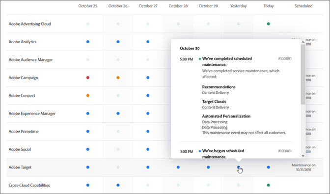

# 系統狀態更新和主動通知

使用[!UICONTROL 「Adobe 系統狀態」]頁面和主動通知來隨時掌握 [!DNL Adobe] 產品和 [!DNL Adobe Experience Cloud] 解決方案的狀態。主動通知能提醒您留意中斷事件和維護事件。

## 系統狀態更新

使用[!UICONTROL 「Adobe 系統狀態」]頁面來檢視 [!DNL Target] 與其他 [!DNL Adobe] 產品和 [!DNL Adobe Experience Cloud] 解決方案的最新狀態。此頁面可協助您判斷您遇到的問題是否是因為系統更新或日常的維護。

前往下列 URL 來存取[!UICONTROL 「系統狀態」]頁面:

[https://status.adobe.com](https://status.adobe.com)

若要查看 [!DNL Target] 等 [!DNL Experience Cloud] 解決方案的狀態，請按一下[!UICONTROL 「Experience Cloud」]標籤。

頁面頂端具有進行中維護事件的資訊，以及訂閱個別解決方案最新消息的連結。

上圖中，[!DNL Adobe Analytics]、[!DNL Adobe Target] 和 [!DNL Adobe Campaign] 在進行維護更新。所有其他產品和解決方案則可正常運作。如果您在使用 [!DNL Target] 時遇到問題，可查看此頁面。

產品內通知一律會在每月的 [!DNL Target] 版本中顯示，但有時會有次要更新，並會在此頁面上列出。

頁面底部會有最近七天的行事曆，列出各解決方案每天的狀態。如需詳細資訊，請將游標移至狀態指示器上:

## 主動通知

主動通知是傳送給註冊客戶的電子郵件警示，提醒其留意以下根據客戶設定檔所含之服務開啟的事件，包括 [!DNL Target]:

* 解決方案層級警示 (未區分解決方案內的特定服務)
* 嚴重程度 1 和 2 的 CSO (中斷事件)
* CMR (維護事件)

>[!NOTE]
>
>您必須註冊才能接收這類警示。若要進行註冊程序，請聯絡 [!DNL Adobe] 客戶成功經理 (CSM) 或 [!DNL Adobe] 業務執行專員 (AE)。

下圖是主動通知電子郵件警示的範例:

