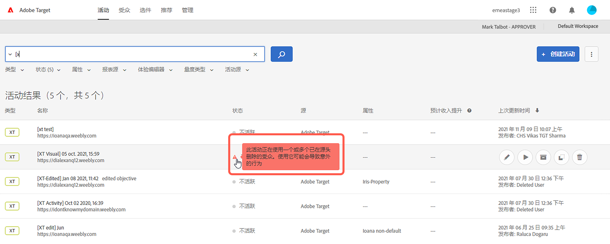
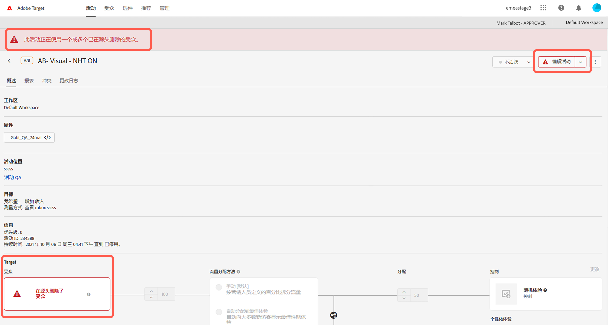

# Target 發行說明 (最新)

這些發行說明提供每個 [!DNL Adobe Target Standard] 和 [!DNL Target Premium] 版本的功能、增強功能和修正資訊。此外，也會隨附 Target API、SDK、[!DNL Adobe Experience Platform Web SDK]、at.js 的發行說明，以及其他平台變更 (如適用)。

>[!IMPORTANT]
>
>**mbox.js 生命週期結束**：自 2021 年 3 月 31 日起，[!DNL Adobe Target] 不再支援 mbox.js 程式庫。 自 2021 年 3 月 31 日起，從 mbox.js 進行的所有呼叫都會正常失敗，並透過提供預設內容而影響執行 [!DNL Target] 活動的頁面。
>
>請遷移至新 [!DNL Adobe Experience Platform Web SDK] 或 at.js JavaScript 程式庫的最新版本，以避免您的網站出現任何潛在問題。如需詳細資訊，請參閱「[總覽：為用戶端 Web 實作 Target](/help/c-implementing-target/c-implementing-target-for-client-side-web/implement-target-for-client-side-web.md)」。

(括號內的問題編號供 [!DNL Adobe] 內部使用。)

## [!DNL Target Standard/Premium] 21.10.4（2021年10月21日）

此維護髮行包含下列增強功能：

| 功能 | 詳細資料 |
| --- | --- |
| 購物車型Recommendations | 新增一系列演算法，以根據訪客購物車的內容提供建議。 如需詳細資訊，請參閱 [建立條件](/help/c-recommendations/c-algorithms/create-new-algorithm.md) 和「購物車新增/購物車檢視/結帳頁面」和「排除已在訪客購物車中的項目」，於 [計畫和實作Recommendations](/help/c-recommendations/plan-implement.md). |

## [!DNL Target Standard/Premium] 21.10.3（2021年10月19日）

此維護發行包含下列增強功能、修正和變更。

* 修正客戶無法開啟 [!UICONTROL A4T] 面板 [!DNL Analysis Workspace] 按一下 [!UICONTROL 在Analytics中檢視] 按鈕 [!DNL Target] 活動報表。 (TGT-42099 和 TGT-42100)
* 修正 [!UICONTROL 編輯設計] 編輯時不顯示的按鈕 [!UICONTROL A/B測試] 和 [!UICONTROL 體驗鎖定] (XT)使用 [!UICONTROL 表單式體驗撰寫器]. (TGT-41980)
* 修正無法 [!UICONTROL 相容] 建立新條件時在條件選取中顯示的核取方塊 [!UICONTROL Recommendations] 活動。 (TGT-42053)
* 修正無法選取時顯示的錯誤訊息 [!DNL Analytics] 作為報表來源(A4T)，因為 [!DNL Analytics] 權限。 (TGT-41954)
* 實作多項協助工具修正，以改善 [!DNL Target] UI。

## [!DNL Target Standard/Premium] 21.10.2（2021年10月13日）

新增下列增強功能，當使用 [!DNL Target] [!UICONTROL 對象] 和 [!DNL Adobe Experience Platform Web SDK]:

* 在 [!DNL Target] UI以指出對象已在來源中刪除，且無法再用於 [!DNL Target] 活動。

   下圖顯示圖示、瀏覽器和訊息的顯示位置：

   * [!UICONTROL 活動] 清單頁面

      

   * 活動 [!UICONTROL 概述] 頁面：

      

   * [!UICONTROL 體驗] 活動建立工作流程的步驟：

      ![在源郵件上刪除的對象 [!UICONTROL 體驗] 頁面](assets/deleted-at-source-experiences.png)

   * [!UICONTROL 定位] 活動建立工作流程的步驟：

      ![在源郵件上刪除的對象 [!UICONTROL 定位] 頁面](assets/deleted-at-source-targeting.png)

   * [!UICONTROL 目標與設定] 活動建立工作流程的步驟：

      ![對象已在 [!UICONTROL 目標與設定] 頁面](assets/deleted-at-source-goals-settings.png)

   * 對象細分([!UICONTROL 取代受眾] 在 [!UICONTROL 定位] 活動建立工作流程的步驟):

* 如果您嘗試使用「合併對象」功能，但來源上已刪除其中一個對象， [!UICONTROL 儲存] 已停用。

## [!DNL Target Standard/Premium]21.10.1 (2021 年 10 月 6 日)

此版本包含下列新功能：

| 功能 | 詳細資料 |
| --- | --- |
| [!UICONTROL Audiences UI 重新整理] | 作為 [!DNL Adobe Target] 團隊持續致力於改善 [!DNL Target] 使用者，此版本會重新整理 [!UICONTROL 對象] 和 [!UICONTROL 設定檔指令碼] 頁面 [!DNL Target] UI。 此更新會統一及標準化先前不一致的設計模式，同時新增增強功能，例如：<ul><li>可同時選取和刪除多個對象</li><li>已重新整理 [audience builder設計](/help/c-target/c-audiences/create-audience.md)</li><li>中的排除規則支援 [!UICONTROL 對象] 程式庫規則產生器</li><li>新的「受眾來源」篩選器，可加快受眾探索</li><li>工作階段持續搜尋和篩選選項</li></ul>如需詳細資訊，請參閱[對象](/help/c-target/target.md)。 **注意**:新 [!UICONTROL 對象] 除了目前位於 [!DNL Target] 測試版計畫。 我們將在2021年10月19日星期二為一組客戶重新啟用此UI重新整理，並在10月21日星期四為其餘所有客戶重新啟用。 |
| [!UICONTROL 設定檔指令碼] UI重新整理 | 此 [!UICONTROL 設定檔指令碼] 程式庫也已更新，且包含更新後的介面以及數項生產力更新：<ul><li>可同時選取和刪除多個設定檔指令碼</li><li>描述檔指令碼的新程式碼編輯器</li><li>程式碼編輯器內的語法醒目提示和錯誤檢查</li><li>透過鍵盤快速鍵自動完成Token（mbox或設定檔）參數</li></ul>如需詳細資訊，請參閱 [訪客設定檔](/help/c-target/c-visitor-profile/visitor-profile.md). |
|  Recommendations條件建立和編輯 | 此 [!UICONTROL Recommendations條件] 已簡化建立和編輯工作流程，以簡化選擇正確的建議演算法和設定，以達成您的目標。 如需詳細資訊，請參閱 [建立條件](/help/c-recommendations/c-algorithms/create-new-algorithm.md). |
|  Recommendations回顧期間和演算法重新整理率改善 | 您現在可以執行「檢視次數最多」和「最暢銷商品」演算法，並有六小時回顧期間，以擷取最近趨勢的內容。 選取六小時回顧期間後，您的建議結果會一天中每3到6小時更新一次。 如需詳細資訊，請參閱 [資料來源](/help/c-recommendations/c-algorithms/create-new-algorithm.md#data-source) in *建立條件*. |

## 額外的發行說明和版本詳細資料

| 資源 | 詳細資料 |
|--- |--- |
| [發行說明：Adobe Target Platform Experience Web SDK](https://experienceleague.adobe.com/docs/experience-platform/edge/release-notes.html?lang=zh_Hant) | 有關 Platform Web SDK 各版本變更的詳細資料。 |
| [at.js 版本詳細資料](/help/c-implementing-target/c-implementing-target-for-client-side-web/target-atjs-versions.md) | 有關 [!DNL Adobe Target] at.js JavaScript 資料庫每個版本中的變更的詳細資料。 |

## 文件變更、過去的發行說明和 Experience Cloud 發行說明

除了每次發行的說明，下列資源也提供額外資訊:

| 資源 | 詳細資料 |
|--- |--- |
| 文件變更 | 檢視本指南未包含在這些發行說明中的更新詳細資訊。 如需詳細資訊，請參閱[文件變更](/help/r-release-notes/doc-change.md#reference_366123CF00994BACBBF9BBDF2C4D840C)。 |
| 舊版發行說明 | 檢視舊版 Target Standard 和 Target Premium 中新功能和增強功能的詳細資訊。 如需詳細資訊，請參閱[舊版發行說明](/help/r-release-notes/release-notes-for-previous-releases.md)。 |
| Adobe Experience Cloud 發行說明 | 檢視 Adobe Experience Cloud 解決方案的最新發行說明。如需詳細資訊，請參閱「 Creative Cloud 發行說明[」。](https://experienceleague.adobe.com/docs/release-notes/experience-cloud/current.html??lang=zh-Hant) |

## 發行前資訊 {#section_5D588F0415A2435B851A4D0113ACA3A0}

以下資源告訴您下個 Target 版本將推出哪些功能。

| 資源 | 詳細資料 |
|--- |--- |
| Adobe 優先產品更新 | 若要接收即將推出的 Target 產品增強功能與其他 Adobe Experience Cloud 解決方案的進階通知，請註冊 Adobe 優先產品更新： [https://www.adobe.com/tw/subscription/priority-product-update.html](https://www.adobe.com/tw/subscription/priority-product-update.html) |
| 即將發佈的發行說明 | 如需本月的 Target 版本的詳細資訊，包括發行前資訊，請參閱 [Target 發行說明 - 發行前](/help/r-release-notes/target-release-notes.md)頁面。 |
