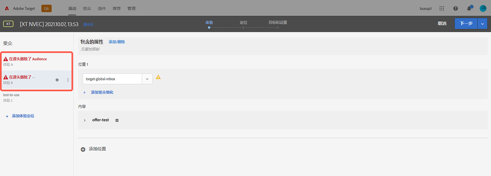
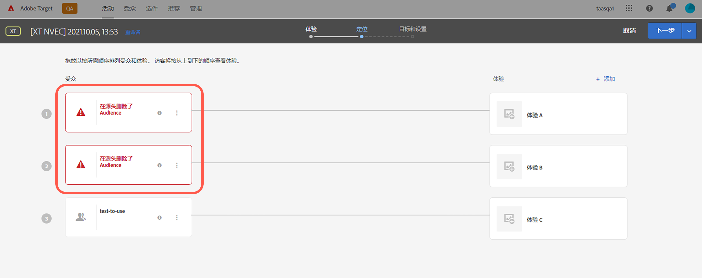

# Target 發行說明 (發行前)

本文包含發行前資訊。發行日期、功能和其他資訊可能會有所變更，恕不另行通知。

**上次更新日期：2021 年 10 月 11 日**

若要檢視目前版本的相關資訊，請參閱「[Target 發行說明](release-notes.md)」。 這些頁面上的資訊可能會相同 (視發佈時間而定)。 括號內的問題編號供 [!DNL Adobe] 內部使用。

>[!IMPORTANT]
>
>**mbox.js 生命週期結束**：自 2021 年 3 月 31 日起，[!DNL Adobe Target] 不再支援 mbox.js 程式庫。 自 2021 年 3 月 31 日起，從 mbox.js 進行的所有呼叫都會正常失敗，並透過提供預設內容而影響執行 [!DNL Target] 活動的頁面。
>
>為避免您的網站出現任何潛在問題，請遷移至新 [!DNL Adobe Experience Platform Web SDK] 或 at.js JavaScript 程式庫的最新版本。 如需詳細資訊，請參閱「[總覽：為用戶端 Web 實作 Target](/help/c-implementing-target/c-implementing-target-for-client-side-web/implement-target-for-client-side-web.md)」。

## [!DNL Target Standard/Premium] 21.10.2（2021年10月13日）

將[!DNL Target] [!UICONTROL Audiences]與[!DNL Adobe Experience Platform Web SDK]搭配使用時，已新增下列增強功能：

* 在[!DNL Target] UI中各處新增警告圖示、瀏覽器和訊息，指出對象已在來源中刪除，且不再適用於[!DNL Target]活動。

   下圖顯示圖示、瀏覽器和訊息的顯示位置：

   *  活動清單頁面

      

   * 活動[!UICONTROL 概述]頁面：

      

   *  活動建立工作流程的體驗步驟：

      

   *  活動建立工作流程的定位步驟：

      

   * [!UICONTROL 活動建] 立工作流程的目標與設定步驟：

      ![在目標與設定頁面上的來源訊息 [!UICONTROL 中刪除的對] 像](assets/deleted-at-source-goals-settings.png)

   * 在活動建立工作流程的[!UICONTROL 鎖定目標]步驟上，對象細分（[!UICONTROL 取代對象]）:

* 如果您嘗試使用「合併對象」功能，但來源上刪除了其中一個對象，則會停用[!UICONTROL 儲存]。

## 發行前資訊 {#section_7B9D4AAFC6A74388B9D7DEF0658D8B63}

若要收到 Target 和其他 Adobe Experience Cloud 解決方案日後產品增強功能的提前通知，請註冊 Adobe 優先產品更新：

[https://www.adobe.com/tw/subscription/priority-product-update.html](https://www.adobe.com/tw/subscription/priority-product-update.html)
